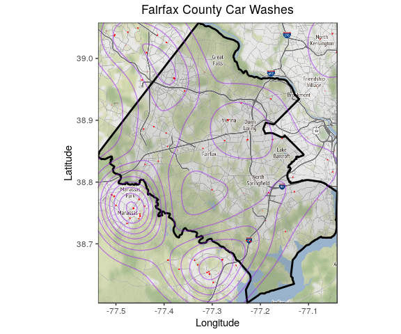
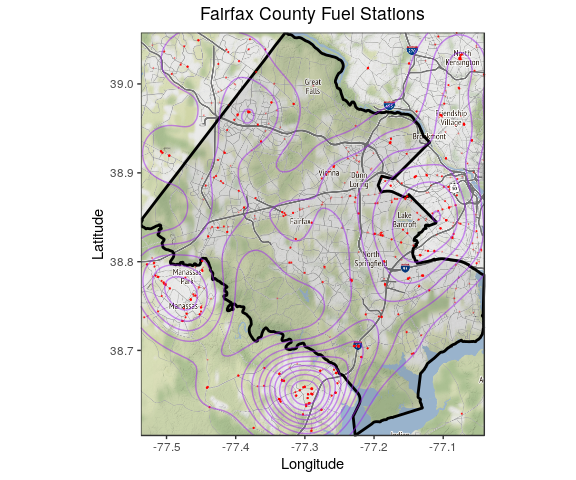
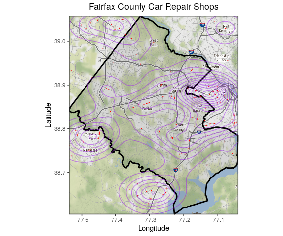
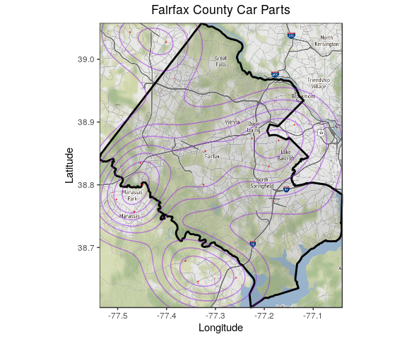
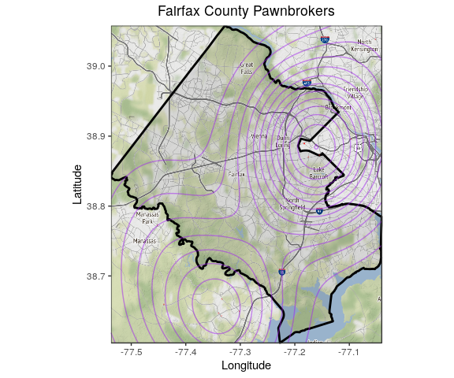
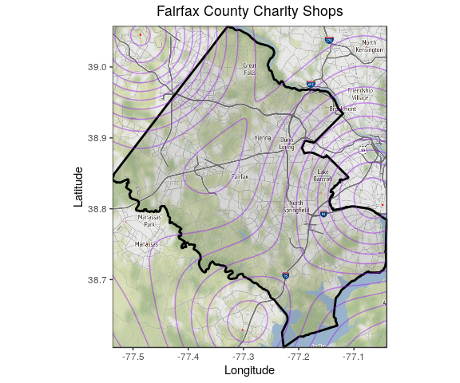
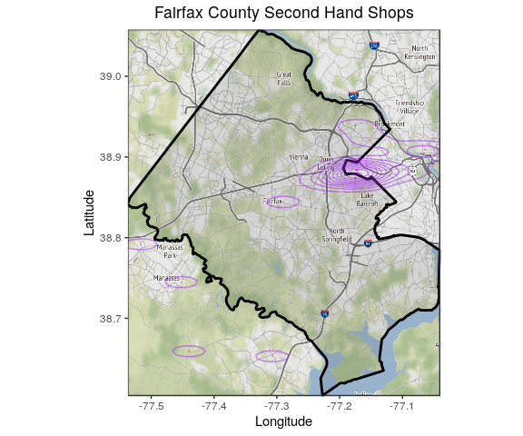
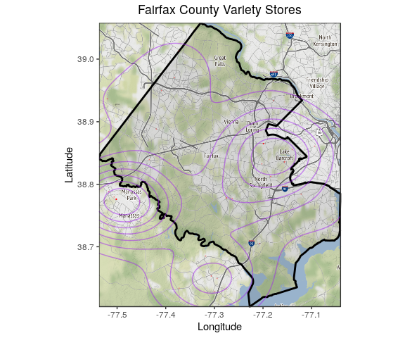
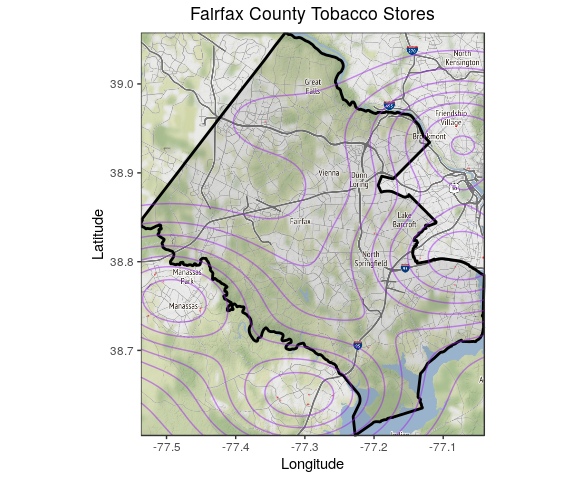

OSM Safety Variable Exploration
================
Eliza
7/1/2019

LOAD PACKAGES AND LIBRARIES
===========================

``` r
knitr::opts_knit$set(echo = TRUE,
                     root.dir = rprojroot::find_rstudio_root_file())

##install.packages("dplyr") # new  version
##install.packages(c("snakecase", "janitor")) #tidy names
##install.packages("pillar") #Dependency for patchwork
##devtools::install_github("thomasp85/patchwork") #For multi-panel plots
##install.packages(c("osmdata", "ggmap"))
##install.packages(c("sp", "sf"))

library(tidyverse) 
library(janitor)   #Clean names
library(patchwork) #Multi panel plots
library(osmdata)   #OSM
library(ggmap)     #Tidy gg maps
library(purrr)     #Map functions
library(sp)        #Spatial forms
library(sf)        #Spatial forms
```

``` r
knitr::opts_chunk$set(
#  fig.height =   
  fig.width = 6,
#  fig.asp = .5,
  out.width = "90%",
#  out.height = 
  cache = FALSE
)
#Set Theme for ggplot2
theme_set(theme_bw() + theme(plot.title = element_text(hjust = 0.5), legend.position = "bottom"))
#Set Scientific notation output for knitr
options(scipen = 999999)
```

DEFINING FUNCTIONS
==================

1. Define the function for finding points
-----------------------------------------

``` r
#Fairfax read OSM to output tibble (tidyr df)

osm_to_df <- function(key = "leisure", value = "playground", type = "point") {
#Read in playground data
read.df <- getbb("fairfax county", format_out = "polygon") %>%
  opq() %>%
  add_osm_feature(key = key, value = value) %>%
  osmdata_sf()
    
    if (type == "point" & !is.null(read.df$osm_points)) {
      
      lat.long.df <- do.call(rbind, st_geometry(read.df$osm_points)) %>% 
        as_tibble() %>% 
        setNames(c("longitude", "latitude")) %>%
        mutate(object_id = 1:nrow(.) %>% as.factor()) %>%
        dplyr::select(object_id, everything())
      
    } else if (type == "polygon" & !is.null(read.df$osm_polygons)) {
      
      poly.list <- do.call(rbind, st_geometry(read.df$osm_polygons)) %>%
        lapply(as.tibble)
      npolys    <- length(poly.list)
      
      lat.long.df <- tibble(
        object_id = 1:npolys %>% as.factor(),
        coord.df  = poly.list
        ) %>%
        unnest(coord.df) %>%
        rename(
        longitude = lon,
        latitude  = lat
        )
      
    } else if (type == "line" & !is.null(read.df$osm_lines)) {
      
      line.list <- do.call(list, st_geometry(read.df$osm_lines)) %>%
        lapply(., rbind) %>%
        lapply(., as.tibble)
      nlines    <- length(line.list)
      
      lat.long.df <- tibble(
        object_id = 1:nlines %>% as.factor(),
        coord.df  = line.list
        ) %>%
        unnest(coord.df) %>%
        rename(
        longitude = lon,
        latitude  = lat
        )
    } else {
      ifelse(is.null(read.df$osm_points), stop("key/value incorrect or object type is empty"), 
             ifelse(!(type %in% c("point", "polygon", "line")), stop("type is not point, polygon, or line"),
                    stop("object type is empty, try another")))
    }
  
  return(lat.long.df)

}
```

2. Define the function for mapping
----------------------------------

``` r
#Boundary and outline of Fairfax County
fairfax.gg <- function() {
fairfax.box <- getbb("fairfax county")
fairfax.boundary <- getbb("fairfax county", format_out = "polygon") %>%
  as.tibble() %>%
  rename(longitude = `V1`, latitude = `V2`)

#Grab the map info (many varieties)
fairfax.map <- get_map(location = fairfax.box, source="stamen", maptype="watercolor", crop = TRUE)

#ggmap and ggplot map and boundary
ff.map <- ggmap(fairfax.map) +
  geom_polygon(data = fairfax.boundary, aes(x = longitude, y = latitude), colour = "black", size = 1, alpha = 0.1) +
  labs(
    x = "Longitude",
    y = "Latitude"
  )
  return(ff.map)
}
```

3. Build the base Fairfax County map
------------------------------------

``` text
ff.map <- fairfax.gg()
```

------------------------------------------------------------------------

TESTING VALUES
==============

\*Google Maps used for proxy versus reality comparisons

1. Car Wash
-----------

``` r
obj <- osm_to_df(key = "amenity", value = "car_wash", type = "point")

#Add locations of fast food
osm_point_plot <- function(ff.map, obj, value) {
  if (!is.data.frame(obj)) stop("OSM object is not a data frame")
  if (!is.ggplot(ff.map))  stop("Baseline Fairfax map is not a ggplot")
  ff.map +
  geom_point(data = obj, aes(x = longitude, y = latitude),
             size = 0.1, colour = "red", alpha = 0.25) + 
  geom_density_2d(data = obj, aes(x = longitude, y = latitude),
                  colour = "purple", alpha = 0.5) +
  labs(title = sprintf("Fairfax County %s", value))
  }

#Visualize
osm_point_plot(ff.map, obj, "Car Washes")
```



### **Findings:**

**Trends or connections:** Car washes appear to be spread out across county and found in more built up areas. There is a slight concentration in the western part of Fairfax County. There does not appear to be a large number overall.

**Usable data (Y/N/M):** Y - Although there is not a huge amount of data, the data appear similar to that of Google Maps and will be helpful in conjunction with other measures of safety.

**Proxy versus reality:** Google Maps shows slightly more data points in the eastern part of the county, but overall the OSM data are pretty similar to that of Google Maps.

2. Fuel
-------

``` r
obj <- osm_to_df(key = "amenity", value = "fuel", type = "point")
osm_point_plot(ff.map, obj, "Fuel Stations")
```

    ## Warning: Removed 6 rows containing non-finite values (stat_density2d).

    ## Warning: Removed 6 rows containing missing values (geom_point).



### **Findings:**

**Trends or connections:** As usual, there are more points in denser areas. The area of the county with the greatest concentration of stations is in the eastern section. Overall, gas station availability is relatively dispersed throughout the county, besides in more rural areas.

**Usable data (Y/N/M):** Y - The data appear accurate and relevant to safety.

**Proxy versus reality:** OSM has more points than Google Maps, but both sources display a concentration in the eastern and western areas of the county.

3. Car Repair Shops
-------------------

``` r
obj <- osm_to_df(key = "shop", value = "car_repair", type = "point")
osm_point_plot(ff.map, obj, "Car Repair Shops")
```



### **Findings:**

**Trends or connections:** Car repair shops are concentrated in center of county along the E-W line. Still, there are other data points spreading out North and South from this center line. These data points get more sparse as one gets farther from this center E-W line.

**Usable data (Y/N/M):** M - There is enough data available, but the proxy is not super similar to the reality comparison.

**Proxy versus reality:** Google Maps shows a much larger concentration of car repair shops in eastern area of the county, both in the N-E and S-E regions. OSM appears to have slightly more data than Google Maps.

4. Car Parts
------------

``` r
obj <- osm_to_df(key = "shop", value = "car_parts", type = "point")
```

    ## Request failed [429]. Retrying in 1 seconds...

``` r
osm_point_plot(ff.map, obj, "Car Parts")
```



### **Findings:**

**Trends or connections:** There are very few data points. The car part shops seem to be in the center and eastern areas of the county.

**Usable data (Y/N/M):** M - there are not enough data points to conclusively analyze by itself. It is likely that many "car part" stores share a lot of overlap with "car repair" shops in terms of services and products offered. Therefore, it is possible that car part stores may be characterized as car repair shops on OSM. I think that "car repair" and "car part" shops can be combined into one variable.

**Proxy versus reality:** Google Maps shows many more data points than OSM.

5. Pawnbroker
-------------

``` r
obj <- osm_to_df(key = "shop", value = "pawnbroker", type = "point")
osm_point_plot(ff.map, obj, "Pawnbrokers")
```



### **Findings:**

**Trends or connections:** There are very few data points. The car part shops seem to be in the center and eastern areas of the county.

**Usable data (Y/N/M):** M - there are not enough data points to conclusively analyze by itself. It is likely that many "car part" stores share a lot of overlap with "car repair" shops in terms of services and products offered. Therefore, it is possible that car part stores may be characterized as car repair shops on OSM. I think that "car repair" and "car part" shops can be combined into one variable.

**Proxy versus reality:** Google Maps shows many more data points than OSM.

6. Charity Shops
----------------

``` r
obj <- osm_to_df(key = "shop", value = "charity", type = "point")
osm_point_plot(ff.map, obj, "Charity Shops")
```



### **Findings:**

**Trends or connections:** There appears to be one charity shop in Fairfax County.

**Usable data (Y/N/M):** N - one data point is not sufficient for analysis.

**Proxy versus reality:** Google Maps has more data points, but these seem to also include thrift shops.

7. Second Hand Stores
---------------------

``` r
obj <- osm_to_df(key = "shop", value = "second_hand", type = "point")
osm_point_plot(ff.map, obj, "Second Hand Shops")
```



### **Findings:**

**Trends or connections:** Again, not many data points (fewer than 10). These are mostly found in eastern area.

**Usable data (Y/N/M):** N - There are not many data points, and the data seems sparse in comparison to reality.

**Proxy versus reality:** There are a lot more data points on Google Maps for second hand stores. These data points are spread out across the county.

8. Variety Stores
-----------------

``` r
obj <- osm_to_df(key = "shop", value = "variety_store", type = "point")
osm_point_plot(ff.map, obj, "Variety Stores")
```



### **Findings:**

**Trends or connections:** There are minimal data points. The available data is mostly found in the eastern part of the county.

**Usable data (Y/N/M):** N - Unless variety stores is combined with thrift and charity shops, there is not enough data to come to any conclusions.

**Proxy versus reality:** Google Maps also shows fewer than 10 variety stores, but these points are more spread out in the county.

9. Tobacco Stores
-----------------

``` r
obj <- osm_to_df(key = "shop", value = "tobacco", type = "point")
osm_point_plot(ff.map, obj, "Tobacco Stores")
```



### **Findings:**

**Trends or connections:** There are minimal points (fewer than five).

**Usable data (Y/N/M):** N - There appears to be one data point. Shops for purchasing tobacco are probably accounted for in gas stations and/or convenience stores.

**Proxy versus reality:** Google Maps also yields few results for tobacco stores. It seems as though there aren't many stores that sell solely tobacco.
