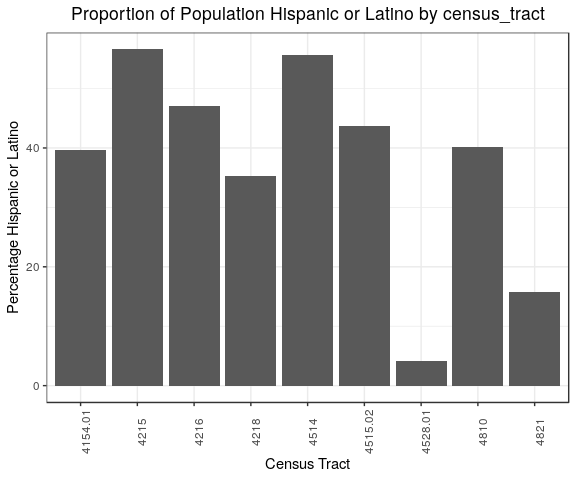
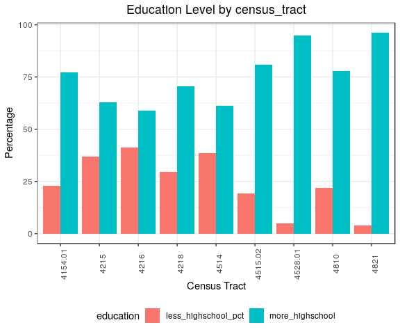

ACS Variable Exploration
================
Eliza
7/2/2019

Load Packages & Set Theme
=========================

Read in Data
============

``` r
#Read in the ACS wide and ACS long (tidy) data
acs.df <- read_csv("/home/ent4pn/dspg19fairfax/data/working/ACS_joined_estimates/2019_07_08_acs_all_geography.csv")
```

    ## Parsed with column specification:
    ## cols(
    ##   .default = col_integer(),
    ##   id = col_character(),
    ##   id_type = col_character(),
    ##   age0_5_moe = col_double(),
    ##   age5_9_moe = col_double(),
    ##   age10_14_moe = col_double(),
    ##   age15_17_moe = col_double(),
    ##   age18_19_moe = col_double(),
    ##   age20_moe = col_double(),
    ##   age21_moe = col_double(),
    ##   age22_24_moe = col_double(),
    ##   age25_34_moe = col_double(),
    ##   age35_44_moe = col_double(),
    ##   age45_54_moe = col_double(),
    ##   age55_64_moe = col_double(),
    ##   age65up_moe = col_double(),
    ##   less_highschool_moe = col_double(),
    ##   highschool_ged_moe = col_double(),
    ##   employed_est = col_double(),
    ##   very_well_est = col_double(),
    ##   very_well_moe = col_double()
    ##   # ... with 32 more columns
    ## )

    ## See spec(...) for full column specifications.

``` r
#acs.tidy.df <- read_csv("./data/working/ACS_joined_estimates/2019_06_24_acs_all_geography_tidy.csv")
```

Variable Exploration
====================

### Variables Explored:

### 1. Unemployment Rate

### 2. Ethnicity

### 3. Race

### 4. Marital Status

### 5. Single Parent Household

### 6. English Speaking Ability

### 7. Education

1. Unemployment Rate
--------------------

### A. Data Description

``` r
# Select the variables about employment
acs.employment.df <- acs.df %>% select("id_type","id",contains("employed")) 

#Dimension
employment.dim  <- acs.employment.df %>% select(ends_with("est")) %>% dim()

#Employment Groups
##employment.vars <- str_extract(names(acs.employment.df), "(?<=age).*(?=_est)") %>% 
  ##na.omit() %>% 
  ##unique() %>%
  ##gsub("_","-",.)

#Missing data
miss.employment.df <- tibble(
  Variable = names(acs.employment.df),
  Count = acs.employment.df %>% map_dbl(.x = ., ~is.na(.x) %>% sum()),
  Percentage = acs.employment.df %>% map_dbl(.x = ., ~is.na(.x) %>% mean())) %>%
  mutate(
    Percentage = as.character(Percentage * 100) %>% str_c(., "%")
  )
```

*Description:* The employment data contains 691 observations aggregated by four geographic units: blockgroup, census tract, highschool district, and supervisor district. There are two employment groups: unemployed and employed. Because there are only two, it is not necessary to group these data. In both employment groups, the observation includes an estimated value and a margin of error value. There is no missing value in this dataset.

### B. Proportionality

*Description:* Each of these tables displays the percentage of individuals employed versus unemployed across various census tracts, high school districts, and supervisor districts. *\#\#\#i. Census Tract*

``` r
#Proportion by Census Tract
find_pct <- function(dt){
  # only one id_type
  dt <- dt[, -grep("moe",colnames(dt))]
  dt$SUM = rowSums( dt[ sapply(dt, is.numeric)] )
  dt.pct <- dt %>% 
    mutate_if(is.numeric, funs(round(.*100/SUM,2)))
  colnames(dt.pct) <- gsub("est","pct",colnames(dt.pct))
  dt.pct
}
acs.employment.df %>% filter(id_type == "census_tract") %>% 
  find_pct() %>%
  mutate_if(is.numeric, funs(as.character() %>% str_c(., "%"))) %>%
  knitr::kable() 
```

    ## Warning: funs() is soft deprecated as of dplyr 0.8.0
    ## Please use a list of either functions or lambdas: 
    ## 
    ##   # Simple named list: 
    ##   list(mean = mean, median = median)
    ## 
    ##   # Auto named with `tibble::lst()`: 
    ##   tibble::lst(mean, median)
    ## 
    ##   # Using lambdas
    ##   list(~ mean(., trim = .2), ~ median(., na.rm = TRUE))
    ## This warning is displayed once per session.

| id\_type      | id                                             | employed\_pct | unemployed\_pct | SUM  |
|:--------------|:-----------------------------------------------|:--------------|:----------------|:-----|
| census\_tract | Census Tract 4154.01, Fairfax County, Virginia | 95%           | 5%              | 100% |
| census\_tract | Census Tract 4215, Fairfax County, Virginia    | 92.31%        | 7.69%           | 100% |
| census\_tract | Census Tract 4216, Fairfax County, Virginia    | 95.02%        | 4.98%           | 100% |
| census\_tract | Census Tract 4218, Fairfax County, Virginia    | 91.26%        | 8.74%           | 100% |
| census\_tract | Census Tract 4514, Fairfax County, Virginia    | 97.19%        | 2.81%           | 100% |
| census\_tract | Census Tract 4515.02, Fairfax County, Virginia | 96.07%        | 3.93%           | 100% |
| census\_tract | Census Tract 4528.01, Fairfax County, Virginia | 94.13%        | 5.87%           | 100% |
| census\_tract | Census Tract 4810, Fairfax County, Virginia    | 92.32%        | 7.68%           | 100% |
| census\_tract | Census Tract 4821, Fairfax County, Virginia    | 96.43%        | 3.57%           | 100% |

*\#\#\#ii. High School District*

``` r
#Proportion by High School District
acs.employment.df %>% filter(id_type=="highschool_district") %>%
  find_pct() %>%
  mutate_if(is.numeric, funs(as.character() %>% str_c(., "%"))) %>%
  knitr::kable() 
```

| id\_type             | id               | employed\_pct | unemployed\_pct | SUM  |
|:---------------------|:-----------------|:--------------|:----------------|:-----|
| highschool\_district | ANNANDALE        | 96.27%        | 3.73%           | 100% |
| highschool\_district | CENTREVILLE      | 96.13%        | 3.87%           | 100% |
| highschool\_district | CHANTILLY        | 94.15%        | 5.85%           | 100% |
| highschool\_district | EDISON           | 95.91%        | 4.09%           | 100% |
| highschool\_district | FAIRFAX          | 95.34%        | 4.66%           | 100% |
| highschool\_district | FALLS CHURCH     | 95.86%        | 4.14%           | 100% |
| highschool\_district | HAYFIELD         | 93.94%        | 6.06%           | 100% |
| highschool\_district | HERNDON          | 92.98%        | 7.02%           | 100% |
| highschool\_district | JUSTICE          | 95.26%        | 4.74%           | 100% |
| highschool\_district | LAKE BRADDOCK    | 96.59%        | 3.41%           | 100% |
| highschool\_district | LANGLEY          | 95.26%        | 4.74%           | 100% |
| highschool\_district | LEE              | 94.53%        | 5.47%           | 100% |
| highschool\_district | MADISON          | 94.25%        | 5.75%           | 100% |
| highschool\_district | MARSHALL         | 95.59%        | 4.41%           | 100% |
| highschool\_district | MCLEAN           | 95.84%        | 4.16%           | 100% |
| highschool\_district | MOUNT VERNON     | 94.47%        | 5.53%           | 100% |
| highschool\_district | OAKTON           | 96.77%        | 3.23%           | 100% |
| highschool\_district | ROBINSON         | 95.59%        | 4.41%           | 100% |
| highschool\_district | SOUTH COUNTY     | 96.09%        | 3.91%           | 100% |
| highschool\_district | SOUTH LAKES      | 95.78%        | 4.22%           | 100% |
| highschool\_district | WEST POTOMAC     | 95.67%        | 4.33%           | 100% |
| highschool\_district | WEST SPRINGFIELD | 95.08%        | 4.92%           | 100% |
| highschool\_district | WESTFIELD        | 95.62%        | 4.38%           | 100% |
| highschool\_district | WOODSON          | 96.31%        | 3.69%           | 100% |

*\#\#\#iii. Supervisor District*

``` r
#Proportion by Supervisor District
acs.employment.df %>% filter(id_type=="supervisor_district") %>%
  find_pct() %>%
  mutate_if(is.numeric, funs(as.character() %>% str_c(., "%"))) %>%
  knitr::kable() 
```

| id\_type             | id           | employed\_pct | unemployed\_pct | SUM  |
|:---------------------|:-------------|:--------------|:----------------|:-----|
| supervisor\_district | BRADDOCK     | 95.12%        | 4.88%           | 100% |
| supervisor\_district | DRANESVILLE  | 94.94%        | 5.06%           | 100% |
| supervisor\_district | HUNTER MILL  | 95.63%        | 4.37%           | 100% |
| supervisor\_district | LEE          | 95.65%        | 4.35%           | 100% |
| supervisor\_district | MASON        | 95.43%        | 4.57%           | 100% |
| supervisor\_district | MOUNT VERNON | 96.14%        | 3.86%           | 100% |
| supervisor\_district | PROVIDENCE   | 95.74%        | 4.26%           | 100% |
| supervisor\_district | SPRINGFIELD  | 95.24%        | 4.76%           | 100% |
| supervisor\_district | SULLY        | 94.44%        | 5.56%           | 100% |

### C. Recode

*\#\#\#i. Percent Unemployed by Census Tract*

``` r
acs.employment.df %>% filter(id_type=="census_tract") %>%
  find_pct() %>%
  mutate_if(is.numeric, funs(as.character() %>% str_c(., "%"))) %>%
  knitr::kable() 
```

| id\_type      | id                                             | employed\_pct | unemployed\_pct | SUM  |
|:--------------|:-----------------------------------------------|:--------------|:----------------|:-----|
| census\_tract | Census Tract 4154.01, Fairfax County, Virginia | 95%           | 5%              | 100% |
| census\_tract | Census Tract 4215, Fairfax County, Virginia    | 92.31%        | 7.69%           | 100% |
| census\_tract | Census Tract 4216, Fairfax County, Virginia    | 95.02%        | 4.98%           | 100% |
| census\_tract | Census Tract 4218, Fairfax County, Virginia    | 91.26%        | 8.74%           | 100% |
| census\_tract | Census Tract 4514, Fairfax County, Virginia    | 97.19%        | 2.81%           | 100% |
| census\_tract | Census Tract 4515.02, Fairfax County, Virginia | 96.07%        | 3.93%           | 100% |
| census\_tract | Census Tract 4528.01, Fairfax County, Virginia | 94.13%        | 5.87%           | 100% |
| census\_tract | Census Tract 4810, Fairfax County, Virginia    | 92.32%        | 7.68%           | 100% |
| census\_tract | Census Tract 4821, Fairfax County, Virginia    | 96.43%        | 3.57%           | 100% |

``` r
dt_employment_census <-acs.employment.df %>% filter(id_type == "census_tract") %>%
   find_pct() 
dt_employment_census$id<-str_extract(dt_employment_census$id, "(?<=Census Tract ).*(?=, Fairfax County, Virginia)")
  ggplot(data=dt_employment_census, aes(id, unemployed_pct)) +  
    geom_bar(stat="identity") + 
    theme(axis.text.x = element_text(angle = 90)) +
    labs(title=paste0("Unemployment Rate by ", unique(dt_employment_census$id_type)),
         x="Census Tract", y = "Unemployment Rate (%)") 
```

 *\#\#\#ii. Percent Unemployed by High School District*

``` r
acs.employment.df %>% filter(id_type=="highschool_district") %>%
  find_pct() %>%
  mutate_if(is.numeric, funs(as.character() %>% str_c(., "%"))) %>%
  knitr::kable() 
```

| id\_type             | id               | employed\_pct | unemployed\_pct | SUM  |
|:---------------------|:-----------------|:--------------|:----------------|:-----|
| highschool\_district | ANNANDALE        | 96.27%        | 3.73%           | 100% |
| highschool\_district | CENTREVILLE      | 96.13%        | 3.87%           | 100% |
| highschool\_district | CHANTILLY        | 94.15%        | 5.85%           | 100% |
| highschool\_district | EDISON           | 95.91%        | 4.09%           | 100% |
| highschool\_district | FAIRFAX          | 95.34%        | 4.66%           | 100% |
| highschool\_district | FALLS CHURCH     | 95.86%        | 4.14%           | 100% |
| highschool\_district | HAYFIELD         | 93.94%        | 6.06%           | 100% |
| highschool\_district | HERNDON          | 92.98%        | 7.02%           | 100% |
| highschool\_district | JUSTICE          | 95.26%        | 4.74%           | 100% |
| highschool\_district | LAKE BRADDOCK    | 96.59%        | 3.41%           | 100% |
| highschool\_district | LANGLEY          | 95.26%        | 4.74%           | 100% |
| highschool\_district | LEE              | 94.53%        | 5.47%           | 100% |
| highschool\_district | MADISON          | 94.25%        | 5.75%           | 100% |
| highschool\_district | MARSHALL         | 95.59%        | 4.41%           | 100% |
| highschool\_district | MCLEAN           | 95.84%        | 4.16%           | 100% |
| highschool\_district | MOUNT VERNON     | 94.47%        | 5.53%           | 100% |
| highschool\_district | OAKTON           | 96.77%        | 3.23%           | 100% |
| highschool\_district | ROBINSON         | 95.59%        | 4.41%           | 100% |
| highschool\_district | SOUTH COUNTY     | 96.09%        | 3.91%           | 100% |
| highschool\_district | SOUTH LAKES      | 95.78%        | 4.22%           | 100% |
| highschool\_district | WEST POTOMAC     | 95.67%        | 4.33%           | 100% |
| highschool\_district | WEST SPRINGFIELD | 95.08%        | 4.92%           | 100% |
| highschool\_district | WESTFIELD        | 95.62%        | 4.38%           | 100% |
| highschool\_district | WOODSON          | 96.31%        | 3.69%           | 100% |

``` r
dt_employment_hs <-acs.employment.df %>% filter(id_type == "highschool_district") %>%
  find_pct() 
  ggplot(data=dt_employment_hs, aes(id, unemployed_pct)) +  
    geom_bar(stat="identity") + 
    theme(axis.text.x = element_text(angle = 90)) +
    labs(title=paste0("Unemployment Rate by ", unique(dt_employment_hs$id_type)),
         x="High School District", y = "Unemployment Rate (%)") 
```


*\#\#\#iii. Percent Unemployed by Supervisor District*

``` r
acs.employment.df %>% filter(id_type=="supervisor_district") %>%
  find_pct() %>%
  mutate_if(is.numeric, funs(as.character() %>% str_c(., "%"))) %>%
  knitr::kable() 
```

| id\_type             | id           | employed\_pct | unemployed\_pct | SUM  |
|:---------------------|:-------------|:--------------|:----------------|:-----|
| supervisor\_district | BRADDOCK     | 95.12%        | 4.88%           | 100% |
| supervisor\_district | DRANESVILLE  | 94.94%        | 5.06%           | 100% |
| supervisor\_district | HUNTER MILL  | 95.63%        | 4.37%           | 100% |
| supervisor\_district | LEE          | 95.65%        | 4.35%           | 100% |
| supervisor\_district | MASON        | 95.43%        | 4.57%           | 100% |
| supervisor\_district | MOUNT VERNON | 96.14%        | 3.86%           | 100% |
| supervisor\_district | PROVIDENCE   | 95.74%        | 4.26%           | 100% |
| supervisor\_district | SPRINGFIELD  | 95.24%        | 4.76%           | 100% |
| supervisor\_district | SULLY        | 94.44%        | 5.56%           | 100% |

``` r
dt_employment_sv <-acs.employment.df %>% filter(id_type == "supervisor_district") %>%
  find_pct() 
  ggplot(data=dt_employment_sv, aes(id, unemployed_pct)) +  
    geom_bar(stat="identity") + 
    theme(axis.text.x = element_text(angle = 90)) +
    labs(title=paste0("Unemployment Rates by ", unique(dt_employment_sv$id_type)),
         x="Supervisor District", y = "Unemployment Rate (%)") 
```


2. Ethnicity
------------

### A. Data Description

``` r
# Select the variables about ethnicity
acs.ethnicity.df <- acs.df %>% select("id_type","id",contains("hispanic")) 

#Dimension
ethnicity.dim  <- acs.ethnicity.df %>% select(ends_with("est")) %>% dim()

#Ethnicity Groups
##ethnicity.vars <- str_extract(names(acs.ethnicity.df), "(?<=hispanic).*(?=_est)") %>% 
  ##na.omit() %>% 
  ##unique() %>%
  ##gsub("_","-",.)

#Missing data
miss.ethnicity.df <- tibble(
  Variable = names(acs.ethnicity.df),
  Count = acs.ethnicity.df %>% map_dbl(.x = ., ~is.na(.x) %>% sum()),
  Percentage = acs.ethnicity.df %>% map_dbl(.x = ., ~is.na(.x) %>% mean())) %>%
  mutate(
    Percentage = as.character(Percentage * 100) %>% str_c(., "%")
  )
```

*Description:* The ethnicity data contains 691 observations aggregated by four geographic units: blockgroup, census tract, highschool district, and supervisor district. There are two ethnicity groups: identifying as Hispanic or Latino. Because there are only two, it is not necessary to group these data. In both ethnicity identifiers, the observation includes an estimated value and a value of margin of error. There is no missing value in this dataset. \#\#\#B. Proportionality *Description:* Each of these tables displays the percent of individuals identifying or not identifying as Hispanic or Latino across various census tracts, high school districts, and supervisor districts. *\#\#\#i. Census Tract*

``` r
#Proportion by Census Tract
find_pct <- function(dt){
  # only one id_type
  dt <- dt[, -grep("moe",colnames(dt))]
  dt$SUM = rowSums( dt[ sapply(dt, is.numeric)] )
  dt.pct <- dt %>% 
    mutate_if(is.numeric, funs(round(.*100/SUM,2)))
  colnames(dt.pct) <- gsub("est","pct",colnames(dt.pct))
  dt.pct
}
acs.ethnicity.df %>% filter(id_type == "census_tract") %>% 
  find_pct() %>%
  mutate_if(is.numeric, funs(as.character() %>% str_c(., "%"))) %>%
  knitr::kable() 
```

| id\_type            | id                                             | hispanic\_pct | nonhispanic\_pct | SUM  |
|:--------------------|:-----------------------------------------------|:--------------|:-----------------|:-----|
| census\_tract       | Census Tract 4154.01, Fairfax County, Virginia | 39.7%         | 60.3%            | 100% |
| census\_tract       | Census Tract 4215, Fairfax County, Virginia    | 56.58%        | 43.42%           | 100% |
| census\_tract       | Census Tract 4216, Fairfax County, Virginia    | 47.08%        | 52.92%           | 100% |
| census\_tract       | Census Tract 4218, Fairfax County, Virginia    | 35.32%        | 64.68%           | 100% |
| census\_tract       | Census Tract 4514, Fairfax County, Virginia    | 55.68%        | 44.32%           | 100% |
| census\_tract       | Census Tract 4515.02, Fairfax County, Virginia | 43.69%        | 56.31%           | 100% |
| census\_tract       | Census Tract 4528.01, Fairfax County, Virginia | 4.17%         | 95.83%           | 100% |
| census\_tract       | Census Tract 4810, Fairfax County, Virginia    | 40.14%        | 59.86%           | 100% |
| census\_tract       | Census Tract 4821, Fairfax County, Virginia    | 15.8%         | 84.2%            | 100% |
| \*\#\#\#ii. High Sc | hool District\*                                |               |                  |      |

``` r
#Proportion by High School District
acs.ethnicity.df %>% filter(id_type=="highschool_district") %>%
  find_pct() %>%
  mutate_if(is.numeric, funs(as.character() %>% str_c(., "%"))) %>%
  knitr::kable() 
```

| id\_type                   | id               | hispanic\_pct | nonhispanic\_pct | SUM  |
|:---------------------------|:-----------------|:--------------|:-----------------|:-----|
| highschool\_district       | ANNANDALE        | 13.58%        | 86.42%           | 100% |
| highschool\_district       | CENTREVILLE      | 14.61%        | 85.39%           | 100% |
| highschool\_district       | CHANTILLY        | 9.76%         | 90.24%           | 100% |
| highschool\_district       | EDISON           | 3.59%         | 96.41%           | 100% |
| highschool\_district       | FAIRFAX          | 11.84%        | 88.16%           | 100% |
| highschool\_district       | FALLS CHURCH     | 12.13%        | 87.87%           | 100% |
| highschool\_district       | HAYFIELD         | 11%           | 89%              | 100% |
| highschool\_district       | HERNDON          | 29.97%        | 70.03%           | 100% |
| highschool\_district       | JUSTICE          | 14.12%        | 85.88%           | 100% |
| highschool\_district       | LAKE BRADDOCK    | 8.87%         | 91.13%           | 100% |
| highschool\_district       | LANGLEY          | 29.66%        | 70.34%           | 100% |
| highschool\_district       | LEE              | 31.4%         | 68.6%            | 100% |
| highschool\_district       | MADISON          | 20.44%        | 79.56%           | 100% |
| highschool\_district       | MARSHALL         | 10.99%        | 89.01%           | 100% |
| highschool\_district       | MCLEAN           | 8.95%         | 91.05%           | 100% |
| highschool\_district       | MOUNT VERNON     | 25.6%         | 74.4%            | 100% |
| highschool\_district       | OAKTON           | 8.49%         | 91.51%           | 100% |
| highschool\_district       | ROBINSON         | 24.46%        | 75.54%           | 100% |
| highschool\_district       | SOUTH COUNTY     | 11.58%        | 88.42%           | 100% |
| highschool\_district       | SOUTH LAKES      | 17.28%        | 82.72%           | 100% |
| highschool\_district       | WEST POTOMAC     | 14.11%        | 85.89%           | 100% |
| highschool\_district       | WEST SPRINGFIELD | 24.67%        | 75.33%           | 100% |
| highschool\_district       | WESTFIELD        | 9.83%         | 90.17%           | 100% |
| highschool\_district       | WOODSON          | 10.42%        | 89.58%           | 100% |
| \*\#\#\#iii. Supervisor Di | strict\*         |               |                  |      |

``` r
#Proportion by Supervisor District
acs.ethnicity.df %>% filter(id_type=="supervisor_district") %>%
  find_pct() %>%
  mutate_if(is.numeric, funs(as.character() %>% str_c(., "%"))) %>%
  knitr::kable() 
```

| id\_type                   | id              | hispanic\_pct   | nonhispanic\_pct   | SUM           |
|:---------------------------|:----------------|:----------------|:-------------------|:--------------|
| supervisor\_district       | BRADDOCK        | 16.2%           | 83.8%              | 100%          |
| supervisor\_district       | DRANESVILLE     | 13.38%          | 86.62%             | 100%          |
| supervisor\_district       | HUNTER MILL     | 14.46%          | 85.54%             | 100%          |
| supervisor\_district       | LEE             | 8.68%           | 91.32%             | 100%          |
| supervisor\_district       | MASON           | 16.27%          | 83.73%             | 100%          |
| supervisor\_district       | MOUNT VERNON    | 9.68%           | 90.32%             | 100%          |
| supervisor\_district       | PROVIDENCE      | 14.19%          | 85.81%             | 100%          |
| supervisor\_district       | SPRINGFIELD     | 29.76%          | 70.24%             | 100%          |
| supervisor\_district       | SULLY           | 23.81%          | 76.19%             | 100%          |
| \#\#\#C. Recode            |                 |                 |                    |               |
| \*\#\#\#i. Proportion of P | opulation Ident | ifying as Hispa | nic or Latino by C | ensus Tract\* |

``` r
acs.ethnicity.df %>% filter(id_type=="census_tract") %>%
  find_pct() %>%
  mutate_if(is.numeric, funs(as.character() %>% str_c(., "%"))) %>%
  knitr::kable() 
```

| id\_type      | id                                             | hispanic\_pct | nonhispanic\_pct | SUM  |
|:--------------|:-----------------------------------------------|:--------------|:-----------------|:-----|
| census\_tract | Census Tract 4154.01, Fairfax County, Virginia | 39.7%         | 60.3%            | 100% |
| census\_tract | Census Tract 4215, Fairfax County, Virginia    | 56.58%        | 43.42%           | 100% |
| census\_tract | Census Tract 4216, Fairfax County, Virginia    | 47.08%        | 52.92%           | 100% |
| census\_tract | Census Tract 4218, Fairfax County, Virginia    | 35.32%        | 64.68%           | 100% |
| census\_tract | Census Tract 4514, Fairfax County, Virginia    | 55.68%        | 44.32%           | 100% |
| census\_tract | Census Tract 4515.02, Fairfax County, Virginia | 43.69%        | 56.31%           | 100% |
| census\_tract | Census Tract 4528.01, Fairfax County, Virginia | 4.17%         | 95.83%           | 100% |
| census\_tract | Census Tract 4810, Fairfax County, Virginia    | 40.14%        | 59.86%           | 100% |
| census\_tract | Census Tract 4821, Fairfax County, Virginia    | 15.8%         | 84.2%            | 100% |

``` r
dt_ethnicity_census <-acs.ethnicity.df %>% filter(id_type == "census_tract") %>%
  find_pct() 
dt_ethnicity_census$id<-str_extract(dt_ethnicity_census$id, "(?<=Census Tract ).*(?=, Fairfax County, Virginia)")
  ggplot(data=dt_ethnicity_census, aes(id, hispanic_pct)) +  
    geom_bar(stat="identity") + 
    theme(axis.text.x = element_text(angle = 90)) +
    labs(title=paste0("Proportion of Population Identifying as Hispanic or Latino by ", unique(dt_ethnicity_census$id_type)),
         x="Census Tract", y = "Percentage Hispanic or Latino") 
```

 *\#\#\#ii. Proportion of Population Identifying as Hispanic or Latino by High School District*

``` r
acs.ethnicity.df %>% filter(id_type=="highschool_district") %>%
  find_pct() %>%
  mutate_if(is.numeric, funs(as.character() %>% str_c(., "%"))) %>%
  knitr::kable() 
```

| id\_type             | id               | hispanic\_pct | nonhispanic\_pct | SUM  |
|:---------------------|:-----------------|:--------------|:-----------------|:-----|
| highschool\_district | ANNANDALE        | 13.58%        | 86.42%           | 100% |
| highschool\_district | CENTREVILLE      | 14.61%        | 85.39%           | 100% |
| highschool\_district | CHANTILLY        | 9.76%         | 90.24%           | 100% |
| highschool\_district | EDISON           | 3.59%         | 96.41%           | 100% |
| highschool\_district | FAIRFAX          | 11.84%        | 88.16%           | 100% |
| highschool\_district | FALLS CHURCH     | 12.13%        | 87.87%           | 100% |
| highschool\_district | HAYFIELD         | 11%           | 89%              | 100% |
| highschool\_district | HERNDON          | 29.97%        | 70.03%           | 100% |
| highschool\_district | JUSTICE          | 14.12%        | 85.88%           | 100% |
| highschool\_district | LAKE BRADDOCK    | 8.87%         | 91.13%           | 100% |
| highschool\_district | LANGLEY          | 29.66%        | 70.34%           | 100% |
| highschool\_district | LEE              | 31.4%         | 68.6%            | 100% |
| highschool\_district | MADISON          | 20.44%        | 79.56%           | 100% |
| highschool\_district | MARSHALL         | 10.99%        | 89.01%           | 100% |
| highschool\_district | MCLEAN           | 8.95%         | 91.05%           | 100% |
| highschool\_district | MOUNT VERNON     | 25.6%         | 74.4%            | 100% |
| highschool\_district | OAKTON           | 8.49%         | 91.51%           | 100% |
| highschool\_district | ROBINSON         | 24.46%        | 75.54%           | 100% |
| highschool\_district | SOUTH COUNTY     | 11.58%        | 88.42%           | 100% |
| highschool\_district | SOUTH LAKES      | 17.28%        | 82.72%           | 100% |
| highschool\_district | WEST POTOMAC     | 14.11%        | 85.89%           | 100% |
| highschool\_district | WEST SPRINGFIELD | 24.67%        | 75.33%           | 100% |
| highschool\_district | WESTFIELD        | 9.83%         | 90.17%           | 100% |
| highschool\_district | WOODSON          | 10.42%        | 89.58%           | 100% |

``` r
dt_ethnicity_hs <-acs.ethnicity.df %>% filter(id_type == "highschool_district") %>%
  find_pct() 
  ggplot(data=dt_ethnicity_hs, aes(id, hispanic_pct)) +  
    geom_bar(stat="identity") + 
    theme(axis.text.x = element_text(angle = 90)) +
    labs(title=paste0("Proportion of Population Identifying as Hispanic or Latino by ", unique(dt_ethnicity_hs$id_type)),
         x="High School District", y = "Percentage Hispanic or Latino") 
```

 *\#\#\#iii. Proportion of Population Identifying as Hispanic or Latino by Supervisor District*

``` r
acs.ethnicity.df %>% filter(id_type=="supervisor_district") %>%
  find_pct() %>%
  mutate_if(is.numeric, funs(as.character() %>% str_c(., "%"))) %>%
  knitr::kable() 
```

| id\_type             | id           | hispanic\_pct | nonhispanic\_pct | SUM  |
|:---------------------|:-------------|:--------------|:-----------------|:-----|
| supervisor\_district | BRADDOCK     | 16.2%         | 83.8%            | 100% |
| supervisor\_district | DRANESVILLE  | 13.38%        | 86.62%           | 100% |
| supervisor\_district | HUNTER MILL  | 14.46%        | 85.54%           | 100% |
| supervisor\_district | LEE          | 8.68%         | 91.32%           | 100% |
| supervisor\_district | MASON        | 16.27%        | 83.73%           | 100% |
| supervisor\_district | MOUNT VERNON | 9.68%         | 90.32%           | 100% |
| supervisor\_district | PROVIDENCE   | 14.19%        | 85.81%           | 100% |
| supervisor\_district | SPRINGFIELD  | 29.76%        | 70.24%           | 100% |
| supervisor\_district | SULLY        | 23.81%        | 76.19%           | 100% |

``` r
dt_ethnicity_sd <-acs.ethnicity.df %>% filter(id_type == "supervisor_district") %>%
  find_pct()
  ggplot(data=dt_ethnicity_sd, aes(id, hispanic_pct)) +  
    geom_bar(stat="identity") + 
    theme(axis.text.x = element_text(angle = 90)) +
    labs(title=paste0("Proportion of Population Identifying as Hispanic or Latino by ", unique(dt_ethnicity_sd$id_type)),
         x="Supervisor District", y = "Percentage Hispanic or Latino") 
```


3. Race
-------

### A. Data Description

``` r
# Select the variables about race
acs.race.df <- acs.df %>% select("id_type","id", one_of("white_est", "black_est", "asian_est", "other_est_y")) 

#Dimension
race.dim  <- acs.race.df %>% select(ends_with("est")) %>% dim()

#Race Groups
##race.vars <- str_extract(names(acs.race.df), "(?<=race).*(?=_est)") %>% 
##na.omit() %>% 
##unique() %>%
##gsub("_","-",.)

#Missing data
miss.race.df <- tibble(
  Variable = names(acs.race.df),
  Count = acs.race.df %>% map_dbl(.x = ., ~is.na(.x) %>% sum()),
  Percentage = acs.race.df %>% map_dbl(.x = ., ~is.na(.x) %>% mean())) %>%
  mutate(
    Percentage = as.character(Percentage * 100) %>% str_c(., "%")
  )
```

*Description:* The race data contains 691 observations aggregated by four geographic units: blockgroup, census tract, highschool district, and supervisor district. There are four race variables: white, black, asian, and other. Because there are only four variables, and these variables share no common grouping pattern, the race groups function is unnecessary. In all of the race identifiers, the observation includes an estimated value and a value of margin of error. There is no missing value in this dataset. \#\#\#B. Proportionality *Description:* Each of these tables displays the proportion of individuals identifying as white, black, asian, or other by census tracts, high school districts, and supervisor districts. The second table under each roman numeral shows the distribution of white versus minority (black, asian, or other) populations in each respective geography. This more general comparison is relevant to our exploration of vulnerable populations. *\#\#\#i. Census Tract*

``` r
#Proportion by Census Tract
find_pct <- function(dt){
  # only one id_type
  ##dt <- dt[, -grep("moe",colnames(dt))]
  dt$SUM = rowSums( dt[ sapply(dt, is.numeric)] )
  dt.pct <- dt %>% 
    mutate_if(is.numeric, funs(round(.*100/SUM,2)))
  colnames(dt.pct) <- gsub("est","pct",colnames(dt.pct))
  dt.pct
}
acs.race.df %>% filter(id_type == "census_tract") %>% 
  find_pct() %>%
  mutate_if(is.numeric, funs(as.character() %>% str_c(., "%"))) %>%
  knitr::kable() 
```

| id\_type      | id                                             | white\_pct | black\_pct | asian\_pct | other\_pct\_y | SUM  |
|:--------------|:-----------------------------------------------|:-----------|:-----------|:-----------|:--------------|:-----|
| census\_tract | Census Tract 4154.01, Fairfax County, Virginia | 55.94%     | 27.33%     | 1.37%      | 15.37%        | 100% |
| census\_tract | Census Tract 4215, Fairfax County, Virginia    | 51.72%     | 20.55%     | 4.35%      | 23.38%        | 100% |
| census\_tract | Census Tract 4216, Fairfax County, Virginia    | 46.35%     | 32.62%     | 9.01%      | 12.01%        | 100% |
| census\_tract | Census Tract 4218, Fairfax County, Virginia    | 43.48%     | 33.26%     | 8.9%       | 14.36%        | 100% |
| census\_tract | Census Tract 4514, Fairfax County, Virginia    | 55.99%     | 8.01%      | 14.51%     | 21.49%        | 100% |
| census\_tract | Census Tract 4515.02, Fairfax County, Virginia | 64.27%     | 10.08%     | 10.93%     | 14.72%        | 100% |
| census\_tract | Census Tract 4528.01, Fairfax County, Virginia | 53.87%     | 24.95%     | 17.27%     | 3.91%         | 100% |
| census\_tract | Census Tract 4810, Fairfax County, Virginia    | 49.14%     | 17%        | 21.99%     | 11.87%        | 100% |
| census\_tract | Census Tract 4821, Fairfax County, Virginia    | 65%        | 15.67%     | 9.43%      | 9.9%          | 100% |

*\#\#\#Create new Variable & Examine White versus Minority by Census Tract*

``` r
#Collapse black, asian, and other variables into "minority" variable
acs.collapsedrace <- acs.race.df
acs.collapsedrace$minority <- acs.collapsedrace$black_est+acs.collapsedrace$asian_est+acs.collapsedrace$other_est_y
acs.collapsedrace<-acs.collapsedrace[,-c(4:6)]

#Proportion by Census Tract
find_pct <- function(dt){
  # only one id_type
  ##dt <- dt[, -grep("moe",colnames(dt))]
  dt$SUM = rowSums( dt[ sapply(dt, is.numeric)] )
  dt.pct <- dt %>% 
    mutate_if(is.numeric, funs(round(.*100/SUM,2)))
  colnames(dt.pct) <- gsub("est","pct",colnames(dt.pct))
  dt.pct
}
acs.collapsedrace %>% filter(id_type == "census_tract") %>% 
  find_pct() %>%
  mutate_if(is.numeric, funs(as.character() %>% str_c(., "%"))) %>%
  knitr::kable() 
```

| id\_type      | id                                             | white\_pct | minority | SUM  |
|:--------------|:-----------------------------------------------|:-----------|:---------|:-----|
| census\_tract | Census Tract 4154.01, Fairfax County, Virginia | 55.94%     | 44.06%   | 100% |
| census\_tract | Census Tract 4215, Fairfax County, Virginia    | 51.72%     | 48.28%   | 100% |
| census\_tract | Census Tract 4216, Fairfax County, Virginia    | 46.35%     | 53.65%   | 100% |
| census\_tract | Census Tract 4218, Fairfax County, Virginia    | 43.48%     | 56.52%   | 100% |
| census\_tract | Census Tract 4514, Fairfax County, Virginia    | 55.99%     | 44.01%   | 100% |
| census\_tract | Census Tract 4515.02, Fairfax County, Virginia | 64.27%     | 35.73%   | 100% |
| census\_tract | Census Tract 4528.01, Fairfax County, Virginia | 53.87%     | 46.13%   | 100% |
| census\_tract | Census Tract 4810, Fairfax County, Virginia    | 49.14%     | 50.86%   | 100% |
| census\_tract | Census Tract 4821, Fairfax County, Virginia    | 65%        | 35%      | 100% |

*\#\#\#ii. High School District*

``` r
#Proportion by Census Tract
find_pct <- function(dt){
  # only one id_type
  ##dt <- dt[, -grep("moe",colnames(dt))]
  dt$SUM = rowSums( dt[ sapply(dt, is.numeric)] )
  dt.pct <- dt %>% 
    mutate_if(is.numeric, funs(round(.*100/SUM,2)))
  colnames(dt.pct) <- gsub("est","pct",colnames(dt.pct))
  dt.pct
}
acs.race.df %>% filter(id_type == "highschool_district") %>% 
  find_pct() %>%
  mutate_if(is.numeric, funs(as.character() %>% str_c(., "%"))) %>%
  knitr::kable() 
```

| id\_type             | id               | white\_pct | black\_pct | asian\_pct | other\_pct\_y | SUM  |
|:---------------------|:-----------------|:-----------|:-----------|:-----------|:--------------|:-----|
| highschool\_district | ANNANDALE        | 69.05%     | 5.99%      | 18.53%     | 6.43%         | 100% |
| highschool\_district | CENTREVILLE      | 49.24%     | 7.99%      | 33.35%     | 9.42%         | 100% |
| highschool\_district | CHANTILLY        | 70.79%     | 4.83%      | 19.43%     | 4.94%         | 100% |
| highschool\_district | EDISON           | 75.24%     | 1.51%      | 19.16%     | 4.09%         | 100% |
| highschool\_district | FAIRFAX          | 70.16%     | 8.66%      | 15.88%     | 5.29%         | 100% |
| highschool\_district | FALLS CHURCH     | 60.35%     | 4.28%      | 24.6%      | 10.77%        | 100% |
| highschool\_district | HAYFIELD         | 57.31%     | 6.59%      | 30.92%     | 5.18%         | 100% |
| highschool\_district | HERNDON          | 56.11%     | 22.34%     | 7.96%      | 13.58%        | 100% |
| highschool\_district | JUSTICE          | 53.5%      | 11.4%      | 28.34%     | 6.76%         | 100% |
| highschool\_district | LAKE BRADDOCK    | 63.51%     | 5.3%       | 23.85%     | 7.34%         | 100% |
| highschool\_district | LANGLEY          | 59.49%     | 11.32%     | 14.07%     | 15.11%        | 100% |
| highschool\_district | LEE              | 51.92%     | 11.75%     | 22.89%     | 13.44%        | 100% |
| highschool\_district | MADISON          | 55.7%      | 13.93%     | 20.47%     | 9.9%          | 100% |
| highschool\_district | MARSHALL         | 74.56%     | 4.74%      | 14.48%     | 6.22%         | 100% |
| highschool\_district | MCLEAN           | 69.99%     | 3.76%      | 19.56%     | 6.7%          | 100% |
| highschool\_district | MOUNT VERNON     | 54.31%     | 6.52%      | 23.1%      | 16.07%        | 100% |
| highschool\_district | OAKTON           | 77.57%     | 2.63%      | 13.74%     | 6.06%         | 100% |
| highschool\_district | ROBINSON         | 65.71%     | 13.24%     | 6.26%      | 14.79%        | 100% |
| highschool\_district | SOUTH COUNTY     | 69.5%      | 10.73%     | 13.43%     | 6.34%         | 100% |
| highschool\_district | SOUTH LAKES      | 59.63%     | 17.23%     | 12.96%     | 10.17%        | 100% |
| highschool\_district | WEST POTOMAC     | 55.32%     | 21.57%     | 12.86%     | 10.25%        | 100% |
| highschool\_district | WEST SPRINGFIELD | 67.73%     | 7.55%      | 15.52%     | 9.2%          | 100% |
| highschool\_district | WESTFIELD        | 59.94%     | 15.76%     | 18.99%     | 5.32%         | 100% |
| highschool\_district | WOODSON          | 56.43%     | 10.73%     | 25.47%     | 7.36%         | 100% |

*\#\#\#White versus Minority by High School District*

``` r
#Proportion by Census Tract
find_pct <- function(dt){
  # only one id_type
  ##dt <- dt[, -grep("moe",colnames(dt))]
  dt$SUM = rowSums( dt[ sapply(dt, is.numeric)] )
  dt.pct <- dt %>% 
    mutate_if(is.numeric, funs(round(.*100/SUM,2)))
  colnames(dt.pct) <- gsub("est","pct",colnames(dt.pct))
  dt.pct
}

acs.collapsedrace %>% filter(id_type == "highschool_district") %>% 
  find_pct() %>%
  mutate_if(is.numeric, funs(as.character() %>% str_c(., "%"))) %>%
  knitr::kable() 
```

| id\_type                   | id               | white\_pct | minority | SUM  |
|:---------------------------|:-----------------|:-----------|:---------|:-----|
| highschool\_district       | ANNANDALE        | 69.05%     | 30.95%   | 100% |
| highschool\_district       | CENTREVILLE      | 49.24%     | 50.76%   | 100% |
| highschool\_district       | CHANTILLY        | 70.79%     | 29.21%   | 100% |
| highschool\_district       | EDISON           | 75.24%     | 24.76%   | 100% |
| highschool\_district       | FAIRFAX          | 70.16%     | 29.84%   | 100% |
| highschool\_district       | FALLS CHURCH     | 60.35%     | 39.65%   | 100% |
| highschool\_district       | HAYFIELD         | 57.31%     | 42.69%   | 100% |
| highschool\_district       | HERNDON          | 56.11%     | 43.89%   | 100% |
| highschool\_district       | JUSTICE          | 53.5%      | 46.5%    | 100% |
| highschool\_district       | LAKE BRADDOCK    | 63.51%     | 36.49%   | 100% |
| highschool\_district       | LANGLEY          | 59.49%     | 40.51%   | 100% |
| highschool\_district       | LEE              | 51.92%     | 48.08%   | 100% |
| highschool\_district       | MADISON          | 55.7%      | 44.3%    | 100% |
| highschool\_district       | MARSHALL         | 74.56%     | 25.44%   | 100% |
| highschool\_district       | MCLEAN           | 69.99%     | 30.01%   | 100% |
| highschool\_district       | MOUNT VERNON     | 54.31%     | 45.69%   | 100% |
| highschool\_district       | OAKTON           | 77.57%     | 22.43%   | 100% |
| highschool\_district       | ROBINSON         | 65.71%     | 34.29%   | 100% |
| highschool\_district       | SOUTH COUNTY     | 69.5%      | 30.5%    | 100% |
| highschool\_district       | SOUTH LAKES      | 59.63%     | 40.37%   | 100% |
| highschool\_district       | WEST POTOMAC     | 55.32%     | 44.68%   | 100% |
| highschool\_district       | WEST SPRINGFIELD | 67.73%     | 32.27%   | 100% |
| highschool\_district       | WESTFIELD        | 59.94%     | 40.06%   | 100% |
| highschool\_district       | WOODSON          | 56.43%     | 43.57%   | 100% |
| \*\#\#\#iii. Supervisor Di | strict\*         |            |          |      |

``` r
#Proportion by Supervisor District
find_pct <- function(dt){
  # only one id_type
  ##dt <- dt[, -grep("moe",colnames(dt))]
  dt$SUM = rowSums( dt[ sapply(dt, is.numeric)] )
  dt.pct <- dt %>% 
    mutate_if(is.numeric, funs(round(.*100/SUM,2)))
  colnames(dt.pct) <- gsub("est","pct",colnames(dt.pct))
  dt.pct
}
acs.race.df %>% filter(id_type == "supervisor_district") %>% 
  find_pct() %>%
  mutate_if(is.numeric, funs(as.character() %>% str_c(., "%"))) %>%
  knitr::kable() 
```

| id\_type             | id           | white\_pct | black\_pct | asian\_pct | other\_pct\_y | SUM  |
|:---------------------|:-------------|:-----------|:-----------|:-----------|:--------------|:-----|
| supervisor\_district | BRADDOCK     | 65.67%     | 6.2%       | 20.19%     | 7.94%         | 100% |
| supervisor\_district | DRANESVILLE  | 57.71%     | 6.76%      | 28.11%     | 7.42%         | 100% |
| supervisor\_district | HUNTER MILL  | 67.68%     | 5.97%      | 19.24%     | 7.11%         | 100% |
| supervisor\_district | LEE          | 68.34%     | 7.59%      | 18.58%     | 5.49%         | 100% |
| supervisor\_district | MASON        | 61.9%      | 18.23%     | 10.41%     | 9.45%         | 100% |
| supervisor\_district | MOUNT VERNON | 69.12%     | 7.64%      | 17.4%      | 5.83%         | 100% |
| supervisor\_district | PROVIDENCE   | 58.83%     | 6.46%      | 24.15%     | 10.57%        | 100% |
| supervisor\_district | SPRINGFIELD  | 56.13%     | 11.54%     | 17.9%      | 14.42%        | 100% |
| supervisor\_district | SULLY        | 56.59%     | 16.71%     | 13.84%     | 12.86%        | 100% |

*\#\#\#White versus Minority by High School District*

``` r
#Proportion by Supervisor District
find_pct <- function(dt){
  # only one id_type
  ##dt <- dt[, -grep("moe",colnames(dt))]
  dt$SUM = rowSums( dt[ sapply(dt, is.numeric)] )
  dt.pct <- dt %>% 
    mutate_if(is.numeric, funs(round(.*100/SUM,2)))
  colnames(dt.pct) <- gsub("est","pct",colnames(dt.pct))
  dt.pct
}
acs.collapsedrace %>% filter(id_type == "supervisor_district") %>% 
  find_pct() %>%
  mutate_if(is.numeric, funs(as.character() %>% str_c(., "%"))) %>%
  knitr::kable() 
```

| id\_type             | id           | white\_pct | minority | SUM  |
|:---------------------|:-------------|:-----------|:---------|:-----|
| supervisor\_district | BRADDOCK     | 65.67%     | 34.33%   | 100% |
| supervisor\_district | DRANESVILLE  | 57.71%     | 42.29%   | 100% |
| supervisor\_district | HUNTER MILL  | 67.68%     | 32.32%   | 100% |
| supervisor\_district | LEE          | 68.34%     | 31.66%   | 100% |
| supervisor\_district | MASON        | 61.9%      | 38.1%    | 100% |
| supervisor\_district | MOUNT VERNON | 69.12%     | 30.88%   | 100% |
| supervisor\_district | PROVIDENCE   | 58.83%     | 41.17%   | 100% |
| supervisor\_district | SPRINGFIELD  | 56.13%     | 43.87%   | 100% |
| supervisor\_district | SULLY        | 56.59%     | 43.41%   | 100% |

### C. Recode

*\#\#\#i. Proportion of Population Minority Versus White Population by Census Tract*

``` r
#create new variable to filter for desired geography without disturbing original acs.collapsedrace
census.collapsedrace <- acs.collapsedrace
census.collapsedrace <- census.collapsedrace %>% filter(id_type=="census_tract") %>%
  find_pct()
#make tidy data frame in order to examine data in a grouped bar plot
acs.race.tidy.df <- census.collapsedrace %>% gather(key = race, value = value,-c(id,id_type,SUM))
acs.race.tidy.df$id<-str_extract(acs.race.tidy.df$id, "(?<=Census Tract ).*(?=, Fairfax County, Virginia)")
  ggplot(data=acs.race.tidy.df, aes(id, value)) +  
    geom_bar(aes(fill = race),stat="identity",position="dodge") + 
    theme(axis.text.x = element_text(angle = 90)) +
    labs(title=paste0("White Versus Minority Population by ", unique(acs.race.tidy.df$id_type)),
         x="Census Tract", y = "Percentage") 
```

 *\#\#\#ii. Proportion of Population Minority Versus White Population by High School District*

``` r
hs.collapsedrace <- acs.collapsedrace
hs.collapsedrace <- hs.collapsedrace %>% filter(id_type == "highschool_district") %>%
  find_pct()
acs.race.tidy.df <- hs.collapsedrace %>% gather(key = race, value = value,-c(id, id_type, SUM))
  ggplot(data=acs.race.tidy.df, aes(id, value)) +  
    geom_bar(aes(fill = race),stat="identity",position="dodge") + 
    theme(axis.text.x = element_text(angle = 90)) +
    labs(title=paste0("White Versus Minority Population by ", unique(acs.race.tidy.df$id_type)),
         x="High School District", y = "Percentage") 
```


*\#\#\#iii. Proportion of Population Minority Versus White Population by Supervisor District*

``` r
sv.collapsedrace <- acs.collapsedrace
sv.collapsedrace <- sv.collapsedrace %>% filter(id_type=="supervisor_district") %>%
  find_pct()
acs.race.tidy.df <- sv.collapsedrace %>% gather(key = race, value = value,-c(id,id_type,SUM))
  ggplot(data=acs.race.tidy.df, aes(id, value)) +  
    geom_bar(aes(fill = race),stat="identity",position="dodge") + 
    theme(axis.text.x = element_text(angle = 90)) +
    labs(title=paste0("White Versus Minority Population by ", unique(acs.race.tidy.df$id_type)),
         x="Supervisor District", y = "Percentage") 
```

 \#\#4. Marital Status \#\#\#A. Data Description

``` r
# Select the variables about marital status
acs.marriage.df <- acs.df %>% select("id_type","id", contains("married"), -starts_with("family"))

#Dimension
marriage.dim  <- acs.marriage.df %>% select(ends_with("est")) %>% dim()

#Marriage Groups
##marriage.vars <- str_extract(names(acs.marriage.df), "(?<=married).*(?=_est)") %>% 
  ##na.omit() %>% 
  ##unique() %>%
  ##gsub("_","-",.)

#Missing data
miss.marriage.df <- tibble(
  Variable = names(acs.marriage.df),
  Count = acs.marriage.df %>% map_dbl(.x = ., ~is.na(.x) %>% sum()),
  Percentage = acs.marriage.df %>% map_dbl(.x = ., ~is.na(.x) %>% mean())) %>%
  mutate(
    Percentage = as.character(Percentage * 100) %>% str_c(., "%")
  )
```

*Description:* The marriage data contains 691 observations aggregated by four geographic units: blockgroup, census tract, highschool district, and supervisor district. There are two marriage variables: married and unmarried. Because there are only two variables, grouping is unnecessary. In both marriage identifiers, the observation includes an estimated value and a value of margin of error. There is no missing value in this dataset. \#\#\#B. Proportionality *Description:* Each of these tables displays the percent of individuals married and not married across various census tracts, high school districts, and supervisor districts. *\#\#\#i. Census Tract*

``` r
#Proportion by Census Tract
find_pct <- function(dt){
  # only one id_type
  dt <- dt[, -grep("moe",colnames(dt))]
  dt$SUM = rowSums( dt[ sapply(dt, is.numeric)] )
  dt.pct <- dt %>% 
    mutate_if(is.numeric, funs(round(.*100/SUM,2)))
  colnames(dt.pct) <- gsub("est","pct",colnames(dt.pct))
  dt.pct
}
acs.marriage.df %>% filter(id_type == "census_tract") %>% 
  find_pct() %>%
  mutate_if(is.numeric, funs(as.character() %>% str_c(., "%"))) %>%
  knitr::kable() 
```

| id\_type            | id                                             | married\_pct | unmarried\_pct | SUM  |
|:--------------------|:-----------------------------------------------|:-------------|:---------------|:-----|
| census\_tract       | Census Tract 4154.01, Fairfax County, Virginia | 43.5%        | 56.5%          | 100% |
| census\_tract       | Census Tract 4215, Fairfax County, Virginia    | 54.51%       | 45.49%         | 100% |
| census\_tract       | Census Tract 4216, Fairfax County, Virginia    | 45.67%       | 54.33%         | 100% |
| census\_tract       | Census Tract 4218, Fairfax County, Virginia    | 43.06%       | 56.94%         | 100% |
| census\_tract       | Census Tract 4514, Fairfax County, Virginia    | 35.73%       | 64.27%         | 100% |
| census\_tract       | Census Tract 4515.02, Fairfax County, Virginia | 46.93%       | 53.07%         | 100% |
| census\_tract       | Census Tract 4528.01, Fairfax County, Virginia | 44.35%       | 55.65%         | 100% |
| census\_tract       | Census Tract 4810, Fairfax County, Virginia    | 53.3%        | 46.7%          | 100% |
| census\_tract       | Census Tract 4821, Fairfax County, Virginia    | 54.1%        | 45.9%          | 100% |
| \*\#\#\#ii. High Sc | hool District\*                                |              |                |      |

``` r
#Proportion by High School District
acs.marriage.df %>% filter(id_type=="highschool_district") %>%
  find_pct() %>%
  mutate_if(is.numeric, funs(as.character() %>% str_c(., "%"))) %>%
  knitr::kable() 
```

| id\_type             | id               | married\_pct | unmarried\_pct | SUM  |
|:---------------------|:-----------------|:-------------|:---------------|:-----|
| highschool\_district | ANNANDALE        | 62.81%       | 37.19%         | 100% |
| highschool\_district | CENTREVILLE      | 57.81%       | 42.19%         | 100% |
| highschool\_district | CHANTILLY        | 54.57%       | 45.43%         | 100% |
| highschool\_district | EDISON           | 70.16%       | 29.84%         | 100% |
| highschool\_district | FAIRFAX          | 62.05%       | 37.95%         | 100% |
| highschool\_district | FALLS CHURCH     | 54.66%       | 45.34%         | 100% |
| highschool\_district | HAYFIELD         | 60.1%        | 39.9%          | 100% |
| highschool\_district | HERNDON          | 53.13%       | 46.87%         | 100% |
| highschool\_district | JUSTICE          | 58.17%       | 41.83%         | 100% |
| highschool\_district | LAKE BRADDOCK    | 60.67%       | 39.33%         | 100% |
| highschool\_district | LANGLEY          | 51.46%       | 48.54%         | 100% |
| highschool\_district | LEE              | 50.24%       | 49.76%         | 100% |
| highschool\_district | MADISON          | 54.8%        | 45.2%          | 100% |
| highschool\_district | MARSHALL         | 60.26%       | 39.74%         | 100% |
| highschool\_district | MCLEAN           | 61.31%       | 38.69%         | 100% |
| highschool\_district | MOUNT VERNON     | 50.97%       | 49.03%         | 100% |
| highschool\_district | OAKTON           | 65.08%       | 34.92%         | 100% |
| highschool\_district | ROBINSON         | 58.02%       | 41.98%         | 100% |
| highschool\_district | SOUTH COUNTY     | 54.65%       | 45.35%         | 100% |
| highschool\_district | SOUTH LAKES      | 51.2%        | 48.8%          | 100% |
| highschool\_district | WEST POTOMAC     | 57.24%       | 42.76%         | 100% |
| highschool\_district | WEST SPRINGFIELD | 56.64%       | 43.36%         | 100% |
| highschool\_district | WESTFIELD        | 60.47%       | 39.53%         | 100% |
| highschool\_district | WOODSON          | 53.9%        | 46.1%          | 100% |

*\#\#\#iii. Supervisor District*

``` r
#Proportion by Supervisor District
acs.marriage.df %>% filter(id_type=="supervisor_district") %>%
  find_pct() %>%
  mutate_if(is.numeric, funs(as.character() %>% str_c(., "%"))) %>%
  knitr::kable() 
```

| id\_type                   | id              | married\_pct | unmarried\_pct | SUM  |
|:---------------------------|:----------------|:-------------|:---------------|:-----|
| supervisor\_district       | BRADDOCK        | 54.74%       | 45.26%         | 100% |
| supervisor\_district       | DRANESVILLE     | 60.13%       | 39.87%         | 100% |
| supervisor\_district       | HUNTER MILL     | 62.92%       | 37.08%         | 100% |
| supervisor\_district       | LEE             | 62.31%       | 37.69%         | 100% |
| supervisor\_district       | MASON           | 56.63%       | 43.37%         | 100% |
| supervisor\_district       | MOUNT VERNON    | 59.09%       | 40.91%         | 100% |
| supervisor\_district       | PROVIDENCE      | 53.01%       | 46.99%         | 100% |
| supervisor\_district       | SPRINGFIELD     | 51.46%       | 48.54%         | 100% |
| supervisor\_district       | SULLY           | 54.03%       | 45.97%         | 100% |
| \#\#\#C. Recode            |                 |              |                |      |
| \*\#\#\#i. Proportion Unma | rried by Census | Tract\*      |                |      |

``` r
acs.marriage.df %>% filter(id_type=="census_tract") %>%
  find_pct() %>%
  mutate_if(is.numeric, funs(as.character() %>% str_c(., "%"))) %>%
  knitr::kable() 
```

| id\_type      | id                                             | married\_pct | unmarried\_pct | SUM  |
|:--------------|:-----------------------------------------------|:-------------|:---------------|:-----|
| census\_tract | Census Tract 4154.01, Fairfax County, Virginia | 43.5%        | 56.5%          | 100% |
| census\_tract | Census Tract 4215, Fairfax County, Virginia    | 54.51%       | 45.49%         | 100% |
| census\_tract | Census Tract 4216, Fairfax County, Virginia    | 45.67%       | 54.33%         | 100% |
| census\_tract | Census Tract 4218, Fairfax County, Virginia    | 43.06%       | 56.94%         | 100% |
| census\_tract | Census Tract 4514, Fairfax County, Virginia    | 35.73%       | 64.27%         | 100% |
| census\_tract | Census Tract 4515.02, Fairfax County, Virginia | 46.93%       | 53.07%         | 100% |
| census\_tract | Census Tract 4528.01, Fairfax County, Virginia | 44.35%       | 55.65%         | 100% |
| census\_tract | Census Tract 4810, Fairfax County, Virginia    | 53.3%        | 46.7%          | 100% |
| census\_tract | Census Tract 4821, Fairfax County, Virginia    | 54.1%        | 45.9%          | 100% |

``` r
dt_marriage_census <-acs.marriage.df %>% filter(id_type == "census_tract") %>%
   find_pct() 
dt_marriage_census$id<-str_extract(dt_marriage_census$id, "(?<=Census Tract ).*(?=, Fairfax County, Virginia)")
  ggplot(data=dt_marriage_census, aes(id, unmarried_pct)) +  
    geom_bar(stat="identity") + 
    theme(axis.text.x = element_text(angle = 90)) +
    labs(title=paste0("Percent Unmarried by ", unique(dt_marriage_census$id_type)),
         x="Census Tract", y = "Percent Unmarried") 
```

 *\#\#\#ii. Proportion of Population Unmarried by High School District*

``` r
acs.marriage.df %>% filter(id_type=="highschool_district") %>%
  find_pct() %>%
  mutate_if(is.numeric, funs(as.character() %>% str_c(., "%"))) %>%
  knitr::kable() 
```

| id\_type             | id               | married\_pct | unmarried\_pct | SUM  |
|:---------------------|:-----------------|:-------------|:---------------|:-----|
| highschool\_district | ANNANDALE        | 62.81%       | 37.19%         | 100% |
| highschool\_district | CENTREVILLE      | 57.81%       | 42.19%         | 100% |
| highschool\_district | CHANTILLY        | 54.57%       | 45.43%         | 100% |
| highschool\_district | EDISON           | 70.16%       | 29.84%         | 100% |
| highschool\_district | FAIRFAX          | 62.05%       | 37.95%         | 100% |
| highschool\_district | FALLS CHURCH     | 54.66%       | 45.34%         | 100% |
| highschool\_district | HAYFIELD         | 60.1%        | 39.9%          | 100% |
| highschool\_district | HERNDON          | 53.13%       | 46.87%         | 100% |
| highschool\_district | JUSTICE          | 58.17%       | 41.83%         | 100% |
| highschool\_district | LAKE BRADDOCK    | 60.67%       | 39.33%         | 100% |
| highschool\_district | LANGLEY          | 51.46%       | 48.54%         | 100% |
| highschool\_district | LEE              | 50.24%       | 49.76%         | 100% |
| highschool\_district | MADISON          | 54.8%        | 45.2%          | 100% |
| highschool\_district | MARSHALL         | 60.26%       | 39.74%         | 100% |
| highschool\_district | MCLEAN           | 61.31%       | 38.69%         | 100% |
| highschool\_district | MOUNT VERNON     | 50.97%       | 49.03%         | 100% |
| highschool\_district | OAKTON           | 65.08%       | 34.92%         | 100% |
| highschool\_district | ROBINSON         | 58.02%       | 41.98%         | 100% |
| highschool\_district | SOUTH COUNTY     | 54.65%       | 45.35%         | 100% |
| highschool\_district | SOUTH LAKES      | 51.2%        | 48.8%          | 100% |
| highschool\_district | WEST POTOMAC     | 57.24%       | 42.76%         | 100% |
| highschool\_district | WEST SPRINGFIELD | 56.64%       | 43.36%         | 100% |
| highschool\_district | WESTFIELD        | 60.47%       | 39.53%         | 100% |
| highschool\_district | WOODSON          | 53.9%        | 46.1%          | 100% |

``` r
dt_marriage_hs <- acs.marriage.df %>% filter(id_type == "highschool_district") %>%
  find_pct() 
  ggplot(data = dt_marriage_hs, aes(id, unmarried_pct)) +  
    geom_bar(stat="identity") + 
    theme(axis.text.x = element_text(angle = 90)) +
    labs(title=paste0("Percent Unmarried by ", unique(dt_marriage_hs$id_type)),
         x="High School District", y = "Percent Unmarried") 
```


*\#\#\#iii. Proportion of Population Unmarried by Supervisor District*

``` r
acs.marriage.df %>% filter(id_type=="supervisor_district") %>%
  find_pct() %>%
  mutate_if(is.numeric, funs(as.character() %>% str_c(., "%"))) %>%
  knitr::kable() 
```

| id\_type             | id           | married\_pct | unmarried\_pct | SUM  |
|:---------------------|:-------------|:-------------|:---------------|:-----|
| supervisor\_district | BRADDOCK     | 54.74%       | 45.26%         | 100% |
| supervisor\_district | DRANESVILLE  | 60.13%       | 39.87%         | 100% |
| supervisor\_district | HUNTER MILL  | 62.92%       | 37.08%         | 100% |
| supervisor\_district | LEE          | 62.31%       | 37.69%         | 100% |
| supervisor\_district | MASON        | 56.63%       | 43.37%         | 100% |
| supervisor\_district | MOUNT VERNON | 59.09%       | 40.91%         | 100% |
| supervisor\_district | PROVIDENCE   | 53.01%       | 46.99%         | 100% |
| supervisor\_district | SPRINGFIELD  | 51.46%       | 48.54%         | 100% |
| supervisor\_district | SULLY        | 54.03%       | 45.97%         | 100% |

``` r
dt_marriage_sv <-acs.marriage.df %>% filter(id_type == "supervisor_district") %>%
  find_pct() 
  ggplot(data=dt_marriage_sv, aes(id, unmarried_pct)) +  
    geom_bar(stat="identity") + 
    theme(axis.text.x = element_text(angle = 90)) +
    labs(title=paste0("Percent Unmarried by ", unique(dt_marriage_sv$id_type)),
         x="Supervisor District", y = "Percent Unmarried") 
```


5. Single Parent Household (Family Household Type)
--------------------------------------------------

### A. Data Description

``` r
# Select the variables about single parent household
acs.family.df <- acs.df %>% select("id_type","id", contains("family"))

#Dimension
family.dim  <- acs.family.df %>% select(ends_with("est")) %>% dim()

#Family Groups
##marriage.vars <- str_extract(names(acs.marriage.df), "(?<=married).*(?=_est)") %>% 
  ##na.omit() %>% 
  ##unique() %>%
  ##gsub("_","-",.)

#Missing data
miss.family.df <- tibble(
  Variable = names(acs.family.df),
  Count = acs.family.df %>% map_dbl(.x = ., ~is.na(.x) %>% sum()),
  Percentage = acs.family.df %>% map_dbl(.x = ., ~is.na(.x) %>% mean())) %>%
  mutate(
    Percentage = as.character(Percentage * 100) %>% str_c(., "%")
  )
```

*Description:* The household family data contains 691 observations aggregated by four geographic units: blockgroup, census tract, highschool district, and supervisor district. There are three household family groups: married-couple family households, other family households (single parent households), and nonfamily households. Because there are only three groups, it is not necessary to group these data. In all three family identifiers, the observation includes an estimated value and a value of margin of error. There is no missing value in this dataset. \#\#\#B. Proportionality *Description:* Each of these tables displays the proportion of married-couple family households, other family households (single parent households), and nonfamily households in each census tract, high school district, and supervisor district, respectively. Additionally, the second chart under each roman numeral shows single parent households versus family and non-family households ("other households"), as this comparison is relevant to our analysis of vulnerable populations in Fairfax County. *\#\#\#i. Census Tract*

``` r
#Proportion by Census Tract
find_pct <- function(dt){
  dt <- dt[, -grep("moe",colnames(dt))]
  dt$SUM = rowSums( dt[ sapply(dt, is.numeric)] )
  dt.pct <- dt %>% 
    mutate_if(is.numeric, funs(round(.*100/SUM,2)))
  colnames(dt.pct) <- gsub("est","pct",colnames(dt.pct))
  dt.pct
}
acs.family.df %>% filter(id_type == "census_tract") %>% 
  find_pct() %>%
  mutate_if(is.numeric, funs(as.character() %>% str_c(., "%"))) %>%
  knitr::kable() 
```

| id\_type           | id                                                | family\_married\_pct | family\_singleparent\_pct | nonfamily\_pct | SUM  |
|:-------------------|:--------------------------------------------------|:---------------------|:--------------------------|:---------------|:-----|
| census\_tract      | Census Tract 4154.01, Fairfax County, Virginia    | 38.03%               | 24.49%                    | 37.47%         | 100% |
| census\_tract      | Census Tract 4215, Fairfax County, Virginia       | 47.06%               | 24.92%                    | 28.02%         | 100% |
| census\_tract      | Census Tract 4216, Fairfax County, Virginia       | 30.93%               | 33.32%                    | 35.75%         | 100% |
| census\_tract      | Census Tract 4218, Fairfax County, Virginia       | 50.14%               | 23.46%                    | 26.4%          | 100% |
| census\_tract      | Census Tract 4514, Fairfax County, Virginia       | 32.09%               | 13.6%                     | 54.31%         | 100% |
| census\_tract      | Census Tract 4515.02, Fairfax County, Virginia    | 35.74%               | 19.66%                    | 44.6%          | 100% |
| census\_tract      | Census Tract 4528.01, Fairfax County, Virginia    | 27.49%               | 22.53%                    | 49.98%         | 100% |
| census\_tract      | Census Tract 4810, Fairfax County, Virginia       | 59.5%                | 23.31%                    | 17.19%         | 100% |
| census\_tract      | Census Tract 4821, Fairfax County, Virginia       | 44.9%                | 12.88%                    | 42.21%         | 100% |
| \*\#\#\#Create New | Variable and Examine Single Parent v. Other House | holds\*              |                           |                |      |

``` r
#Collapse "married family" and "non family" variables into "other households" variable
acs.collapsedfamily <- acs.family.df
acs.collapsedfamily$other_households <- acs.collapsedfamily$family_married_est+acs.collapsedfamily$nonfamily_est

acs.collapsedfamily <-acs.collapsedfamily[,-c(3:4, 6:8)]

#Proportion by Census Tract
find_pct <- function(dt){
  #dt <- dt[, -grep("moe",colnames(dt))]
  dt$SUM = rowSums( dt[ sapply(dt, is.numeric)] )
  dt.pct <- dt %>% 
    mutate_if(is.numeric, funs(round(.*100/SUM,2)))
  colnames(dt.pct) <- gsub("est","pct",colnames(dt.pct))
  dt.pct
}
acs.collapsedfamily %>% filter(id_type == "census_tract") %>% 
  find_pct() %>%
  mutate_if(is.numeric, funs(as.character() %>% str_c(., "%"))) %>%
  knitr::kable() 
```

| id\_type            | id                                             | family\_singleparent\_pct | other\_households | SUM  |
|:--------------------|:-----------------------------------------------|:--------------------------|:------------------|:-----|
| census\_tract       | Census Tract 4154.01, Fairfax County, Virginia | 24.49%                    | 75.51%            | 100% |
| census\_tract       | Census Tract 4215, Fairfax County, Virginia    | 24.92%                    | 75.08%            | 100% |
| census\_tract       | Census Tract 4216, Fairfax County, Virginia    | 33.32%                    | 66.68%            | 100% |
| census\_tract       | Census Tract 4218, Fairfax County, Virginia    | 23.46%                    | 76.54%            | 100% |
| census\_tract       | Census Tract 4514, Fairfax County, Virginia    | 13.6%                     | 86.4%             | 100% |
| census\_tract       | Census Tract 4515.02, Fairfax County, Virginia | 19.66%                    | 80.34%            | 100% |
| census\_tract       | Census Tract 4528.01, Fairfax County, Virginia | 22.53%                    | 77.47%            | 100% |
| census\_tract       | Census Tract 4810, Fairfax County, Virginia    | 23.31%                    | 76.69%            | 100% |
| census\_tract       | Census Tract 4821, Fairfax County, Virginia    | 12.88%                    | 87.12%            | 100% |
| \*\#\#\#ii. High Sc | hool District\*                                |                           |                   |      |

``` r
#Proportion by High School District
find_pct <- function(dt){
  dt <- dt[, -grep("moe",colnames(dt))]
  dt$SUM = rowSums( dt[ sapply(dt, is.numeric)] )
  dt.pct <- dt %>% 
    mutate_if(is.numeric, funs(round(.*100/SUM,2)))
  colnames(dt.pct) <- gsub("est","pct",colnames(dt.pct))
  dt.pct
}
acs.family.df %>% filter(id_type == "highschool_district") %>% 
  find_pct() %>%
  mutate_if(is.numeric, funs(as.character() %>% str_c(., "%"))) %>%
  knitr::kable() 
```

| id\_type                   | id                 | family\_married\_pct   | family\_singleparent\_pct | nonfamily\_pct | SUM  |
|:---------------------------|:-------------------|:-----------------------|:--------------------------|:---------------|:-----|
| highschool\_district       | ANNANDALE          | 71.12%                 | 12.36%                    | 16.52%         | 100% |
| highschool\_district       | CENTREVILLE        | 58.87%                 | 14.64%                    | 26.49%         | 100% |
| highschool\_district       | CHANTILLY          | 67.89%                 | 10.07%                    | 22.05%         | 100% |
| highschool\_district       | EDISON             | 81.23%                 | 7.03%                     | 11.75%         | 100% |
| highschool\_district       | FAIRFAX            | 64.62%                 | 12.93%                    | 22.45%         | 100% |
| highschool\_district       | FALLS CHURCH       | 52.93%                 | 10.58%                    | 36.48%         | 100% |
| highschool\_district       | HAYFIELD           | 67.74%                 | 11.59%                    | 20.66%         | 100% |
| highschool\_district       | HERNDON            | 54%                    | 21.63%                    | 24.37%         | 100% |
| highschool\_district       | JUSTICE            | 59.25%                 | 12.46%                    | 28.29%         | 100% |
| highschool\_district       | LAKE BRADDOCK      | 62.86%                 | 9.09%                     | 28.05%         | 100% |
| highschool\_district       | LANGLEY            | 45.78%                 | 15%                       | 39.22%         | 100% |
| highschool\_district       | LEE                | 51.38%                 | 19.33%                    | 29.29%         | 100% |
| highschool\_district       | MADISON            | 56.8%                  | 15.79%                    | 27.41%         | 100% |
| highschool\_district       | MARSHALL           | 70.29%                 | 10.51%                    | 19.2%          | 100% |
| highschool\_district       | MCLEAN             | 59.43%                 | 11.25%                    | 29.32%         | 100% |
| highschool\_district       | MOUNT VERNON       | 50.7%                  | 17.07%                    | 32.23%         | 100% |
| highschool\_district       | OAKTON             | 69.06%                 | 11.52%                    | 19.42%         | 100% |
| highschool\_district       | ROBINSON           | 55.13%                 | 15.01%                    | 29.85%         | 100% |
| highschool\_district       | SOUTH COUNTY       | 51.46%                 | 12.18%                    | 36.36%         | 100% |
| highschool\_district       | SOUTH LAKES        | 46.25%                 | 12.9%                     | 40.85%         | 100% |
| highschool\_district       | WEST POTOMAC       | 58.54%                 | 13.58%                    | 27.88%         | 100% |
| highschool\_district       | WEST SPRINGFIELD   | 56.54%                 | 14.48%                    | 28.99%         | 100% |
| highschool\_district       | WESTFIELD          | 66.1%                  | 13.02%                    | 20.88%         | 100% |
| highschool\_district       | WOODSON            | 47.98%                 | 12.9%                     | 39.12%         | 100% |
| \*\#\#\#Single Parent v. O | ther Households by | High School District\* |                           |                |      |

``` r
#Proportion by High School District
find_pct <- function(dt){
  #dt <- dt[, -grep("moe",colnames(dt))]
  dt$SUM = rowSums( dt[ sapply(dt, is.numeric)] )
  dt.pct <- dt %>% 
    mutate_if(is.numeric, funs(round(.*100/SUM,2)))
  colnames(dt.pct) <- gsub("est","pct",colnames(dt.pct))
  dt.pct
}
acs.collapsedfamily %>% filter(id_type == "highschool_district") %>% 
  find_pct() %>%
  mutate_if(is.numeric, funs(as.character() %>% str_c(., "%"))) %>%
  knitr::kable() 
```

| id\_type                   | id               | family\_singleparent\_pct | other\_households | SUM  |
|:---------------------------|:-----------------|:--------------------------|:------------------|:-----|
| highschool\_district       | ANNANDALE        | 12.36%                    | 87.64%            | 100% |
| highschool\_district       | CENTREVILLE      | 14.64%                    | 85.36%            | 100% |
| highschool\_district       | CHANTILLY        | 10.07%                    | 89.93%            | 100% |
| highschool\_district       | EDISON           | 7.03%                     | 92.97%            | 100% |
| highschool\_district       | FAIRFAX          | 12.93%                    | 87.07%            | 100% |
| highschool\_district       | FALLS CHURCH     | 10.58%                    | 89.42%            | 100% |
| highschool\_district       | HAYFIELD         | 11.59%                    | 88.41%            | 100% |
| highschool\_district       | HERNDON          | 21.63%                    | 78.37%            | 100% |
| highschool\_district       | JUSTICE          | 12.46%                    | 87.54%            | 100% |
| highschool\_district       | LAKE BRADDOCK    | 9.09%                     | 90.91%            | 100% |
| highschool\_district       | LANGLEY          | 15%                       | 85%               | 100% |
| highschool\_district       | LEE              | 19.33%                    | 80.67%            | 100% |
| highschool\_district       | MADISON          | 15.79%                    | 84.21%            | 100% |
| highschool\_district       | MARSHALL         | 10.51%                    | 89.49%            | 100% |
| highschool\_district       | MCLEAN           | 11.25%                    | 88.75%            | 100% |
| highschool\_district       | MOUNT VERNON     | 17.07%                    | 82.93%            | 100% |
| highschool\_district       | OAKTON           | 11.52%                    | 88.48%            | 100% |
| highschool\_district       | ROBINSON         | 15.01%                    | 84.99%            | 100% |
| highschool\_district       | SOUTH COUNTY     | 12.18%                    | 87.82%            | 100% |
| highschool\_district       | SOUTH LAKES      | 12.9%                     | 87.1%             | 100% |
| highschool\_district       | WEST POTOMAC     | 13.58%                    | 86.42%            | 100% |
| highschool\_district       | WEST SPRINGFIELD | 14.48%                    | 85.52%            | 100% |
| highschool\_district       | WESTFIELD        | 13.02%                    | 86.98%            | 100% |
| highschool\_district       | WOODSON          | 12.9%                     | 87.1%             | 100% |
| \*\#\#\#iii. Supervisor Di | strict\*         |                           |                   |      |

``` r
#Proportion by Supervisor District
find_pct <- function(dt){
  dt <- dt[, -grep("moe",colnames(dt))]
  dt$SUM = rowSums( dt[ sapply(dt, is.numeric)] )
  dt.pct <- dt %>% 
    mutate_if(is.numeric, funs(round(.*100/SUM,2)))
  colnames(dt.pct) <- gsub("est","pct",colnames(dt.pct))
  dt.pct
}
acs.family.df %>% filter(id_type == "supervisor_district") %>% 
  find_pct() %>%
  mutate_if(is.numeric, funs(as.character() %>% str_c(., "%"))) %>%
  knitr::kable() 
```

| id\_type                   | id              | family\_married\_pct | family\_singleparent\_pct | nonfamily\_pct | SUM  |
|:---------------------------|:----------------|:---------------------|:--------------------------|:---------------|:-----|
| supervisor\_district       | BRADDOCK        | 60.76%               | 13.55%                    | 25.69%         | 100% |
| supervisor\_district       | DRANESVILLE     | 65.67%               | 12.79%                    | 21.54%         | 100% |
| supervisor\_district       | HUNTER MILL     | 67.35%               | 10.65%                    | 21.99%         | 100% |
| supervisor\_district       | LEE             | 67.2%                | 10.94%                    | 21.86%         | 100% |
| supervisor\_district       | MASON           | 56.64%               | 13.87%                    | 29.49%         | 100% |
| supervisor\_district       | MOUNT VERNON    | 57.05%               | 11.44%                    | 31.51%         | 100% |
| supervisor\_district       | PROVIDENCE      | 50.3%                | 12.93%                    | 36.77%         | 100% |
| supervisor\_district       | SPRINGFIELD     | 49.43%               | 16.47%                    | 34.1%          | 100% |
| supervisor\_district       | SULLY           | 52.3%                | 16.44%                    | 31.26%         | 100% |
| \*\#\#\#Single Parent v. O | ther Households | by Supervisor Distri | ct\*                      |                |      |

``` r
#Proportion by Supervisor District
find_pct <- function(dt){
  #dt <- dt[, -grep("moe",colnames(dt))]
  dt$SUM = rowSums( dt[ sapply(dt, is.numeric)] )
  dt.pct <- dt %>% 
    mutate_if(is.numeric, funs(round(.*100/SUM,2)))
  colnames(dt.pct) <- gsub("est","pct",colnames(dt.pct))
  dt.pct
}
acs.collapsedfamily %>% filter(id_type == "supervisor_district") %>% 
  find_pct() %>%
  mutate_if(is.numeric, funs(as.character() %>% str_c(., "%"))) %>%
  knitr::kable() 
```

| id\_type                   | id              | family\_singleparent\_pct | other\_households | SUM  |
|:---------------------------|:----------------|:--------------------------|:------------------|:-----|
| supervisor\_district       | BRADDOCK        | 13.55%                    | 86.45%            | 100% |
| supervisor\_district       | DRANESVILLE     | 12.79%                    | 87.21%            | 100% |
| supervisor\_district       | HUNTER MILL     | 10.65%                    | 89.35%            | 100% |
| supervisor\_district       | LEE             | 10.94%                    | 89.06%            | 100% |
| supervisor\_district       | MASON           | 13.87%                    | 86.13%            | 100% |
| supervisor\_district       | MOUNT VERNON    | 11.44%                    | 88.56%            | 100% |
| supervisor\_district       | PROVIDENCE      | 12.93%                    | 87.07%            | 100% |
| supervisor\_district       | SPRINGFIELD     | 16.47%                    | 83.53%            | 100% |
| supervisor\_district       | SULLY           | 16.44%                    | 83.56%            | 100% |
| \#\#\#C. Recode            |                 |                           |                   |      |
| \*\#\#\#i. Proportion Sing | le Parent House | hold by Census Tract\*    |                   |      |

``` r
census.collapsedfamily <- acs.collapsedfamily
census.collapsedfamily <- census.collapsedfamily %>% filter(id_type=="census_tract") %>%
  find_pct()
acs.family.tidy.df <- census.collapsedfamily %>% gather(key = household, value = value,-c(id, id_type, SUM))
acs.family.tidy.df$id<-str_extract(acs.family.tidy.df$id, "(?<=Census Tract ).*(?=, Fairfax County, Virginia)")
  ggplot(data=acs.family.tidy.df, aes(id, value)) +  
    geom_bar(aes(fill = household),stat="identity",position="dodge") + 
    theme(axis.text.x = element_text(angle = 90)) +
    labs(title=paste0("Single Parent Household Versus Other Households by ", unique(acs.family.tidy.df$id_type)),
         x="Census Tract", y = "Percentage") 
```

 *\#\#\#ii. Proportion Single Parent Household by High School District*

``` r
hs.collapsedfamily <- acs.collapsedfamily
hs.collapsedfamily <- hs.collapsedfamily %>% filter(id_type == "highschool_district") %>%
  find_pct()
acs.family.tidy.df <- hs.collapsedfamily %>% gather(key = household, value = value,-c(id, id_type, SUM))
  ggplot(data=acs.family.tidy.df, aes(id, value)) +  
    geom_bar(aes(fill = household),stat="identity",position="dodge") + 
    theme(axis.text.x = element_text(angle = 90)) +
    labs(title=paste0("Single Parent Households Versus Other Households by ", unique(acs.family.tidy.df$id_type)),
         x="High School District", y = "Percentage") 
```


*\#\#\#iii. Proportion Single Parent Household by Supervisor District*

``` r
sv.collapsedfamily <- acs.collapsedfamily
sv.collapsedfamily <- sv.collapsedfamily %>% filter(id_type=="supervisor_district") %>%
  find_pct()
acs.family.tidy.df <- sv.collapsedfamily %>% gather(key = household, value = value,-c(id,id_type,SUM))
  ggplot(data=acs.family.tidy.df, aes(id, value)) +  
    geom_bar(aes(fill = household), stat="identity", position="dodge") + 
    theme(axis.text.x = element_text(angle = 90)) +
    labs(title=paste0("Single Parent Households Versus Other Households by ", unique(acs.family.tidy.df$id_type)),
         x="Supervisor District", y = "Percentage") 
```


6. English Speaking Ability
---------------------------

### A. Data Description

``` r
# Select the variables about ability to speak english
acs.language.df <- acs.df %>% select("id_type","id", one_of("very_well_est", "well_est", "not_well_est", "not_at_all_est"))

#Dimension
language.dim  <- acs.language.df %>% select(ends_with("est")) %>% dim()

#Family Groups
##marriage.vars <- str_extract(names(acs.marriage.df), "(?<=married).*(?=_est)") %>% 
  ##na.omit() %>% 
  ##unique() %>%
  ##gsub("_","-",.)

#Missing data
miss.language.df <- tibble(
  Variable = names(acs.language.df),
  Count = acs.language.df %>% map_dbl(.x = ., ~is.na(.x) %>% sum()),
  Percentage = acs.language.df %>% map_dbl(.x = ., ~is.na(.x) %>% mean())) %>%
  mutate(
    Percentage = as.character(Percentage * 100) %>% str_c(., "%")
  )
```

*Description:* The language data contains 691 observations aggregated by four geographic units: blockgroup, census tract, highschool district, and supervisor district. Individuals identified their english speaking skills according to four variables: very well, well, not well, and not at all. Because there are only four variables, it is not necessary to group these data. In all four language identifiers, the observation includes an estimated value and a value of margin of error. There is no missing value in this dataset.

### B. Proportionality

*Description:* Each of these tables displays the proportion of individuals who identified their english speaking abilities as very well, well, not well, and not at all at various geographies. Additionally, the second chart under each roman numeral shows the distribution of proficient english speakers (those who speak english very well and well) versus limited english speakers (those who speak english not well and not at all). This comparison is relevant to our analysis of vulnerable populations in Fairfax County. *\#\#\#i. Census Tract*

``` r
#Proportion by Census Tract
find_pct <- function(dt){
  # only one id_type
  ##dt <- dt[, -grep("moe",colnames(dt))]
  dt$SUM = rowSums( dt[ sapply(dt, is.numeric)] )
  dt.pct <- dt %>% 
    mutate_if(is.numeric, funs(round(.*100/SUM,2)))
  colnames(dt.pct) <- gsub("est","pct",colnames(dt.pct))
  dt.pct
}
acs.language.df %>% filter(id_type == "census_tract") %>% 
  find_pct() %>%
  mutate_if(is.numeric, funs(as.character() %>% str_c(., "%"))) %>%
  knitr::kable() 
```

| id\_type           | id                                                | very\_well\_pct  | well\_pct   | not\_well\_pct | not\_at\_all\_pct | SUM  |
|:-------------------|:--------------------------------------------------|:-----------------|:------------|:---------------|:------------------|:-----|
| census\_tract      | Census Tract 4154.01, Fairfax County, Virginia    | 77.08%           | 15.82%      | 3.63%          | 3.48%             | 100% |
| census\_tract      | Census Tract 4215, Fairfax County, Virginia       | 62.49%           | 17.98%      | 17.81%         | 1.71%             | 100% |
| census\_tract      | Census Tract 4216, Fairfax County, Virginia       | 69.76%           | 14.19%      | 13.99%         | 2.07%             | 100% |
| census\_tract      | Census Tract 4218, Fairfax County, Virginia       | 85.8%            | 8.95%       | 5.25%          | 0%                | 100% |
| census\_tract      | Census Tract 4514, Fairfax County, Virginia       | 70.17%           | 9.78%       | 12.98%         | 7.07%             | 100% |
| census\_tract      | Census Tract 4515.02, Fairfax County, Virginia    | 67.58%           | 13.04%      | 11.67%         | 7.7%              | 100% |
| census\_tract      | Census Tract 4528.01, Fairfax County, Virginia    | 76.92%           | 16.07%      | 6.77%          | 0.24%             | 100% |
| census\_tract      | Census Tract 4810, Fairfax County, Virginia       | 62.8%            | 25.02%      | 11.25%         | 0.93%             | 100% |
| census\_tract      | Census Tract 4821, Fairfax County, Virginia       | 84.43%           | 9.98%       | 5.59%          | 0%                | 100% |
| \*\#\#\#Create New | Variable and Examine Proficient v. Limited Englis | h Ability by Cen | sus Tract\* |                |                   |      |

``` r
#Collapse "well" and "very well" language variables into "proficient" variable
acs.collapsedlanguage <- acs.language.df
acs.collapsedlanguage$proficient <- acs.collapsedlanguage$well_est+acs.collapsedlanguage$very_well_est

#Collapse "not well" and "not at all" variables into "limited" variable
acs.collapsedlanguage$limited <- acs.collapsedlanguage$not_well_est+acs.collapsedlanguage$not_at_all_est

acs.collapsedlanguage <-acs.collapsedlanguage[,-c(3:6)]

#Proportion by Census Tract
find_pct <- function(dt){
  # only one id_type
  ##dt <- dt[, -grep("moe",colnames(dt))]
  dt$SUM = rowSums( dt[ sapply(dt, is.numeric)] )
  dt.pct <- dt %>% 
    mutate_if(is.numeric, funs(round(.*100/SUM,2)))
  colnames(dt.pct) <- gsub("est","pct",colnames(dt.pct))
  dt.pct
}
acs.collapsedlanguage %>% filter(id_type == "census_tract") %>% 
  find_pct() %>%
  mutate_if(is.numeric, funs(as.character() %>% str_c(., "%"))) %>%
  knitr::kable() 
```

| id\_type            | id                                             | proficient | limited | SUM  |
|:--------------------|:-----------------------------------------------|:-----------|:--------|:-----|
| census\_tract       | Census Tract 4154.01, Fairfax County, Virginia | 92.89%     | 7.11%   | 100% |
| census\_tract       | Census Tract 4215, Fairfax County, Virginia    | 80.47%     | 19.53%  | 100% |
| census\_tract       | Census Tract 4216, Fairfax County, Virginia    | 83.95%     | 16.05%  | 100% |
| census\_tract       | Census Tract 4218, Fairfax County, Virginia    | 94.75%     | 5.25%   | 100% |
| census\_tract       | Census Tract 4514, Fairfax County, Virginia    | 79.95%     | 20.05%  | 100% |
| census\_tract       | Census Tract 4515.02, Fairfax County, Virginia | 80.63%     | 19.37%  | 100% |
| census\_tract       | Census Tract 4528.01, Fairfax County, Virginia | 92.99%     | 7.01%   | 100% |
| census\_tract       | Census Tract 4810, Fairfax County, Virginia    | 87.82%     | 12.18%  | 100% |
| census\_tract       | Census Tract 4821, Fairfax County, Virginia    | 94.41%     | 5.59%   | 100% |
| \*\#\#\#ii. High Sc | hool District\*                                |            |         |      |

``` r
#Proportion by High School District
find_pct <- function(dt){
  # only one id_type
  ##dt <- dt[, -grep("moe",colnames(dt))]
  dt$SUM = rowSums( dt[ sapply(dt, is.numeric)] )
  dt.pct <- dt %>% 
    mutate_if(is.numeric, funs(round(.*100/SUM,2)))
  colnames(dt.pct) <- gsub("est","pct",colnames(dt.pct))
  dt.pct
}
acs.language.df %>% filter(id_type == "highschool_district") %>% 
  find_pct() %>%
  mutate_if(is.numeric, funs(as.character() %>% str_c(., "%"))) %>%
  knitr::kable() 
```

| id\_type                   | id                 | very\_well\_pct | well\_pct  | not\_well\_pct | not\_at\_all\_pct | SUM  |
|:---------------------------|:-------------------|:----------------|:-----------|:---------------|:------------------|:-----|
| highschool\_district       | ANNANDALE          | 84.31%          | 7.2%       | 6.01%          | 2.49%             | 100% |
| highschool\_district       | CENTREVILLE        | 76.4%           | 11.72%     | 8.09%          | 3.79%             | 100% |
| highschool\_district       | CHANTILLY          | 85.3%           | 7.87%      | 4.62%          | 2.21%             | 100% |
| highschool\_district       | EDISON             | 88.14%          | 5.39%      | 3.96%          | 2.5%              | 100% |
| highschool\_district       | FAIRFAX            | 87%             | 5.54%      | 5.11%          | 2.36%             | 100% |
| highschool\_district       | FALLS CHURCH       | 80.55%          | 9.96%      | 6.77%          | 2.72%             | 100% |
| highschool\_district       | HAYFIELD           | 82.92%          | 8.86%      | 5.5%           | 2.73%             | 100% |
| highschool\_district       | HERNDON            | 81.15%          | 9.28%      | 6.76%          | 2.81%             | 100% |
| highschool\_district       | JUSTICE            | 80.45%          | 9.58%      | 7%             | 2.96%             | 100% |
| highschool\_district       | LAKE BRADDOCK      | 85.44%          | 7.29%      | 4.79%          | 2.49%             | 100% |
| highschool\_district       | LANGLEY            | 74.35%          | 11.62%     | 9.18%          | 4.84%             | 100% |
| highschool\_district       | LEE                | 71.85%          | 13.47%     | 11.22%         | 3.46%             | 100% |
| highschool\_district       | MADISON            | 74.98%          | 12.28%     | 8.89%          | 3.85%             | 100% |
| highschool\_district       | MARSHALL           | 86.73%          | 6.84%      | 4.19%          | 2.23%             | 100% |
| highschool\_district       | MCLEAN             | 85.25%          | 6.8%       | 5.03%          | 2.92%             | 100% |
| highschool\_district       | MOUNT VERNON       | 73.11%          | 11.6%      | 11.7%          | 3.59%             | 100% |
| highschool\_district       | OAKTON             | 87.85%          | 5.41%      | 4.63%          | 2.11%             | 100% |
| highschool\_district       | ROBINSON           | 80.65%          | 9.1%       | 7.03%          | 3.22%             | 100% |
| highschool\_district       | SOUTH COUNTY       | 85.6%           | 6.88%      | 4.6%           | 2.92%             | 100% |
| highschool\_district       | SOUTH LAKES        | 83.56%          | 8.23%      | 5.11%          | 3.09%             | 100% |
| highschool\_district       | WEST POTOMAC       | 85.44%          | 7.95%      | 4.28%          | 2.33%             | 100% |
| highschool\_district       | WEST SPRINGFIELD   | 78.27%          | 10.33%     | 8.31%          | 3.09%             | 100% |
| highschool\_district       | WESTFIELD          | 84.52%          | 7.84%      | 5.23%          | 2.41%             | 100% |
| highschool\_district       | WOODSON            | 79.59%          | 10.66%     | 6.95%          | 2.8%              | 100% |
| \*\#\#\#Examine Proficient | v. Limited English | Ability by High | School Dis | trict\*        |                   |      |

``` r
#Proportion by High School District
find_pct <- function(dt){
  # only one id_type
  ##dt <- dt[, -grep("moe",colnames(dt))]
  dt$SUM = rowSums( dt[ sapply(dt, is.numeric)] )
  dt.pct <- dt %>% 
    mutate_if(is.numeric, funs(round(.*100/SUM,2)))
  colnames(dt.pct) <- gsub("est","pct",colnames(dt.pct))
  dt.pct
}
acs.collapsedlanguage %>% filter(id_type == "highschool_district") %>% 
  find_pct() %>%
  mutate_if(is.numeric, funs(as.character() %>% str_c(., "%"))) %>%
  knitr::kable() 
```

| id\_type                   | id               | proficient | limited | SUM  |
|:---------------------------|:-----------------|:-----------|:--------|:-----|
| highschool\_district       | ANNANDALE        | 91.5%      | 8.5%    | 100% |
| highschool\_district       | CENTREVILLE      | 88.11%     | 11.89%  | 100% |
| highschool\_district       | CHANTILLY        | 93.17%     | 6.83%   | 100% |
| highschool\_district       | EDISON           | 93.53%     | 6.47%   | 100% |
| highschool\_district       | FAIRFAX          | 92.53%     | 7.47%   | 100% |
| highschool\_district       | FALLS CHURCH     | 90.51%     | 9.49%   | 100% |
| highschool\_district       | HAYFIELD         | 91.77%     | 8.23%   | 100% |
| highschool\_district       | HERNDON          | 90.43%     | 9.57%   | 100% |
| highschool\_district       | JUSTICE          | 90.04%     | 9.96%   | 100% |
| highschool\_district       | LAKE BRADDOCK    | 92.72%     | 7.28%   | 100% |
| highschool\_district       | LANGLEY          | 85.98%     | 14.02%  | 100% |
| highschool\_district       | LEE              | 85.32%     | 14.68%  | 100% |
| highschool\_district       | MADISON          | 87.26%     | 12.74%  | 100% |
| highschool\_district       | MARSHALL         | 93.58%     | 6.42%   | 100% |
| highschool\_district       | MCLEAN           | 92.05%     | 7.95%   | 100% |
| highschool\_district       | MOUNT VERNON     | 84.71%     | 15.29%  | 100% |
| highschool\_district       | OAKTON           | 93.27%     | 6.73%   | 100% |
| highschool\_district       | ROBINSON         | 89.75%     | 10.25%  | 100% |
| highschool\_district       | SOUTH COUNTY     | 92.48%     | 7.52%   | 100% |
| highschool\_district       | SOUTH LAKES      | 91.79%     | 8.21%   | 100% |
| highschool\_district       | WEST POTOMAC     | 93.39%     | 6.61%   | 100% |
| highschool\_district       | WEST SPRINGFIELD | 88.6%      | 11.4%   | 100% |
| highschool\_district       | WESTFIELD        | 92.36%     | 7.64%   | 100% |
| highschool\_district       | WOODSON          | 90.25%     | 9.75%   | 100% |
| \*\#\#\#iii. Supervisor Di | strict\*         |            |         |      |

``` r
#Proportion by Supervisor District
find_pct <- function(dt){
  # only one id_type
  ##dt <- dt[, -grep("moe",colnames(dt))]
  dt$SUM = rowSums( dt[ sapply(dt, is.numeric)] )
  dt.pct <- dt %>% 
    mutate_if(is.numeric, funs(round(.*100/SUM,2)))
  colnames(dt.pct) <- gsub("est","pct",colnames(dt.pct))
  dt.pct
}
acs.language.df %>% filter(id_type == "supervisor_district") %>% 
  find_pct() %>%
  mutate_if(is.numeric, funs(as.character() %>% str_c(., "%"))) %>%
  knitr::kable() 
```

| id\_type                   | id             | very\_well\_pct | well\_pct  | not\_well\_pct | not\_at\_all\_pct | SUM  |
|:---------------------------|:---------------|:----------------|:-----------|:---------------|:------------------|:-----|
| supervisor\_district       | BRADDOCK       | 81.85%          | 9.1%       | 6.25%          | 2.81%             | 100% |
| supervisor\_district       | DRANESVILLE    | 81%             | 9.21%      | 6.57%          | 3.22%             | 100% |
| supervisor\_district       | HUNTER MILL    | 81.76%          | 8.51%      | 6.67%          | 3.05%             | 100% |
| supervisor\_district       | LEE            | 85.94%          | 6.83%      | 4.87%          | 2.36%             | 100% |
| supervisor\_district       | MASON          | 84.93%          | 7.46%      | 4.97%          | 2.64%             | 100% |
| supervisor\_district       | MOUNT VERNON   | 86.27%          | 6.57%      | 4.49%          | 2.67%             | 100% |
| supervisor\_district       | PROVIDENCE     | 80%             | 10.13%     | 7.08%          | 2.79%             | 100% |
| supervisor\_district       | SPRINGFIELD    | 73.3%           | 12.05%     | 10.34%         | 4.31%             | 100% |
| supervisor\_district       | SULLY          | 78.39%          | 10.63%     | 7.6%           | 3.38%             | 100% |
| \*\#\#\#Examine Proficient | v. Limited Eng | lish Ability by | Supervisor | District\*     |                   |      |

``` r
#Proportion by Supervisor District
find_pct <- function(dt){
  # only one id_type
  ##dt <- dt[, -grep("moe",colnames(dt))]
  dt$SUM = rowSums( dt[ sapply(dt, is.numeric)] )
  dt.pct <- dt %>% 
    mutate_if(is.numeric, funs(round(.*100/SUM,2)))
  colnames(dt.pct) <- gsub("est","pct",colnames(dt.pct))
  dt.pct
}
acs.collapsedlanguage %>% filter(id_type == "supervisor_district") %>% 
  find_pct() %>%
  mutate_if(is.numeric, funs(as.character() %>% str_c(., "%"))) %>%
  knitr::kable() 
```

| id\_type                   | id              | proficient   | limited    | SUM                          |
|:---------------------------|:----------------|:-------------|:-----------|:-----------------------------|
| supervisor\_district       | BRADDOCK        | 90.94%       | 9.06%      | 100%                         |
| supervisor\_district       | DRANESVILLE     | 90.21%       | 9.79%      | 100%                         |
| supervisor\_district       | HUNTER MILL     | 90.27%       | 9.73%      | 100%                         |
| supervisor\_district       | LEE             | 92.77%       | 7.23%      | 100%                         |
| supervisor\_district       | MASON           | 92.4%        | 7.6%       | 100%                         |
| supervisor\_district       | MOUNT VERNON    | 92.83%       | 7.17%      | 100%                         |
| supervisor\_district       | PROVIDENCE      | 90.13%       | 9.87%      | 100%                         |
| supervisor\_district       | SPRINGFIELD     | 85.35%       | 14.65%     | 100%                         |
| supervisor\_district       | SULLY           | 89.02%       | 10.98%     | 100%                         |
| \#\#\#C. Recode            |                 |              |            |                              |
| \*\#\#\#i. Proportion of C | ensus Tract Pop | ulation with | Limited v. | Proficient English Ability\* |

``` r
census.collapsedlanguage <- acs.collapsedlanguage
census.collapsedlanguage <- census.collapsedlanguage %>% filter(id_type=="census_tract") %>%
  find_pct()
acs.language.tidy.df <- census.collapsedlanguage %>% gather(key = english, value = value,-c(id, id_type, SUM))
acs.language.tidy.df$id<-str_extract(acs.language.tidy.df$id, "(?<=Census Tract ).*(?=, Fairfax County, Virginia)")
  ggplot(data=acs.language.tidy.df, aes(id, value)) +  
    geom_bar(aes(fill = english),stat="identity",position="dodge") + 
    theme(axis.text.x = element_text(angle = 90)) +
    labs(title=paste0("Proficient versus Limited English Ability by ", unique(acs.language.tidy.df$id_type)),
         x="Census Tract", y = "Percentage") 
```

 *\#\#\#ii. Proportion of Population Minority Versus White Population by High School District*

``` r
hs.collapsedlanguage <- acs.collapsedlanguage
hs.collapsedlanguage <- hs.collapsedlanguage %>% filter(id_type == "highschool_district") %>%
  find_pct()
acs.language.tidy.df <- hs.collapsedlanguage %>% gather(key = english, value = value,-c(id, id_type, SUM))
  ggplot(data=acs.language.tidy.df, aes(id, value)) +  
    geom_bar(aes(fill = english),stat="identity",position="dodge") + 
    theme(axis.text.x = element_text(angle = 90)) +
    labs(title=paste0("Proficient versus Limited English Ability by ", unique(acs.language.tidy.df$id_type)),
         x="High School District", y = "Percentage") 
```


*\#\#\#iii. Proportion of Population Minority Versus White Population by Supervisor District*

``` r
sv.collapsedlanguage <- acs.collapsedlanguage
sv.collapsedlanguage <- sv.collapsedlanguage %>% filter(id_type=="supervisor_district") %>%
  find_pct()
acs.language.tidy.df <- sv.collapsedlanguage %>% gather(key = english, value = value,-c(id,id_type,SUM))
  ggplot(data=acs.language.tidy.df, aes(id, value)) +  
    geom_bar(aes(fill = english),stat="identity",position="dodge") + 
    theme(axis.text.x = element_text(angle = 90)) +
    labs(title=paste0("Proficient versus Limited English Ability by ", unique(acs.language.tidy.df$id_type)),
         x="Supervisor District", y = "Percentage") 
```


7. Education
------------

### A. Data Description

``` r
# Select the variables about education
acs.education.df <- acs.df %>% select("id_type","id", one_of("less_highschool_est", "highschool_ged_est", "bachelors_est", "masters_est", "professional_school_est", "doctorate_est"))

#Dimension
education.dim  <- acs.education.df %>% select(ends_with("est")) %>% dim()

##Education Groups -- no pattern
##education.vars <- str_extract(names(acs.education.df), "*(?=_est)") %>% 
 ## na.omit() %>% 
 ## unique() %>%
 ## gsub("_","-",.)

#Missing data
miss.education.df <- tibble(
  Variable = names(acs.education.df),
  Count = acs.education.df %>% map_dbl(.x = ., ~is.na(.x) %>% sum()),
  Percentage = acs.education.df %>% map_dbl(.x = ., ~is.na(.x) %>% mean())) %>%
  mutate(
    Percentage = as.character(Percentage * 100) %>% str_c(., "%")
  )
```

*Description:* The education data contains 691 observations aggregated by four geographic units: blockgroup, census tract, highschool district, and supervisor district. There are six education groups: less\_highschool (earned less than a high school diploma), highschool\_ged (earned a GED or a high school diploma), bachelors, masters, professional\_school, and doctorate. Because there are only six groups, it is not necessary to group these data. In all six education identifiers, the observation includes an estimated value and a value of margin of error. There is no missing value in this dataset. \#\#\#B. Proportionality *Description:* Each of these tables displays the percent distribution of individuals in each of the previously identified education groups. Additionally the second chart under each roman numeral shows the distribution of those who without a high school diploma versus those with a high school diploma or GED and above. This comparison is relevant to our analysis of vulnerable populations in Fairfax County. *\#\#\#i. Census Tract*

``` r
#Proportion by Census Tract
find_pct <- function(dt){
  # only one id_type
  ##dt <- dt[, -grep("moe",colnames(dt))]
  dt$SUM = rowSums( dt[ sapply(dt, is.numeric)] )
  dt.pct <- dt %>% 
    mutate_if(is.numeric, funs(round(.*100/SUM,2)))
  colnames(dt.pct) <- gsub("est","pct",colnames(dt.pct))
  dt.pct
}
acs.education.df %>% filter(id_type == "census_tract") %>% 
  find_pct() %>%
  mutate_if(is.numeric, funs(as.character() %>% str_c(., "%"))) %>%
  knitr::kable() 
```

| id\_type           | id                                                | less\_highschool\_pct  | highschool\_ged\_pct | bachelors\_pct | masters\_pct | professional\_school\_pct | doctorate\_pct | SUM  |
|:-------------------|:--------------------------------------------------|:-----------------------|:---------------------|:---------------|:-------------|:--------------------------|:---------------|:-----|
| census\_tract      | Census Tract 4154.01, Fairfax County, Virginia    | 22.95%                 | 44.04%               | 19.91%         | 8.96%        | 2.06%                     | 2.08%          | 100% |
| census\_tract      | Census Tract 4215, Fairfax County, Virginia       | 37.04%                 | 42.65%               | 12.26%         | 5.48%        | 1.84%                     | 0.73%          | 100% |
| census\_tract      | Census Tract 4216, Fairfax County, Virginia       | 41.11%                 | 43.55%               | 10.04%         | 4.86%        | 0.44%                     | 0%             | 100% |
| census\_tract      | Census Tract 4218, Fairfax County, Virginia       | 29.41%                 | 41.39%               | 17.33%         | 8.79%        | 2.23%                     | 0.84%          | 100% |
| census\_tract      | Census Tract 4514, Fairfax County, Virginia       | 38.69%                 | 36.65%               | 15.75%         | 6.73%        | 1.58%                     | 0.61%          | 100% |
| census\_tract      | Census Tract 4515.02, Fairfax County, Virginia    | 19.22%                 | 38.3%                | 23.1%          | 14.34%       | 1.68%                     | 3.36%          | 100% |
| census\_tract      | Census Tract 4528.01, Fairfax County, Virginia    | 5.08%                  | 33.99%               | 35.02%         | 15.18%       | 8.15%                     | 2.59%          | 100% |
| census\_tract      | Census Tract 4810, Fairfax County, Virginia       | 22.04%                 | 33.44%               | 29.04%         | 12.78%       | 2.55%                     | 0.15%          | 100% |
| census\_tract      | Census Tract 4821, Fairfax County, Virginia       | 3.81%                  | 30.89%               | 32.39%         | 22.79%       | 1.67%                     | 8.46%          | 100% |
| \*\#\#\#Create New | Variable and Examine Less Education versus More E | ducation by Census Tra | ct\*                 |                |              |                           |                |      |

``` r
#Collapse all groups of individuals who earned high school diploma/GED and above
acs.collapsededucation <- acs.education.df
acs.collapsededucation$more_highschool <- acs.collapsededucation$highschool_ged_est+ acs.collapsededucation$bachelors_est + acs.collapsededucation$masters_est + acs.collapsededucation$professional_school_est + acs.collapsededucation$doctorate_est


acs.collapsededucation <-acs.collapsededucation[,-c(4:8)]

#Proportion by High School District
find_pct <- function(dt){
  # only one id_type
  ##dt <- dt[, -grep("moe",colnames(dt))]
  dt$SUM = rowSums( dt[ sapply(dt, is.numeric)] )
  dt.pct <- dt %>% 
    mutate_if(is.numeric, funs(round(.*100/SUM,2)))
  colnames(dt.pct) <- gsub("est","pct",colnames(dt.pct))
  dt.pct
}
acs.collapsededucation %>% filter(id_type == "highschool_district") %>% 
  find_pct() %>%
  mutate_if(is.numeric, funs(as.character() %>% str_c(., "%"))) %>%
  knitr::kable() 
```

| id\_type                   | id               | less\_highschool\_pct | more\_highschool | SUM  |
|:---------------------------|:-----------------|:----------------------|:-----------------|:-----|
| highschool\_district       | ANNANDALE        | 7.5%                  | 92.5%            | 100% |
| highschool\_district       | CENTREVILLE      | 9.41%                 | 90.59%           | 100% |
| highschool\_district       | CHANTILLY        | 7.12%                 | 92.88%           | 100% |
| highschool\_district       | EDISON           | 5.42%                 | 94.58%           | 100% |
| highschool\_district       | FAIRFAX          | 6.42%                 | 93.58%           | 100% |
| highschool\_district       | FALLS CHURCH     | 8.43%                 | 91.57%           | 100% |
| highschool\_district       | HAYFIELD         | 7.28%                 | 92.72%           | 100% |
| highschool\_district       | HERNDON          | 22.24%                | 77.76%           | 100% |
| highschool\_district       | JUSTICE          | 9.05%                 | 90.95%           | 100% |
| highschool\_district       | LAKE BRADDOCK    | 7.29%                 | 92.71%           | 100% |
| highschool\_district       | LANGLEY          | 19.38%                | 80.62%           | 100% |
| highschool\_district       | LEE              | 19.14%                | 80.86%           | 100% |
| highschool\_district       | MADISON          | 14.78%                | 85.22%           | 100% |
| highschool\_district       | MARSHALL         | 6.27%                 | 93.73%           | 100% |
| highschool\_district       | MCLEAN           | 7.09%                 | 92.91%           | 100% |
| highschool\_district       | MOUNT VERNON     | 17.05%                | 82.95%           | 100% |
| highschool\_district       | OAKTON           | 6.56%                 | 93.44%           | 100% |
| highschool\_district       | ROBINSON         | 16.81%                | 83.19%           | 100% |
| highschool\_district       | SOUTH COUNTY     | 6.95%                 | 93.05%           | 100% |
| highschool\_district       | SOUTH LAKES      | 11.77%                | 88.23%           | 100% |
| highschool\_district       | WEST POTOMAC     | 6.93%                 | 93.07%           | 100% |
| highschool\_district       | WEST SPRINGFIELD | 13.6%                 | 86.4%            | 100% |
| highschool\_district       | WESTFIELD        | 8.94%                 | 91.06%           | 100% |
| highschool\_district       | WOODSON          | 6.57%                 | 93.43%           | 100% |
| \*\#\#\#ii. High School Di | strict\*         |                       |                  |      |

``` r
#Proportion by High School District
find_pct <- function(dt){
  # only one id_type
  ##dt <- dt[, -grep("moe",colnames(dt))]
  dt$SUM = rowSums( dt[ sapply(dt, is.numeric)] )
  dt.pct <- dt %>% 
    mutate_if(is.numeric, funs(round(.*100/SUM,2)))
  colnames(dt.pct) <- gsub("est","pct",colnames(dt.pct))
  dt.pct
}
acs.education.df %>% filter(id_type == "highschool_district") %>% 
  find_pct() %>%
  mutate_if(is.numeric, funs(as.character() %>% str_c(., "%"))) %>%
  knitr::kable() 
```

| id\_type                   | id                 | less\_highschool\_pct  | highschool\_ged\_pct | bachelors\_pct | masters\_pct | professional\_school\_pct | doctorate\_pct | SUM  |
|:---------------------------|:-------------------|:-----------------------|:---------------------|:---------------|:-------------|:--------------------------|:---------------|:-----|
| highschool\_district       | ANNANDALE          | 7.5%                   | 26.16%               | 34.1%          | 24.61%       | 4.35%                     | 3.27%          | 100% |
| highschool\_district       | CENTREVILLE        | 9.41%                  | 30.99%               | 35.67%         | 19.2%        | 2.39%                     | 2.34%          | 100% |
| highschool\_district       | CHANTILLY          | 7.12%                  | 24.01%               | 31.5%          | 25.89%       | 5.87%                     | 5.61%          | 100% |
| highschool\_district       | EDISON             | 5.42%                  | 12.63%               | 32.5%          | 27.92%       | 14.25%                    | 7.28%          | 100% |
| highschool\_district       | FAIRFAX            | 6.42%                  | 27.02%               | 33.3%          | 26.87%       | 3.86%                     | 2.53%          | 100% |
| highschool\_district       | FALLS CHURCH       | 8.43%                  | 18.16%               | 35.6%          | 26.85%       | 6.17%                     | 4.78%          | 100% |
| highschool\_district       | HAYFIELD           | 7.28%                  | 26.77%               | 35.2%          | 25.38%       | 2.84%                     | 2.54%          | 100% |
| highschool\_district       | HERNDON            | 22.24%                 | 39.42%               | 20.64%         | 13.6%        | 2.68%                     | 1.43%          | 100% |
| highschool\_district       | JUSTICE            | 9.05%                  | 27.84%               | 34.81%         | 23.74%       | 2.29%                     | 2.26%          | 100% |
| highschool\_district       | LAKE BRADDOCK      | 7.29%                  | 17.76%               | 35.77%         | 29.51%       | 5.36%                     | 4.3%           | 100% |
| highschool\_district       | LANGLEY            | 19.38%                 | 30.85%               | 26.67%         | 15.6%        | 4.65%                     | 2.85%          | 100% |
| highschool\_district       | LEE                | 19.14%                 | 36.68%               | 24.44%         | 14.75%       | 2.87%                     | 2.13%          | 100% |
| highschool\_district       | MADISON            | 14.78%                 | 35.93%               | 28.61%         | 15.52%       | 2.86%                     | 2.31%          | 100% |
| highschool\_district       | MARSHALL           | 6.27%                  | 24.49%               | 35.69%         | 25.69%       | 4.36%                     | 3.5%           | 100% |
| highschool\_district       | MCLEAN             | 7.09%                  | 16.51%               | 29.74%         | 28.65%       | 11.51%                    | 6.5%           | 100% |
| highschool\_district       | MOUNT VERNON       | 17.05%                 | 30.01%               | 30.2%          | 17.35%       | 3.31%                     | 2.08%          | 100% |
| highschool\_district       | OAKTON             | 6.56%                  | 20.11%               | 33.42%         | 26.69%       | 7.62%                     | 5.6%           | 100% |
| highschool\_district       | ROBINSON           | 16.81%                 | 28.78%               | 27.12%         | 18.34%       | 5.9%                      | 3.05%          | 100% |
| highschool\_district       | SOUTH COUNTY       | 6.95%                  | 24.6%                | 35.35%         | 25.36%       | 3.43%                     | 4.32%          | 100% |
| highschool\_district       | SOUTH LAKES        | 11.77%                 | 28.87%               | 31.12%         | 21.26%       | 4.01%                     | 2.96%          | 100% |
| highschool\_district       | WEST POTOMAC       | 6.93%                  | 33.29%               | 31.93%         | 21.83%       | 3.91%                     | 2.11%          | 100% |
| highschool\_district       | WEST SPRINGFIELD   | 13.6%                  | 25.18%               | 33.46%         | 22.11%       | 3.22%                     | 2.43%          | 100% |
| highschool\_district       | WESTFIELD          | 8.94%                  | 30.74%               | 30.7%          | 21.78%       | 4.7%                      | 3.15%          | 100% |
| highschool\_district       | WOODSON            | 6.57%                  | 26.02%               | 36.06%         | 23.75%       | 4.63%                     | 2.97%          | 100% |
| \*\#\#\#Less Education ver | sus More Education | by High School Distric | t\*                  |                |              |                           |                |      |

``` r
#Proportion by High School District
find_pct <- function(dt){
  # only one id_type
  ##dt <- dt[, -grep("moe",colnames(dt))]
  dt$SUM = rowSums( dt[ sapply(dt, is.numeric)] )
  dt.pct <- dt %>% 
    mutate_if(is.numeric, funs(round(.*100/SUM,2)))
  colnames(dt.pct) <- gsub("est","pct",colnames(dt.pct))
  dt.pct
}
acs.collapsededucation %>% filter(id_type == "highschool_district") %>% 
  find_pct() %>%
  mutate_if(is.numeric, funs(as.character() %>% str_c(., "%"))) %>%
  knitr::kable() 
```

| id\_type                   | id               | less\_highschool\_pct | more\_highschool | SUM  |
|:---------------------------|:-----------------|:----------------------|:-----------------|:-----|
| highschool\_district       | ANNANDALE        | 7.5%                  | 92.5%            | 100% |
| highschool\_district       | CENTREVILLE      | 9.41%                 | 90.59%           | 100% |
| highschool\_district       | CHANTILLY        | 7.12%                 | 92.88%           | 100% |
| highschool\_district       | EDISON           | 5.42%                 | 94.58%           | 100% |
| highschool\_district       | FAIRFAX          | 6.42%                 | 93.58%           | 100% |
| highschool\_district       | FALLS CHURCH     | 8.43%                 | 91.57%           | 100% |
| highschool\_district       | HAYFIELD         | 7.28%                 | 92.72%           | 100% |
| highschool\_district       | HERNDON          | 22.24%                | 77.76%           | 100% |
| highschool\_district       | JUSTICE          | 9.05%                 | 90.95%           | 100% |
| highschool\_district       | LAKE BRADDOCK    | 7.29%                 | 92.71%           | 100% |
| highschool\_district       | LANGLEY          | 19.38%                | 80.62%           | 100% |
| highschool\_district       | LEE              | 19.14%                | 80.86%           | 100% |
| highschool\_district       | MADISON          | 14.78%                | 85.22%           | 100% |
| highschool\_district       | MARSHALL         | 6.27%                 | 93.73%           | 100% |
| highschool\_district       | MCLEAN           | 7.09%                 | 92.91%           | 100% |
| highschool\_district       | MOUNT VERNON     | 17.05%                | 82.95%           | 100% |
| highschool\_district       | OAKTON           | 6.56%                 | 93.44%           | 100% |
| highschool\_district       | ROBINSON         | 16.81%                | 83.19%           | 100% |
| highschool\_district       | SOUTH COUNTY     | 6.95%                 | 93.05%           | 100% |
| highschool\_district       | SOUTH LAKES      | 11.77%                | 88.23%           | 100% |
| highschool\_district       | WEST POTOMAC     | 6.93%                 | 93.07%           | 100% |
| highschool\_district       | WEST SPRINGFIELD | 13.6%                 | 86.4%            | 100% |
| highschool\_district       | WESTFIELD        | 8.94%                 | 91.06%           | 100% |
| highschool\_district       | WOODSON          | 6.57%                 | 93.43%           | 100% |
| \*\#\#\#iii. Supervisor Di | strict\*         |                       |                  |      |

``` r
#Proportion by Supervisor District
find_pct <- function(dt){
  # only one id_type
  ##dt <- dt[, -grep("moe",colnames(dt))]
  dt$SUM = rowSums( dt[ sapply(dt, is.numeric)] )
  dt.pct <- dt %>% 
    mutate_if(is.numeric, funs(round(.*100/SUM,2)))
  colnames(dt.pct) <- gsub("est","pct",colnames(dt.pct))
  dt.pct
}
acs.education.df %>% filter(id_type == "supervisor_district") %>% 
  find_pct() %>%
  mutate_if(is.numeric, funs(as.character() %>% str_c(., "%"))) %>%
  knitr::kable() 
```

| id\_type                   | id              | less\_highschool\_pct  | highschool\_ged\_pct | bachelors\_pct | masters\_pct | professional\_school\_pct | doctorate\_pct | SUM  |
|:---------------------------|:----------------|:-----------------------|:---------------------|:---------------|:-------------|:--------------------------|:---------------|:-----|
| supervisor\_district       | BRADDOCK        | 9.17%                  | 29.2%                | 32.02%         | 22.71%       | 3.85%                     | 3.06%          | 100% |
| supervisor\_district       | DRANESVILLE     | 8.3%                   | 28.12%               | 35.59%         | 22.22%       | 3.11%                     | 2.66%          | 100% |
| supervisor\_district       | HUNTER MILL     | 10.08%                 | 19.53%               | 30.78%         | 25.25%       | 9.12%                     | 5.25%          | 100% |
| supervisor\_district       | LEE             | 6.21%                  | 24.74%               | 34.78%         | 26.18%       | 4.56%                     | 3.53%          | 100% |
| supervisor\_district       | MASON           | 11.16%                 | 32.01%               | 29.55%         | 19.65%       | 4.86%                     | 2.76%          | 100% |
| supervisor\_district       | MOUNT VERNON    | 6.63%                  | 21.23%               | 35.78%         | 27.03%       | 4.83%                     | 4.49%          | 100% |
| supervisor\_district       | PROVIDENCE      | 9.88%                  | 21.28%               | 34.04%         | 25.65%       | 5.26%                     | 3.88%          | 100% |
| supervisor\_district       | SPRINGFIELD     | 19.4%                  | 31.81%               | 26.45%         | 15.64%       | 4.14%                     | 2.56%          | 100% |
| supervisor\_district       | SULLY           | 16.16%                 | 33.57%               | 27.37%         | 17.6%        | 3.09%                     | 2.21%          | 100% |
| \*\#\#\#Less Education ver | sus More Educat | ion by Supervisor Dist | rict\*               |                |              |                           |                |      |

``` r
#Proportion by Supervisor District
find_pct <- function(dt){
  # only one id_type
  ##dt <- dt[, -grep("moe",colnames(dt))]
  dt$SUM = rowSums( dt[ sapply(dt, is.numeric)] )
  dt.pct <- dt %>% 
    mutate_if(is.numeric, funs(round(.*100/SUM,2)))
  colnames(dt.pct) <- gsub("est","pct",colnames(dt.pct))
  dt.pct
}
acs.collapsededucation %>% filter(id_type == "supervisor_district") %>% 
  find_pct() %>%
  mutate_if(is.numeric, funs(as.character() %>% str_c(., "%"))) %>%
  knitr::kable() 
```

| id\_type                   | id              | less\_highschool\_pct  | more\_highschool  | SUM                            |
|:---------------------------|:----------------|:-----------------------|:------------------|:-------------------------------|
| supervisor\_district       | BRADDOCK        | 9.17%                  | 90.83%            | 100%                           |
| supervisor\_district       | DRANESVILLE     | 8.3%                   | 91.7%             | 100%                           |
| supervisor\_district       | HUNTER MILL     | 10.08%                 | 89.92%            | 100%                           |
| supervisor\_district       | LEE             | 6.21%                  | 93.79%            | 100%                           |
| supervisor\_district       | MASON           | 11.16%                 | 88.84%            | 100%                           |
| supervisor\_district       | MOUNT VERNON    | 6.63%                  | 93.37%            | 100%                           |
| supervisor\_district       | PROVIDENCE      | 9.88%                  | 90.12%            | 100%                           |
| supervisor\_district       | SPRINGFIELD     | 19.4%                  | 80.6%             | 100%                           |
| supervisor\_district       | SULLY           | 16.16%                 | 83.84%            | 100%                           |
| \#\#\#C. Recode            |                 |                        |                   |                                |
| \*\#\#\#i. Proportion of C | ensus Tract Pop | ulation with Less than | High School v Mor | e than High School Education\* |

``` r
census.collapsededucation <- acs.collapsededucation
census.collapsededucation <- census.collapsededucation %>% filter(id_type=="census_tract") %>%
  find_pct()
acs.education.tidy.df <- census.collapsededucation %>% gather(key = education, value = value,-c(id,id_type,SUM))
acs.education.tidy.df$id<-str_extract(acs.education.tidy.df$id, "(?<=Census Tract ).*(?=, Fairfax County, Virginia)")
  ggplot(data=acs.education.tidy.df, aes(id, value)) +  
    geom_bar(aes(fill = education),stat="identity",position="dodge") + 
    theme(axis.text.x = element_text(angle = 90)) +
    labs(title=paste0("Education Level by ", unique(acs.education.tidy.df$id_type)),
         x="Census Tract", y = "Percentage") 
```

 *\#\#\#ii. Proportion of Population with Less than High School v More than High School Education by High School District*

``` r
hs.collapsededucation <- acs.collapsededucation
hs.collapsededucation <- hs.collapsededucation %>% filter(id_type == "highschool_district") %>%
  find_pct()
acs.education.tidy.df <- hs.collapsededucation %>% gather(key = education, value = value,-c(id, id_type, SUM))
  ggplot(data=acs.education.tidy.df, aes(id, value)) +  
    geom_bar(aes(fill = education),stat="identity",position="dodge") + 
    theme(axis.text.x = element_text(angle = 90)) +
    labs(title=paste0("Education Level by ", unique(acs.education.tidy.df$id_type)),
         x="High School District", y = "Percentage") 
```


*\#\#\#iii. Proportion of Population Minority Versus White Population by Supervisor District*

``` r
sv.collapsededucation <- acs.collapsededucation
sv.collapsededucation <- sv.collapsededucation %>% filter(id_type=="supervisor_district") %>%
  find_pct()
acs.education.tidy.df <- sv.collapsededucation %>% gather(key = education, value = value,-c(id,id_type,SUM))
  ggplot(data=acs.education.tidy.df, aes(id, value)) +  
    geom_bar(aes(fill = education),stat="identity",position="dodge") + 
    theme(axis.text.x = element_text(angle = 90)) +
    labs(title=paste0("Education Level by ", unique(acs.education.tidy.df$id_type)),
         x="Supervisor District", y = "Percentage") 
```


