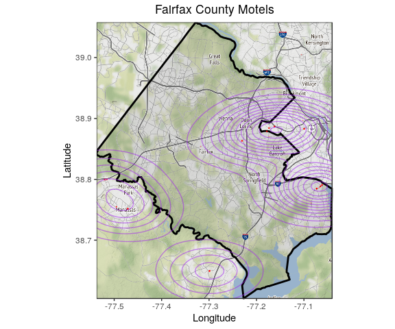
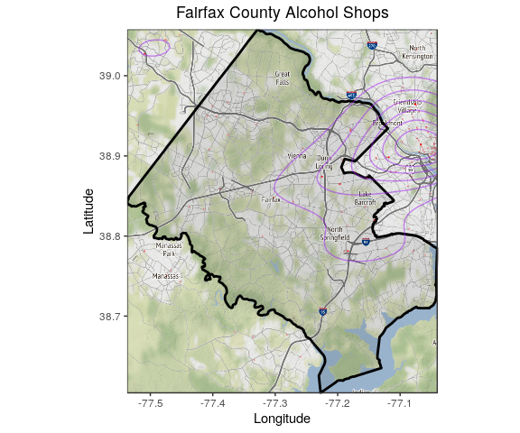
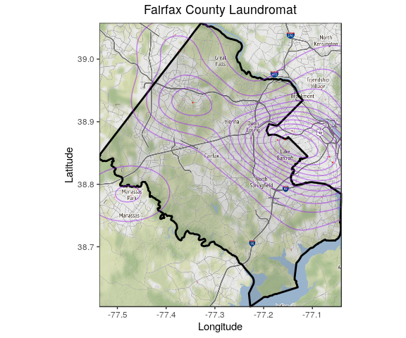
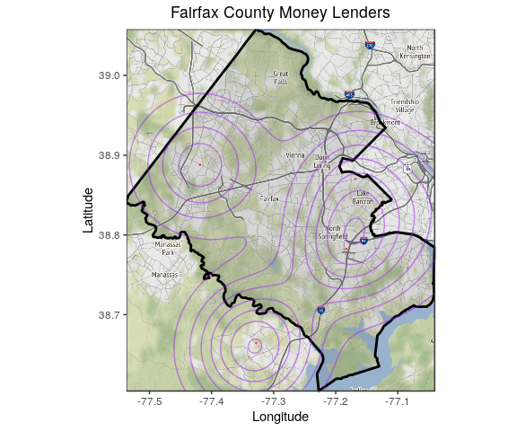
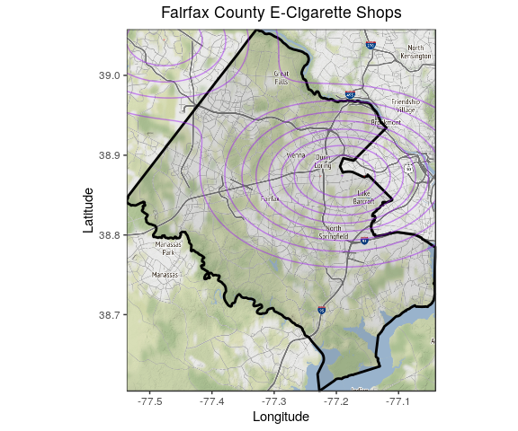
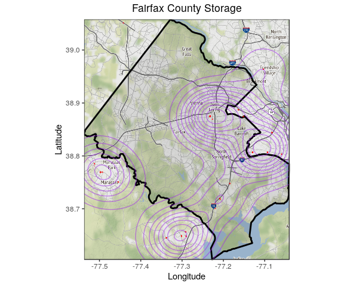

OSM Saftey- Part 2
================
VH
6/20/2019

1.  Define the Functions

Before you do anything, restart your R session (under Session at the top). Then run the setup chunk above to initilize the packages you need and other output definitions for the .RMD document (don't worry about these for now). Run this entire chunk to define the functions for use below. You can verify that this worked if they show up in your global envirnment (top right), under functions.

``` r
#Fairfax read OSM to output tibble (tidyr df)
osm_to_df <- function(key = "leisure", value = "playground", type = "point") {
#Read in playground data
read.df <- getbb("fairfax county", format_out = "polygon") %>%
  opq() %>%
  add_osm_feature(key = key, value = value) %>%
  osmdata_sf()
    
    if (type == "point" & !is.null(read.df$osm_points)) {
      
      lat.long.df <- do.call(rbind, st_geometry(read.df$osm_points)) %>% 
        as_tibble() %>% 
        setNames(c("longitude", "latitude")) %>%
        mutate(object_id = 1:nrow(.) %>% as.factor()) %>%
        dplyr::select(object_id, everything())
      
    } else if (type == "polygon" & !is.null(read.df$osm_polygons)) {
      
      poly.list <- do.call(rbind, st_geometry(read.df$osm_polygons)) %>%
        lapply(as.tibble)
      npolys    <- length(poly.list)
      
      lat.long.df <- tibble(
        object_id = 1:npolys %>% as.factor(),
        coord.df  = poly.list
        ) %>%
        unnest(coord.df) %>%
        rename(
        longitude = lon,
        latitude  = lat
        )
      
    } else if (type == "line" & !is.null(read.df$osm_lines)) {
      
      line.list <- do.call(list, st_geometry(read.df$osm_lines)) %>%
        lapply(., rbind) %>%
        lapply(., as.tibble)
      nlines    <- length(line.list)
      
      lat.long.df <- tibble(
        object_id = 1:nlines %>% as.factor(),
        coord.df  = line.list
        ) %>%
        unnest(coord.df) %>%
        rename(
        longitude = lon,
        latitude  = lat
        )
    } else {
      ifelse(is.null(read.df$osm_points), stop("key/value incorrect or object type is empty"), 
             ifelse(!(type %in% c("point", "polygon", "line")), stop("type is not point, polygon, or line"),
                    stop("object type is empty, try another")))
    }
  
  return(lat.long.df)
}

#Base Map Function
fairfax.gg <- function() {
fairfax.box <- getbb("fairfax county")
fairfax.boundary <- getbb("fairfax county", format_out = "polygon") %>%
  as.tibble() %>%
  rename(longitude = `V1`, latitude = `V2`)

#Grab the map info (many varieties)
fairfax.map <- get_map(location = fairfax.box, source="stamen", maptype="watercolor", crop = TRUE)

#ggmap and ggplot map and boundary
ff.map <- ggmap(fairfax.map) +
  geom_polygon(data = fairfax.boundary, aes(x = longitude, y = latitude), colour = "black", size = 1, alpha = 0.1) +
  labs(
    x = "Longitude",
    y = "Latitude"
  )
  return(ff.map)
}

#Point Visualization
osm_point_plot <- function(ff.map, obj, value) {
  if (!is.data.frame(obj)) stop("OSM object is not a data frame")
  if (!is.ggplot(ff.map))  stop("Baseline Fairfax map is not a ggplot")
  ff.map +
  geom_point(data = obj, aes(x = longitude, y = latitude),
             size = 0.1, colour = "red", alpha = 0.25) + 
  geom_density_2d(data = obj, aes(x = longitude, y = latitude),
                  colour = "purple", alpha = 0.5) +
  labs(title = sprintf("Fairfax County %s", value))
  }

#Polygon Plot
osm_poly_plot <- function(ff.map, obj, value) {
  if (!is.data.frame(obj)) stop("OSM object is not a data frame")
  if (!is.ggplot(ff.map))  stop("Baseline Fairfax map is not a ggplot")
  ff.map +
  geom_polygon(data = obj, aes(x = longitude, y = latitude, group = object_id), 
               colour = "red", fill = "maroon", alpha = 0.5, size = 0.2) +
  labs(title = sprintf("Fairfax County %s", value))
  }

#Line Plot
osm_line_plot <- function(ff.map, obj, value) {
  if (!is.data.frame(obj)) stop("OSM object is not a data frame")
  if (!is.ggplot(ff.map))  stop("Baseline Fairfax map is not a ggplot")
  ff.map +
  geom_path(data = obj, aes(x = longitude, y = latitude, group = object_id), 
               colour = "red", alpha = 0.5, size = 0.5) +
  labs(title = sprintf("Fairfax County %s", value))
  }

#File Path Generator (for OSM specifically)
osm_filepath_gen <- function(data.folder, file.type, key, value, type) {
  date <- Sys.Date() %>% as.character() %>% str_replace_all("-", "_")
  file.type <- "csv"
  data.folder <- "original/osm"
  file.path <- sprintf("./data/%s/%s_%s.%s", 
                     data.folder,
                     date, 
                     paste(key, value, type, sep = "_"),
                     file.type)
  return(file.path)
}
```

``` r
ff.map <- fairfax.gg()
```

    ## Warning: `as.tibble()` is deprecated, use `as_tibble()` (but mind the new semantics).
    ## This warning is displayed once per session.

    ## Source : http://tile.stamen.com/terrain/11/582/782.png

    ## Source : http://tile.stamen.com/terrain/11/583/782.png

    ## Source : http://tile.stamen.com/terrain/11/584/782.png

    ## Source : http://tile.stamen.com/terrain/11/585/782.png

    ## Source : http://tile.stamen.com/terrain/11/582/783.png

    ## Source : http://tile.stamen.com/terrain/11/583/783.png

    ## Source : http://tile.stamen.com/terrain/11/584/783.png

    ## Source : http://tile.stamen.com/terrain/11/585/783.png

    ## Source : http://tile.stamen.com/terrain/11/582/784.png

    ## Source : http://tile.stamen.com/terrain/11/583/784.png

    ## Source : http://tile.stamen.com/terrain/11/584/784.png

    ## Source : http://tile.stamen.com/terrain/11/585/784.png

    ## Source : http://tile.stamen.com/terrain/11/582/785.png

    ## Source : http://tile.stamen.com/terrain/11/583/785.png

    ## Source : http://tile.stamen.com/terrain/11/584/785.png

    ## Source : http://tile.stamen.com/terrain/11/585/785.png

``` r
play.df <- osm_to_df(key = "tourism", value = "motel", type = "point")
```

    ## Warning: `as_tibble.matrix()` requires a matrix with column names or a `.name_repair` argument. Using compatibility `.name_repair`.
    ## This warning is displayed once per session.

``` r
playground.gg <- osm_point_plot(ff.map, play.df, "Motels")  
playground.gg  
```



``` r
play.df$object_id %>% unique() %>% length()
```

    ## [1] 130

Motel Observations: This is an interesting one that warants more discussion..there are only 3 motels on this map, but there aren't many motels to begin with. Google search tends to prefer showing hotels and a price restriction limits the motels to about the same number... Also, I think "inn" and "motel" are synonymous (price-wise).. but those are also not included. Perhaps we would have better luck with a hotel booking site? Use: Maybe...

``` r
ff.map <- fairfax.gg()
play.df <- osm_to_df(key = "shop", value = "beauty", type = "point")
playground.gg <- osm_point_plot(ff.map, play.df, "Beauty Shops")  
playground.gg  
```


``` r
play.df$object_id %>% unique() %>% length()
```

    ## [1] 289

Beauty Shop Observations: This one has potential to be misleading... Since it's crowd sourced, people may call salons/spas beauty shops. For some reason, these points appear for wealthy areas.. (I zoomed in on google maps to see the beauty shops in the area) Use: No.

``` r
ff.map <- fairfax.gg()
play.df <- osm_to_df(key = "shop", value = "alcohol", type = "point")
playground.gg <- osm_point_plot(ff.map, play.df, "Alcohol Shops")  
playground.gg  
```



``` r
play.df$object_id %>% unique() %>% length()
```

    ## [1] 132

Alcohol Shop Observations:This one is interesting because the dots are faint... From what I can see though, this map is still not reliable because there would be more 'purple loops'. Of all maps, this one is quite possibly the worst. There are countless alcohol shops on Gmaps and this one does not come close. Use:NO

``` r
ff.map <- fairfax.gg()
play.df <- osm_to_df(key = "shop", value = "laundry", type = "point")
playground.gg <- osm_point_plot(ff.map, play.df, "Laundromat")  
playground.gg  
```



``` r
play.df$object_id %>% unique() %>% length()
```

    ## [1] 45

Laundromat Observations:Terrible! Google Maps shows a HUGE amount of these... the three points are not enough!!!! Use: NO

``` r
ff.map <- fairfax.gg()
play.df <- osm_to_df(key = "shop", value = "money_lender", type = "point")
playground.gg <- osm_point_plot(ff.map, play.df, "Money Lenders")  
playground.gg  
```



``` r
play.df$object_id %>% unique() %>% length()
```

    ## [1] 26

Money Lender Observations: This map has three points...Google Maps has many times this amount. Not reliable!!! Use: NO

``` r
ff.map <- fairfax.gg()
play.df <- osm_to_df(key = "shop", value = "e-cigarette", type = "point")
playground.gg <- osm_point_plot(ff.map, play.df, "E-Cigarette Shops")  
playground.gg  
```



``` r
play.df$object_id %>% unique() %>% length()
```

    ## [1] 3

E-Cigarette Shop Observations: Only one point. Use: No

``` r
ff.map <- fairfax.gg()
play.df <- osm_to_df(key = "shop", value = "storage_rental", type = "point")
playground.gg <- osm_point_plot(ff.map, play.df, "Storage")  
playground.gg  
```



``` r
play.df$object_id %>% unique() %>% length()
```

    ## [1] 215

Storage Observations: We have five points on the map, but Google maps reveals more evenly spread storage with over 12 points on the map (more if you zoom in on certain areas) Use: No

Overall, though I personally think the points are not thoughough... if you overlay the points, I think you get a fuller story/pattern that can be predictive to a degree.
