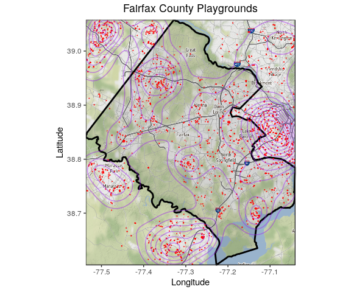
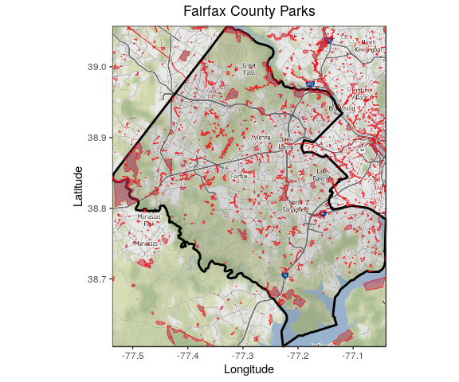
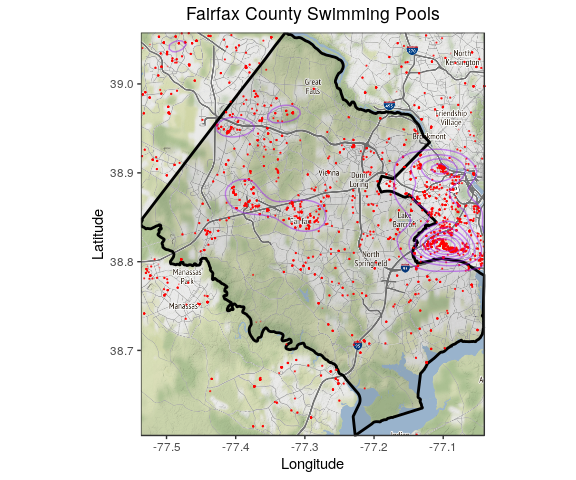
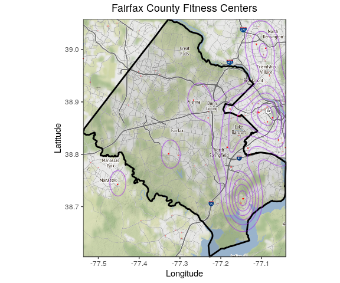
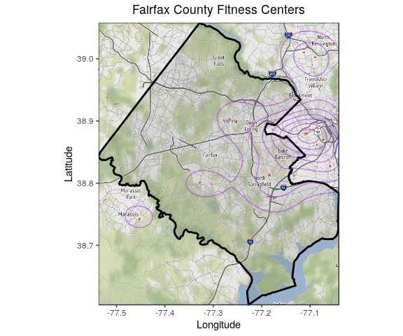
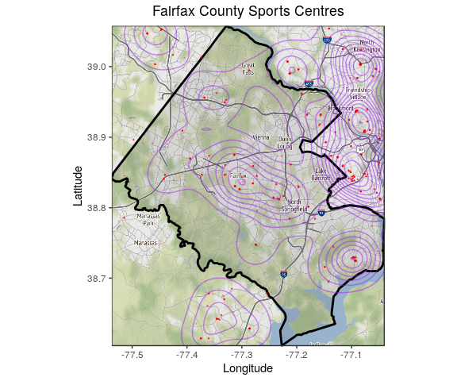

Economic Vulnerability
================
VH
6/20/2019

1.  Define the Functions

Before you do anything, restart your R session (under Session at the top). Then run the setup chunk above to initilize the packages you need and other output definitions for the .RMD document (don't worry about these for now). Run this entire chunk to define the functions for use below. You can verify that this worked if they show up in your global envirnment (top right), under functions.

``` r
#Fairfax read OSM to output tibble (tidyr df)
osm_to_df <- function(key = "leisure", value = "playground", type = "point") {
#Read in playground data
read.df <- getbb("fairfax county", format_out = "polygon") %>%
  opq() %>%
  add_osm_feature(key = key, value = value) %>%
  osmdata_sf()
    
    if (type == "point" & !is.null(read.df$osm_points)) {
      
      lat.long.df <- do.call(rbind, st_geometry(read.df$osm_points)) %>% 
        as_tibble() %>% 
        setNames(c("longitude", "latitude")) %>%
        mutate(object_id = 1:nrow(.) %>% as.factor()) %>%
        dplyr::select(object_id, everything())
      
    } else if (type == "polygon" & !is.null(read.df$osm_polygons)) {
      
      poly.list <- do.call(rbind, st_geometry(read.df$osm_polygons)) %>%
        lapply(as.tibble)
      npolys    <- length(poly.list)
      
      lat.long.df <- tibble(
        object_id = 1:npolys %>% as.factor(),
        coord.df  = poly.list
        ) %>%
        unnest(coord.df) %>%
        rename(
        longitude = lon,
        latitude  = lat
        )
      
    } else if (type == "line" & !is.null(read.df$osm_lines)) {
      
      line.list <- do.call(list, st_geometry(read.df$osm_lines)) %>%
        lapply(., rbind) %>%
        lapply(., as.tibble)
      nlines    <- length(line.list)
      
      lat.long.df <- tibble(
        object_id = 1:nlines %>% as.factor(),
        coord.df  = line.list
        ) %>%
        unnest(coord.df) %>%
        rename(
        longitude = lon,
        latitude  = lat
        )
    } else {
      ifelse(is.null(read.df$osm_points), stop("key/value incorrect or object type is empty"), 
             ifelse(!(type %in% c("point", "polygon", "line")), stop("type is not point, polygon, or line"),
                    stop("object type is empty, try another")))
    }
  
  return(lat.long.df)
}

#Base Map Function
fairfax.gg <- function() {
fairfax.box <- getbb("fairfax county")
fairfax.boundary <- getbb("fairfax county", format_out = "polygon") %>%
  as.tibble() %>%
  rename(longitude = `V1`, latitude = `V2`)

#Grab the map info (many varieties)
fairfax.map <- get_map(location = fairfax.box, source="stamen", maptype="watercolor", crop = TRUE)

#ggmap and ggplot map and boundary
ff.map <- ggmap(fairfax.map) +
  geom_polygon(data = fairfax.boundary, aes(x = longitude, y = latitude), colour = "black", size = 1, alpha = 0.1) +
  labs(
    x = "Longitude",
    y = "Latitude"
  )
  return(ff.map)
}

#Point Visualization
osm_point_plot <- function(ff.map, obj, value) {
  if (!is.data.frame(obj)) stop("OSM object is not a data frame")
  if (!is.ggplot(ff.map))  stop("Baseline Fairfax map is not a ggplot")
  ff.map +
  geom_point(data = obj, aes(x = longitude, y = latitude),
             size = 0.1, colour = "red", alpha = 0.25) + 
  geom_density_2d(data = obj, aes(x = longitude, y = latitude),
                  colour = "purple", alpha = 0.5) +
  labs(title = sprintf("Fairfax County %s", value))
  }

#Polygon Plot
osm_poly_plot <- function(ff.map, obj, value) {
  if (!is.data.frame(obj)) stop("OSM object is not a data frame")
  if (!is.ggplot(ff.map))  stop("Baseline Fairfax map is not a ggplot")
  ff.map +
  geom_polygon(data = obj, aes(x = longitude, y = latitude, group = object_id), 
               colour = "red", fill = "maroon", alpha = 0.5, size = 0.2) +
  labs(title = sprintf("Fairfax County %s", value))
  }

#Line Plot
osm_line_plot <- function(ff.map, obj, value) {
  if (!is.data.frame(obj)) stop("OSM object is not a data frame")
  if (!is.ggplot(ff.map))  stop("Baseline Fairfax map is not a ggplot")
  ff.map +
  geom_path(data = obj, aes(x = longitude, y = latitude, group = object_id), 
               colour = "red", alpha = 0.5, size = 0.5) +
  labs(title = sprintf("Fairfax County %s", value))
  }

#File Path Generator (for OSM specifically)
osm_filepath_gen <- function(data.folder, file.type, key, value, type) {
  date <- Sys.Date() %>% as.character() %>% str_replace_all("-", "_")
  file.type <- "csv"
  data.folder <- "original/osm"
  file.path <- sprintf("./data/%s/%s_%s.%s", 
                     data.folder,
                     date, 
                     paste(key, value, type, sep = "_"),
                     file.type)
  return(file.path)
}
```

``` r
ff.map <- fairfax.gg()
```

    ## Warning: `as.tibble()` is deprecated, use `as_tibble()` (but mind the new semantics).
    ## This warning is displayed once per session.

    ## Source : http://tile.stamen.com/terrain/11/582/782.png

    ## Source : http://tile.stamen.com/terrain/11/583/782.png

    ## Source : http://tile.stamen.com/terrain/11/584/782.png

    ## Source : http://tile.stamen.com/terrain/11/585/782.png

    ## Source : http://tile.stamen.com/terrain/11/582/783.png

    ## Source : http://tile.stamen.com/terrain/11/583/783.png

    ## Source : http://tile.stamen.com/terrain/11/584/783.png

    ## Source : http://tile.stamen.com/terrain/11/585/783.png

    ## Source : http://tile.stamen.com/terrain/11/582/784.png

    ## Source : http://tile.stamen.com/terrain/11/583/784.png

    ## Source : http://tile.stamen.com/terrain/11/584/784.png

    ## Source : http://tile.stamen.com/terrain/11/585/784.png

    ## Source : http://tile.stamen.com/terrain/11/582/785.png

    ## Source : http://tile.stamen.com/terrain/11/583/785.png

    ## Source : http://tile.stamen.com/terrain/11/584/785.png

    ## Source : http://tile.stamen.com/terrain/11/585/785.png

``` r
ff.map
```



``` r
play.df <- osm_to_df(key = "leisure", value = "playground", type = "point")
```

    ## Warning: `as_tibble.matrix()` requires a matrix with column names or a `.name_repair` argument. Using compatibility `.name_repair`.
    ## This warning is displayed once per session.

``` r
play.df
```

    ## # A tibble: 9,600 x 3
    ##    object_id longitude latitude
    ##    <fct>         <dbl>    <dbl>
    ##  1 1             -77.1     39.0
    ##  2 2             -77.1     39.0
    ##  3 3             -77.1     39.0
    ##  4 4             -77.1     38.8
    ##  5 5             -77.1     38.8
    ##  6 6             -77.1     38.8
    ##  7 7             -77.1     38.9
    ##  8 8             -77.1     38.9
    ##  9 9             -77.1     38.9
    ## 10 10            -77.1     38.9
    ## # … with 9,590 more rows

``` r
playground.gg <- osm_point_plot(ff.map, play.df, "Playgrounds")  
playground.gg  
```

    ## Warning: Removed 2 rows containing non-finite values (stat_density2d).

    ## Warning: Removed 2 rows containing missing values (geom_point).


``` r
play.df$object_id %>% unique() %>% length()
```

    ## [1] 9600

COMMENTS: No way to cross check playgrounds on GMAPS...

``` r
ff.map <- fairfax.gg()
ff.map
```


``` r
play.df <- osm_to_df(key = "leisure", value = "park", type = "polygon")
play.df
```

    ## # A tibble: 58,371 x 3
    ##    object_id longitude latitude
    ##    <fct>         <dbl>    <dbl>
    ##  1 1             -77.1     39.0
    ##  2 1             -77.1     39.0
    ##  3 1             -77.1     39.0
    ##  4 1             -77.1     39.0
    ##  5 1             -77.1     39.0
    ##  6 1             -77.1     39.0
    ##  7 1             -77.1     39.0
    ##  8 1             -77.1     39.0
    ##  9 1             -77.1     39.0
    ## 10 1             -77.1     39.0
    ## # … with 58,361 more rows

``` r
playground.gg <- osm_poly_plot(ff.map, play.df, "Parks")  
playground.gg  
```



``` r
play.df$object_id %>% unique() %>% length()
```

    ## [1] 1727

COMMENT; useful but accuracy questionable cross-check on fairfax. Perhaps it excludes the nature reserves? website:<https://data-fairfaxcountygis.opendata.arcgis.com/datasets/county-parks?geometry=-78.124%2C38.645%2C-76.197%2C39.019>

``` r
ff.map <- fairfax.gg()
ff.map
```



``` r
play.df <- osm_to_df(key = "leisure", value = "swimming_pool", type = "point")
play.df
```

    ## # A tibble: 12,512 x 3
    ##    object_id longitude latitude
    ##    <fct>         <dbl>    <dbl>
    ##  1 1             -77.1     38.9
    ##  2 2             -77.1     38.8
    ##  3 3             -77.1     38.8
    ##  4 4             -77.1     38.8
    ##  5 5             -77.1     38.8
    ##  6 6             -77.1     38.9
    ##  7 7             -77.1     38.9
    ##  8 8             -77.1     38.9
    ##  9 9             -77.1     38.9
    ## 10 10            -77.1     38.9
    ## # … with 12,502 more rows

``` r
playground.gg <- osm_point_plot(ff.map, play.df, "Swimming Pools")  
playground.gg  
```

    ## Warning: Removed 9 rows containing non-finite values (stat_density2d).

    ## Warning: Removed 9 rows containing missing values (geom_point).


``` r
play.df$object_id %>% unique() %>% length()
```

    ## [1] 12512

COMMENT: Looks decent. Compare to fairfax website: <https://data-fairfaxcountygis.opendata.arcgis.com/datasets/community-pools?geometry=-78.05%2C38.674%2C-76.124%2C39.048>

``` r
ff.map <- fairfax.gg()
ff.map
```



``` r
play.df <- osm_to_df(key = "leisure", value = "fitness_centre", type = "point")
```

    ## Request failed [429]. Retrying in 1.9 seconds...

``` r
play.df
```

    ## # A tibble: 205 x 3
    ##    object_id longitude latitude
    ##    <fct>         <dbl>    <dbl>
    ##  1 1             -77.1     38.9
    ##  2 2             -77.1     38.9
    ##  3 3             -77.1     38.9
    ##  4 4             -77.1     38.9
    ##  5 5             -77.1     38.9
    ##  6 6             -77.1     38.9
    ##  7 7             -77.1     38.9
    ##  8 8             -77.1     38.9
    ##  9 9             -77.1     38.9
    ## 10 10            -77.1     38.9
    ## # … with 195 more rows

``` r
playground.gg <- osm_point_plot(ff.map, play.df, "Fitness Centers")  
playground.gg  
```

    ## Warning: Removed 6 rows containing non-finite values (stat_density2d).

    ## Warning: Removed 6 rows containing missing values (geom_point).



``` r
play.df$object_id %>% unique() %>% length()
```

    ## [1] 205

NOTE: we MIGHT want the next one ... your call.

``` r
ff.map <- fairfax.gg()
ff.map
```


``` r
play.df <- osm_to_df(key = "leisure", value = "sports_centre", type = "point")
play.df
```

    ## # A tibble: 1,614 x 3
    ##    object_id longitude latitude
    ##    <fct>         <dbl>    <dbl>
    ##  1 1             -77.2     38.9
    ##  2 2             -77.1     39.0
    ##  3 3             -77.0     38.9
    ##  4 4             -77.1     39.0
    ##  5 5             -77.1     38.9
    ##  6 6             -77.4     39.0
    ##  7 7             -77.3     38.8
    ##  8 8             -77.1     38.8
    ##  9 9             -77.3     38.8
    ## 10 10            -77.1     38.8
    ## # … with 1,604 more rows

``` r
playground.gg <- osm_point_plot(ff.map, play.df, "Sports Centres")  
playground.gg  
```

    ## Warning: Removed 2 rows containing non-finite values (stat_density2d).

    ## Warning: Removed 2 rows containing missing values (geom_point).



``` r
play.df$object_id %>% unique() %>% length()
```

    ## [1] 1614
