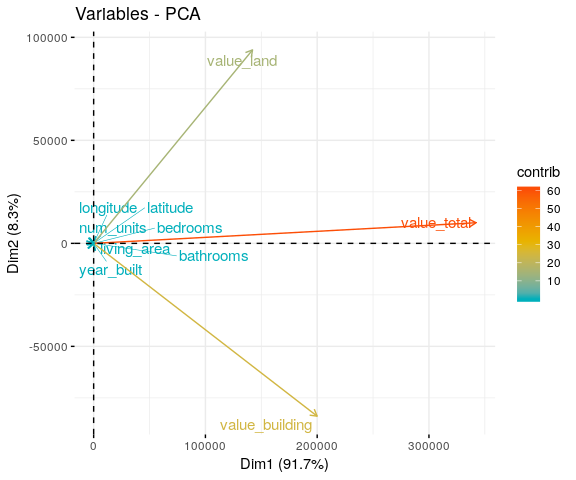

ACS EDA
================
Quinton Neville

1. Data Description
===================

``` r
#Read
housing.df <- read_csv("./data/working/Fairfax_Housing_2018/fairfax_housing_2018_geo.csv") %>%
  janitor::clean_names() %>%
  mutate(
    housing_type = housing_type %>% as.factor(),
    water        = water %>% as.factor(),
    sewer        = sewer %>% as.factor(),
    gas          = gas   %>% as.factor(),
    district     = district  %>% as.factor(),
    highschool   = highschool %>% as.factor()
  )

#Dimension
house.dim  <- dim(housing.df)
#Charstring of Variable Names
house.vars <- str_c(names(housing.df), collapse = ", ")

#Check uniqueness of parcel id's
parcel.id.non.unique <- house.dim[1] - (housing.df$parcel_id %>% unique() %>% length())

#Grab unique levels of each factor (cat variable)
unique.char.types    <- housing.df %>%
  select_if(is.factor) %>% 
  map_dbl(.x = ., ~ unique(.x) %>% length()) 
unique.parcels       <- housing.df$parcel_id %>% unique() %>% length()

#Missing data
miss.df <- tibble(
  Variable = names(housing.df),
  Count = housing.df %>% map_dbl(.x = ., ~is.na(.x) %>% sum()),
  Percentage = housing.df %>% map_dbl(.x = ., ~is.na(.x) %>% mean()) %>% round(5),
) %>%
  mutate(
    Percentage = as.character(Percentage * 100) %>% str_c(., "%")
  )
```

These housing data, probabilistically sampled to be a synthetically representative sample of households in Fairfax County, contain 332190 housing level observations in 18 variables, given by: parcel\_id, num\_units, housing\_type, year\_built, longitude, latitude, water, sewer, gas, value\_land, value\_building, value\_total, bedrooms, bathrooms, living\_area, geoid, district, highschool. Parcel ID refers to the unique identifier of the parcel in which the housing unit exists, further there exist 123 repeated ID's (i.e. more than one housing unit in the same parcel). Number of units is a self explanatory continuous variable, where multiple units refers to an appartment complex. Housing type is a character vector with 8 unique types while Year is an integer refering to the year the house was built. Longitude and latitude are continuous variables refering the geospatial location of the housing unit, while Water, Sewer, and Gas are character vectors with 4, 4, and 4 unique observations, respectively. Value of the land, building, total, living area, and bedrooms/bathrooms are numeric values which describe value with respect to U.S. dollars. Lastly, GEOID describes the unique geo code used by the census as an observational identifier and there exist 9 districts with 24 highschools.

The rates and counts of missing data are given in the table below.

| Variable        |  Count| Percentage |
|:----------------|------:|:-----------|
| parcel\_id      |      0| 0%         |
| num\_units      |      0| 0%         |
| housing\_type   |      0| 0%         |
| year\_built     |    453| 0.136%     |
| longitude       |      0| 0%         |
| latitude        |      0| 0%         |
| water           |   2710| 0.816%     |
| sewer           |   2327| 0.701%     |
| gas             |   4308| 1.297%     |
| value\_land     |   2218| 0.668%     |
| value\_building |   2218| 0.668%     |
| value\_total    |   2218| 0.668%     |
| bedrooms        |  12017| 3.618%     |
| bathrooms       |   3408| 1.026%     |
| living\_area    |   3281| 0.988%     |
| geoid           |      3| 0.001%     |
| district        |      0| 0%         |
| highschool      |      0| 0%         |

2. Variable Profiles and Visualizations
=======================================

i. Number of Units
------------------

``` r
#Counts
housing.df %>% 
  mutate(
    Type = ifelse(num_units > 1, "Multiple Unit", "Single Unit") %>%
            as.factor()
  ) %>%
  group_by(Type) %>%
  summarise(
    Count    = n(),
    Mean     = mean(num_units),
    Median   = median(num_units),
    Variance = sd(num_units)^2,
    IQR      = quantile(num_units, c(0.25, 0.75)) %>% 
               str_c(., collapse = ", ") %>%
               str_c("(", ., ")")
  ) %>% knitr::kable()
```

| Type          |   Count|      Mean|  Median|  Variance| IQR        |
|:--------------|-------:|---------:|-------:|---------:|:-----------|
| Multiple Unit |     716|  121.1955|    35.5|   28958.4| (2, 200.5) |
| Single Unit   |  331474|    1.0000|     1.0|       0.0| (1, 1)     |

``` r
#Distribution
housing.df %>% 
  mutate(
    group = ifelse(num_units > 1, "Multiple Unit", "Single Unit") %>%
            as.factor()
  ) %>%
  filter(group %in% "Multiple Unit") %>%
  ggplot() +
  geom_violin(aes(x = group, y = num_units, fill = group), trim = FALSE, alpha = 0.5) +
  geom_boxplot(aes(x = group, y = num_units), colour = "black", width = .16, alpha = 0.8) +
  labs(
    x = "Type",
    y = "Count",
    title = "Distribution of Number of Units"
  ) +
  scale_fill_viridis_d() +
  coord_flip() +
  theme(legend.position = "none")
```


Here we stratified by those observations with at least one unit (House) versus those with more than one unit (Complex, Duplex, etc.) see that a majority of observations are houses, while a smaller number are appartment buildings. Of appartment buildings, the number of units is heavilly left skewed, without many outlying number of units at the upper end of the spectrum.

ii. Housing Type
----------------

``` r
#Table of Count/Frequency
housing.df %>% 
  group_by(housing_type) %>% 
  summarise(
    Count =n()
    ) %>% 
  mutate(
    Frequency = str_c(round(Count / sum(Count)*100,2),"%")
    ) %>%
  rename(
    `Housing Type` = housing_type
  ) %>%
  knitr::kable(digits = 3)
```

| Housing Type           |   Count| Frequency |
|:-----------------------|-------:|:----------|
| Duplex                 |    2307| 0.69%     |
| High Rise              |    9784| 2.95%     |
| Low Rise               |   29546| 8.89%     |
| Mid Rise               |    1715| 0.52%     |
| Mobile Home            |       8| 0%        |
| Multiplex              |   10290| 3.1%      |
| Single Family Detached |  193640| 58.29%    |
| Townhouse              |   84900| 25.56%    |

Here we see that a vast majority of observations are classified as Single Family Detached homes, followed by Townhomes, then Low - High rise units, with very few Duplexes and almost no Mobile Homes.

iii. Year Built
---------------

``` r
#Distribution of Years
all.time.gg <- housing.df %>% 
  mutate(
    group = rep("Domicile", length = nrow(.)) %>%
      as.factor()
  ) %>%
  ggplot() +
  geom_violin(aes(x = group, y = year_built, fill = group), trim = FALSE, alpha = 0.5) +
  geom_boxplot(aes(x = group, y = year_built), colour = "black", width = .16, alpha = 0.8) +
  labs(
    x = "Count",
    y = "Year",
    title = "Distribution of Domiciles Built by Year"
  ) +
  scale_fill_viridis_d() +
  coord_flip() +
  theme(legend.position = "none")

#Post WWII
post.ww2.gg <- all.time.gg + ylim(c(1940, 2018))

#Histogram
post.ww2.hist <- housing.df %>% 
  mutate(
    group = rep("Domicile", length = nrow(.)) %>%
      as.factor()
  ) %>%
  ggplot() +
  geom_histogram(aes(x = year_built, fill = group), colour = "black", alpha = 0.5) +
  labs(
    x = "Year",
    y = "Count",
    title = "Distribution of Domiciles Built by Year"
  ) +
  scale_fill_viridis_d() +
  theme(legend.position = "none") + 
  xlim(c(1940, 2018))
  
#Display
(all.time.gg / post.ww2.gg)
```


``` r
post.ww2.hist
```


``` r
#Counts
housing.df %>%
  group_by(year_built) %>%
  summarise(
    Count = n()
  ) %>%
    arrange(desc(Count)) %>%
  mutate(
    Year = as.character(year_built) %>% 
      as.factor() %>%
      forcats::fct_reorder(., Count)
    ) %>% 
  slice(1:50) %>%
    ggplot(aes(x = Year, y = Count, fill = Count)) +
  geom_bar(stat = "identity", width = 1, colour = "black") +
  coord_flip() +
  labs(
    x = "Year",
    y = "Number of Domiciles Built",
    title = "Number of Domiciles Built by Year"
  ) +
theme(legend.position = "right",
  axis.text.y = element_text(color = "black", 
  size = 10,  hjust = 1)) +
  scale_fill_viridis_c("Number of Domociles \nBuilt")
```


Here we observed that there are quite a few domiciles were built well before World War II, though few in each year still remain, while the majority of houses were built after World War II to present. Additionally, there exist 453 observations where the year of building was unknown. Clearly, this distribution is heavily left skewed, but taking a snapshot of houses built after WWII, this bimodal distribution appears to be *approximately* empirically normal.

iv. Water, Sewer, Gas
---------------------

``` r
#Table of Count/Frequency Water
housing.df %>% 
    mutate(
    water = water %>% as.character() %>% replace_na(., "Not Available")
  ) %>% 
  group_by(water) %>% 
  summarise(
    Count =n()
    ) %>% 
  mutate(
    Frequency = str_c(round(Count / sum(Count)*100,2),"%")
    ) %>%
  rename(
    `Water Availability` = water
  ) %>%
  knitr::kable(digits = 3)
```

| Water Availability  |   Count| Frequency |
|:--------------------|-------:|:----------|
| Not Available       |    2710| 0.82%     |
| Water available     |    2908| 0.88%     |
| Water connected     |  316451| 95.26%    |
| Water not available |   10121| 3.05%     |

``` r
#Table of Count/Frequency Sewage
housing.df %>% 
  mutate(
    sewer = sewer %>% as.character() %>% replace_na(., "Not Available")
  ) %>%
  group_by(sewer) %>% 
  summarise(
    Count =n()
    ) %>% 
  mutate(
    Frequency = str_c(round(Count / sum(Count)*100,2),"%")
    ) %>%
  rename(
    `Sewage Availability` = sewer
  ) %>%
  knitr::kable(digits = 3)
```

| Sewage Availability |   Count| Frequency |
|:--------------------|-------:|:----------|
| Not Available       |    2327| 0.7%      |
| Sewer available     |    2130| 0.64%     |
| Sewer connected     |  307607| 92.6%     |
| Sewer not available |   20126| 6.06%     |

``` r
#Table of Count/Frequency Gas
housing.df %>% 
  mutate(
    gas = gas %>% as.character() %>% replace_na(., "Not Available")
  ) %>%
  group_by(gas) %>% 
  summarise(
    Count =n()
    ) %>% 
  mutate(
    Frequency = str_c(round(Count / sum(Count)*100,2),"%")
    ) %>%
  rename(
    `Gas Availability` = gas
  ) %>%
  knitr::kable(digits = 3)
```

| Gas Availability  |   Count| Frequency |
|:------------------|-------:|:----------|
| Gas available     |   13415| 4.04%     |
| Gas connected     |  213299| 64.21%    |
| Gas not available |  101168| 30.45%    |
| Not Available     |    4308| 1.3%      |

These data suggest that apporximately 95% of domiciles had water services connected, with 3% of services being unnavailable. With respect to sewage, 92% were connected and 6% of services were unnavailable. Lastly, roughly 65% of domiciles had gas connected, 30% did not have services available, and 4% had services available but not connected. Overall, slightly less than 1% of these data were missing/unnavailable for water and sewage, while over 1% was missing for gas services.

v. District and Highschool
--------------------------

``` r
#Table of Count/Frequency District
housing.df %>% 
    mutate(
    district = district %>% 
      as.character() %>% 
      replace_na(., "Not Available")
  ) %>% 
  group_by(district) %>% 
  summarise(
    Count =n()
    ) %>% 
  mutate(
    Frequency = str_c(round(Count / sum(Count)*100,2),"%")
    ) %>%
  rename(
    `School District` = district
  ) %>%
  knitr::kable(digits = 3)
```

| School District |  Count| Frequency |
|:----------------|------:|:----------|
| BRADDOCK        |  35835| 10.79%    |
| DRANESVILLE     |  36843| 11.09%    |
| HUNTER MILL     |  41434| 12.47%    |
| LEE             |  33698| 10.14%    |
| MASON           |  30418| 9.16%     |
| MOUNT VERNON    |  39055| 11.76%    |
| PROVIDENCE      |  38401| 11.56%    |
| SPRINGFIELD     |  37882| 11.4%     |
| SULLY           |  38624| 11.63%    |

``` r
#Table of Count/Frequency HIghschool
housing.df %>% 
  mutate(
    highschool = highschool %>% 
      as.character() %>% 
      replace_na(., "Not Available")
  ) %>%
  group_by(highschool) %>% 
  summarise(
    Count =n()
    ) %>% 
  mutate(
    Frequency = str_c(round(Count / sum(Count)*100,2),"%")
    ) %>%
  rename(
    `Highschool` = highschool
  ) %>%
  knitr::kable(digits = 3)
```

| Highschool       |  Count| Frequency |
|:-----------------|------:|:----------|
| ANNANDALE        |  12075| 3.63%     |
| CENTREVILLE      |  13572| 4.09%     |
| CHANTILLY        |  12957| 3.9%      |
| EDISON           |  18174| 5.47%     |
| FAIRFAX          |   8427| 2.54%     |
| FALLS CHURCH     |  14706| 4.43%     |
| HAYFIELD         |  13155| 3.96%     |
| HERNDON          |  15038| 4.53%     |
| JUSTICE          |  14012| 4.22%     |
| LAKE BRADDOCK    |  13806| 4.16%     |
| LANGLEY          |  12737| 3.83%     |
| LEE              |   9890| 2.98%     |
| MADISON          |  11782| 3.55%     |
| MARSHALL         |  15309| 4.61%     |
| MCLEAN           |  15654| 4.71%     |
| MOUNT VERNON     |  11408| 3.43%     |
| OAKTON           |  15977| 4.81%     |
| ROBINSON         |  15440| 4.65%     |
| SOUTH COUNTY     |  10965| 3.3%      |
| SOUTH LAKES      |  20943| 6.3%      |
| WEST POTOMAC     |  15071| 4.54%     |
| WEST SPRINGFIELD |  13395| 4.03%     |
| WESTFIELD        |  14905| 4.49%     |
| WOODSON          |  12792| 3.85%     |

Overall, we observed that observations were roughly uniformly distributed by School District, with Hunter Mill having slightly more than average and Lee having slightly fewer. We observed a similar trend amongst highschools, with a roughly uniform distribution of observations with South County and Annadale having slightly fewer than average while South Lakes had a percentage point more observations than average.

vi. Land, Building, and Total Value
-----------------------------------

``` r
#Table of Value stratified by Single/Multiple Unit & Type
housing.df %>% 
  mutate(
    `Housing Type` = ifelse(num_units > 1, "Multiple Unit", "Single Unit") %>%
            as.factor()
  ) %>%
  dplyr::select(`Housing Type`, value_land, value_building, value_total) %>%
  rename(
    Land     = value_land,
    Building = value_building,
    Total    = value_total
  ) %>%
  gather(key = `Type`, value = `Value`, Land:Total) %>%
  group_by(`Housing Type`, Type) %>%
  summarise(
    mean     = mean(Value, na.rm = TRUE),
    median   = median(Value, na.rm = TRUE),
    variance = sd(Value, na.rm = TRUE)^2,
    IQR      = quantile(Value, c(0.25, 0.75), na.rm = TRUE) %>% 
               str_c(., collapse = ", ") %>%
               str_c("(", ., ")")
  ) %>% knitr::kable()
```

| Housing Type  | Type     |        mean|   median|          variance| IQR                    |
|:--------------|:---------|-----------:|--------:|-----------------:|:-----------------------|
| Multiple Unit | Building |  18966346.8|  2060945|   958747112422080| (364597.5, 24698092.5) |
| Multiple Unit | Land     |   5406651.4|  1519500|    64644461792983| (427500, 7188015)      |
| Multiple Unit | Total    |  24372998.2|  4610995|  1446835588298651| (821987.5, 33320590)   |
| Single Unit   | Building |    351821.7|   311570|       48041457787| (245250, 401720)       |
| Single Unit   | Land     |    212541.7|   201000|       32944691621| (110000, 262000)       |
| Single Unit   | Total    |    564363.4|   509845|      123647067530| (382100, 668612.5)     |

``` r
#Distribution of Value by Single/Multiple Unit & Type
housing.df %>%
  mutate(
    `Housing Type` = ifelse(num_units > 1, "Multiple Unit", "Single Unit") %>%
            as.factor() %>% fct_relevel("Single Unit")
  ) %>%
  dplyr::select(`Housing Type`, value_land, value_building, value_total) %>%
  rename(
    Land     = value_land,
    Building = value_building,
    Total    = value_total
  ) %>%
  gather(key = `Type`, value = `Value`, Land:Total) %>%
  ggplot() +
  geom_density(aes(x = Value/1000000, fill = Type), alpha = 0.5, adjust = 4, colour = "black") +
  labs(
    x = "Value in Millions of Dollars",
    y = "Density",
    title = "Distribution of Value by Type"
  ) +
  scale_fill_viridis_d() +
  xlim(c(0, 3)) +
  facet_wrap(~`Housing Type`) +
  theme(axis.text.x = element_text(color = "black", 
        size = 10, vjust = .5))
```


First we note that we must necessarily deal with the extreme outliers for both multiple and single unit domiciles; as clearly the insanely inflated variance and skew is going to make the use of the variable problematic. However, restricting our scope to just observations valued between 0-3 Million dollars, we notice that the distribution of value for single units is less variable, but the Land's central tendency is valued lower than Building; which I would say is the reverse trend for multiple unit observations. Additionally, as is both intuitive and explicit by the high variability in all multiple unit values, there are much more extreme/frequent outliers at the high end of the spectrum there than for single units.

vii. Correlations
-----------------

### a. Continuous Variables

``` r
housing.df %>%
  dplyr::select_if(is.numeric) %>%
  na.omit() %>%
  cor(method = "spearman") %>%
  corrplot(type = "upper", order = "hclust", tl.col = "black", tl.cex = 0.75)
```


### b. Categorical Variables

``` r
housing.df %>%
  dplyr::select_if(is.factor) %>%
  na.omit() %>%
tetrachoric()
corrplot(type = "upper", order = "hclust", tl.col = "black", tl.cex = 0.75)
```

What correlation calculation should we use for these categorical variables? Is it even possible?

viii. Dimensionality
====================

``` r
#Scree Plot (percentage of variability explained by each principal component)
housing.df %>%
  dplyr::select_if(is.numeric) %>%
  select(-geoid) %>%
  na.omit() %>%
  as.matrix() %>%
  princomp() %>%
  fviz_eig()
```


``` r
#Visualize Features (projected onto first two principal component dimensions)
housing.df %>%
  dplyr::select_if(is.numeric) %>%
  dplyr::select(-geoid) %>%
  na.omit() %>%
  princomp() %>%
  fviz_pca_var(.,
             col.var = "contrib",
             gradient.cols = c("#00AFBB", "#E7B800", "#FC4E07"),
             repel = TRUE)
```



Analyzing the basic dimensionality of the continuous variables evident in these synthetic ACS data, we noted that there is overwhelming evidence to suggest that one dimension is sufficient to capture almost 92% of the variability (within the continuous data). This will be important to remember later for indicator construction.

viii. Initial Geo Spatial Visualization
=======================================

### Fairfax Boundary/Census Track by Domicile Location

``` r
#Read Shape File
tracts.nad83<-tracts(state = '51', county = c('059'))
```

``` r
#Build Map
fairfax.gg() + 
  geom_polygon(data = tracts.nad83, 
               aes(x = long, y = lat, group = group, fill = group), alpha = 0.64) +
  geom_point(data = housing.df,
             aes(x = longitude, y = latitude), colour = "red", size = 0.00001, alpha = 0.1) +
  scale_fill_viridis_d() +
  theme(legend.position = "none") +
  labs(
    title = "Location of ACS Domiciles by Fairfax Census Track"
  )
```


