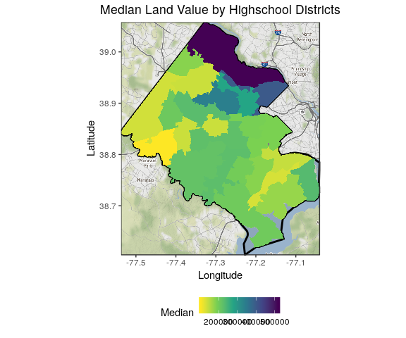

ACS/Housing data mapping
================
Cong Cong
7/9/2019

``` r
# Installation Libraries if needed

# Libraries
library(tidyverse)
library(stringr)
library(ggplot2)
library(ggmap)
library(sf)
library(rgdal)
library(tigris)
library(osmdata)
library(data.table)

# Setting root directory
knitr::opts_knit$set(echo = TRUE,
                     root.dir = rprojroot::find_rstudio_root_file())

# Controlling figure output in markdown
knitr::opts_chunk$set(
  #  fig.height =   
  fig.width = 6,
  #  fig.asp = .5,
  out.width = "90%",
  #  out.height = 
  cache = FALSE
)
# Set Theme for ggplot2
theme_set(theme_bw() + theme(plot.title = element_text(hjust = 0.5), legend.position = "bottom"))
# Set Scientific notation output for knitr
options(scipen = 999999)
```

``` r
#Base Map Function
fairfax.gg <- function() {
fairfax.box <- getbb("fairfax county")
fairfax.boundary <- getbb("fairfax county", format_out = "polygon") %>%
  as.tibble() %>%
  rename(longitude = `V1`, latitude = `V2`)

#Grab the map info (many varieties)
fairfax.map <- get_map(location = fairfax.box, source="stamen", maptype="watercolor", crop = TRUE)

#ggmap and ggplot map and boundary
ff.map <- ggmap(fairfax.map) +
  geom_polygon(data = fairfax.boundary, aes(x = longitude, y = latitude), colour = "black", size = 1, alpha = 0.1) +
  labs(
    x = "Longitude",
    y = "Latitude"
  )
  return(ff.map)
}
```

Median land value by school district
------------------------------------

``` r
# Read in the housing stock data
housing <- read.csv("./data/working/Fairfax_Housing_2018/fairfax_housing_2018_geo.csv")

# Leave only the variables about value and types of district
housing_value <- subset(housing, select = c("LONGITUDE","LATITUDE","VALUE_LAND", "VALUE_BUILDING", "VALUE_TOTAL", "GEOID", "DISTRICT", "HIGHSCHOOL"))

# Find the median value for each school district
medvalue <- housing_value %>% group_by(HIGHSCHOOL) %>% na.omit() %>% summarise(Median = median(VALUE_LAND), Count = n()) 

# Read in the geographies:
school_shp <- readOGR("./data/original/Fairfax_Geographies/High_School_Attendance_Areas/High_School_Attendance_Areas.shp")
```

    ## OGR data source with driver: ESRI Shapefile 
    ## Source: "/home/sdad/project_data/ffx/dspg2019fairfax/original/Fairfax_Geographies/High_School_Attendance_Areas/High_School_Attendance_Areas.shp", layer: "High_School_Attendance_Areas"
    ## with 25 features
    ## It has 18 fields
    ## Integer64 fields read as strings:  OBJECTID ZIP REGION

``` r
# Join the median value by school districts
median_by_school<-merge(school_shp,medvalue,by.x='SCHOOL_NAM',by.y='HIGHSCHOOL',all.x=TRUE)
```

Plot
====

``` r
median_by_school@data <- median_by_school@data %>% mutate(id = row.names(.))
shp_df <- broom::tidy(median_by_school,region = "id")
shp_df <- shp_df %>% left_join(median_by_school@data, by = c("id"="id"))
fairfax.gg() + 
  geom_polygon(data=shp_df, aes(x = long, y = lat, fill = Median, group = group))+
  ggtitle(label = "Median Land Value by Highschool Districts")+
  scale_fill_viridis_c(option = "D",direction = -1) 
```


