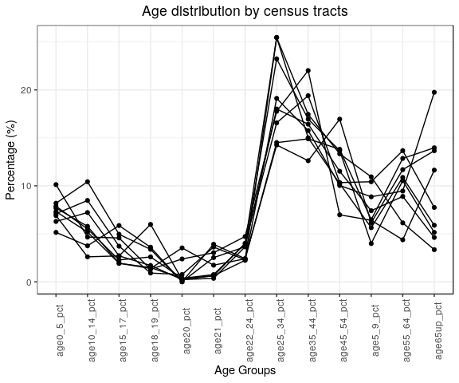
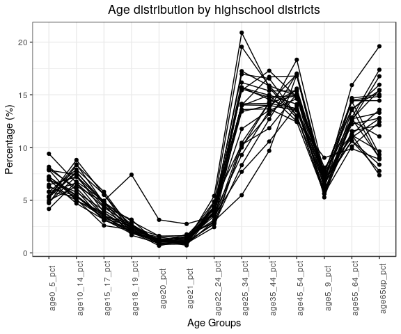
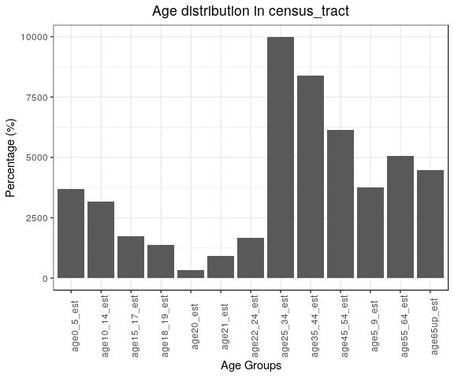
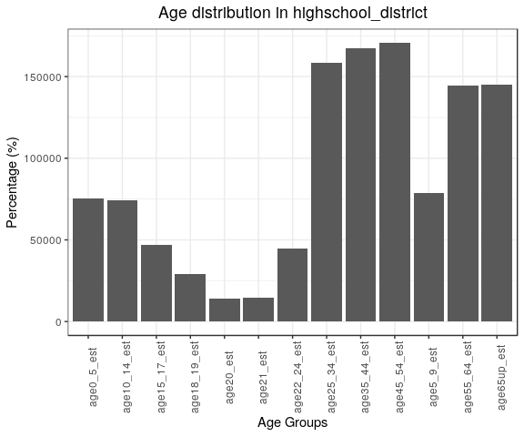

ACS variables exploration example
================
Cong Cong
7/1/2019

1. Example Read and Explore Age data
====================================

``` r
#Read in the ACS wide and ACS long (tidy) data
acs.df <- read_csv("./data/working/ACS_joined_estimates/2019_06_24_acs_all_geography.csv")
#acs.tidy.df <- read_csv("./data/working/ACS_joined_estimates/2019_06_24_acs_all_geography_tidy.csv")
```

``` r
#1. Data Description  
# Select the variables about age
acs.age.df <- acs.df %>% select("id_type","id",starts_with("age")) 

#Dimension
age.dim  <- acs.age.df %>% select(ends_with("est")) %>% dim()

#Age groups
age.vars <- str_extract(names(acs.age.df), "(?<=age).*(?=_est)") %>% 
  na.omit() %>% 
  unique() %>%
  gsub("_","-",.)

#Missing data
miss.df <- tibble(
  Variable = names(acs.age.df),
  Count = acs.age.df %>% map_dbl(.x = ., ~is.na(.x) %>% sum()),
  Percentage = acs.age.df %>% map_dbl(.x = ., ~is.na(.x) %>% mean())) %>%
  mutate(
    Percentage = as.character(Percentage * 100) %>% str_c(., "%")
  )
```

The age data contain 691 observations aggregated by four geographic units: blockgroup, census tract, highschool district, and supervisor district. There are 13age groups: 0-5, 5-9, 10-14, 15-17, 18-19, 20, 21, 22-24, 25-34, 35-44, 45-54, 55-64, 65up. In each age group, the observation includes an estimated value and a value of margin of error. There is no missing value in this dataset.

2.Descriptive statistics at highschool district level
=====================================================

``` r
#Proportion by district
find_pct <- function(dt){
  # only one id_type
  dt <- dt[, -grep("moe",colnames(dt))]
  dt$SUM = rowSums( dt[ sapply(dt, is.numeric)] )
  dt.pct <- dt %>% 
    mutate_if(is.numeric, funs(round(.*100/SUM,2)))
  colnames(dt.pct) <- gsub("est","pct",colnames(dt.pct))
  dt.pct
}

acs.age.df %>% filter(id_type=="census_tract") %>%
  find_pct() %>%
  mutate_if(is.numeric, funs(as.character() %>% str_c(., "%"))) %>%
  knitr::kable() 
```

    ## Warning: funs() is soft deprecated as of dplyr 0.8.0
    ## please use list() instead
    ## 
    ##   # Before:
    ##   funs(name = f(.))
    ## 
    ##   # After: 
    ##   list(name = ~ f(.))
    ## This warning is displayed once per session.

| id\_type      | id                                             | age0\_5\_pct | age5\_9\_pct | age10\_14\_pct | age15\_17\_pct | age18\_19\_pct | age20\_pct | age21\_pct | age22\_24\_pct | age25\_34\_pct | age35\_44\_pct | age45\_54\_pct | age55\_64\_pct | age65up\_pct | SUM  |
|:--------------|:-----------------------------------------------|:-------------|:-------------|:---------------|:---------------|:---------------|:-----------|:-----------|:---------------|:---------------|:---------------|:---------------|:---------------|:-------------|:-----|
| census\_tract | Census Tract 4154.01, Fairfax County, Virginia | 7.1%         | 5.64%        | 8.48%          | 3.71%          | 0.91%          | 0.76%      | 3.62%      | 2.29%          | 25.47%         | 15.01%         | 10.24%         | 10.88%         | 5.89%        | 100% |
| census\_tract | Census Tract 4215, Fairfax County, Virginia    | 8.19%        | 7.41%        | 10.43%         | 4.95%          | 3.38%          | 0%         | 2.52%      | 3.65%          | 18.01%         | 16.43%         | 11.52%         | 8.9%           | 4.62%        | 100% |
| census\_tract | Census Tract 4216, Fairfax County, Virginia    | 7.69%        | 10.43%       | 5.78%          | 1.93%          | 1.48%          | 0.35%      | 0.62%      | 4.01%          | 16.57%         | 19.4%          | 10.34%         | 13.67%         | 7.75%        | 100% |
| census\_tract | Census Tract 4218, Fairfax County, Virginia    | 6.29%        | 3.99%        | 7.22%          | 2.7%           | 5.98%          | 0.23%      | 0.36%      | 3.65%          | 23.24%         | 16.96%         | 13.68%         | 10.55%         | 5.15%        | 100% |
| census\_tract | Census Tract 4514, Fairfax County, Virginia    | 10.13%       | 6.41%        | 4.66%          | 4.57%          | 1.31%          | 2.38%      | 3.03%      | 4.72%          | 17.77%         | 22.02%         | 6.98%          | 4.38%          | 11.64%       | 100% |
| census\_tract | Census Tract 4515.02, Fairfax County, Virginia | 6.9%         | 8.86%        | 2.6%           | 2.7%           | 1.7%           | 0.23%      | 0.64%      | 2.24%          | 19.12%         | 15.76%         | 10.04%         | 9.46%          | 19.75%       | 100% |
| census\_tract | Census Tract 4528.01, Fairfax County, Virginia | 5.15%        | 6.15%        | 3.75%          | 5.86%          | 3.6%           | 0%         | 3.91%      | 2.41%          | 14.26%         | 12.62%         | 16.95%         | 11.69%         | 13.66%       | 100% |
| census\_tract | Census Tract 4810, Fairfax County, Virginia    | 7.87%        | 10.94%       | 5.5%           | 2.28%          | 2.59%          | 0.36%      | 0.75%      | 3.97%          | 25.46%         | 17.45%         | 13.34%         | 6.14%          | 3.35%        | 100% |
| census\_tract | Census Tract 4821, Fairfax County, Virginia    | 7.32%        | 6.47%        | 5.18%          | 1.93%          | 1.39%          | 3.53%      | 1.73%      | 2.4%           | 14.51%         | 14.9%          | 13.81%         | 12.86%         | 13.97%       | 100% |

``` r
acs.age.df %>% filter(id_type=="highschool_district") %>%
  find_pct() %>%
  mutate_if(is.numeric, funs(as.character() %>% str_c(., "%"))) %>%
  knitr::kable() 
```

| id\_type             | id               | age0\_5\_pct | age5\_9\_pct | age10\_14\_pct | age15\_17\_pct | age18\_19\_pct | age20\_pct | age21\_pct | age22\_24\_pct | age25\_34\_pct | age35\_44\_pct | age45\_54\_pct | age55\_64\_pct | age65up\_pct | SUM  |
|:---------------------|:-----------------|:-------------|:-------------|:---------------|:---------------|:---------------|:-----------|:-----------|:---------------|:---------------|:---------------|:---------------|:---------------|:-------------|:-----|
| highschool\_district | ANNANDALE        | 4.81%        | 7.59%        | 7.29%          | 4.82%          | 2.71%          | 1.16%      | 1.07%      | 3.76%          | 9.29%          | 13.51%         | 14.63%         | 14.5%          | 14.86%       | 100% |
| highschool\_district | CENTREVILLE      | 6.47%        | 6.57%        | 7.22%          | 4.38%          | 3.16%          | 0.78%      | 1.28%      | 4.24%          | 14.03%         | 16.7%          | 16.79%         | 10.62%         | 7.77%        | 100% |
| highschool\_district | CHANTILLY        | 4.17%        | 5.61%        | 6.77%          | 4.95%          | 7.42%          | 3.14%      | 2.75%      | 3.49%          | 7.7%           | 10.57%         | 13.93%         | 13.55%         | 15.96%       | 100% |
| highschool\_district | EDISON           | 4.72%        | 6.62%        | 8.34%          | 5.8%           | 2.25%          | 0.81%      | 0.84%      | 3.02%          | 5.48%          | 9.69%          | 16.9%          | 15.93%         | 19.61%       | 100% |
| highschool\_district | FAIRFAX          | 5.8%         | 7.62%        | 6.64%          | 4.3%           | 2.63%          | 1.07%      | 0.98%      | 2.8%           | 10.01%         | 14.28%         | 14.96%         | 14.44%         | 14.45%       | 100% |
| highschool\_district | FALLS CHURCH     | 6.24%        | 5.63%        | 5.39%          | 3.16%          | 1.84%          | 1.18%      | 0.78%      | 4.8%           | 19.56%         | 15.85%         | 13.04%         | 10.1%          | 12.42%       | 100% |
| highschool\_district | HAYFIELD         | 5.8%         | 7.49%        | 7.91%          | 5.55%          | 2.01%          | 0.68%      | 1.21%      | 3.95%          | 11.77%         | 13.54%         | 18.33%         | 12.73%         | 9.03%        | 100% |
| highschool\_district | HERNDON          | 9.41%        | 9.03%        | 6.64%          | 3.53%          | 2.71%          | 1.11%      | 1.52%      | 4.15%          | 15.68%         | 14.96%         | 12.49%         | 9.89%          | 8.89%        | 100% |
| highschool\_district | JUSTICE          | 7.96%        | 8.09%        | 6.16%          | 3.46%          | 1.99%          | 0.93%      | 0.96%      | 4.37%          | 15.43%         | 17.29%         | 14.79%         | 11.2%          | 7.37%        | 100% |
| highschool\_district | LAKE BRADDOCK    | 5.26%        | 6.48%        | 7.63%          | 4.86%          | 1.97%          | 1.08%      | 0.99%      | 3.82%          | 13.41%         | 14%            | 15.5%          | 12.22%         | 12.79%       | 100% |
| highschool\_district | LANGLEY          | 7.89%        | 6.9%         | 4.92%          | 3.84%          | 2.1%           | 1.1%       | 1.57%      | 2.95%          | 15.71%         | 14.56%         | 13.59%         | 11.27%         | 13.59%       | 100% |
| highschool\_district | LEE              | 7%           | 6.43%        | 5.42%          | 3.51%          | 2.45%          | 1.6%       | 1.64%      | 4.38%          | 14.04%         | 14%            | 13.52%         | 12.72%         | 13.3%        | 100% |
| highschool\_district | MADISON          | 6.92%        | 5.61%        | 5.76%          | 4.04%          | 2.38%          | 1.28%      | 1.05%      | 3.96%          | 13.6%          | 13.67%         | 12.43%         | 12.55%         | 16.76%       | 100% |
| highschool\_district | MARSHALL         | 4.98%        | 6.12%        | 6.33%          | 4.81%          | 2.99%          | 1.6%       | 1.38%      | 4.88%          | 10.27%         | 11.83%         | 15.1%          | 14.69%         | 15.02%       | 100% |
| highschool\_district | MCLEAN           | 5.36%        | 7.21%        | 7.71%          | 4.58%          | 1.67%          | 0.92%      | 0.92%      | 2.45%          | 10.18%         | 13.17%         | 15.59%         | 12.86%         | 17.38%       | 100% |
| highschool\_district | MOUNT VERNON     | 7.26%        | 5.64%        | 5.09%          | 2.6%           | 2.18%          | 1.34%      | 1.28%      | 4.39%          | 16.96%         | 16.55%         | 13.02%         | 11.56%         | 12.12%       | 100% |
| highschool\_district | OAKTON           | 5.36%        | 7.18%        | 8.4%           | 4.72%          | 2.26%          | 1.15%      | 1.06%      | 2.74%          | 8.33%          | 12.69%         | 17.02%         | 13.69%         | 15.41%       | 100% |
| highschool\_district | ROBINSON         | 7.85%        | 7.37%        | 7.42%          | 3.82%          | 2.1%           | 1.06%      | 1.76%      | 2.86%          | 14.15%         | 14.19%         | 13.7%          | 10.96%         | 12.75%       | 100% |
| highschool\_district | SOUTH COUNTY     | 5.79%        | 5.84%        | 5.33%          | 3.49%          | 1.94%          | 1.3%       | 0.87%      | 4.25%          | 13.96%         | 14.98%         | 14.11%         | 12.68%         | 15.46%       | 100% |
| highschool\_district | SOUTH LAKES      | 6.94%        | 5.27%        | 4.69%          | 3.15%          | 2.05%          | 1.02%      | 1.03%      | 4.26%          | 17.25%         | 15.85%         | 14.91%         | 12.55%         | 11.05%       | 100% |
| highschool\_district | WEST POTOMAC     | 8.17%        | 6.99%        | 5.92%          | 3.07%          | 2.35%          | 1.2%       | 0.71%      | 3.9%           | 16.17%         | 15.38%         | 15.35%         | 11.17%         | 9.64%        | 100% |
| highschool\_district | WEST SPRINGFIELD | 7.2%         | 7.77%        | 5.47%          | 3.21%          | 2.61%          | 1.07%      | 1.28%      | 3.5%           | 15.55%         | 14.77%         | 14.93%         | 13.68%         | 8.96%        | 100% |
| highschool\_district | WESTFIELD        | 5.33%        | 6.79%        | 8.82%          | 5.51%          | 2.49%          | 1.14%      | 1.44%      | 3.13%          | 10.45%         | 14.27%         | 16.94%         | 14.37%         | 9.33%        | 100% |
| highschool\_district | WOODSON          | 6.33%        | 6.81%        | 5%             | 3.4%           | 2.04%          | 1.51%      | 1.11%      | 5.4%           | 20.9%          | 15.68%         | 12.79%         | 10.65%         | 8.37%        | 100% |

These tables show the proportation of each age group in each type of district. For economic vulnerability analysis, we care about the proportion of people aged under 16/18 and above 65:

``` r
acs.age.df %>% filter(id_type=="census_tract") %>%  find_pct() %>%
  transmute(id,id_type,
            age0_18_pct = age0_5_pct + age5_9_pct + age10_14_pct + age15_17_pct,
            age65up_pct) %>%
  mutate_if(is.numeric, funs(as.character() %>% str_c(., "%"))) %>%
  knitr::kable() 
```

| id                                             | id\_type      | age0\_18\_pct | age65up\_pct |
|:-----------------------------------------------|:--------------|:--------------|:-------------|
| Census Tract 4154.01, Fairfax County, Virginia | census\_tract | 24.93%        | 5.89%        |
| Census Tract 4215, Fairfax County, Virginia    | census\_tract | 30.98%        | 4.62%        |
| Census Tract 4216, Fairfax County, Virginia    | census\_tract | 25.83%        | 7.75%        |
| Census Tract 4218, Fairfax County, Virginia    | census\_tract | 20.2%         | 5.15%        |
| Census Tract 4514, Fairfax County, Virginia    | census\_tract | 25.77%        | 11.64%       |
| Census Tract 4515.02, Fairfax County, Virginia | census\_tract | 21.06%        | 19.75%       |
| Census Tract 4528.01, Fairfax County, Virginia | census\_tract | 20.91%        | 13.66%       |
| Census Tract 4810, Fairfax County, Virginia    | census\_tract | 26.59%        | 3.35%        |
| Census Tract 4821, Fairfax County, Virginia    | census\_tract | 20.9%         | 13.97%       |

``` r
acs.age.df %>% filter(id_type=="highschool_district") %>%  find_pct() %>%
  transmute(id,id_type,
            age0_18_pct = age0_5_pct + age5_9_pct + age10_14_pct + age15_17_pct,
            age65up_pct) %>% knitr::kable() 
```

| id               | id\_type             |  age0\_18\_pct|  age65up\_pct|
|:-----------------|:---------------------|--------------:|-------------:|
| ANNANDALE        | highschool\_district |          24.51|         14.86|
| CENTREVILLE      | highschool\_district |          24.64|          7.77|
| CHANTILLY        | highschool\_district |          21.50|         15.96|
| EDISON           | highschool\_district |          25.48|         19.61|
| FAIRFAX          | highschool\_district |          24.36|         14.45|
| FALLS CHURCH     | highschool\_district |          20.42|         12.42|
| HAYFIELD         | highschool\_district |          26.75|          9.03|
| HERNDON          | highschool\_district |          28.61|          8.89|
| JUSTICE          | highschool\_district |          25.67|          7.37|
| LAKE BRADDOCK    | highschool\_district |          24.23|         12.79|
| LANGLEY          | highschool\_district |          23.55|         13.59|
| LEE              | highschool\_district |          22.36|         13.30|
| MADISON          | highschool\_district |          22.33|         16.76|
| MARSHALL         | highschool\_district |          22.24|         15.02|
| MCLEAN           | highschool\_district |          24.86|         17.38|
| MOUNT VERNON     | highschool\_district |          20.59|         12.12|
| OAKTON           | highschool\_district |          25.66|         15.41|
| ROBINSON         | highschool\_district |          26.46|         12.75|
| SOUTH COUNTY     | highschool\_district |          20.45|         15.46|
| SOUTH LAKES      | highschool\_district |          20.05|         11.05|
| WEST POTOMAC     | highschool\_district |          24.15|          9.64|
| WEST SPRINGFIELD | highschool\_district |          23.65|          8.96|
| WESTFIELD        | highschool\_district |          26.45|          9.33|
| WOODSON          | highschool\_district |          21.54|          8.37|

From the opportunity census tracts, people under 18 years old compose 20-30 percent of the population, people above 65 years old below 20 percent. Census tract 4215 has the largest proportion of minor population while Census tract 4515.02 has the largest proportion of elderly people.

``` r
# Visualize the distribution by census tracts
age.pct <- acs.age.df %>%
  filter(id_type=="census_tract") %>% 
  find_pct() %>% 
  select(-SUM) %>% 
  gather(key = variable, value = value, -c(id, id_type))

ggplot(data=age.pct, aes(x=variable, y=value, group=id)) +
  geom_line() +
  geom_point() +
  labs(title="Age distribution by census tracts",x="Age Groups", y = "Percentage (%)") +
  theme(axis.text.x = element_text(angle = 90)) 
```

 This map visualizes the distribution of age groups and the range of proportion in all districts. People of the age 25 to 44 take the largest proportion in most of the census tracts.

``` r
# Visualize the distribution by school districts
age.pct <- acs.age.df %>%
  filter(id_type=="highschool_district") %>% 
  find_pct() %>% 
  select(-SUM) %>% 
  gather(key = variable, value = value, -c(id, id_type))

ggplot(data=age.pct, aes(x=variable, y=value, group=id)) +
  geom_line() +
  geom_point() +
  labs(title="Age distribution by highschool districts",x="Age Groups", y = "Percentage (%)") +
  theme(axis.text.x = element_text(angle = 90)) 
```

 There is more variance in terms of the largest age group among all the highschool districts.

``` r
#Sum of population in each age group across all districts
sum_plot <- function(dt){
  # only one id_type
  dt <- dt[, -grep("moe",colnames(dt))]
  plot <- dt %>% select_if(is.numeric)%>% colSums(.)%>% as.data.frame()
  colnames(plot) <- "count"
  ggplot(data=plot, aes(x=rownames(plot), y=count)) + 
    geom_bar(stat="identity") + 
    theme(axis.text.x = element_text(angle = 90)) +
    labs(title=paste0("Age distribution in ", unique(dt$id_type)),
         x="Age Groups", y = "Percentage (%)") 
}

acs.age.df %>% filter(id_type=="census_tract") %>% sum_plot()
```



``` r
acs.age.df %>% filter(id_type=="highschool_district") %>% sum_plot()
```

 Overall people of the age 25 to 34 is the largest population in all studied census tracts. People of the age 45 to 54 is the largest population in all high school districts.
