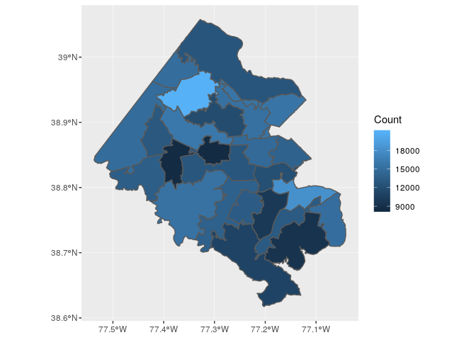
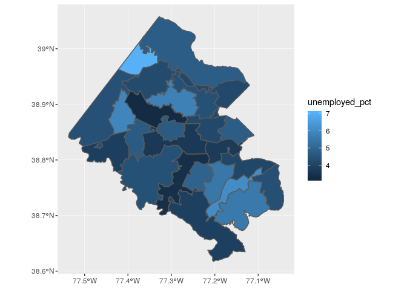

simple mapping examples
================
Cong Cong
7/9/2019

``` r
library(sf)
library(tidyverse)
library(tigris)
knitr::opts_knit$set(echo = TRUE,
                     root.dir = rprojroot::find_rstudio_root_file())
```

### Plot median housing value by school district

``` r
# Read in the housing stock data
housing <- read.csv("./data/working/Fairfax_Housing_2018/fairfax_housing_2018_geo.csv")

# Leave only the variables about value and types of district
housing_value <- subset(housing, select = c("LONGITUDE","LATITUDE","VALUE_LAND", "VALUE_BUILDING", "VALUE_TOTAL", "GEOID", "DISTRICT", "HIGHSCHOOL"))

# Find the median value for each school district
medvalue <- housing_value %>% group_by(HIGHSCHOOL) %>% na.omit() %>% summarise(Median = median(VALUE_TOTAL), Count = n()) 

# Read in the geographies:
school_shp <- st_read("./data/original/Fairfax_Geographies/High_School_Attendance_Areas/High_School_Attendance_Areas.shp")
```

    ## Reading layer `High_School_Attendance_Areas' from data source `/home/sdad/project_data/ffx/dspg2019fairfax/original/Fairfax_Geographies/High_School_Attendance_Areas/High_School_Attendance_Areas.shp' using driver `ESRI Shapefile'
    ## Simple feature collection with 25 features and 18 fields
    ## geometry type:  MULTIPOLYGON
    ## dimension:      XY
    ## bbox:           xmin: -77.53701 ymin: 38.61731 xmax: -77.04145 ymax: 39.05769
    ## epsg (SRID):    4326
    ## proj4string:    +proj=longlat +datum=WGS84 +no_defs

``` r
# Join with the school district shapefile
median_by_school<-merge(school_shp,medvalue,by.x='SCHOOL_NAM',by.y='HIGHSCHOOL',all.x=TRUE)

# Plot
ggplot(median_by_school)+
  geom_sf(aes(fill=Count))
```



### Plot unemployment rate by school district

``` r
# Read in the ACS data
acs.df <- read_csv("./data/working/ACS_joined_estimates/2019_07_08_acs_all_geography.csv")

# Select the employment status data
acs.emp<- acs.df %>% select("id_type","id","employed_est","unemployed_est")

# Find percentage by census tract
acs.emp <- acs.emp %>% filter(id_type == "highschool_district") 
acs.emp$employed_pct <- acs.emp$employed_est *100 / (acs.emp$employed_est + acs.emp$unemployed_est)
acs.emp$unemployed_pct <- acs.emp$unemployed_est *100 / (acs.emp$employed_est + acs.emp$unemployed_est)

# Join with shapefile
unemp_by_school<-merge(school_shp,acs.emp,by.x='SCHOOL_NAM',by.y='id',all.x=TRUE)

# Plot
ggplot(unemp_by_school)+
  geom_sf(aes(fill=unemployed_pct))
```


