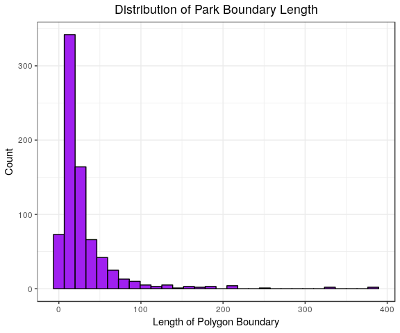
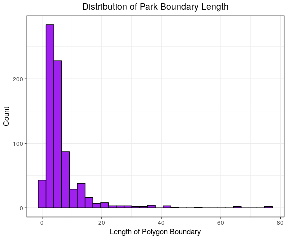

OSM Distance-Time Calculation
================
Quinton
7/11/2019

1. Read OSM Final Data
----------------------

#### a. Introduction

``` r
osm.df    <- read_csv("./data/working/OSM_joined/7_10_2019_osm_joined.csv")
osm.dim   <- dim(osm.df)
osm.names <- names(osm.df) %>% paste0(., collapse = ", ")

#Number of obs. for each variable
table(osm.df$variable)
```

    ## 
    ##       Alcohol   Convenience     Fast Food   Gas Station          Park 
    ##            86           295           818           689         22915 
    ##    Playground    Restaurant Sports Center   Supermarket Swimming Pool 
    ##          4076          1490           594           950          4853 
    ##    Team Sport         Track 
    ##          9226          2037

The dimensions of the raw data are 48029, , 5, and the variables contained are named environment, variable, object\_id, longitude, latitude.

#### b. Sample Park Boundary

Reading in the final osm data. Need to reduce the number of points to look through for the park polygons. Using centroids is definitely going to bias the distance-time coverage downward. Further, we are interested in whether they are close to the boundary. However, we don't need to look through every point. Instead we take a random sample of boundary points for each polygon and use those instead.

This is a simplification for computational efficiency, but with random sampling, the only error should really be random. From a uniform distribution, we should get a relatively good sample of the boundary points to calculate distance\_time.

``` r
#Investigating the Number of Points in each Park Boundary
park.df <- read_csv("./data/working/OSM_joined/7_10_2019_osm_joined.csv") %>%
  nest(-c(environment, variable)) %>%
  filter(variable == "Park") %>%
  dplyr::select(data) %>%
  unnest() %>%
  nest(-object_id) %>%
  mutate(
    length = map_dbl(data, nrow)
  ) 
#Check out length of Parks
park.df$length %>% summary()
```

    ##    Min. 1st Qu.  Median    Mean 3rd Qu.    Max. 
    ##    2.00   11.00   18.00   29.92   33.00  385.00

``` r
#Distribution
park.df %>%
  ggplot(aes(x = length)) +
  geom_histogram(fill = "purple", colour = "black") +
  labs(
    x = "Length of Polygon Boundary",
    y = "Count",
    title = "Distribution of Park Boundary Length"
  )
```



``` r
#Actual unique number of parks
nrow(park.df)
```

    ## [1] 766

As the variability in length (analogous to the size of park) is quite high, quite a few small parks and quite a few extremely large parks. As such we will take a random sample that is proportionate to the size of the park. To do say we say we will sample 25% of the boundary points at random.

``` r
#Mutating/sampling the spatial data by park object_id
park.samp.df <- park.df %>%
  mutate(
    data = map(.x = data, 
               ~ slice(.x, sample(1:nrow(.x), (nrow(.x)/5) %>% ceiling(), replace = FALSE))
               ),
    length_new = map_dbl(data, nrow)
  )

#Check out new length of Parks
park.samp.df$length_new %>% summary()
```

    ##    Min. 1st Qu.  Median    Mean 3rd Qu.    Max. 
    ##   1.000   3.000   4.000   6.379   7.000  77.000

``` r
#Distribution
park.samp.df %>%
  ggplot(aes(x = length_new)) +
  geom_histogram(fill = "purple", colour = "black") +
  labs(
    x = "Length of Polygon Boundary",
    y = "Count",
    title = "Distribution of Park Boundary Length"
  )
```



#### c. Alternatively make a Park centroid variable

``` r
#Mutating/sampling the spatial data by park object_id
park.cent.df <- park.df %>%
  mutate(
    data = map(.x = data, 
               ~ ifelse(nrow(data) > 2,
                        centroid(.x) %>%
                        as_tibble(),
                        data %>%
                          slice(1)
                       )
               )
  ) %>% unnest()
```

#### d. Replace Park Data in OSM Final Data (either centroid or sample)

``` r
osm.df <- osm.df %>%
  nest(-c(environment, variable)) %>%
  mutate(
    data = ifelse(variable == "Park", 
                  park.samp.df %>%  #Choose which park .df
                  dplyr::select(object_id, data) %>%
                  unnest(),
                  data),
    data = map(data, as_tibble)
  )
```

#### e. For Now, filter out park; will deal with later

``` r
osm.df <- osm.df %>%
  filter(variable != "Park") %>%
  unnest()

nrow(osm.df)
```

    ## [1] 25114

2. Calculate Distance Time
==========================

``` r
#Gather API Keys and ID's
api.id   <- c("3c54476f",
              "12251934",
              "b777323f",
              "6969dd9f",
              "c1c5c35f",
              "5c7a743f",
              "d5a88656",
              "57763cf3"
              )
api.grid <- 
  tibble(
    api_keys = c("049992edda691331bc5bbe90dd7c6952",
                 "b5fb14aa79e0278e065d9de3ef95dbd9",
                 "2b20066c5d1c020b6cd5db2ab72e45f6",
                 "5cdf18d9d77c5c8d55b1bc63f8eb026b",
                 "5f26cdb482e3dcd1fcaceb3782d63f4e",
                 "81946416ebd0d8542cd38d7f1488da4c",
                 "3099b337621a7249f3b48597b86348bb",
                 "b1aa75203ab3d3b42f1f80d14bcef026"
              ) %>%
                  rep(., times = ceiling(nrow(osm.df)/8)),
    api_id  = c("3c54476f",
                "12251934",
                "b777323f",
                "6969dd9f",
                "c1c5c35f",
                "5c7a743f",
                "d5a88656",
                "57763cf3"
              ) %>%
                  rep(., times = ceiling(nrow(osm.df)/8))
  )

api.grid <- api.grid %>%
  slice(1:nrow(osm.df))

osm.df <- bind_cols(osm.df, api.grid)

#Objective Task Function
taskFun <- function(data, i) {
  Sys.sleep(6.01)
  
  traveltime_map(appId      = data$api_id[i],
                 apiKey     = data$api_keys[i],
                 location   = c(data$latitude[i], data$longitude[i]),
                 traveltime = 600,
                 type       = "driving",
                 departure  = "2019-7-10T18:00:00Z")
}

#Nest to save .RDS each time we finish an object
osm.df <- osm.df %>%
  nest(-c(environment, variable))

#Parallelize
#detectCores()
nCores <- 8
registerDoParallel(nCores)

#Initalize result list (each variable)
result <- list()

#Iterate over all variables (so we can store and save as we go *doesn't store object otherwise)

for(j in 2:nrow(osm.df)) {
  
#Count start time for each iteration  
#a <- Sys.time()

#1 X nrow(osm.df$data) iterations 
result[[j]] <- foreach(i = 1:nrow(osm.df$data[[j]]),
                  .packages = "traveltime") %dopar% {
  outSub <- taskFun(osm.df$data[[j]], i)
  outSub
} 

#Count end time
#b <- Sys.time()
#print(sprintf("Iteration %i took %f seconds", j, (b - a)))
print(sprintf("Finished %s iteration", osm.df$variable[j]))

write_rds(result[[j]], sprintf("./data/working/Time_distance_files/%s.rds", 
                               osm.df$variable[j] %>% janitor::make_clean_names()))
}
```
