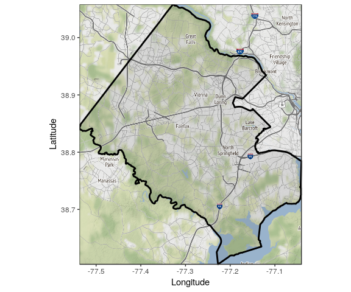
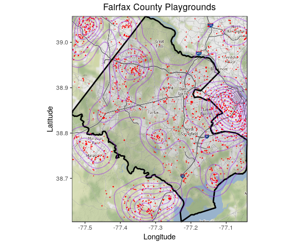
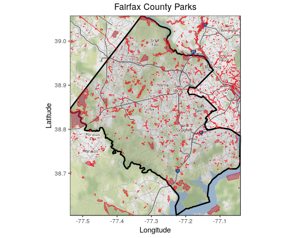
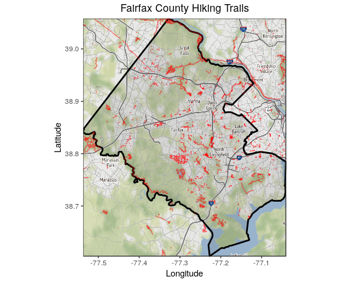

OSM EDA Functions
================
Quinton Neville
6/12/2019

1. Functions to Read/Write OSM Data
===================================

a. Read and output data frame for visualization/storage
-------------------------------------------------------

Here the functions takes 3 inputs:

-   The key, i.e. which group the locations of interest are in

-   The value, i.e. the specific object of interest within that group

-   The type of spatial data -- either point, line, or polygon

*note - Here the key and value come from the OSM drop down of the Data tab on the xWiki page. There is a little trouble with the "type = line" reading/visualizing so we can work on that later.*

Steps:

1.  Read in the data with desired inputs key and value into `read.df`

2.  If the type is point, manipulate `sf` read.df object into the tidy `lat.long.df` with desired grouping/format for points.

3.  Repeat 2. if else polygon or line with similar process

4.  If either key,value inputted incorrectly; type was inputted incorrectly; or the object type of interest does not exist for desired key/value -- the function will stop and return an error

Output:

A tidy data frame (long) with the variables `object_id`, a factor describing the specific object, and two numeric `latitude` and `longitude` columns.

``` r
#Fairfax read OSM to output tibble (tidyr df)

osm_to_df <- function(key = "leisure", value = "playground", type = "point") {
#Read in playground data
read.df <- getbb("fairfax county", format_out = "polygon") %>%
  opq() %>%
  add_osm_feature(key = key, value = value) %>%
  osmdata_sf()
    
    if (type == "point" & !is.null(read.df$osm_points)) {
      
      lat.long.df <- do.call(rbind, st_geometry(read.df$osm_points)) %>% 
        as_tibble() %>% 
        setNames(c("longitude", "latitude")) %>%
        mutate(object_id = 1:nrow(.) %>% as.factor()) %>%
        dplyr::select(object_id, everything())
      
    } else if (type == "polygon" & !is.null(read.df$osm_polygons)) {
      
      poly.list <- do.call(rbind, st_geometry(read.df$osm_polygons)) %>%
        lapply(as.tibble)
      npolys    <- length(poly.list)
      
      lat.long.df <- tibble(
        object_id = 1:npolys %>% as.factor(),
        coord.df  = poly.list
        ) %>%
        unnest(coord.df) %>%
        rename(
        longitude = lon,
        latitude  = lat
        )
      
    } else if (type == "line" & !is.null(read.df$osm_lines)) {
      
      line.list <- do.call(list, st_geometry(read.df$osm_lines)) %>%
        lapply(., rbind) %>%
        lapply(., as.tibble)
      nlines    <- length(line.list)
      
      lat.long.df <- tibble(
        object_id = 1:nlines %>% as.factor(),
        coord.df  = line.list
        ) %>%
        unnest(coord.df) %>%
        rename(
        longitude = lon,
        latitude  = lat
        )
    } else {
      ifelse(is.null(read.df$osm_points), stop("key/value incorrect or object type is empty"), 
             ifelse(!(type %in% c("point", "polygon", "line")), stop("type is not point, polygon, or line"),
                    stop("object type is empty, try another")))
    }
  
  return(lat.long.df)

}
```

b. Write out data frame for storage/later use
---------------------------------------------

Generate the correct/standardized filepath for saving with "./data.folder/date\_key\_value\_type\_file.type".

*note - Do not actually write anything to the data folders yet until we discuss the workflow/structure/naming as a team.*

``` r
#Write out dataframe
osm_filepath_gen <- function(data.folder, file.type, key, value, type) {
  date <- Sys.Date() %>% as.character() %>% str_replace_all("-", "_")
  file.type <- "csv"
  data.folder <- "original/osm"
  file.path <- sprintf("./data/%s/%s_%s.%s", 
                     data.folder,
                     date, 
                     paste(key, value, type, sep = "_"),
                     file.type)
  return(file.path)
}

#Example
osm_filepath_gen(data.folder = "original/osm", 
                 file.type   = "csv",
                 key         = "leisure",
                 value       = "playground",
                 type = "point")
```

    ## [1] "./data/original/osm/2019_06_12_leisure_playground_point.csv"

``` r
##Don't run this until we've discussed naming format, data storage!!!!!!!##
#writes.csv(osm_to_df(), osm_filepath_gen())
```

2. Functions for Spatial Fairfax EDA-OSM plots
==============================================

i. Set your base (background) Fairfax Map
-----------------------------------------

Only need to do this once at the beggining of plotting.

``` r
#Set Base Fairfax Map
#Boundary and outline of Fairfax County
fairfax.gg <- function() {
fairfax.box <- getbb("fairfax county")
fairfax.boundary <- getbb("fairfax county", format_out = "polygon") %>%
  as.tibble() %>%
  rename(longitude = `V1`, latitude = `V2`)

#Grab the map info (many varieties)
fairfax.map <- get_map(location = fairfax.box, source="stamen", maptype="watercolor", crop = TRUE)

#ggmap and ggplot map and boundary
ff.map <- ggmap(fairfax.map) +
  geom_polygon(data = fairfax.boundary, aes(x = longitude, y = latitude), colour = "black", size = 1, alpha = 0.1) +
  labs(
    x = "Longitude",
    y = "Latitude"
  )
  return(ff.map)
}

#Call
ff.map <- fairfax.gg()

#Plot
ff.map
```



### a. Points

Playground example

``` r
#osm data frame object of type = point
obj <- osm_to_df(key = "leisure", value = "playground", type = "point")

#Add locations of playgrounds
osm_point_plot <- function(ff.map, obj, value) {
  if (!is.data.frame(obj)) stop("OSM object is not a data frame")
  if (!is.ggplot(ff.map))  stop("Baseline Fairfax map is not a ggplot")
  ff.map +
  geom_point(data = obj, aes(x = longitude, y = latitude),
             size = 0.1, colour = "red", alpha = 0.25) + 
  geom_density_2d(data = obj, aes(x = longitude, y = latitude),
                  colour = "purple", alpha = 0.5) +
  labs(title = sprintf("Fairfax County %s", value))
  }

#Visualize
osm_point_plot(ff.map, obj, "Playgrounds")
```



### b. Polygons (Areas)

Park example.

``` r
#Example OSM data frame polygon object from above
obj <- osm_to_df(key = "leisure", value = "park", type = "polygon")

#Add locations of playgrounds
osm_poly_plot <- function(ff.map, obj, value) {
  if (!is.data.frame(obj)) stop("OSM object is not a data frame")
  if (!is.ggplot(ff.map))  stop("Baseline Fairfax map is not a ggplot")
  ff.map +
  geom_polygon(data = obj, aes(x = longitude, y = latitude, group = object_id), 
               colour = "red", fill = "maroon", alpha = 0.5, size = 0.2) +
  labs(title = sprintf("Fairfax County %s", value))
  }

#Visualize
osm_poly_plot(ff.map, obj, "Parks")
```



### c. Lines (Roads, Sidewalks, etc.)

Hiking trail example.

``` r
#Example OSM data frame object from above
obj <- osm_to_df(key = "highway", value = "path", type = "line")

#Add locations of playgrounds
osm_line_plot <- function(ff.map, obj, value) {
  if (!is.data.frame(obj)) stop("OSM object is not a data frame")
  if (!is.ggplot(ff.map))  stop("Baseline Fairfax map is not a ggplot")
  ff.map +
  geom_path(data = obj, aes(x = longitude, y = latitude, group = object_id), 
               colour = "red", alpha = 0.5, size = 0.5) +
  labs(title = sprintf("Fairfax County %s", value))
  }

#Visualize
osm_line_plot(ff.map, obj, "Hiking Trails")
```



3. Flow of Using Functions together
===================================

Total flow playground example (plus use of filepath function to save plot as .jpg for later).

``` r
#Generate desired OSM dataframe of desired type
obj <- osm_to_df()

#Call the plot to see what's going on/visualize
gg.obj <- osm_point_plot(ff.map, obj, "Playgrounds")

#Save the data frame if it looks promising (don't yet)
df.file.path <- osm_filepath_gen(data.folder = "original/osm", 
                 file.type   = "csv",
                 key         = "leisure",
                 value       = "playground",
                 type = "point")
#writes.csv(obj, file.path.df)

#Save the eda ggplot like so (don't yet)
gg.file.path <- osm_filepath_gen(data.folder = "original/osm/eda/figures", 
                 file.type   = "jpg",
                 key         = "leisure",
                 value       = "playground",
                 type = "point")

#ggsave(gg.file.path, gg.obj)
```
