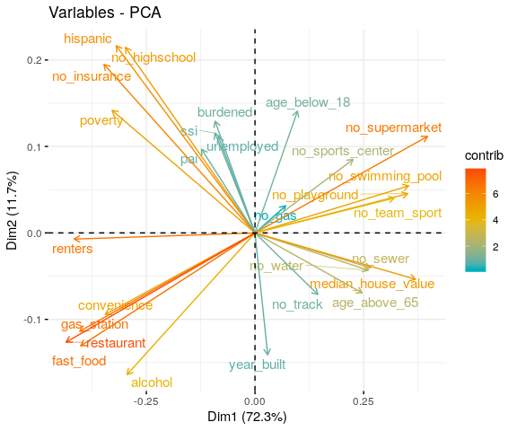
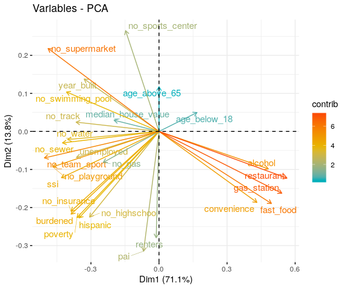

Obesogenic Dimensional Analysis
================
DSPG Business Innovation Team
7/24/2019

1. Read & Join the Obesogenic Data
----------------------------------

Here we read the Fairfax Housing/OSM Binary Isochrone data, aggregate and nest by geography; read, clean, and nest by geography type the American Community Survey data (final Economic Vulnerability); and finally join by geography and write out a final Obesegenic Environment data frame for dimensional/factor analysis (and index construction).

``` r
#Read clean census track id's by manipulating the census tract number for matching join
census.tract.df <- read_csv("./data/working/ACS_final_index_2/index.csv") %>%
                     rename(geoid = Id2, census_tract = Geography) %>%
                     mutate(
                       geoid = census_tract %>% 
                         parse_number() %>% 
                         as.character() %>% 
                         ifelse(str_length(.) == 4, str_c(., ".00"), .) %>%
                         str_split("") %>%
                         map_chr(.x = ., ~.x[-5] %>% str_c(., collapse = ""))
                     )
                     
#Read in the Fairfax/OSM data
ffx.osm.df <- read_rds("./data/working/Fairfax_Housing_OSM_Joined/fairfax_osm_final.RDS") %>%
               mutate(
                 geoid = geoid %>% as.character() %>% str_sub(., 6, nchar(.)-1)
               )

#Bind together (3 observations do not have census tract identified & 3 census tracts not represented)
ffx.osm.df <- bind_rows(left_join(ffx.osm.df %>% filter(!is.na(geoid)), census.tract.df, by = "geoid"),
            ffx.osm.df %>% filter(is.na(geoid))) %>%
            dplyr::select(-parcel_id) %>%
            rename(
              highschool_district = highschool,
              supervisor_district = district
            ) %>%
            gather(key = id_type, 
                   value = geography,
                   c(census_tract, highschool_district, supervisor_district)) %>%
            mutate(id_type = as.factor(id_type)) %>%
            nest(-c(id_type, geography))

#Read in the Economic Vulnerability ACS/Housing Stock data
acs.df     <- read_csv("./data/working/ACS_final_index_2/07_22_2019_joined_acs_final.csv") %>%
  janitor::clean_names() %>%
  mutate(
    id_type   = as.factor(id_type) 
  ) %>%
  dplyr::select(id_type, geography, everything()) %>%
  nest(-c(id_type, geography)) 

#Join together for final Obesogenic Data: ACS, Fairfax/OSM (aggregated by geography, median or mean respectively)
obesity.df <- inner_join(ffx.osm.df, acs.df, by = c("id_type", "geography")) %>%
              rename(ffx_osm_df = data.x, acs_df = data.y) %>%
              unnest(acs_df) %>%
              mutate(
                ffx_osm_df = map(ffx_osm_df,
                                 ~.x %>%
                                   mutate(
                                     no_supermarket = !supermarket,
                                     no_playground  = !playground,
                                     no_sports_center = !sports_center,
                                     no_swimming_pool = !swimming_pool,
                                     no_team_sport    = !team_sport,
                                     no_track         = !track
                                   ) %>%
                                   dplyr::select(-c(supermarket, playground, sports_center,
                                             swimming_pool, team_sport, track))),
                ffx_osm_df = map(ffx_osm_df,
                                 ~.x %>%
                                   dplyr::select(alcohol:no_track) %>%
                                   map_df(mean))
              ) %>%
              unnest()

#Check counts
obesity.df %>% 
  group_by(id_type) %>%
  summarise(
    count = n()
  ) %>% knitr::kable()
```

| id\_type             |  count|
|:---------------------|------:|
| census\_tract        |    255|
| highschool\_district |     24|
| supervisor\_district |      9|

``` r
#View Head and compare to make sure negativity mutation worked properly
#head(obesity.df) %>% knitr::kable()
#read_csv("./data/working/Obesogenic_final_data/2019_7_24_obesogenic_final.csv") %>% head()
```

Here we were very meticulous about making sure everything is matched, aggregated, and assigned to the right geographic unit. After joining three seperate data sets, Fairfax Housing, OSM, and ACS; we have our final working Obesogenic Environment data (stored in the `"./data/working/Obesogenic_final_data/"` folder). Note that three observations are missing census tracts but are not missing supervisor or highschool district, while three census tracts are not present at all, thus there are three fewer total observations than in the original ACS units of geography (due to the three missing census tracts, as verified in the table above).

2. Dimensional Analysis
-----------------------

#### a. Singular Value Decomposition

``` r
#Read the data
obesity.df <- read_rds("./data/working/Obesogenic_final_data/2019_7_28_obesogenic_final_nested.RDS") %>%
              mutate(
                data = map(data,
                           ~.x %>%
                            dplyr::select(-c(minority, unmarried, single_parent, limited_english,
                               low_income, not_enrolled, no_vehicle, long_commute)))
              )

              
#Scale the data
obesity.scale.df <- obesity.df %>%
              mutate(
                data = data %>% map(.x = ., ~na.omit(.x) %>%
                                          dplyr::select(-geography) %>%
                                          mutate_if(is.numeric, function(x) {
                                            (x - mean(x))/sd(x)})),
                cor_data = data %>% map(.x = ., ~.x %>% cor(., method = "pearson")),
                pca_data = cor_data %>% map(princomp)
              ) 

#Singular Value Decomposition for Dimensions

#Corplots
obesity.scale.df$cor_data %>%
  map(.x = ., ~.x %>% corrplot(type = "upper", tl.col = "black", tl.cex = 0.75))
```


    ## [[1]]
    ##                    age_below_18 age_above_65 no_highschool    hispanic
    ## age_below_18        1.000000000  -0.23885751    0.11291565  0.13152964
    ## age_above_65       -0.238857512   1.00000000   -0.27687122 -0.39211411
    ## no_highschool       0.112915652  -0.27687122    1.00000000  0.88228621
    ## hispanic            0.131529638  -0.39211411    0.88228621  1.00000000
    ## poverty             0.047433071  -0.27199722    0.68623897  0.67770674
    ## ssi                 0.014254929   0.04522829    0.36746052  0.26902201
    ## pai                 0.094666487  -0.10137072    0.29750141  0.25727855
    ## no_insurance        0.111719250  -0.43570035    0.83062973  0.87131060
    ## unemployed          0.047989207  -0.14884845    0.29840944  0.26114068
    ## renters            -0.186689382  -0.51410163    0.41274929  0.46482145
    ## burdened            0.160788807  -0.05143074    0.29054239  0.30147428
    ## no_water            0.007283094   0.23530634   -0.15908296 -0.19074405
    ## no_sewer            0.064683340   0.24539912   -0.17704280 -0.19644754
    ## no_gas              0.033297784   0.03121707    0.01544039  0.05326123
    ## median_house_value  0.236563526   0.48291503   -0.34545539 -0.44373227
    ## year_built         -0.074578706  -0.32678559   -0.34645141 -0.32508044
    ## alcohol            -0.238726241  -0.07734531    0.06731447  0.07483081
    ## convenience        -0.188359832  -0.18546269    0.27508340  0.28741373
    ## fast_food          -0.191246796  -0.20694214    0.24973512  0.24089679
    ## gas_station        -0.205719178  -0.26857235    0.30696831  0.29318895
    ## restaurant         -0.274077480  -0.23718247    0.27859624  0.29008511
    ## no_supermarket      0.185129294   0.23757371   -0.26772792 -0.26924432
    ## no_playground       0.155646365   0.20310661   -0.19312752 -0.21931342
    ## no_sports_center    0.147349345   0.08121043   -0.05695672 -0.07066067
    ## no_swimming_pool    0.179869086   0.24176805   -0.17376308 -0.24381838
    ## no_team_sport       0.119799544   0.22055945   -0.08832978 -0.14857847
    ## no_track           -0.054909415   0.06412949   -0.21938195 -0.22422266
    ##                        poverty          ssi         pai no_insurance
    ## age_below_18        0.04743307  0.014254929  0.09466649  0.111719250
    ## age_above_65       -0.27199722  0.045228285 -0.10137072 -0.435700354
    ## no_highschool       0.68623897  0.367460521  0.29750141  0.830629731
    ## hispanic            0.67770674  0.269022011  0.25727855  0.871310595
    ## poverty             1.00000000  0.277450285  0.25100231  0.764836633
    ## ssi                 0.27745028  1.000000000  0.26177266  0.304445856
    ## pai                 0.25100231  0.261772663  1.00000000  0.301355825
    ## no_insurance        0.76483663  0.304445856  0.30135582  1.000000000
    ## unemployed          0.25922336  0.205691397  0.04311543  0.316893476
    ## renters             0.59004118  0.061920746  0.20508406  0.567607538
    ## burdened            0.26519826  0.173034150  0.19959305  0.308504306
    ## no_water           -0.13038409 -0.044704939 -0.11575271 -0.175173664
    ## no_sewer           -0.11601938 -0.044527363 -0.08411639 -0.181656472
    ## no_gas              0.01599223  0.028387333 -0.05831030  0.009738994
    ## median_house_value -0.41877015 -0.151785524 -0.20887386 -0.479821105
    ## year_built         -0.13824697 -0.117338250 -0.14289616 -0.209970383
    ## alcohol             0.21308546 -0.028424272  0.02844024  0.156646012
    ## convenience         0.24556834  0.041504726  0.18260936  0.308486643
    ## fast_food           0.34315184  0.067990128  0.14821271  0.336709962
    ## gas_station         0.35980168  0.046207147  0.13226606  0.362604711
    ## restaurant          0.41248633  0.076510875  0.08534919  0.361390341
    ## no_supermarket     -0.32641678 -0.109527342 -0.09978281 -0.309807250
    ## no_playground      -0.27207138 -0.017346667 -0.01957364 -0.248911889
    ## no_sports_center   -0.16696203  0.013091061  0.02711306 -0.101354045
    ## no_swimming_pool   -0.27512756 -0.046778126 -0.01353244 -0.230984346
    ## no_team_sport      -0.11194034  0.007035318  0.01171975 -0.114891807
    ## no_track           -0.17743591 -0.020306506 -0.04726562 -0.220296027
    ##                      unemployed     renters     burdened     no_water
    ## age_below_18        0.047989207 -0.18668938  0.160788807  0.007283094
    ## age_above_65       -0.148848447 -0.51410163 -0.051430736  0.235306342
    ## no_highschool       0.298409436  0.41274929  0.290542390 -0.159082963
    ## hispanic            0.261140678  0.46482145  0.301474281 -0.190744046
    ## poverty             0.259223364  0.59004118  0.265198260 -0.130384089
    ## ssi                 0.205691397  0.06192075  0.173034150 -0.044704939
    ## pai                 0.043115427  0.20508406  0.199593051 -0.115752708
    ## no_insurance        0.316893476  0.56760754  0.308504306 -0.175173664
    ## unemployed          1.000000000  0.16408754  0.127191593  0.025826149
    ## renters             0.164087541  1.00000000  0.066319217 -0.220228113
    ## burdened            0.127191593  0.06631922  1.000000000 -0.126717631
    ## no_water            0.025826149 -0.22022811 -0.126717631  1.000000000
    ## no_sewer           -0.026089849 -0.22731134 -0.098873324  0.819686280
    ## no_gas              0.133916634 -0.09077937  0.066230494  0.234720484
    ## median_house_value -0.122566900 -0.55733493 -0.118367107  0.448086743
    ## year_built         -0.054444786  0.17524799 -0.164319210  0.098712254
    ## alcohol            -0.006230577  0.38916409  0.013352078 -0.132693011
    ## convenience         0.011107456  0.48033633  0.050353105 -0.174101576
    ## fast_food           0.047818260  0.53358966  0.041676258 -0.224100801
    ## gas_station        -0.017686919  0.55460966  0.058839211 -0.209794414
    ## restaurant          0.049096840  0.61340591 -0.005713968 -0.234673943
    ## no_supermarket     -0.027276100 -0.54995639 -0.040673534  0.213605621
    ## no_playground      -0.077382156 -0.40650089 -0.031699980  0.374456237
    ## no_sports_center   -0.011322622 -0.28474678 -0.022076481  0.115044702
    ## no_swimming_pool   -0.046715882 -0.49345257 -0.050802534  0.289304234
    ## no_team_sport       0.021128454 -0.33258394 -0.034974842  0.550862810
    ## no_track           -0.091411492 -0.17178870 -0.091746938  0.122568153
    ##                       no_sewer       no_gas median_house_value  year_built
    ## age_below_18        0.06468334  0.033297784         0.23656353 -0.07457871
    ## age_above_65        0.24539912  0.031217069         0.48291503 -0.32678559
    ## no_highschool      -0.17704280  0.015440393        -0.34545539 -0.34645141
    ## hispanic           -0.19644754  0.053261232        -0.44373227 -0.32508044
    ## poverty            -0.11601938  0.015992235        -0.41877015 -0.13824697
    ## ssi                -0.04452736  0.028387333        -0.15178552 -0.11733825
    ## pai                -0.08411639 -0.058310295        -0.20887386 -0.14289616
    ## no_insurance       -0.18165647  0.009738994        -0.47982111 -0.20997038
    ## unemployed         -0.02608985  0.133916634        -0.12256690 -0.05444479
    ## renters            -0.22731134 -0.090779374        -0.55733493  0.17524799
    ## burdened           -0.09887332  0.066230494        -0.11836711 -0.16431921
    ## no_water            0.81968628  0.234720484         0.44808674  0.09871225
    ## no_sewer            1.00000000  0.209176174         0.44831493  0.08082106
    ## no_gas              0.20917617  1.000000000        -0.04804272  0.07491932
    ## median_house_value  0.44831493 -0.048042720         1.00000000 -0.06230759
    ## year_built          0.08082106  0.074919320        -0.06230759  1.00000000
    ## alcohol            -0.11464195 -0.110177889        -0.26286678  0.09801655
    ## convenience        -0.18339160 -0.096396609        -0.28727611 -0.03028873
    ## fast_food          -0.23418656 -0.048059014        -0.38843055  0.07141299
    ## gas_station        -0.21574638 -0.138983275        -0.32337722 -0.01952688
    ## restaurant         -0.24625626 -0.100652324        -0.42264865  0.03035884
    ## no_supermarket      0.21610841  0.005327539         0.37830047 -0.06337801
    ## no_playground       0.39329627  0.107028690         0.41978746  0.07058742
    ## no_sports_center    0.09982218  0.188193906         0.14974456 -0.01092801
    ## no_swimming_pool    0.30019220  0.040894372         0.44283737 -0.06314544
    ## no_team_sport       0.58098157  0.125298254         0.46320467  0.01956499
    ## no_track            0.11539666  0.020772960         0.11392090  0.18822576
    ##                         alcohol convenience   fast_food gas_station
    ## age_below_18       -0.238726241 -0.18835983 -0.19124680 -0.20571918
    ## age_above_65       -0.077345309 -0.18546269 -0.20694214 -0.26857235
    ## no_highschool       0.067314466  0.27508340  0.24973512  0.30696831
    ## hispanic            0.074830808  0.28741373  0.24089679  0.29318895
    ## poverty             0.213085455  0.24556834  0.34315184  0.35980168
    ## ssi                -0.028424272  0.04150473  0.06799013  0.04620715
    ## pai                 0.028440242  0.18260936  0.14821271  0.13226606
    ## no_insurance        0.156646012  0.30848664  0.33670996  0.36260471
    ## unemployed         -0.006230577  0.01110746  0.04781826 -0.01768692
    ## renters             0.389164089  0.48033633  0.53358966  0.55460966
    ## burdened            0.013352078  0.05035310  0.04167626  0.05883921
    ## no_water           -0.132693011 -0.17410158 -0.22410080 -0.20979441
    ## no_sewer           -0.114641953 -0.18339160 -0.23418656 -0.21574638
    ## no_gas             -0.110177889 -0.09639661 -0.04805901 -0.13898328
    ## median_house_value -0.262866779 -0.28727611 -0.38843055 -0.32337722
    ## year_built          0.098016549 -0.03028873  0.07141299 -0.01952688
    ## alcohol             1.000000000  0.36167429  0.62954983  0.53866388
    ## convenience         0.361674295  1.00000000  0.59303534  0.74283534
    ## fast_food           0.629549831  0.59303534  1.00000000  0.71659049
    ## gas_station         0.538663884  0.74283534  0.71659049  1.00000000
    ## restaurant          0.603269416  0.67851364  0.82369628  0.80420600
    ## no_supermarket     -0.620232983 -0.49685751 -0.74810295 -0.64440148
    ## no_playground      -0.318553596 -0.36624988 -0.42719063 -0.43981128
    ## no_sports_center   -0.405658956 -0.22228150 -0.34638584 -0.30046748
    ## no_swimming_pool   -0.322987383 -0.33236981 -0.42995535 -0.40954457
    ## no_team_sport      -0.247314435 -0.32823048 -0.32252064 -0.35207095
    ## no_track           -0.044306444 -0.10643723 -0.08395808 -0.11196917
    ##                      restaurant no_supermarket no_playground
    ## age_below_18       -0.274077480    0.185129294    0.15564637
    ## age_above_65       -0.237182467    0.237573709    0.20310661
    ## no_highschool       0.278596239   -0.267727920   -0.19312752
    ## hispanic            0.290085110   -0.269244316   -0.21931342
    ## poverty             0.412486328   -0.326416778   -0.27207138
    ## ssi                 0.076510875   -0.109527342   -0.01734667
    ## pai                 0.085349189   -0.099782809   -0.01957364
    ## no_insurance        0.361390341   -0.309807250   -0.24891189
    ## unemployed          0.049096840   -0.027276100   -0.07738216
    ## renters             0.613405908   -0.549956390   -0.40650089
    ## burdened           -0.005713968   -0.040673534   -0.03169998
    ## no_water           -0.234673943    0.213605621    0.37445624
    ## no_sewer           -0.246256265    0.216108407    0.39329627
    ## no_gas             -0.100652324    0.005327539    0.10702869
    ## median_house_value -0.422648652    0.378300474    0.41978746
    ## year_built          0.030358845   -0.063378015    0.07058742
    ## alcohol             0.603269416   -0.620232983   -0.31855360
    ## convenience         0.678513637   -0.496857515   -0.36624988
    ## fast_food           0.823696284   -0.748102950   -0.42719063
    ## gas_station         0.804206002   -0.644401483   -0.43981128
    ## restaurant          1.000000000   -0.728730634   -0.50457076
    ## no_supermarket     -0.728730634    1.000000000    0.43690409
    ## no_playground      -0.504570762    0.436904092    1.00000000
    ## no_sports_center   -0.317814487    0.406112043    0.30047908
    ## no_swimming_pool   -0.495894317    0.489460830    0.58179881
    ## no_team_sport      -0.395464913    0.342738015    0.59843885
    ## no_track           -0.189275959    0.117336553    0.09954416
    ##                    no_sports_center no_swimming_pool no_team_sport
    ## age_below_18             0.14734935       0.17986909   0.119799544
    ## age_above_65             0.08121043       0.24176805   0.220559447
    ## no_highschool           -0.05695672      -0.17376308  -0.088329784
    ## hispanic                -0.07066067      -0.24381838  -0.148578465
    ## poverty                 -0.16696203      -0.27512756  -0.111940343
    ## ssi                      0.01309106      -0.04677813   0.007035318
    ## pai                      0.02711306      -0.01353244   0.011719747
    ## no_insurance            -0.10135405      -0.23098435  -0.114891807
    ## unemployed              -0.01132262      -0.04671588   0.021128454
    ## renters                 -0.28474678      -0.49345257  -0.332583938
    ## burdened                -0.02207648      -0.05080253  -0.034974842
    ## no_water                 0.11504470       0.28930423   0.550862810
    ## no_sewer                 0.09982218       0.30019220   0.580981575
    ## no_gas                   0.18819391       0.04089437   0.125298254
    ## median_house_value       0.14974456       0.44283737   0.463204671
    ## year_built              -0.01092801      -0.06314544   0.019564986
    ## alcohol                 -0.40565896      -0.32298738  -0.247314435
    ## convenience             -0.22228150      -0.33236981  -0.328230483
    ## fast_food               -0.34638584      -0.42995535  -0.322520638
    ## gas_station             -0.30046748      -0.40954457  -0.352070950
    ## restaurant              -0.31781449      -0.49589432  -0.395464913
    ## no_supermarket           0.40611204       0.48946083   0.342738015
    ## no_playground            0.30047908       0.58179881   0.598438851
    ## no_sports_center         1.00000000       0.35612147   0.252571576
    ## no_swimming_pool         0.35612147       1.00000000   0.602238090
    ## no_team_sport            0.25257158       0.60223809   1.000000000
    ## no_track                 0.21873398       0.17403802   0.213389568
    ##                       no_track
    ## age_below_18       -0.05490941
    ## age_above_65        0.06412949
    ## no_highschool      -0.21938195
    ## hispanic           -0.22422266
    ## poverty            -0.17743591
    ## ssi                -0.02030651
    ## pai                -0.04726562
    ## no_insurance       -0.22029603
    ## unemployed         -0.09141149
    ## renters            -0.17178870
    ## burdened           -0.09174694
    ## no_water            0.12256815
    ## no_sewer            0.11539666
    ## no_gas              0.02077296
    ## median_house_value  0.11392090
    ## year_built          0.18822576
    ## alcohol            -0.04430644
    ## convenience        -0.10643723
    ## fast_food          -0.08395808
    ## gas_station        -0.11196917
    ## restaurant         -0.18927596
    ## no_supermarket      0.11733655
    ## no_playground       0.09954416
    ## no_sports_center    0.21873398
    ## no_swimming_pool    0.17403802
    ## no_team_sport       0.21338957
    ## no_track            1.00000000
    ## 
    ## [[2]]
    ##                    age_below_18 age_above_65 no_highschool     hispanic
    ## age_below_18        1.000000000  -0.20624276    0.09198750 -0.005489321
    ## age_above_65       -0.206242762   1.00000000   -0.20164925 -0.268253706
    ## no_highschool       0.091987502  -0.20164925    1.00000000  0.959088986
    ## hispanic           -0.005489321  -0.26825371    0.95908899  1.000000000
    ## poverty            -0.079401999  -0.21739882    0.82185635  0.799364554
    ## ssi                -0.101165362   0.02705229    0.60529133  0.621316538
    ## pai                 0.039676756  -0.05718487    0.59320448  0.592399034
    ## no_insurance       -0.056133768  -0.31875450    0.92490814  0.934354869
    ## unemployed          0.119326207  -0.13868102    0.57682143  0.543635152
    ## renters            -0.280589171  -0.49237306    0.58332429  0.608299144
    ## burdened            0.260399909   0.15349061    0.60838438  0.532827374
    ## no_water            0.029806532   0.08407345    0.38862126  0.378563022
    ## no_sewer            0.053892047   0.18938766    0.33743909  0.313658573
    ## no_gas              0.115826883  -0.13407812    0.58465387  0.522967225
    ## median_house_value -0.074173090   0.33096480    0.17422638  0.167356355
    ## year_built          0.230424732   0.10886523   -0.07869954 -0.151717633
    ## alcohol             0.076315445  -0.18426778   -0.02722717 -0.065995503
    ## convenience        -0.027777722   0.12845280   -0.22959649 -0.237045780
    ## fast_food           0.084666624  -0.24855330   -0.08732677 -0.093616863
    ## gas_station        -0.046188783   0.11420492   -0.28632749 -0.263168445
    ## restaurant          0.032260255   0.07333674   -0.26892954 -0.292828830
    ## no_supermarket     -0.168695933   0.30027339    0.14954994  0.151676232
    ## no_playground       0.060648129   0.05543576    0.23040677  0.279432730
    ## no_sports_center    0.064617514   0.34948199    0.13088838  0.103578580
    ## no_swimming_pool   -0.190325052   0.17047463    0.18326469  0.284568703
    ## no_team_sport      -0.065324315   0.17635102    0.16425732  0.207886226
    ## no_track            0.059530917  -0.06827368    0.01135623 -0.013225689
    ##                         poverty         ssi         pai no_insurance
    ## age_below_18       -0.079401999 -0.10116536  0.03967676 -0.056133768
    ## age_above_65       -0.217398817  0.02705229 -0.05718487 -0.318754502
    ## no_highschool       0.821856349  0.60529133  0.59320448  0.924908139
    ## hispanic            0.799364554  0.62131654  0.59239903  0.934354869
    ## poverty             1.000000000  0.56541905  0.52607719  0.844347379
    ## ssi                 0.565419054  1.00000000  0.50248960  0.642195291
    ## pai                 0.526077193  0.50248960  1.00000000  0.622694738
    ## no_insurance        0.844347379  0.64219529  0.62269474  1.000000000
    ## unemployed          0.362167212  0.41316570  0.20868988  0.500628162
    ## renters             0.732873082  0.43644785  0.51836106  0.711780415
    ## burdened            0.447612155  0.50206292  0.33637392  0.553259857
    ## no_water            0.649021570  0.23603457  0.42192270  0.336511178
    ## no_sewer            0.563300815  0.20159629  0.49595678  0.256751020
    ## no_gas              0.572956923  0.23338230  0.43452857  0.482196211
    ## median_house_value  0.401374413  0.26004741  0.29780417  0.092671349
    ## year_built         -0.003691274 -0.29481644 -0.25167158 -0.151657021
    ## alcohol            -0.135125152  0.25436460 -0.24913180 -0.004476586
    ## convenience        -0.382185029  0.04010115 -0.27565288 -0.196459947
    ## fast_food          -0.316075692  0.08333695 -0.12511672 -0.029565494
    ## gas_station        -0.410505649  0.07888151 -0.32672865 -0.268858273
    ## restaurant         -0.431154203  0.06978691 -0.30416963 -0.251504115
    ## no_supermarket      0.306280647 -0.02052905  0.10326933  0.082436267
    ## no_playground       0.384362354  0.12404079  0.42939081  0.228390103
    ## no_sports_center    0.136371731  0.09125768  0.15703619  0.027750424
    ## no_swimming_pool    0.390125840  0.31394612  0.37713372  0.263865702
    ## no_team_sport       0.482917898  0.15851968  0.49268802  0.183145408
    ## no_track            0.169184824 -0.05219886  0.19176390  0.060242871
    ##                      unemployed     renters    burdened    no_water
    ## age_below_18        0.119326207 -0.28058917  0.26039991  0.02980653
    ## age_above_65       -0.138681020 -0.49237306  0.15349061  0.08407345
    ## no_highschool       0.576821434  0.58332429  0.60838438  0.38862126
    ## hispanic            0.543635152  0.60829914  0.53282737  0.37856302
    ## poverty             0.362167212  0.73287308  0.44761216  0.64902157
    ## ssi                 0.413165695  0.43644785  0.50206292  0.23603457
    ## pai                 0.208689883  0.51836106  0.33637392  0.42192270
    ## no_insurance        0.500628162  0.71178041  0.55325986  0.33651118
    ## unemployed          1.000000000  0.16655848  0.51420616 -0.07767387
    ## renters             0.166558484  1.00000000 -0.03031213  0.31669600
    ## burdened            0.514206157 -0.03031213  1.00000000  0.21572170
    ## no_water           -0.077673866  0.31669600  0.21572170  1.00000000
    ## no_sewer           -0.139899596  0.22533479  0.26833619  0.93750125
    ## no_gas              0.103907668  0.39302992  0.16197573  0.39296177
    ## median_house_value -0.064517771  0.20000909  0.19203420  0.75781353
    ## year_built          0.091665732 -0.36932455  0.27082880  0.12808019
    ## alcohol             0.002174388  0.18485118 -0.18762463 -0.35207283
    ## convenience         0.048772589 -0.17535999 -0.22525753 -0.36806911
    ## fast_food          -0.047173733  0.02365717 -0.27269573 -0.41496117
    ## gas_station        -0.091987814 -0.15730625 -0.38556169 -0.34717113
    ## restaurant         -0.040493779 -0.17669710 -0.30580906 -0.41544768
    ## no_supermarket      0.078922382 -0.09148100  0.34746721  0.33454263
    ## no_playground      -0.165945464  0.13002688  0.27369782  0.61726141
    ## no_sports_center    0.088539023 -0.27900992  0.30859202  0.20189351
    ## no_swimming_pool    0.069277335  0.10597217  0.35074589  0.44408566
    ## no_team_sport      -0.244688969  0.22536640  0.08737913  0.85897654
    ## no_track            0.019724863  0.03010486  0.23587218  0.34443491
    ##                       no_sewer       no_gas median_house_value
    ## age_below_18        0.05389205  0.115826883       -0.074173090
    ## age_above_65        0.18938766 -0.134078116        0.330964802
    ## no_highschool       0.33743909  0.584653875        0.174226379
    ## hispanic            0.31365857  0.522967225        0.167356355
    ## poverty             0.56330081  0.572956923        0.401374413
    ## ssi                 0.20159629  0.233382297        0.260047409
    ## pai                 0.49595678  0.434528574        0.297804174
    ## no_insurance        0.25675102  0.482196211        0.092671349
    ## unemployed         -0.13989960  0.103907668       -0.064517771
    ## renters             0.22533479  0.393029924        0.200009092
    ## burdened            0.26833619  0.161975726        0.192034204
    ## no_water            0.93750125  0.392961771        0.757813533
    ## no_sewer            1.00000000  0.433488826        0.775064802
    ## no_gas              0.43348883  1.000000000       -0.004846304
    ## median_house_value  0.77506480 -0.004846304        1.000000000
    ## year_built          0.15280741  0.101928842       -0.088107263
    ## alcohol            -0.37905807 -0.072577187       -0.213374576
    ## convenience        -0.40248184 -0.297001145       -0.313347318
    ## fast_food          -0.45541742 -0.132000170       -0.501234282
    ## gas_station        -0.38801004 -0.247451472       -0.296596670
    ## restaurant         -0.43022627 -0.250770667       -0.348087668
    ## no_supermarket      0.41174152  0.104142861        0.378343078
    ## no_playground       0.68386458  0.206679949        0.573214200
    ## no_sports_center    0.23372484  0.109095608        0.196538535
    ## no_swimming_pool    0.41956180 -0.010856716        0.416094526
    ## no_team_sport       0.84415404  0.213597454        0.716111358
    ## no_track            0.30768204 -0.030110602        0.234662916
    ##                      year_built      alcohol convenience   fast_food
    ## age_below_18        0.230424732  0.076315445 -0.02777772  0.08466662
    ## age_above_65        0.108865233 -0.184267776  0.12845280 -0.24855330
    ## no_highschool      -0.078699541 -0.027227166 -0.22959649 -0.08732677
    ## hispanic           -0.151717633 -0.065995503 -0.23704578 -0.09361686
    ## poverty            -0.003691274 -0.135125152 -0.38218503 -0.31607569
    ## ssi                -0.294816445  0.254364596  0.04010115  0.08333695
    ## pai                -0.251671580 -0.249131800 -0.27565288 -0.12511672
    ## no_insurance       -0.151657021 -0.004476586 -0.19645995 -0.02956549
    ## unemployed          0.091665732  0.002174388  0.04877259 -0.04717373
    ## renters            -0.369324552  0.184851181 -0.17535999  0.02365717
    ## burdened            0.270828803 -0.187624628 -0.22525753 -0.27269573
    ## no_water            0.128080193 -0.352072829 -0.36806911 -0.41496117
    ## no_sewer            0.152807411 -0.379058074 -0.40248184 -0.45541742
    ## no_gas              0.101928842 -0.072577187 -0.29700115 -0.13200017
    ## median_house_value -0.088107263 -0.213374576 -0.31334732 -0.50123428
    ## year_built          1.000000000 -0.221231736  0.07024193 -0.14513162
    ## alcohol            -0.221231736  1.000000000  0.58398044  0.75715836
    ## convenience         0.070241930  0.583980439  1.00000000  0.69198285
    ## fast_food          -0.145131624  0.757158357  0.69198285  1.00000000
    ## gas_station        -0.143920758  0.724237038  0.83348570  0.77665683
    ## restaurant         -0.180333503  0.800556815  0.80908604  0.85713140
    ## no_supermarket      0.240204501 -0.691460414 -0.52994518 -0.80248793
    ## no_playground       0.202246724 -0.596250204 -0.46806858 -0.60689778
    ## no_sports_center    0.117731795 -0.468501227 -0.24843035 -0.44009164
    ## no_swimming_pool   -0.015911317 -0.660561516 -0.42370242 -0.68217177
    ## no_team_sport       0.078970621 -0.573391816 -0.42413991 -0.53723458
    ## no_track            0.623064482 -0.223665398 -0.02311825 -0.19868736
    ##                    gas_station  restaurant no_supermarket no_playground
    ## age_below_18       -0.04618878  0.03226026    -0.16869593    0.06064813
    ## age_above_65        0.11420492  0.07333674     0.30027339    0.05543576
    ## no_highschool      -0.28632749 -0.26892954     0.14954994    0.23040677
    ## hispanic           -0.26316845 -0.29282883     0.15167623    0.27943273
    ## poverty            -0.41050565 -0.43115420     0.30628065    0.38436235
    ## ssi                 0.07888151  0.06978691    -0.02052905    0.12404079
    ## pai                -0.32672865 -0.30416963     0.10326933    0.42939081
    ## no_insurance       -0.26885827 -0.25150411     0.08243627    0.22839010
    ## unemployed         -0.09198781 -0.04049378     0.07892238   -0.16594546
    ## renters            -0.15730625 -0.17669710    -0.09148100    0.13002688
    ## burdened           -0.38556169 -0.30580906     0.34746721    0.27369782
    ## no_water           -0.34717113 -0.41544768     0.33454263    0.61726141
    ## no_sewer           -0.38801004 -0.43022627     0.41174152    0.68386458
    ## no_gas             -0.24745147 -0.25077067     0.10414286    0.20667995
    ## median_house_value -0.29659667 -0.34808767     0.37834308    0.57321420
    ## year_built         -0.14392076 -0.18033350     0.24020450    0.20224672
    ## alcohol             0.72423704  0.80055682    -0.69146041   -0.59625020
    ## convenience         0.83348570  0.80908604    -0.52994518   -0.46806858
    ## fast_food           0.77665683  0.85713140    -0.80248793   -0.60689778
    ## gas_station         1.00000000  0.92148464    -0.68155968   -0.54269219
    ## restaurant          0.92148464  1.00000000    -0.76955810   -0.70566833
    ## no_supermarket     -0.68155968 -0.76955810     1.00000000    0.53160646
    ## no_playground      -0.54269219 -0.70566833     0.53160646    1.00000000
    ## no_sports_center   -0.29732873 -0.39665950     0.59024165    0.31763225
    ## no_swimming_pool   -0.57418312 -0.64511968     0.58896950    0.54342906
    ## no_team_sport      -0.48023875 -0.56103972     0.48012892    0.74433272
    ## no_track           -0.27399477 -0.28973161     0.11240155    0.37470240
    ##                    no_sports_center no_swimming_pool no_team_sport
    ## age_below_18             0.06461751      -0.19032505   -0.06532431
    ## age_above_65             0.34948199       0.17047463    0.17635102
    ## no_highschool            0.13088838       0.18326469    0.16425732
    ## hispanic                 0.10357858       0.28456870    0.20788623
    ## poverty                  0.13637173       0.39012584    0.48291790
    ## ssi                      0.09125768       0.31394612    0.15851968
    ## pai                      0.15703619       0.37713372    0.49268802
    ## no_insurance             0.02775042       0.26386570    0.18314541
    ## unemployed               0.08853902       0.06927734   -0.24468897
    ## renters                 -0.27900992       0.10597217    0.22536640
    ## burdened                 0.30859202       0.35074589    0.08737913
    ## no_water                 0.20189351       0.44408566    0.85897654
    ## no_sewer                 0.23372484       0.41956180    0.84415404
    ## no_gas                   0.10909561      -0.01085672    0.21359745
    ## median_house_value       0.19653853       0.41609453    0.71611136
    ## year_built               0.11773180      -0.01591132    0.07897062
    ## alcohol                 -0.46850123      -0.66056152   -0.57339182
    ## convenience             -0.24843035      -0.42370242   -0.42413991
    ## fast_food               -0.44009164      -0.68217177   -0.53723458
    ## gas_station             -0.29732873      -0.57418312   -0.48023875
    ## restaurant              -0.39665950      -0.64511968   -0.56103972
    ## no_supermarket           0.59024165       0.58896950    0.48012892
    ## no_playground            0.31763225       0.54342906    0.74433272
    ## no_sports_center         1.00000000       0.46165007    0.26386540
    ## no_swimming_pool         0.46165007       1.00000000    0.66287317
    ## no_team_sport            0.26386540       0.66287317    1.00000000
    ## no_track                 0.19172540       0.31186983    0.36744900
    ##                       no_track
    ## age_below_18        0.05953092
    ## age_above_65       -0.06827368
    ## no_highschool       0.01135623
    ## hispanic           -0.01322569
    ## poverty             0.16918482
    ## ssi                -0.05219886
    ## pai                 0.19176390
    ## no_insurance        0.06024287
    ## unemployed          0.01972486
    ## renters             0.03010486
    ## burdened            0.23587218
    ## no_water            0.34443491
    ## no_sewer            0.30768204
    ## no_gas             -0.03011060
    ## median_house_value  0.23466292
    ## year_built          0.62306448
    ## alcohol            -0.22366540
    ## convenience        -0.02311825
    ## fast_food          -0.19868736
    ## gas_station        -0.27399477
    ## restaurant         -0.28973161
    ## no_supermarket      0.11240155
    ## no_playground       0.37470240
    ## no_sports_center    0.19172540
    ## no_swimming_pool    0.31186983
    ## no_team_sport       0.36744900
    ## no_track            1.00000000
    ## 
    ## [[3]]
    ##                    age_below_18 age_above_65 no_highschool    hispanic
    ## age_below_18        1.000000000  -0.44840153  -0.193607918 -0.21662439
    ## age_above_65       -0.448401525   1.00000000  -0.040406747 -0.04360411
    ## no_highschool      -0.193607918  -0.04040675   1.000000000  0.98742725
    ## hispanic           -0.216624388  -0.04360411   0.987427248  1.00000000
    ## poverty            -0.338360474  -0.09094147   0.891057295  0.89890332
    ## ssi                -0.350706805   0.07526390   0.642912815  0.70355201
    ## pai                -0.167037816  -0.29962180   0.521298082  0.53153129
    ## no_insurance       -0.293585933  -0.09470990   0.954348381  0.96515842
    ## unemployed          0.089060721  -0.48083362   0.541785070  0.59313988
    ## renters            -0.525771159  -0.05122780   0.607294776  0.55853322
    ## burdened            0.004084813  -0.27895555   0.725601669  0.80340290
    ## no_water            0.191935725  -0.42869371   0.410691960  0.45915785
    ## no_sewer            0.123659001  -0.48758196   0.526646880  0.55853730
    ## no_gas              0.227957407  -0.11749950   0.379768760  0.45920446
    ## median_house_value  0.388439731  -0.56881381   0.009951367  0.06584217
    ## year_built         -0.395741130   0.21551974   0.413803233  0.37616847
    ## alcohol             0.541930553  -0.35570957  -0.213339773 -0.28780461
    ## convenience        -0.004533266  -0.32050487  -0.110141339 -0.20281201
    ## fast_food           0.288731996  -0.02656027  -0.005789667 -0.09132345
    ## gas_station         0.265465383  -0.14302232  -0.213345914 -0.30022723
    ## restaurant          0.224814936  -0.08359180  -0.297241888 -0.38732276
    ## no_supermarket     -0.155274187   0.04187386   0.116017340  0.16000413
    ## no_playground      -0.427677256  -0.24379073   0.527651756  0.59501794
    ## no_sports_center   -0.078443144   0.28472429  -0.053439146 -0.13137579
    ## no_swimming_pool   -0.241619650   0.03866030   0.121602189  0.15605117
    ## no_team_sport      -0.055134590  -0.14652633   0.590545394  0.66399431
    ## no_track           -0.115182559   0.22640433   0.685060090  0.67719097
    ##                        poverty          ssi         pai no_insurance
    ## age_below_18       -0.33836047 -0.350706805 -0.16703782  -0.29358593
    ## age_above_65       -0.09094147  0.075263903 -0.29962180  -0.09470990
    ## no_highschool       0.89105730  0.642912815  0.52129808   0.95434838
    ## hispanic            0.89890332  0.703552010  0.53153129   0.96515842
    ## poverty             1.00000000  0.670759650  0.70630027   0.94515626
    ## ssi                 0.67075965  1.000000000  0.48750948   0.67166241
    ## pai                 0.70630027  0.487509478  1.00000000   0.51252989
    ## no_insurance        0.94515626  0.671662414  0.51252989   1.00000000
    ## unemployed          0.35976090  0.515856956  0.04895380   0.55817260
    ## renters             0.72810524  0.280917009  0.77149101   0.59337471
    ## burdened            0.75209995  0.754149963  0.55016993   0.80125079
    ## no_water            0.57424267  0.232207048  0.20102940   0.57575571
    ## no_sewer            0.62149782  0.277960275  0.20186293   0.65422052
    ## no_gas              0.35968772  0.124961428  0.19887491   0.37902121
    ## median_house_value  0.11791919 -0.232136394 -0.06854220   0.15295934
    ## year_built          0.32370444  0.188673026 -0.33949371   0.45221189
    ## alcohol            -0.39784308 -0.739437863 -0.08721079  -0.34629747
    ## convenience        -0.04225780 -0.478412609  0.35759958  -0.15228094
    ## fast_food          -0.16349946 -0.475944861  0.23482552  -0.20218195
    ## gas_station        -0.26688150 -0.588346572  0.22985807  -0.35351376
    ## restaurant         -0.37513036 -0.672112327  0.07213847  -0.42638999
    ## no_supermarket      0.24708158  0.357794151 -0.21471158   0.24590303
    ## no_playground       0.74971556  0.480162341  0.36802280   0.73376662
    ## no_sports_center   -0.02199162  0.005746467 -0.41479225  -0.02994291
    ## no_swimming_pool    0.42086819  0.551680476  0.26509317   0.25267533
    ## no_team_sport       0.75965081  0.646068610  0.37822169   0.74368955
    ## no_track            0.52047163  0.432443757  0.02522098   0.59504442
    ##                     unemployed     renters     burdened    no_water
    ## age_below_18        0.08906072 -0.52577116  0.004084813  0.19193572
    ## age_above_65       -0.48083362 -0.05122780 -0.278955554 -0.42869371
    ## no_highschool       0.54178507  0.60729478  0.725601669  0.41069196
    ## hispanic            0.59313988  0.55853322  0.803402896  0.45915785
    ## poverty             0.35976090  0.72810524  0.752099949  0.57424267
    ## ssi                 0.51585696  0.28091701  0.754149963  0.23220705
    ## pai                 0.04895380  0.77149101  0.550169930  0.20102940
    ## no_insurance        0.55817260  0.59337471  0.801250786  0.57575571
    ## unemployed          1.00000000 -0.06584430  0.635953224  0.45312820
    ## renters            -0.06584430  1.00000000  0.247527079  0.04162025
    ## burdened            0.63595322  0.24752708  1.000000000  0.62238972
    ## no_water            0.45312820  0.04162025  0.622389722  1.00000000
    ## no_sewer            0.61413261  0.13231217  0.596166084  0.95426252
    ## no_gas              0.38032276 -0.02333388  0.504900449  0.60972543
    ## median_house_value  0.36924115 -0.22782289  0.288853994  0.82540042
    ## year_built          0.37456086  0.11291564 -0.007092539  0.28130711
    ## alcohol            -0.19832363 -0.01291055 -0.356116349 -0.26690069
    ## convenience        -0.43641634  0.54858397 -0.327855631 -0.31372251
    ## fast_food          -0.41462061  0.31865749 -0.285815650 -0.48423799
    ## gas_station        -0.53824774  0.30185285 -0.406130994 -0.48934408
    ## restaurant         -0.56017894  0.22024879 -0.507352411 -0.55429066
    ## no_supermarket      0.35790253 -0.22884604  0.172381780  0.58258601
    ## no_playground       0.47276786  0.39460900  0.639867393  0.78491803
    ## no_sports_center   -0.14489738 -0.14614242 -0.346097366  0.07163106
    ## no_swimming_pool    0.04671114  0.08845356  0.261748300  0.45282756
    ## no_team_sport       0.45887871  0.15229808  0.836378969  0.86391546
    ## no_track            0.48840017  0.16540659  0.309063158  0.34776030
    ##                      no_sewer      no_gas median_house_value   year_built
    ## age_below_18        0.1236590  0.22795741        0.388439731 -0.395741130
    ## age_above_65       -0.4875820 -0.11749950       -0.568813808  0.215519739
    ## no_highschool       0.5266469  0.37976876        0.009951367  0.413803233
    ## hispanic            0.5585373  0.45920446        0.065842167  0.376168469
    ## poverty             0.6214978  0.35968772        0.117919186  0.323704442
    ## ssi                 0.2779603  0.12496143       -0.232136394  0.188673026
    ## pai                 0.2018629  0.19887491       -0.068542196 -0.339493715
    ## no_insurance        0.6542205  0.37902121        0.152959343  0.452211887
    ## unemployed          0.6141326  0.38032276        0.369241153  0.374560859
    ## renters             0.1323122 -0.02333388       -0.227822888  0.112915641
    ## burdened            0.5961661  0.50490045        0.288853994 -0.007092539
    ## no_water            0.9542625  0.60972543        0.825400423  0.281307114
    ## no_sewer            1.0000000  0.59272539        0.781847141  0.453676526
    ## no_gas              0.5927254  1.00000000        0.657885624  0.010554820
    ## median_house_value  0.7818471  0.65788562        1.000000000  0.079436280
    ## year_built          0.4536765  0.01055482        0.079436280  1.000000000
    ## alcohol            -0.2551643 -0.03518146        0.113330555 -0.405951098
    ## convenience        -0.2999641 -0.41406409       -0.179291110 -0.357606218
    ## fast_food          -0.4818518 -0.09483275       -0.295941716 -0.489618072
    ## gas_station        -0.5154254 -0.26281894       -0.255848884 -0.573802932
    ## restaurant         -0.5770337 -0.34419604       -0.277574131 -0.507818300
    ## no_supermarket      0.6252128  0.24372629        0.380713824  0.650552158
    ## no_playground       0.8081986  0.43588057        0.529119095  0.435587989
    ## no_sports_center    0.1161416 -0.42904544       -0.160142644  0.653120422
    ## no_swimming_pool    0.4196777  0.01347419        0.081464171  0.273804607
    ## no_team_sport       0.7995569  0.54151559        0.484177459  0.250383231
    ## no_track            0.5102849  0.51534180        0.101860038  0.703452510
    ##                        alcohol  convenience    fast_food gas_station
    ## age_below_18        0.54193055 -0.004533266  0.288731996   0.2654654
    ## age_above_65       -0.35570957 -0.320504869 -0.026560271  -0.1430223
    ## no_highschool      -0.21333977 -0.110141339 -0.005789667  -0.2133459
    ## hispanic           -0.28780461 -0.202812012 -0.091323449  -0.3002272
    ## poverty            -0.39784308 -0.042257803 -0.163499463  -0.2668815
    ## ssi                -0.73943786 -0.478412609 -0.475944861  -0.5883466
    ## pai                -0.08721079  0.357599577  0.234825523   0.2298581
    ## no_insurance       -0.34629747 -0.152280945 -0.202181952  -0.3535138
    ## unemployed         -0.19832363 -0.436416342 -0.414620607  -0.5382477
    ## renters            -0.01291055  0.548583974  0.318657487   0.3018528
    ## burdened           -0.35611635 -0.327855631 -0.285815650  -0.4061310
    ## no_water           -0.26690069 -0.313722511 -0.484237989  -0.4893441
    ## no_sewer           -0.25516434 -0.299964052 -0.481851843  -0.5154254
    ## no_gas             -0.03518146 -0.414064089 -0.094832747  -0.2628189
    ## median_house_value  0.11333056 -0.179291110 -0.295941716  -0.2558489
    ## year_built         -0.40595110 -0.357606218 -0.489618072  -0.5738029
    ## alcohol             1.00000000  0.679594171  0.836353939   0.8450023
    ## convenience         0.67959417  1.000000000  0.740077134   0.8755123
    ## fast_food           0.83635394  0.740077134  1.000000000   0.9489455
    ## gas_station         0.84500234  0.875512286  0.948945495   1.0000000
    ## restaurant          0.86353843  0.864319303  0.921718240   0.9830104
    ## no_supermarket     -0.74714897 -0.712788804 -0.889209383  -0.8826614
    ## no_playground      -0.53731796 -0.246589422 -0.595666964  -0.5858026
    ## no_sports_center   -0.38261229 -0.230149661 -0.413627909  -0.3659796
    ## no_swimming_pool   -0.82636755 -0.426301029 -0.718552484  -0.6385502
    ## no_team_sport      -0.59766555 -0.495750422 -0.586093669  -0.6479243
    ## no_track           -0.37683190 -0.541306354 -0.277090379  -0.5134560
    ##                     restaurant no_supermarket no_playground
    ## age_below_18        0.22481494    -0.15527419   -0.42767726
    ## age_above_65       -0.08359180     0.04187386   -0.24379073
    ## no_highschool      -0.29724189     0.11601734    0.52765176
    ## hispanic           -0.38732276     0.16000413    0.59501794
    ## poverty            -0.37513036     0.24708158    0.74971556
    ## ssi                -0.67211233     0.35779415    0.48016234
    ## pai                 0.07213847    -0.21471158    0.36802280
    ## no_insurance       -0.42638999     0.24590303    0.73376662
    ## unemployed         -0.56017894     0.35790253    0.47276786
    ## renters             0.22024879    -0.22884604    0.39460900
    ## burdened           -0.50735241     0.17238178    0.63986739
    ## no_water           -0.55429066     0.58258601    0.78491803
    ## no_sewer           -0.57703368     0.62521282    0.80819859
    ## no_gas             -0.34419604     0.24372629    0.43588057
    ## median_house_value -0.27757413     0.38071382    0.52911909
    ## year_built         -0.50781830     0.65055216    0.43558799
    ## alcohol             0.86353843    -0.74714897   -0.53731796
    ## convenience         0.86431930    -0.71278880   -0.24658942
    ## fast_food           0.92171824    -0.88920938   -0.59566696
    ## gas_station         0.98301036    -0.88266139   -0.58580261
    ## restaurant          1.00000000    -0.88279054   -0.63077394
    ## no_supermarket     -0.88279054     1.00000000    0.56805390
    ## no_playground      -0.63077394     0.56805390    1.00000000
    ## no_sports_center   -0.31169846     0.59816117   -0.01484278
    ## no_swimming_pool   -0.70918296     0.77901233    0.51232394
    ## no_team_sport      -0.73516902     0.58872171    0.81422164
    ## no_track           -0.55495271     0.55542237    0.35813231
    ##                    no_sports_center no_swimming_pool no_team_sport
    ## age_below_18           -0.078443144      -0.24161965   -0.05513459
    ## age_above_65            0.284724287       0.03866030   -0.14652633
    ## no_highschool          -0.053439146       0.12160219    0.59054539
    ## hispanic               -0.131375793       0.15605117    0.66399431
    ## poverty                -0.021991616       0.42086819    0.75965081
    ## ssi                     0.005746467       0.55168048    0.64606861
    ## pai                    -0.414792251       0.26509317    0.37822169
    ## no_insurance           -0.029942908       0.25267533    0.74368955
    ## unemployed             -0.144897383       0.04671114    0.45887871
    ## renters                -0.146142417       0.08845356    0.15229808
    ## burdened               -0.346097366       0.26174830    0.83637897
    ## no_water                0.071631058       0.45282756    0.86391546
    ## no_sewer                0.116141615       0.41967769    0.79955690
    ## no_gas                 -0.429045443       0.01347419    0.54151559
    ## median_house_value     -0.160142644       0.08146417    0.48417746
    ## year_built              0.653120422       0.27380461    0.25038323
    ## alcohol                -0.382612291      -0.82636755   -0.59766555
    ## convenience            -0.230149661      -0.42630103   -0.49575042
    ## fast_food              -0.413627909      -0.71855248   -0.58609367
    ## gas_station            -0.365979604      -0.63855021   -0.64792426
    ## restaurant             -0.311698456      -0.70918296   -0.73516902
    ## no_supermarket          0.598161170       0.77901233    0.58872171
    ## no_playground          -0.014842780       0.51232394    0.81422164
    ## no_sports_center        1.000000000       0.51913027    0.05037330
    ## no_swimming_pool        0.519130274       1.00000000    0.62227880
    ## no_team_sport           0.050373300       0.62227880    1.00000000
    ## no_track                0.302975854       0.27592196    0.43060553
    ##                       no_track
    ## age_below_18       -0.11518256
    ## age_above_65        0.22640433
    ## no_highschool       0.68506009
    ## hispanic            0.67719097
    ## poverty             0.52047163
    ## ssi                 0.43244376
    ## pai                 0.02522098
    ## no_insurance        0.59504442
    ## unemployed          0.48840017
    ## renters             0.16540659
    ## burdened            0.30906316
    ## no_water            0.34776030
    ## no_sewer            0.51028487
    ## no_gas              0.51534180
    ## median_house_value  0.10186004
    ## year_built          0.70345251
    ## alcohol            -0.37683190
    ## convenience        -0.54130635
    ## fast_food          -0.27709038
    ## gas_station        -0.51345603
    ## restaurant         -0.55495271
    ## no_supermarket      0.55542237
    ## no_playground       0.35813231
    ## no_sports_center    0.30297585
    ## no_swimming_pool    0.27592196
    ## no_team_sport       0.43060553
    ## no_track            1.00000000

``` r
#Parallel analysis
obesity.scale.df$cor_data %>%
  map(.x = ., ~fa.parallel(.x))
```

    ## Warning in fa.parallel(.x): It seems as if you are using a correlation
    ## matrix, but have not specified the number of cases. The number of subjects
    ## is arbitrarily set to be 100

    ## Parallel analysis suggests that the number of factors =  3  and the number of components =  3

    ## Warning in fa.parallel(.x): It seems as if you are using a correlation
    ## matrix, but have not specified the number of cases. The number of subjects
    ## is arbitrarily set to be 100

    ## Warning in cor.smooth(R): Matrix was not positive definite, smoothing was
    ## done

    ## Warning in cor.smooth(R): Matrix was not positive definite, smoothing was
    ## done

    ## Warning in cor.smooth(R): Matrix was not positive definite, smoothing was
    ## done

    ## Warning in cor.smooth(r): Matrix was not positive definite, smoothing was
    ## done

    ## Warning in fa.stats(r = r, f = f, phi = phi, n.obs = n.obs, np.obs
    ## = np.obs, : The estimated weights for the factor scores are probably
    ## incorrect. Try a different factor extraction method.

    ## In factor.scores, the correlation matrix is singular, an approximation is used

    ## Warning in cor.smooth(r): Matrix was not positive definite, smoothing was
    ## done


    ## Parallel analysis suggests that the number of factors =  5  and the number of components =  5

    ## Warning in fa.parallel(.x): It seems as if you are using a correlation
    ## matrix, but have not specified the number of cases. The number of subjects
    ## is arbitrarily set to be 100

    ## Warning in cor.smooth(R): Matrix was not positive definite, smoothing was
    ## done

    ## Warning in cor.smooth(R): Matrix was not positive definite, smoothing was
    ## done

    ## Warning in cor.smooth(R): Matrix was not positive definite, smoothing was
    ## done

    ## Warning in cor.smooth(r): Matrix was not positive definite, smoothing was
    ## done

    ## Warning in fa.stats(r = r, f = f, phi = phi, n.obs = n.obs, np.obs
    ## = np.obs, : The estimated weights for the factor scores are probably
    ## incorrect. Try a different factor extraction method.

    ## In factor.scores, the correlation matrix is singular, an approximation is used

    ## Warning in cor.smooth(r): Matrix was not positive definite, smoothing was
    ## done


    ## Parallel analysis suggests that the number of factors =  5  and the number of components =  5

    ## [[1]]
    ## Call: fa.parallel(x = .x)
    ## Parallel analysis suggests that the number of factors =  3  and the number of components =  3 
    ## 
    ##  Eigen Values of 
    ## 
    ##  eigen values of factors
    ##  [1]  7.34  2.66  1.47  0.77  0.43  0.29  0.20  0.14  0.02 -0.01 -0.06
    ## [12] -0.12 -0.15 -0.19 -0.20 -0.26 -0.29 -0.31 -0.34 -0.37 -0.41 -0.44
    ## [23] -0.47 -0.49 -0.58 -0.63 -0.65
    ## 
    ##  eigen values of simulated factors
    ##  [1]  1.26  0.95  0.83  0.72  0.62  0.53  0.46  0.37  0.27  0.19  0.13
    ## [12]  0.08  0.01 -0.05 -0.09 -0.15 -0.20 -0.26 -0.31 -0.36 -0.40 -0.44
    ## [23] -0.49 -0.54 -0.58 -0.62 -0.68
    ## 
    ##  eigen values of components 
    ##  [1] 7.92 3.38 2.19 1.60 1.24 1.18 0.98 0.98 0.86 0.82 0.79 0.72 0.66 0.54
    ## [15] 0.43 0.40 0.36 0.33 0.28 0.26 0.24 0.20 0.17 0.15 0.13 0.12 0.08
    ## 
    ##  eigen values of simulated components
    ##  [1] 2.13 1.91 1.80 1.69 1.58 1.49 1.42 1.33 1.23 1.14 1.09 1.04 0.97 0.91
    ## [15] 0.86 0.80 0.75 0.70 0.64 0.60 0.55 0.51 0.45 0.41 0.37 0.33 0.28
    ## 
    ## [[2]]
    ## Call: fa.parallel(x = .x)
    ## Parallel analysis suggests that the number of factors =  5  and the number of components =  5 
    ## 
    ##  Eigen Values of 
    ## 
    ##  eigen values of factors
    ##  [1]  8.83  4.35  1.83  1.25  0.98  0.43  0.25  0.14 -0.08 -0.19 -0.23
    ## [12] -0.28 -0.32 -0.36 -0.39 -0.41 -0.43 -0.47 -0.49 -0.56 -0.59 -0.63
    ## [23] -0.65 -0.70 -0.76 -0.81 -0.87
    ## 
    ##  eigen values of simulated factors
    ##  [1]  1.27  0.96  0.84  0.71  0.62  0.53  0.44  0.36  0.28  0.21  0.13
    ## [12]  0.07  0.01 -0.04 -0.09 -0.16 -0.21 -0.25 -0.30 -0.35 -0.40 -0.45
    ## [23] -0.50 -0.54 -0.59 -0.63 -0.68
    ## 
    ##  eigen values of components 
    ##  [1] 9.38 5.04 2.44 2.04 1.83 1.23 0.99 0.86 0.57 0.51 0.47 0.40 0.33 0.24
    ## [15] 0.22 0.14 0.11 0.08 0.04 0.04 0.02 0.02 0.00 0.00 0.00 0.00 0.00
    ## 
    ##  eigen values of simulated components
    ##  [1] 2.13 1.93 1.80 1.67 1.58 1.49 1.41 1.32 1.23 1.17 1.09 1.03 0.97 0.91
    ## [15] 0.86 0.80 0.75 0.70 0.65 0.60 0.56 0.51 0.46 0.41 0.37 0.33 0.27
    ## 
    ## [[3]]
    ## Call: fa.parallel(x = .x)
    ## Parallel analysis suggests that the number of factors =  5  and the number of components =  5 
    ## 
    ##  Eigen Values of 
    ## 
    ##  eigen values of factors
    ##  [1] 11.11  4.65  2.93  1.35  1.22  0.42  0.30 -0.04 -0.29 -0.31 -0.38
    ## [12] -0.40 -0.41 -0.45 -0.46 -0.47 -0.50 -0.53 -0.55 -0.55 -0.63 -0.67
    ## [23] -0.75 -0.79 -0.86 -0.90 -0.94
    ## 
    ##  eigen values of simulated factors
    ##  [1]  1.23  0.97  0.81  0.71  0.62  0.54  0.45  0.36  0.29  0.22  0.14
    ## [12]  0.07  0.01 -0.05 -0.10 -0.16 -0.20 -0.25 -0.31 -0.35 -0.40 -0.45
    ## [23] -0.50 -0.54 -0.58 -0.63 -0.68
    ## 
    ##  eigen values of components 
    ##  [1] 11.57  5.27  3.67  1.97  1.86  1.12  1.01  0.52  0.00  0.00  0.00
    ## [12]  0.00  0.00  0.00  0.00  0.00  0.00  0.00  0.00  0.00  0.00  0.00
    ## [23]  0.00  0.00  0.00  0.00  0.00
    ## 
    ##  eigen values of simulated components
    ##  [1] 2.10 1.93 1.78 1.67 1.58 1.50 1.41 1.32 1.25 1.19 1.10 1.03 0.98 0.91
    ## [15] 0.86 0.80 0.75 0.70 0.64 0.59 0.55 0.50 0.46 0.42 0.37 0.33 0.28

``` r
#Scree Plot
obesity.scale.df$pca_data %>%
  map(.x = ., ~fviz_eig(.x))
```

    ## [[1]]


    ## 
    ## [[2]]


    ## 
    ## [[3]]


``` r
#Feature Map
obesity.scale.df$pca_data %>%
  map(.x = ., ~.x %>% fviz_pca_var(.,
             col.var = "contrib",
             gradient.cols = c("#00AFBB", "#E7B800", "#FC4E07"),
             repel = TRUE))
```

    ## [[1]]



    ## 
    ## [[2]]


    ## 
    ## [[3]]



All evidence points to 3 distinct dimensions, however there is some discrepancy between 2 and 3 by supervisor district (the third plots); however for consistency we should probably fit a three factor model for all geographies. There is actually some interesting stuff going on at the census\_tract level, if you look at the feature map in PCA space, there almost looks like there are actually 4 distinct groupings (but the groupings in the positive direction of Dimension 1 are less clear).
