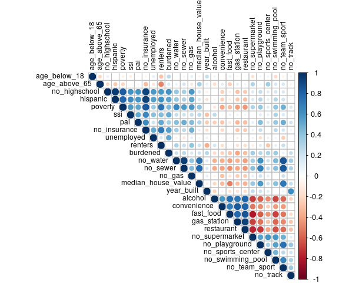
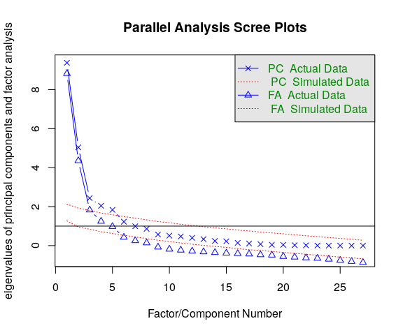

Obesogenic Dimensional Analysis
================
DSPG Business Innovation Team
7/24/2019

1. Read & Join the Obesogenic Data
----------------------------------

Here we read the Fairfax Housing/OSM Binary Isochrone data, aggregate and nest by geography; read, clean, and nest by geography type the American Community Survey data (final Economic Vulnerability); and finally join by geography and write out a final Obesegenic Environment data frame for dimensional/factor analysis (and index construction).

``` r
#Read clean census track id's by manipulating the census tract number for matching join
census.tract.df <- read_csv("./data/working/ACS_final_index_2/index.csv") %>%
                     rename(geoid = Id2, census_tract = Geography) %>%
                     mutate(
                       geoid = census_tract %>% 
                         parse_number() %>% 
                         as.character() %>% 
                         ifelse(str_length(.) == 4, str_c(., ".00"), .) %>%
                         str_split("") %>%
                         map_chr(.x = ., ~.x[-5] %>% str_c(., collapse = ""))
                     )
                     
#Read in the Fairfax/OSM data
ffx.osm.df <- read_rds("./data/working/Fairfax_Housing_OSM_Joined/fairfax_osm_final.RDS") %>%
               mutate(
                 geoid = geoid %>% as.character() %>% str_sub(., 6, nchar(.)-1)
               )

#Bind together (3 observations do not have census tract identified & 3 census tracts not represented)
ffx.osm.df <- bind_rows(left_join(ffx.osm.df %>% filter(!is.na(geoid)), census.tract.df, by = "geoid"),
            ffx.osm.df %>% filter(is.na(geoid))) %>%
            dplyr::select(-parcel_id) %>%
            rename(
              highschool_district = highschool,
              supervisor_district = district
            ) %>%
            gather(key = id_type, 
                   value = geography,
                   c(census_tract, highschool_district, supervisor_district)) %>%
            mutate(id_type = as.factor(id_type)) %>%
            nest(-c(id_type, geography))

#Read in the Economic Vulnerability ACS/Housing Stock data
acs.df     <- read_csv("./data/working/ACS_final_index_2/07_22_2019_joined_acs_final.csv") %>%
  janitor::clean_names() %>%
  mutate(
    id_type   = as.factor(id_type) 
  ) %>%
  dplyr::select(id_type, geography, everything()) %>%
  nest(-c(id_type, geography)) 

#Join together for final Obesogenic Data: ACS, Fairfax/OSM (aggregated by geography, median or mean respectively)
obesity.df <- inner_join(ffx.osm.df, acs.df, by = c("id_type", "geography")) %>%
              rename(ffx_osm_df = data.x, acs_df = data.y) %>%
              unnest(acs_df) %>%
              mutate(
                ffx_osm_df = map(ffx_osm_df,
                                 ~.x %>%
                                   mutate(
                                     no_supermarket = !supermarket,
                                     no_playground  = !playground,
                                     no_sports_center = !sports_center,
                                     no_swimming_pool = !swimming_pool,
                                     no_team_sport    = !team_sport,
                                     no_track         = !track
                                   ) %>%
                                   dplyr::select(-c(supermarket, playground, sports_center,
                                             swimming_pool, team_sport, track))),
                ffx_osm_df = map(ffx_osm_df,
                                 ~.x %>%
                                   dplyr::select(alcohol:no_track) %>%
                                   map_df(mean))
              ) %>%
              unnest()

#Check counts
obesity.df %>% 
  group_by(id_type) %>%
  summarise(
    count = n()
  ) %>% knitr::kable()
```

| id\_type             |  count|
|:---------------------|------:|
| census\_tract        |    255|
| highschool\_district |     24|
| supervisor\_district |      9|

``` r
#View Head and compare to make sure negativity mutation worked properly
#head(obesity.df) %>% knitr::kable()
#read_csv("./data/working/Obesogenic_final_data/2019_7_24_obesogenic_final.csv") %>% head()
```

Here we were very meticulous about making sure everything is matched, aggregated, and assigned to the right geographic unit. After joining three seperate data sets, Fairfax Housing, OSM, and ACS; we have our final working Obesogenic Environment data (stored in the `"./data/working/Obesogenic_final_data/"` folder). Note that three observations are missing census tracts but are not missing supervisor or highschool district, while three census tracts are not present at all, thus there are three fewer total observations than in the original ACS units of geography (due to the three missing census tracts, as verified in the table above).

2. Dimensional Analysis
-----------------------

#### a. Singular Value Decomposition

``` r
#Read the data
obesity.df <- read_rds("./data/working/Obesogenic_final_data/2019_7_25_obesogenic_final_nested.RDS") %>%
              mutate(
                data = map(data,
                           ~.x %>%
                            dplyr::select(-c(minority, unmarried, single_parent, limited_english,
                               low_income, not_enrolled, no_vehicle, long_commute)))
              )

              
#Scale the data
obesity.scale.df <- obesity.df %>%
              mutate(
                data = data %>% map(.x = ., ~na.omit(.x) %>%
                                          dplyr::select(-geography) %>%
                                          mutate_if(is.numeric, function(x) {
                                            (x - mean(x))/sd(x)})),
                cor_data = data %>% map(.x = ., ~.x %>% cor(., method = "pearson")),
                pca_data = cor_data %>% map(princomp)
              ) 

#Singular Value Decomposition for Dimensions

#Corplots
obesity.scale.df$cor_data %>%
  map(.x = ., ~.x %>% corrplot(type = "upper", tl.col = "black", tl.cex = 0.75))
```



    ## [[1]]
    ##                    age_below_18 age_above_65 no_highschool    hispanic
    ## age_below_18         1.00000000  -0.23365796    0.10871888  0.12859651
    ## age_above_65        -0.23365796   1.00000000   -0.27994042 -0.39373861
    ## no_highschool        0.10871888  -0.27994042    1.00000000  0.88242221
    ## hispanic             0.12859651  -0.39373861    0.88242221  1.00000000
    ## poverty              0.04756803  -0.27109962    0.68469318  0.67694413
    ## ssi                  0.01061923   0.04099989    0.36975989  0.27079826
    ## pai                  0.09118538  -0.10457657    0.29975201  0.25889880
    ## no_insurance         0.10899874  -0.43706006    0.83084333  0.87152400
    ## unemployed           0.05084649  -0.14492641    0.29442638  0.25851139
    ## no_water             0.01313033   0.24029839   -0.16401657 -0.19376087
    ## no_sewer             0.08068788   0.25394248   -0.18720902 -0.19944399
    ## no_gas               0.03715317   0.03557538    0.01132996  0.05033928
    ## median_house_value   0.24073283   0.48605623   -0.34902484 -0.44533842
    ## year_built          -0.07406720  -0.32558721   -0.34615838 -0.32504206
    ## alcohol             -0.24046256  -0.07976502    0.06952900  0.07634067
    ## convenience         -0.19133290  -0.18882127    0.27777791  0.28917414
    ## fast_food           -0.19476847  -0.21084866    0.25304900  0.24308673
    ## gas_station         -0.20908929  -0.27208110    0.30995001  0.29515762
    ## restaurant          -0.27768970  -0.24151979    0.28224433  0.29233148
    ## no_supermarket       0.18843612   0.24106625   -0.27074341 -0.27121791
    ## no_playground        0.16223951   0.21013136   -0.19941211 -0.22283083
    ## no_sports_center     0.14950116   0.08382908   -0.05939074 -0.07230410
    ## no_swimming_pool     0.17945224   0.24110296   -0.17334668 -0.24354418
    ## no_team_sport        0.12978878   0.22961674   -0.09928047 -0.15401796
    ## no_track            -0.05240910   0.06658872   -0.22119024 -0.22548690
    ##                        poverty          ssi          pai no_insurance
    ## age_below_18        0.04756803  0.010619225  0.091185377  0.108998737
    ## age_above_65       -0.27109962  0.040999895 -0.104576574 -0.437060060
    ## no_highschool       0.68469318  0.369759894  0.299752013  0.830843329
    ## hispanic            0.67694413  0.270798263  0.258898797  0.871523998
    ## poverty             1.00000000  0.276752688  0.250468484  0.764080438
    ## ssi                 0.27675269  1.000000000  0.264029141  0.306017471
    ## pai                 0.25046848  0.264029141  1.000000000  0.302780992
    ## no_insurance        0.76408044  0.306017471  0.302780992  1.000000000
    ## unemployed          0.25908722  0.202187092  0.040435624  0.314297148
    ## no_water           -0.12941756 -0.050105255 -0.120093345 -0.178061104
    ## no_sewer           -0.10872990 -0.060946036 -0.096269755 -0.184688707
    ## no_gas              0.01619775  0.024429685 -0.061516211  0.007107875
    ## median_house_value -0.41665122 -0.156293348 -0.212502068 -0.481067069
    ## year_built         -0.13822114 -0.117491354 -0.143016893 -0.210042703
    ## alcohol             0.21278257 -0.026078356  0.030396867  0.157943908
    ## convenience         0.24490256  0.044891890  0.185163382  0.310075674
    ## fast_food           0.34200465  0.071911901  0.151365205  0.338428788
    ## gas_station         0.35866661  0.050117769  0.135400536  0.364209955
    ## restaurant          0.41074958  0.081004631  0.089272159  0.363161318
    ## no_supermarket     -0.32544483 -0.113013243 -0.102898307 -0.311524431
    ## no_playground      -0.26900570 -0.025204592 -0.026497829 -0.251818437
    ## no_sports_center   -0.16666049  0.010591995  0.024867982 -0.102852051
    ## no_swimming_pool   -0.27513041 -0.046617830 -0.013443761 -0.230747714
    ## no_team_sport      -0.10861211 -0.005615803  0.000378297 -0.120626745
    ## no_track           -0.17716022 -0.022530238 -0.049181349 -0.221495158
    ##                      unemployed    no_water     no_sewer       no_gas
    ## age_below_18        0.050846491  0.01313033  0.080687876  0.037153173
    ## age_above_65       -0.144926414  0.24029839  0.253942479  0.035575377
    ## no_highschool       0.294426381 -0.16401657 -0.187209015  0.011329957
    ## hispanic            0.258511390 -0.19376087 -0.199443993  0.050339283
    ## poverty             0.259087218 -0.12941756 -0.108729898  0.016197748
    ## ssi                 0.202187092 -0.05010526 -0.060946036  0.024429685
    ## pai                 0.040435624 -0.12009334 -0.096269755 -0.061516211
    ## no_insurance        0.314297148 -0.17806110 -0.184688707  0.007107875
    ## unemployed          1.000000000  0.03044083 -0.008893752  0.136692599
    ## no_water            0.030440832  1.00000000  0.803828793  0.239447419
    ## no_sewer           -0.008893752  0.80382879  1.000000000  0.218689111
    ## no_gas              0.136692599  0.23944742  0.218689111  1.000000000
    ## median_house_value -0.117359674  0.45299580  0.452378358 -0.041711988
    ## year_built         -0.054077216  0.09883705  0.078512414  0.075156099
    ## alcohol            -0.008125751 -0.13571420 -0.120914828 -0.112391347
    ## convenience         0.008111650 -0.17878386 -0.192663936 -0.099948304
    ## fast_food           0.044105049 -0.22940684 -0.244230265 -0.052521540
    ## gas_station        -0.021061689 -0.21504963 -0.226229894 -0.142912832
    ## restaurant          0.044767591 -0.24080772 -0.259113263 -0.105530598
    ## no_supermarket     -0.023897770  0.21857585  0.225610558  0.009664340
    ## no_playground      -0.069811591  0.38243159  0.412919808  0.114751968
    ## no_sports_center   -0.009232704  0.11845844  0.107906337  0.190368267
    ## no_swimming_pool   -0.046725523  0.28781759  0.283939705  0.040718459
    ## no_team_sport       0.031082607  0.55631535  0.605809398  0.136067428
    ## no_track           -0.089325875  0.12564209  0.121621480  0.023243245
    ##                    median_house_value  year_built      alcohol convenience
    ## age_below_18               0.24073283 -0.07406720 -0.240462560 -0.19133290
    ## age_above_65               0.48605623 -0.32558721 -0.079765015 -0.18882127
    ## no_highschool             -0.34902484 -0.34615838  0.069528995  0.27777791
    ## hispanic                  -0.44533842 -0.32504206  0.076340668  0.28917414
    ## poverty                   -0.41665122 -0.13822114  0.212782573  0.24490256
    ## ssi                       -0.15629335 -0.11749135 -0.026078356  0.04489189
    ## pai                       -0.21250207 -0.14301689  0.030396867  0.18516338
    ## no_insurance              -0.48106707 -0.21004270  0.157943908  0.31007567
    ## unemployed                -0.11735967 -0.05407722 -0.008125751  0.00811165
    ## no_water                   0.45299580  0.09883705 -0.135714201 -0.17878386
    ## no_sewer                   0.45237836  0.07851241 -0.120914828 -0.19266394
    ## no_gas                    -0.04171199  0.07515610 -0.112391347 -0.09994830
    ## median_house_value         1.00000000 -0.06148079 -0.265116827 -0.29107170
    ## year_built                -0.06148079  1.00000000  0.097705532 -0.03059962
    ## alcohol                   -0.26511683  0.09770553  1.000000000  0.36307561
    ## convenience               -0.29107170 -0.03059962  0.363075607  1.00000000
    ## fast_food                 -0.39238387  0.07079142  0.630233945  0.59474801
    ## gas_station               -0.32764277 -0.01990410  0.539648527  0.74387867
    ## restaurant                -0.42705261  0.02974631  0.603947346  0.67993885
    ## no_supermarket             0.38199134 -0.06282994 -0.620969426 -0.49886159
    ## no_playground              0.42667325  0.07075571 -0.320615335 -0.37037289
    ## no_sports_center           0.15283665 -0.01066278 -0.406620845 -0.22420371
    ## no_swimming_pool           0.44083201 -0.06315243 -0.322693013 -0.33168778
    ## no_team_sport              0.47026978  0.02041214 -0.249712107 -0.33292765
    ## no_track                   0.11691248  0.18831712 -0.045736497 -0.10848927
    ##                      fast_food gas_station  restaurant no_supermarket
    ## age_below_18       -0.19476847 -0.20908929 -0.27768970     0.18843612
    ## age_above_65       -0.21084866 -0.27208110 -0.24151979     0.24106625
    ## no_highschool       0.25304900  0.30995001  0.28224433    -0.27074341
    ## hispanic            0.24308673  0.29515762  0.29233148    -0.27121791
    ## poverty             0.34200465  0.35866661  0.41074958    -0.32544483
    ## ssi                 0.07191190  0.05011777  0.08100463    -0.11301324
    ## pai                 0.15136521  0.13540054  0.08927216    -0.10289831
    ## no_insurance        0.33842879  0.36420995  0.36316132    -0.31152443
    ## unemployed          0.04410505 -0.02106169  0.04476759    -0.02389777
    ## no_water           -0.22940684 -0.21504963 -0.24080772     0.21857585
    ## no_sewer           -0.24423026 -0.22622989 -0.25911326     0.22561056
    ## no_gas             -0.05252154 -0.14291283 -0.10553060     0.00966434
    ## median_house_value -0.39238387 -0.32764277 -0.42705261     0.38199134
    ## year_built          0.07079142 -0.01990410  0.02974631    -0.06282994
    ## alcohol             0.63023395  0.53964853  0.60394735    -0.62096943
    ## convenience         0.59474801  0.74387867  0.67993885    -0.49886159
    ## fast_food           1.00000000  0.71800620  0.82469212    -0.74929624
    ## gas_station         0.71800620  1.00000000  0.80526958    -0.64605155
    ## restaurant          0.82469212  0.80526958  1.00000000    -0.73013379
    ## no_supermarket     -0.74929624 -0.64605155 -0.73013379     1.00000000
    ## no_playground      -0.43189087 -0.44416056 -0.50947444     0.44095096
    ## no_sports_center   -0.34819539 -0.30239641 -0.31992121     0.40764639
    ## no_swimming_pool   -0.42875301 -0.40845202 -0.49406368     0.48828269
    ## no_team_sport      -0.32957135 -0.35802015 -0.40276818     0.34832788
    ## no_track           -0.08645068 -0.11431088 -0.19169530     0.11956497
    ##                    no_playground no_sports_center no_swimming_pool
    ## age_below_18          0.16223951      0.149501161       0.17945224
    ## age_above_65          0.21013136      0.083829085       0.24110296
    ## no_highschool        -0.19941211     -0.059390742      -0.17334668
    ## hispanic             -0.22283083     -0.072304100      -0.24354418
    ## poverty              -0.26900570     -0.166660494      -0.27513041
    ## ssi                  -0.02520459      0.010591995      -0.04661783
    ## pai                  -0.02649783      0.024867982      -0.01344376
    ## no_insurance         -0.25181844     -0.102852051      -0.23074771
    ## unemployed           -0.06981159     -0.009232704      -0.04672552
    ## no_water              0.38243159      0.118458436       0.28781759
    ## no_sewer              0.41291981      0.107906337       0.28393970
    ## no_gas                0.11475197      0.190368267       0.04071846
    ## median_house_value    0.42667325      0.152836648       0.44083201
    ## year_built            0.07075571     -0.010662782      -0.06315243
    ## alcohol              -0.32061534     -0.406620845      -0.32269301
    ## convenience          -0.37037289     -0.224203714      -0.33168778
    ## fast_food            -0.43189087     -0.348195392      -0.42875301
    ## gas_station          -0.44416056     -0.302396408      -0.40845202
    ## restaurant           -0.50947444     -0.319921205      -0.49406368
    ## no_supermarket        0.44095096      0.407646390       0.48828269
    ## no_playground         1.00000000      0.303126814       0.57613522
    ## no_sports_center      0.30312681      1.000000000       0.35575163
    ## no_swimming_pool      0.57613522      0.355751625       1.00000000
    ## no_team_sport         0.60835552      0.255497247       0.58823514
    ## no_track              0.10382739      0.219999210       0.17385554
    ##                    no_team_sport    no_track
    ## age_below_18         0.129788782 -0.05240910
    ## age_above_65         0.229616739  0.06658872
    ## no_highschool       -0.099280468 -0.22119024
    ## hispanic            -0.154017957 -0.22548690
    ## poverty             -0.108612109 -0.17716022
    ## ssi                 -0.005615803 -0.02253024
    ## pai                  0.000378297 -0.04918135
    ## no_insurance        -0.120626745 -0.22149516
    ## unemployed           0.031082607 -0.08932587
    ## no_water             0.556315353  0.12564209
    ## no_sewer             0.605809398  0.12162148
    ## no_gas               0.136067428  0.02324324
    ## median_house_value   0.470269785  0.11691248
    ## year_built           0.020412138  0.18831712
    ## alcohol             -0.249712107 -0.04573650
    ## convenience         -0.332927655 -0.10848927
    ## fast_food           -0.329571348 -0.08645068
    ## gas_station         -0.358020148 -0.11431088
    ## restaurant          -0.402768178 -0.19169530
    ## no_supermarket       0.348327875  0.11956497
    ## no_playground        0.608355524  0.10382739
    ## no_sports_center     0.255497247  0.21999921
    ## no_swimming_pool     0.588235143  0.17385554
    ## no_team_sport        1.000000000  0.21657972
    ## no_track             0.216579723  1.00000000
    ## 
    ## [[2]]
    ##                    age_below_18 age_above_65 no_highschool     hispanic
    ## age_below_18        1.000000000  -0.20624276    0.09198750 -0.005489321
    ## age_above_65       -0.206242762   1.00000000   -0.20164925 -0.268253706
    ## no_highschool       0.091987502  -0.20164925    1.00000000  0.959088986
    ## hispanic           -0.005489321  -0.26825371    0.95908899  1.000000000
    ## poverty            -0.079401999  -0.21739882    0.82185635  0.799364554
    ## ssi                -0.101165362   0.02705229    0.60529133  0.621316538
    ## pai                 0.039676756  -0.05718487    0.59320448  0.592399034
    ## no_insurance       -0.056133768  -0.31875450    0.92490814  0.934354869
    ## unemployed          0.119326207  -0.13868102    0.57682143  0.543635152
    ## no_water            0.029806532   0.08407345    0.38862126  0.378563022
    ## no_sewer            0.053892047   0.18938766    0.33743909  0.313658573
    ## no_gas              0.115826883  -0.13407812    0.58465387  0.522967225
    ## median_house_value -0.074173090   0.33096480    0.17422638  0.167356355
    ## year_built          0.230424732   0.10886523   -0.07869954 -0.151717633
    ## alcohol             0.076315445  -0.18426778   -0.02722717 -0.065995503
    ## convenience        -0.027777722   0.12845280   -0.22959649 -0.237045780
    ## fast_food           0.084666624  -0.24855330   -0.08732677 -0.093616863
    ## gas_station        -0.046188783   0.11420492   -0.28632749 -0.263168445
    ## restaurant          0.032260255   0.07333674   -0.26892954 -0.292828830
    ## no_supermarket     -0.168695933   0.30027339    0.14954994  0.151676232
    ## no_playground       0.060648129   0.05543576    0.23040677  0.279432730
    ## no_sports_center    0.064617514   0.34948199    0.13088838  0.103578580
    ## no_swimming_pool   -0.190325052   0.17047463    0.18326469  0.284568703
    ## no_team_sport      -0.065324315   0.17635102    0.16425732  0.207886226
    ## no_track            0.059530917  -0.06827368    0.01135623 -0.013225689
    ##                         poverty         ssi         pai no_insurance
    ## age_below_18       -0.079401999 -0.10116536  0.03967676 -0.056133768
    ## age_above_65       -0.217398817  0.02705229 -0.05718487 -0.318754502
    ## no_highschool       0.821856349  0.60529133  0.59320448  0.924908139
    ## hispanic            0.799364554  0.62131654  0.59239903  0.934354869
    ## poverty             1.000000000  0.56541905  0.52607719  0.844347379
    ## ssi                 0.565419054  1.00000000  0.50248960  0.642195291
    ## pai                 0.526077193  0.50248960  1.00000000  0.622694738
    ## no_insurance        0.844347379  0.64219529  0.62269474  1.000000000
    ## unemployed          0.362167212  0.41316570  0.20868988  0.500628162
    ## no_water            0.649021570  0.23603457  0.42192270  0.336511178
    ## no_sewer            0.563300815  0.20159629  0.49595678  0.256751020
    ## no_gas              0.572956923  0.23338230  0.43452857  0.482196211
    ## median_house_value  0.401374413  0.26004741  0.29780417  0.092671349
    ## year_built         -0.003691274 -0.29481644 -0.25167158 -0.151657021
    ## alcohol            -0.135125152  0.25436460 -0.24913180 -0.004476586
    ## convenience        -0.382185029  0.04010115 -0.27565288 -0.196459947
    ## fast_food          -0.316075692  0.08333695 -0.12511672 -0.029565494
    ## gas_station        -0.410505649  0.07888151 -0.32672865 -0.268858273
    ## restaurant         -0.431154203  0.06978691 -0.30416963 -0.251504115
    ## no_supermarket      0.306280647 -0.02052905  0.10326933  0.082436267
    ## no_playground       0.384362354  0.12404079  0.42939081  0.228390103
    ## no_sports_center    0.136371731  0.09125768  0.15703619  0.027750424
    ## no_swimming_pool    0.390125840  0.31394612  0.37713372  0.263865702
    ## no_team_sport       0.482917898  0.15851968  0.49268802  0.183145408
    ## no_track            0.169184824 -0.05219886  0.19176390  0.060242871
    ##                      unemployed    no_water    no_sewer       no_gas
    ## age_below_18        0.119326207  0.02980653  0.05389205  0.115826883
    ## age_above_65       -0.138681020  0.08407345  0.18938766 -0.134078116
    ## no_highschool       0.576821434  0.38862126  0.33743909  0.584653875
    ## hispanic            0.543635152  0.37856302  0.31365857  0.522967225
    ## poverty             0.362167212  0.64902157  0.56330081  0.572956923
    ## ssi                 0.413165695  0.23603457  0.20159629  0.233382297
    ## pai                 0.208689883  0.42192270  0.49595678  0.434528574
    ## no_insurance        0.500628162  0.33651118  0.25675102  0.482196211
    ## unemployed          1.000000000 -0.07767387 -0.13989960  0.103907668
    ## no_water           -0.077673866  1.00000000  0.93750125  0.392961771
    ## no_sewer           -0.139899596  0.93750125  1.00000000  0.433488826
    ## no_gas              0.103907668  0.39296177  0.43348883  1.000000000
    ## median_house_value -0.064517771  0.75781353  0.77506480 -0.004846304
    ## year_built          0.091665732  0.12808019  0.15280741  0.101928842
    ## alcohol             0.002174388 -0.35207283 -0.37905807 -0.072577187
    ## convenience         0.048772589 -0.36806911 -0.40248184 -0.297001145
    ## fast_food          -0.047173733 -0.41496117 -0.45541742 -0.132000170
    ## gas_station        -0.091987814 -0.34717113 -0.38801004 -0.247451472
    ## restaurant         -0.040493779 -0.41544768 -0.43022627 -0.250770667
    ## no_supermarket      0.078922382  0.33454263  0.41174152  0.104142861
    ## no_playground      -0.165945464  0.61726141  0.68386458  0.206679949
    ## no_sports_center    0.088539023  0.20189351  0.23372484  0.109095608
    ## no_swimming_pool    0.069277335  0.44408566  0.41956180 -0.010856716
    ## no_team_sport      -0.244688969  0.85897654  0.84415404  0.213597454
    ## no_track            0.019724863  0.34443491  0.30768204 -0.030110602
    ##                    median_house_value   year_built      alcohol
    ## age_below_18             -0.074173090  0.230424732  0.076315445
    ## age_above_65              0.330964802  0.108865233 -0.184267776
    ## no_highschool             0.174226379 -0.078699541 -0.027227166
    ## hispanic                  0.167356355 -0.151717633 -0.065995503
    ## poverty                   0.401374413 -0.003691274 -0.135125152
    ## ssi                       0.260047409 -0.294816445  0.254364596
    ## pai                       0.297804174 -0.251671580 -0.249131800
    ## no_insurance              0.092671349 -0.151657021 -0.004476586
    ## unemployed               -0.064517771  0.091665732  0.002174388
    ## no_water                  0.757813533  0.128080193 -0.352072829
    ## no_sewer                  0.775064802  0.152807411 -0.379058074
    ## no_gas                   -0.004846304  0.101928842 -0.072577187
    ## median_house_value        1.000000000 -0.088107263 -0.213374576
    ## year_built               -0.088107263  1.000000000 -0.221231736
    ## alcohol                  -0.213374576 -0.221231736  1.000000000
    ## convenience              -0.313347318  0.070241930  0.583980439
    ## fast_food                -0.501234282 -0.145131624  0.757158357
    ## gas_station              -0.296596670 -0.143920758  0.724237038
    ## restaurant               -0.348087668 -0.180333503  0.800556815
    ## no_supermarket            0.378343078  0.240204501 -0.691460414
    ## no_playground             0.573214200  0.202246724 -0.596250204
    ## no_sports_center          0.196538535  0.117731795 -0.468501227
    ## no_swimming_pool          0.416094526 -0.015911317 -0.660561516
    ## no_team_sport             0.716111358  0.078970621 -0.573391816
    ## no_track                  0.234662916  0.623064482 -0.223665398
    ##                    convenience   fast_food gas_station  restaurant
    ## age_below_18       -0.02777772  0.08466662 -0.04618878  0.03226026
    ## age_above_65        0.12845280 -0.24855330  0.11420492  0.07333674
    ## no_highschool      -0.22959649 -0.08732677 -0.28632749 -0.26892954
    ## hispanic           -0.23704578 -0.09361686 -0.26316845 -0.29282883
    ## poverty            -0.38218503 -0.31607569 -0.41050565 -0.43115420
    ## ssi                 0.04010115  0.08333695  0.07888151  0.06978691
    ## pai                -0.27565288 -0.12511672 -0.32672865 -0.30416963
    ## no_insurance       -0.19645995 -0.02956549 -0.26885827 -0.25150411
    ## unemployed          0.04877259 -0.04717373 -0.09198781 -0.04049378
    ## no_water           -0.36806911 -0.41496117 -0.34717113 -0.41544768
    ## no_sewer           -0.40248184 -0.45541742 -0.38801004 -0.43022627
    ## no_gas             -0.29700115 -0.13200017 -0.24745147 -0.25077067
    ## median_house_value -0.31334732 -0.50123428 -0.29659667 -0.34808767
    ## year_built          0.07024193 -0.14513162 -0.14392076 -0.18033350
    ## alcohol             0.58398044  0.75715836  0.72423704  0.80055682
    ## convenience         1.00000000  0.69198285  0.83348570  0.80908604
    ## fast_food           0.69198285  1.00000000  0.77665683  0.85713140
    ## gas_station         0.83348570  0.77665683  1.00000000  0.92148464
    ## restaurant          0.80908604  0.85713140  0.92148464  1.00000000
    ## no_supermarket     -0.52994518 -0.80248793 -0.68155968 -0.76955810
    ## no_playground      -0.46806858 -0.60689778 -0.54269219 -0.70566833
    ## no_sports_center   -0.24843035 -0.44009164 -0.29732873 -0.39665950
    ## no_swimming_pool   -0.42370242 -0.68217177 -0.57418312 -0.64511968
    ## no_team_sport      -0.42413991 -0.53723458 -0.48023875 -0.56103972
    ## no_track           -0.02311825 -0.19868736 -0.27399477 -0.28973161
    ##                    no_supermarket no_playground no_sports_center
    ## age_below_18          -0.16869593    0.06064813       0.06461751
    ## age_above_65           0.30027339    0.05543576       0.34948199
    ## no_highschool          0.14954994    0.23040677       0.13088838
    ## hispanic               0.15167623    0.27943273       0.10357858
    ## poverty                0.30628065    0.38436235       0.13637173
    ## ssi                   -0.02052905    0.12404079       0.09125768
    ## pai                    0.10326933    0.42939081       0.15703619
    ## no_insurance           0.08243627    0.22839010       0.02775042
    ## unemployed             0.07892238   -0.16594546       0.08853902
    ## no_water               0.33454263    0.61726141       0.20189351
    ## no_sewer               0.41174152    0.68386458       0.23372484
    ## no_gas                 0.10414286    0.20667995       0.10909561
    ## median_house_value     0.37834308    0.57321420       0.19653853
    ## year_built             0.24020450    0.20224672       0.11773180
    ## alcohol               -0.69146041   -0.59625020      -0.46850123
    ## convenience           -0.52994518   -0.46806858      -0.24843035
    ## fast_food             -0.80248793   -0.60689778      -0.44009164
    ## gas_station           -0.68155968   -0.54269219      -0.29732873
    ## restaurant            -0.76955810   -0.70566833      -0.39665950
    ## no_supermarket         1.00000000    0.53160646       0.59024165
    ## no_playground          0.53160646    1.00000000       0.31763225
    ## no_sports_center       0.59024165    0.31763225       1.00000000
    ## no_swimming_pool       0.58896950    0.54342906       0.46165007
    ## no_team_sport          0.48012892    0.74433272       0.26386540
    ## no_track               0.11240155    0.37470240       0.19172540
    ##                    no_swimming_pool no_team_sport    no_track
    ## age_below_18            -0.19032505   -0.06532431  0.05953092
    ## age_above_65             0.17047463    0.17635102 -0.06827368
    ## no_highschool            0.18326469    0.16425732  0.01135623
    ## hispanic                 0.28456870    0.20788623 -0.01322569
    ## poverty                  0.39012584    0.48291790  0.16918482
    ## ssi                      0.31394612    0.15851968 -0.05219886
    ## pai                      0.37713372    0.49268802  0.19176390
    ## no_insurance             0.26386570    0.18314541  0.06024287
    ## unemployed               0.06927734   -0.24468897  0.01972486
    ## no_water                 0.44408566    0.85897654  0.34443491
    ## no_sewer                 0.41956180    0.84415404  0.30768204
    ## no_gas                  -0.01085672    0.21359745 -0.03011060
    ## median_house_value       0.41609453    0.71611136  0.23466292
    ## year_built              -0.01591132    0.07897062  0.62306448
    ## alcohol                 -0.66056152   -0.57339182 -0.22366540
    ## convenience             -0.42370242   -0.42413991 -0.02311825
    ## fast_food               -0.68217177   -0.53723458 -0.19868736
    ## gas_station             -0.57418312   -0.48023875 -0.27399477
    ## restaurant              -0.64511968   -0.56103972 -0.28973161
    ## no_supermarket           0.58896950    0.48012892  0.11240155
    ## no_playground            0.54342906    0.74433272  0.37470240
    ## no_sports_center         0.46165007    0.26386540  0.19172540
    ## no_swimming_pool         1.00000000    0.66287317  0.31186983
    ## no_team_sport            0.66287317    1.00000000  0.36744900
    ## no_track                 0.31186983    0.36744900  1.00000000
    ## 
    ## [[3]]
    ##                    age_below_18 age_above_65 no_highschool    hispanic
    ## age_below_18        1.000000000  -0.44840153  -0.193607918 -0.21662439
    ## age_above_65       -0.448401525   1.00000000  -0.040406747 -0.04360411
    ## no_highschool      -0.193607918  -0.04040675   1.000000000  0.98742725
    ## hispanic           -0.216624388  -0.04360411   0.987427248  1.00000000
    ## poverty            -0.338360474  -0.09094147   0.891057295  0.89890332
    ## ssi                -0.350706805   0.07526390   0.642912815  0.70355201
    ## pai                -0.167037816  -0.29962180   0.521298082  0.53153129
    ## no_insurance       -0.293585933  -0.09470990   0.954348381  0.96515842
    ## unemployed          0.089060721  -0.48083362   0.541785070  0.59313988
    ## no_water            0.191935725  -0.42869371   0.410691960  0.45915785
    ## no_sewer            0.123659001  -0.48758196   0.526646880  0.55853730
    ## no_gas              0.227957407  -0.11749950   0.379768760  0.45920446
    ## median_house_value  0.388439731  -0.56881381   0.009951367  0.06584217
    ## year_built         -0.395741130   0.21551974   0.413803233  0.37616847
    ## alcohol             0.541930553  -0.35570957  -0.213339773 -0.28780461
    ## convenience        -0.004533266  -0.32050487  -0.110141339 -0.20281201
    ## fast_food           0.288731996  -0.02656027  -0.005789667 -0.09132345
    ## gas_station         0.265465383  -0.14302232  -0.213345914 -0.30022723
    ## restaurant          0.224814936  -0.08359180  -0.297241888 -0.38732276
    ## no_supermarket     -0.155274187   0.04187386   0.116017340  0.16000413
    ## no_playground      -0.427677256  -0.24379073   0.527651756  0.59501794
    ## no_sports_center   -0.078443144   0.28472429  -0.053439146 -0.13137579
    ## no_swimming_pool   -0.241619650   0.03866030   0.121602189  0.15605117
    ## no_team_sport      -0.055134590  -0.14652633   0.590545394  0.66399431
    ## no_track           -0.115182559   0.22640433   0.685060090  0.67719097
    ##                        poverty          ssi         pai no_insurance
    ## age_below_18       -0.33836047 -0.350706805 -0.16703782  -0.29358593
    ## age_above_65       -0.09094147  0.075263903 -0.29962180  -0.09470990
    ## no_highschool       0.89105730  0.642912815  0.52129808   0.95434838
    ## hispanic            0.89890332  0.703552010  0.53153129   0.96515842
    ## poverty             1.00000000  0.670759650  0.70630027   0.94515626
    ## ssi                 0.67075965  1.000000000  0.48750948   0.67166241
    ## pai                 0.70630027  0.487509478  1.00000000   0.51252989
    ## no_insurance        0.94515626  0.671662414  0.51252989   1.00000000
    ## unemployed          0.35976090  0.515856956  0.04895380   0.55817260
    ## no_water            0.57424267  0.232207048  0.20102940   0.57575571
    ## no_sewer            0.62149782  0.277960275  0.20186293   0.65422052
    ## no_gas              0.35968772  0.124961428  0.19887491   0.37902121
    ## median_house_value  0.11791919 -0.232136394 -0.06854220   0.15295934
    ## year_built          0.32370444  0.188673026 -0.33949371   0.45221189
    ## alcohol            -0.39784308 -0.739437863 -0.08721079  -0.34629747
    ## convenience        -0.04225780 -0.478412609  0.35759958  -0.15228094
    ## fast_food          -0.16349946 -0.475944861  0.23482552  -0.20218195
    ## gas_station        -0.26688150 -0.588346572  0.22985807  -0.35351376
    ## restaurant         -0.37513036 -0.672112327  0.07213847  -0.42638999
    ## no_supermarket      0.24708158  0.357794151 -0.21471158   0.24590303
    ## no_playground       0.74971556  0.480162341  0.36802280   0.73376662
    ## no_sports_center   -0.02199162  0.005746467 -0.41479225  -0.02994291
    ## no_swimming_pool    0.42086819  0.551680476  0.26509317   0.25267533
    ## no_team_sport       0.75965081  0.646068610  0.37822169   0.74368955
    ## no_track            0.52047163  0.432443757  0.02522098   0.59504442
    ##                     unemployed    no_water   no_sewer      no_gas
    ## age_below_18        0.08906072  0.19193572  0.1236590  0.22795741
    ## age_above_65       -0.48083362 -0.42869371 -0.4875820 -0.11749950
    ## no_highschool       0.54178507  0.41069196  0.5266469  0.37976876
    ## hispanic            0.59313988  0.45915785  0.5585373  0.45920446
    ## poverty             0.35976090  0.57424267  0.6214978  0.35968772
    ## ssi                 0.51585696  0.23220705  0.2779603  0.12496143
    ## pai                 0.04895380  0.20102940  0.2018629  0.19887491
    ## no_insurance        0.55817260  0.57575571  0.6542205  0.37902121
    ## unemployed          1.00000000  0.45312820  0.6141326  0.38032276
    ## no_water            0.45312820  1.00000000  0.9542625  0.60972543
    ## no_sewer            0.61413261  0.95426252  1.0000000  0.59272539
    ## no_gas              0.38032276  0.60972543  0.5927254  1.00000000
    ## median_house_value  0.36924115  0.82540042  0.7818471  0.65788562
    ## year_built          0.37456086  0.28130711  0.4536765  0.01055482
    ## alcohol            -0.19832363 -0.26690069 -0.2551643 -0.03518146
    ## convenience        -0.43641634 -0.31372251 -0.2999641 -0.41406409
    ## fast_food          -0.41462061 -0.48423799 -0.4818518 -0.09483275
    ## gas_station        -0.53824774 -0.48934408 -0.5154254 -0.26281894
    ## restaurant         -0.56017894 -0.55429066 -0.5770337 -0.34419604
    ## no_supermarket      0.35790253  0.58258601  0.6252128  0.24372629
    ## no_playground       0.47276786  0.78491803  0.8081986  0.43588057
    ## no_sports_center   -0.14489738  0.07163106  0.1161416 -0.42904544
    ## no_swimming_pool    0.04671114  0.45282756  0.4196777  0.01347419
    ## no_team_sport       0.45887871  0.86391546  0.7995569  0.54151559
    ## no_track            0.48840017  0.34776030  0.5102849  0.51534180
    ##                    median_house_value  year_built     alcohol  convenience
    ## age_below_18              0.388439731 -0.39574113  0.54193055 -0.004533266
    ## age_above_65             -0.568813808  0.21551974 -0.35570957 -0.320504869
    ## no_highschool             0.009951367  0.41380323 -0.21333977 -0.110141339
    ## hispanic                  0.065842167  0.37616847 -0.28780461 -0.202812012
    ## poverty                   0.117919186  0.32370444 -0.39784308 -0.042257803
    ## ssi                      -0.232136394  0.18867303 -0.73943786 -0.478412609
    ## pai                      -0.068542196 -0.33949371 -0.08721079  0.357599577
    ## no_insurance              0.152959343  0.45221189 -0.34629747 -0.152280945
    ## unemployed                0.369241153  0.37456086 -0.19832363 -0.436416342
    ## no_water                  0.825400423  0.28130711 -0.26690069 -0.313722511
    ## no_sewer                  0.781847141  0.45367653 -0.25516434 -0.299964052
    ## no_gas                    0.657885624  0.01055482 -0.03518146 -0.414064089
    ## median_house_value        1.000000000  0.07943628  0.11333056 -0.179291110
    ## year_built                0.079436280  1.00000000 -0.40595110 -0.357606218
    ## alcohol                   0.113330555 -0.40595110  1.00000000  0.679594171
    ## convenience              -0.179291110 -0.35760622  0.67959417  1.000000000
    ## fast_food                -0.295941716 -0.48961807  0.83635394  0.740077134
    ## gas_station              -0.255848884 -0.57380293  0.84500234  0.875512286
    ## restaurant               -0.277574131 -0.50781830  0.86353843  0.864319303
    ## no_supermarket            0.380713824  0.65055216 -0.74714897 -0.712788804
    ## no_playground             0.529119095  0.43558799 -0.53731796 -0.246589422
    ## no_sports_center         -0.160142644  0.65312042 -0.38261229 -0.230149661
    ## no_swimming_pool          0.081464171  0.27380461 -0.82636755 -0.426301029
    ## no_team_sport             0.484177459  0.25038323 -0.59766555 -0.495750422
    ## no_track                  0.101860038  0.70345251 -0.37683190 -0.541306354
    ##                       fast_food gas_station  restaurant no_supermarket
    ## age_below_18        0.288731996   0.2654654  0.22481494    -0.15527419
    ## age_above_65       -0.026560271  -0.1430223 -0.08359180     0.04187386
    ## no_highschool      -0.005789667  -0.2133459 -0.29724189     0.11601734
    ## hispanic           -0.091323449  -0.3002272 -0.38732276     0.16000413
    ## poverty            -0.163499463  -0.2668815 -0.37513036     0.24708158
    ## ssi                -0.475944861  -0.5883466 -0.67211233     0.35779415
    ## pai                 0.234825523   0.2298581  0.07213847    -0.21471158
    ## no_insurance       -0.202181952  -0.3535138 -0.42638999     0.24590303
    ## unemployed         -0.414620607  -0.5382477 -0.56017894     0.35790253
    ## no_water           -0.484237989  -0.4893441 -0.55429066     0.58258601
    ## no_sewer           -0.481851843  -0.5154254 -0.57703368     0.62521282
    ## no_gas             -0.094832747  -0.2628189 -0.34419604     0.24372629
    ## median_house_value -0.295941716  -0.2558489 -0.27757413     0.38071382
    ## year_built         -0.489618072  -0.5738029 -0.50781830     0.65055216
    ## alcohol             0.836353939   0.8450023  0.86353843    -0.74714897
    ## convenience         0.740077134   0.8755123  0.86431930    -0.71278880
    ## fast_food           1.000000000   0.9489455  0.92171824    -0.88920938
    ## gas_station         0.948945495   1.0000000  0.98301036    -0.88266139
    ## restaurant          0.921718240   0.9830104  1.00000000    -0.88279054
    ## no_supermarket     -0.889209383  -0.8826614 -0.88279054     1.00000000
    ## no_playground      -0.595666964  -0.5858026 -0.63077394     0.56805390
    ## no_sports_center   -0.413627909  -0.3659796 -0.31169846     0.59816117
    ## no_swimming_pool   -0.718552484  -0.6385502 -0.70918296     0.77901233
    ## no_team_sport      -0.586093669  -0.6479243 -0.73516902     0.58872171
    ## no_track           -0.277090379  -0.5134560 -0.55495271     0.55542237
    ##                    no_playground no_sports_center no_swimming_pool
    ## age_below_18         -0.42767726     -0.078443144      -0.24161965
    ## age_above_65         -0.24379073      0.284724287       0.03866030
    ## no_highschool         0.52765176     -0.053439146       0.12160219
    ## hispanic              0.59501794     -0.131375793       0.15605117
    ## poverty               0.74971556     -0.021991616       0.42086819
    ## ssi                   0.48016234      0.005746467       0.55168048
    ## pai                   0.36802280     -0.414792251       0.26509317
    ## no_insurance          0.73376662     -0.029942908       0.25267533
    ## unemployed            0.47276786     -0.144897383       0.04671114
    ## no_water              0.78491803      0.071631058       0.45282756
    ## no_sewer              0.80819859      0.116141615       0.41967769
    ## no_gas                0.43588057     -0.429045443       0.01347419
    ## median_house_value    0.52911909     -0.160142644       0.08146417
    ## year_built            0.43558799      0.653120422       0.27380461
    ## alcohol              -0.53731796     -0.382612291      -0.82636755
    ## convenience          -0.24658942     -0.230149661      -0.42630103
    ## fast_food            -0.59566696     -0.413627909      -0.71855248
    ## gas_station          -0.58580261     -0.365979604      -0.63855021
    ## restaurant           -0.63077394     -0.311698456      -0.70918296
    ## no_supermarket        0.56805390      0.598161170       0.77901233
    ## no_playground         1.00000000     -0.014842780       0.51232394
    ## no_sports_center     -0.01484278      1.000000000       0.51913027
    ## no_swimming_pool      0.51232394      0.519130274       1.00000000
    ## no_team_sport         0.81422164      0.050373300       0.62227880
    ## no_track              0.35813231      0.302975854       0.27592196
    ##                    no_team_sport    no_track
    ## age_below_18         -0.05513459 -0.11518256
    ## age_above_65         -0.14652633  0.22640433
    ## no_highschool         0.59054539  0.68506009
    ## hispanic              0.66399431  0.67719097
    ## poverty               0.75965081  0.52047163
    ## ssi                   0.64606861  0.43244376
    ## pai                   0.37822169  0.02522098
    ## no_insurance          0.74368955  0.59504442
    ## unemployed            0.45887871  0.48840017
    ## no_water              0.86391546  0.34776030
    ## no_sewer              0.79955690  0.51028487
    ## no_gas                0.54151559  0.51534180
    ## median_house_value    0.48417746  0.10186004
    ## year_built            0.25038323  0.70345251
    ## alcohol              -0.59766555 -0.37683190
    ## convenience          -0.49575042 -0.54130635
    ## fast_food            -0.58609367 -0.27709038
    ## gas_station          -0.64792426 -0.51345603
    ## restaurant           -0.73516902 -0.55495271
    ## no_supermarket        0.58872171  0.55542237
    ## no_playground         0.81422164  0.35813231
    ## no_sports_center      0.05037330  0.30297585
    ## no_swimming_pool      0.62227880  0.27592196
    ## no_team_sport         1.00000000  0.43060553
    ## no_track              0.43060553  1.00000000

``` r
#Parallel analysis
obesity.scale.df$cor_data %>%
  map(.x = ., ~fa.parallel(.x))
```

    ## Warning in fa.parallel(.x): It seems as if you are using a correlation
    ## matrix, but have not specified the number of cases. The number of subjects
    ## is arbitrarily set to be 100

    ## Parallel analysis suggests that the number of factors =  3  and the number of components =  3

    ## Warning in fa.parallel(.x): It seems as if you are using a correlation
    ## matrix, but have not specified the number of cases. The number of subjects
    ## is arbitrarily set to be 100

    ## Warning in cor.smooth(R): Matrix was not positive definite, smoothing was
    ## done

    ## Warning in cor.smooth(R): Matrix was not positive definite, smoothing was
    ## done

    ## Warning in cor.smooth(R): Matrix was not positive definite, smoothing was
    ## done

    ## Warning in cor.smooth(r): Matrix was not positive definite, smoothing was
    ## done

    ## Warning in fa.stats(r = r, f = f, phi = phi, n.obs = n.obs, np.obs
    ## = np.obs, : The estimated weights for the factor scores are probably
    ## incorrect. Try a different factor extraction method.

    ## In factor.scores, the correlation matrix is singular, an approximation is used

    ## Warning in cor.smooth(r): Matrix was not positive definite, smoothing was
    ## done


    ## Parallel analysis suggests that the number of factors =  5  and the number of components =  4

    ## Warning in fa.parallel(.x): It seems as if you are using a correlation
    ## matrix, but have not specified the number of cases. The number of subjects
    ## is arbitrarily set to be 100

    ## Warning in cor.smooth(R): Matrix was not positive definite, smoothing was
    ## done

    ## Warning in cor.smooth(R): Matrix was not positive definite, smoothing was
    ## done

    ## Warning in cor.smooth(R): Matrix was not positive definite, smoothing was
    ## done

    ## Warning in cor.smooth(r): Matrix was not positive definite, smoothing was
    ## done

    ## Warning in fa.stats(r = r, f = f, phi = phi, n.obs = n.obs, np.obs
    ## = np.obs, : The estimated weights for the factor scores are probably
    ## incorrect. Try a different factor extraction method.

    ## In factor.scores, the correlation matrix is singular, an approximation is used

    ## Warning in cor.smooth(r): Matrix was not positive definite, smoothing was
    ## done



    ## Parallel analysis suggests that the number of factors =  5  and the number of components =  4

    ## [[1]]
    ## Call: fa.parallel(x = .x)
    ## Parallel analysis suggests that the number of factors =  3  and the number of components =  3 
    ## 
    ##  Eigen Values of 
    ## 
    ##  eigen values of factors
    ##  [1]  6.76  2.54  1.46  0.62  0.43  0.28  0.18  0.01  0.00 -0.03 -0.08
    ## [12] -0.15 -0.18 -0.25 -0.26 -0.30 -0.33 -0.34 -0.38 -0.43 -0.44 -0.51
    ## [23] -0.59 -0.62 -0.65
    ## 
    ##  eigen values of simulated factors
    ##  [1]  1.18  0.89  0.76  0.65  0.56  0.48  0.40  0.31  0.24  0.16  0.09
    ## [12]  0.04 -0.02 -0.08 -0.14 -0.21 -0.26 -0.31 -0.35 -0.40 -0.46 -0.51
    ## [23] -0.56 -0.61 -0.66
    ## 
    ##  eigen values of components 
    ##  [1] 7.36 3.25 2.15 1.51 1.24 1.18 0.97 0.87 0.82 0.79 0.74 0.68 0.53 0.43
    ## [15] 0.40 0.36 0.33 0.26 0.25 0.23 0.17 0.16 0.13 0.12 0.08
    ## 
    ##  eigen values of simulated components
    ##  [1] 2.05 1.85 1.72 1.61 1.52 1.44 1.36 1.27 1.20 1.12 1.05 0.99 0.94 0.87
    ## [15] 0.81 0.75 0.69 0.64 0.60 0.55 0.50 0.44 0.40 0.35 0.29
    ## 
    ## [[2]]
    ## Call: fa.parallel(x = .x)
    ## Parallel analysis suggests that the number of factors =  5  and the number of components =  4 
    ## 
    ##  Eigen Values of 
    ## 
    ##  eigen values of factors
    ##  [1]  8.46  3.84  1.76  0.98  0.74  0.38  0.19  0.04 -0.05 -0.20 -0.23
    ## [12] -0.28 -0.32 -0.34 -0.38 -0.43 -0.46 -0.48 -0.51 -0.59 -0.63 -0.70
    ## [23] -0.72 -0.74 -0.87
    ## 
    ##  eigen values of simulated factors
    ##  [1]  1.19  0.90  0.76  0.65  0.56  0.46  0.39  0.31  0.23  0.17  0.11
    ## [12]  0.05 -0.02 -0.09 -0.15 -0.20 -0.25 -0.31 -0.36 -0.41 -0.45 -0.50
    ## [23] -0.56 -0.61 -0.68
    ## 
    ##  eigen values of components 
    ##  [1] 8.99 4.56 2.31 1.84 1.56 1.13 0.94 0.83 0.54 0.46 0.42 0.39 0.26 0.22
    ## [15] 0.19 0.11 0.08 0.06 0.04 0.03 0.02 0.01 0.00 0.00 0.00
    ## 
    ##  eigen values of simulated components
    ##  [1] 2.04 1.86 1.73 1.62 1.52 1.42 1.35 1.27 1.19 1.13 1.07 1.01 0.94 0.86
    ## [15] 0.81 0.76 0.70 0.64 0.59 0.54 0.50 0.44 0.40 0.34 0.28
    ## 
    ## [[3]]
    ## Call: fa.parallel(x = .x)
    ## Parallel analysis suggests that the number of factors =  5  and the number of components =  4 
    ## 
    ##  Eigen Values of 
    ## 
    ##  eigen values of factors
    ##  [1] 10.55  3.99  2.66  1.30  0.92  0.41  0.29 -0.09 -0.26 -0.33 -0.39
    ## [12] -0.40 -0.44 -0.46 -0.49 -0.50 -0.52 -0.54 -0.59 -0.61 -0.66 -0.75
    ## [23] -0.79 -0.87 -0.90
    ## 
    ##  eigen values of simulated factors
    ##  [1]  1.18  0.90  0.80  0.68  0.57  0.45  0.37  0.30  0.22  0.16  0.09
    ## [12]  0.03 -0.03 -0.10 -0.15 -0.20 -0.26 -0.31 -0.35 -0.40 -0.45 -0.50
    ## [23] -0.55 -0.60 -0.66
    ## 
    ##  eigen values of components 
    ##  [1] 11.00  4.60  3.36  1.93  1.58  1.10  0.99  0.43  0.00  0.00  0.00
    ## [12]  0.00  0.00  0.00  0.00  0.00  0.00  0.00  0.00  0.00  0.00  0.00
    ## [23]  0.00  0.00  0.00
    ## 
    ##  eigen values of simulated components
    ##  [1] 2.06 1.87 1.76 1.64 1.53 1.41 1.33 1.25 1.18 1.11 1.04 0.98 0.93 0.85
    ## [15] 0.81 0.75 0.69 0.64 0.60 0.55 0.50 0.46 0.41 0.35 0.30

``` r
#Scree Plot
obesity.scale.df$pca_data %>%
  map(.x = ., ~fviz_eig(.x))
```

    ## [[1]]


    ## 
    ## [[2]]


    ## 
    ## [[3]]


``` r
#Feature Map
obesity.scale.df$pca_data %>%
  map(.x = ., ~.x %>% fviz_pca_var(.,
             col.var = "contrib",
             gradient.cols = c("#00AFBB", "#E7B800", "#FC4E07"),
             repel = TRUE))
```

    ## [[1]]


    ## 
    ## [[2]]


    ## 
    ## [[3]]


All evidence points to 3 distinct dimensions, however there is some discrepancy between 2 and 3 by supervisor district (the third plots); however for consistency we should probably fit a three factor model for all geographies. There is actually some interesting stuff going on at the census\_tract level, if you look at the feature map in PCA space, there almost looks like there are actually 4 distinct groupings (but the groupings in the positive direction of Dimension 1 are less clear).
