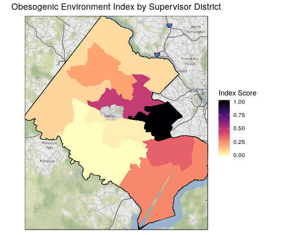

Visualizing Obesogenic Index Factor Analysis
================
Quinton Neville
8/4/2019

1. Data Read and Factor Model
-----------------------------

Here, we read in the necessary data for our specific index, scale, fit the desired *k*-factor model, extract the loadings (variable weights), extract the proportion of total variance explained by each factor/dimension (factor weights), and define which factors load where for our composite index construction.

``` r
#Read data original data for labels
data.orig <- read_csv("./data/working/Obesogenic_final_data/2019_8_04_obesogenic_final.csv") %>%
  mutate(
    geography = ifelse(id_type %in% "census_tract", str_split(geography, ",") %>% map_chr(1), geography)
  )

#Read Data for index construction
obesity.df <- read_rds("./data/working/Obesogenic_final_data/2019_8_04_obesogenic_final_nested.RDS") %>%
  mutate(
    data = map(data,
               ~.x %>%
                 dplyr::select(-c(geography, minority, unmarried, single_parent, limited_english,
                                  low_income, not_enrolled, no_vehicle, long_commute)))
  ) %>% unnest() %>% 
  na.omit() %>% 
  mutate(no_supermarket = 1 - no_supermarket) %>% 
  rename(supermarket = no_supermarket)

#Standardize
obesity.std <- read_rds("./data/working/Obesogenic_final_data/2019_8_04_obesogenic_final_nested.RDS") %>%
  mutate(
    data = map(data,
               ~.x %>%
                 dplyr::select(-c(minority, unmarried, single_parent, limited_english,
                                  low_income, not_enrolled, no_vehicle, long_commute))),
    data = data %>% map(.x = ., ~na.omit(.x) %>%
                          dplyr::select(-geography) %>%
                          mutate_if(is.numeric, function(x) {
                            (x - mean(x))/sd(x)}))
  ) %>% unnest() %>%
  mutate(no_supermarket = 1 - no_supermarket) %>% 
  rename(supermarket = no_supermarket)

#Final Set
final.df <- obesity.std %>%
  dplyr::select(id_type, no_insurance, no_highschool,
                black, poverty, restaurant,
                fast_food, gas_station, supermarket, 
                alcohol, convenience, no_swimming_pool,
                no_team_sport, no_playground)

#Correlation Matrix and FA model
cor.mat  <- final.df %>%   
            filter(id_type %in% "census_tract") %>%
            dplyr::select(-id_type) %>%
            cor()

#Fit correlation model
fact.mod <- fa(r = cor.mat, nfactors = 3, rotate = "varimax", fm = "pa")

#Check loadings
print(fact.mod$loadings, cutoff = 0.3)
```

    ## 
    ## Loadings:
    ##                  PA1    PA2    PA3   
    ## no_insurance             0.931       
    ## no_highschool            0.855       
    ## black                    0.409       
    ## poverty                  0.779       
    ## restaurant        0.857              
    ## fast_food         0.845              
    ## gas_station       0.797              
    ## supermarket       0.738              
    ## alcohol           0.665              
    ## convenience       0.635              
    ## no_swimming_pool -0.311         0.686
    ## no_team_sport                   0.775
    ## no_playground    -0.309         0.683
    ## 
    ##                  PA1   PA2   PA3
    ## SS loadings    3.803 2.633 1.878
    ## Proportion Var 0.293 0.203 0.144
    ## Cumulative Var 0.293 0.495 0.640

``` r
#Extract Cronbach's Alpha  
# Calculate internal consistency
factor1 <- final.df %>% dplyr::select(no_insurance, no_highschool, black, poverty)
factor2 <- final.df %>% dplyr::select(restaurant, fast_food, gas_station,
                                         supermarket, alcohol, convenience)
factor3 <- final.df %>% dplyr::select(no_team_sport, no_swimming_pool, no_playground)

psych::alpha(factor1) # alpha = 0.84 (CI no 80), improves to .91 if black is dropped 
```

    ## 
    ## Reliability analysis   
    ## Call: psych::alpha(x = factor1)
    ## 
    ##   raw_alpha std.alpha G6(smc) average_r S/N   ase    mean   sd median_r
    ##       0.84      0.84    0.84      0.58 5.5 0.015 7.8e-18 0.82     0.55
    ## 
    ##  lower alpha upper     95% confidence boundaries
    ## 0.81 0.84 0.88 
    ## 
    ##  Reliability if an item is dropped:
    ##               raw_alpha std.alpha G6(smc) average_r  S/N alpha se  var.r
    ## no_insurance       0.74      0.74    0.69      0.48  2.8   0.0276 0.0370
    ## no_highschool      0.76      0.76    0.74      0.52  3.3   0.0250 0.0493
    ## black              0.91      0.91    0.88      0.77 10.3   0.0093 0.0048
    ## poverty            0.77      0.77    0.77      0.53  3.4   0.0246 0.0727
    ##               med.r
    ## no_insurance   0.39
    ## no_highschool  0.40
    ## black          0.78
    ## poverty        0.40
    ## 
    ##  Item statistics 
    ##                 n raw.r std.r r.cor r.drop     mean sd
    ## no_insurance  286  0.91  0.91  0.92   0.83  2.8e-17  1
    ## no_highschool 286  0.88  0.88  0.86   0.77 -1.4e-18  1
    ## black         286  0.65  0.65  0.43   0.41 -1.5e-17  1
    ## poverty       286  0.87  0.87  0.82   0.75  1.1e-17  1

``` r
psych::alpha(factor2) # alpha = 0.92 (CI no 80), no improve drop
```

    ## 
    ## Reliability analysis   
    ## Call: psych::alpha(x = factor2)
    ## 
    ##   raw_alpha std.alpha G6(smc) average_r S/N    ase mean   sd median_r
    ##       0.92      0.92    0.92      0.66  12 0.0073 0.17 0.84     0.65
    ## 
    ##  lower alpha upper     95% confidence boundaries
    ## 0.91 0.92 0.94 
    ## 
    ##  Reliability if an item is dropped:
    ##             raw_alpha std.alpha G6(smc) average_r  S/N alpha se  var.r
    ## restaurant       0.89      0.89    0.89      0.62  8.3   0.0103 0.0134
    ## fast_food        0.90      0.90    0.90      0.64  8.8   0.0098 0.0161
    ## gas_station      0.90      0.90    0.89      0.64  9.0   0.0095 0.0160
    ## supermarket      0.91      0.91    0.91      0.67  9.9   0.0087 0.0173
    ## alcohol          0.92      0.92    0.92      0.71 12.1   0.0073 0.0097
    ## convenience      0.92      0.92    0.91      0.70 11.6   0.0075 0.0078
    ##             med.r
    ## restaurant   0.64
    ## fast_food    0.64
    ## gas_station  0.64
    ## supermarket  0.67
    ## alcohol      0.73
    ## convenience  0.69
    ## 
    ##  Item statistics 
    ##               n raw.r std.r r.cor r.drop     mean sd
    ## restaurant  286  0.93  0.93  0.92   0.89  4.9e-17  1
    ## fast_food   286  0.90  0.90  0.88   0.85 -4.0e-17  1
    ## gas_station 286  0.89  0.89  0.87   0.83 -3.3e-17  1
    ## supermarket 286  0.84  0.84  0.80   0.77  1.0e+00  1
    ## alcohol     286  0.76  0.76  0.68   0.65 -2.5e-17  1
    ## convenience 286  0.78  0.78  0.73   0.68 -3.2e-17  1

``` r
psych::alpha(factor3) # alpha = 0.82, no improve drop (CI does contain 80)
```

    ## 
    ## Reliability analysis   
    ## Call: psych::alpha(x = factor3)
    ## 
    ##   raw_alpha std.alpha G6(smc) average_r S/N   ase  mean   sd median_r
    ##       0.82      0.82    0.75       0.6 4.5 0.019 4e-18 0.85     0.61
    ## 
    ##  lower alpha upper     95% confidence boundaries
    ## 0.78 0.82 0.85 
    ## 
    ##  Reliability if an item is dropped:
    ##                  raw_alpha std.alpha G6(smc) average_r S/N alpha se var.r
    ## no_team_sport         0.73      0.73    0.58      0.58 2.7    0.032    NA
    ## no_swimming_pool      0.76      0.76    0.62      0.62 3.2    0.028    NA
    ## no_playground         0.76      0.76    0.61      0.61 3.1    0.029    NA
    ##                  med.r
    ## no_team_sport     0.58
    ## no_swimming_pool  0.62
    ## no_playground     0.61
    ## 
    ##  Item statistics 
    ##                    n raw.r std.r r.cor r.drop     mean sd
    ## no_team_sport    286  0.87  0.87  0.76   0.69 -1.7e-17  1
    ## no_swimming_pool 286  0.85  0.85  0.73   0.66  1.4e-17  1
    ## no_playground    286  0.85  0.85  0.74   0.67  1.3e-17  1

``` r
# Extract loadings and explained proportation
fa.load     <- fact.mod$loadings %>% 
               unclass() %>%
               as_tibble() %>% 
                  mutate(variable = names(final.df %>%
                                          dplyr::select(-id_type))) %>%
               dplyr::select(variable, everything()) %>%
               rename(
                 food     = PA1,
                 ses      = PA2,     #Here you declare names of your factors
                 physical = PA3
               )

fa.prop.var <- fact.mod$Vaccounted %>% unclass() %>% as_tibble() %>% slice(4)

#Declare Which Variables load on which Factors (your input
var.load <- tibble(
  variable = colnames(final.df %>%
                       dplyr::select_if(is.numeric)) %>%
                       str_c(),
  factor  = c(rep("ses", 4), rep("food", 6), rep("physical", 3))
)
```

#### a. Composite Index Construction

Here we build an index construction function, which takes the following inputs: `data` (*final scaled data frame for FA*), `factor.data` (variable~factor data frame with two columns: variable name and factor name), `geo.type` (one of `census_tract, highschool_district, supervisor_district`), `var.weights` (weights for individual variables, default is factor loadings), and `f.weights` (weights for factor aggregation, default is proportion variance explained). The output is a data frame (tibble) with columns `geography`, describing geographic observations (i.e. census tract name, school district name, etc.)), and `factor_scores`, describing the normalized (0 - 1) final index scores for each observation.

``` r
index_construct <- function(data = final.df, factor.data = var.load, geo.type = "census_tract", var.weights = fa.load, f.weights = fa.prop.var) {
  
###Housekeeping####  
  #Check geography
  if( !(geo.type %in% c("census_tract", "highschool_district", "supervisor_district"))) stop("geography not in: c('census_tract', 'highschool_district', 'supervisor_district')")
  #Check weights
  if(nrow(var.weights) != (ncol(data) - 1) | length(f.weights) != length(unique(factor.data$factor))) stop("Variable or Factor weights are incompatible length given the data")  
  #Check data  
  if( any(data %>%
      dplyr::select_if(is.numeric) %>%
      apply(., 2, function(x) {is.na(x) %>% mean()}) != 0)
      ) stop("Missing values in the input data, take care of that please.")  
  #Check Variable Loadings (location)
  if (nrow(var.load) != (ncol(data) - 1)) stop("Variable Loading declaration incompatible length with data")
  
#Filter and Standardize Data
  data <- data %>%
    filter(id_type == geo.type)
  
  
####Create Index####
score.df  <- factor.data %>%
    nest(-factor) %>%
    rename(fa_score = data) %>%
    mutate(
      fa_score = map(.x = fa_score, ~data %>% dplyr::select(.x$variable) %>% as.matrix()),
      weight.vec = map2(.x = fa_score,
                        .y = factor,
                        ~var.weights %>%
                        filter(variable %in% colnames(.x)) %>%
                        dplyr::select(.y) %>%
                        as.matrix()
                        ),
      fa_score = map2(.x = fa_score,
                          .y = weight.vec,
                          ~.x %*% .y) 
    )

#Add to original data
data.orig %>%
      filter(id_type == geo.type) %>%
      na.omit() %>%
      dplyr::select(geography) %>%
      mutate(
       factor_scores = do.call(cbind, score.df$fa_score) %*% t(as.matrix(f.weights)),
       factor_scores = as.vector(factor_scores),
       factor_scores = (factor_scores - min(factor_scores)) /
                       (max(factor_scores) - min(factor_scores))
       ) %>%
       dplyr::select(geography, factor_scores) %>%
  return()
}
```

2. Visualization
----------------

#### a. Shape File for Plotting

Here, the function takes the inputs `data` (an data frame object generated by the `index_construction` function above, see documentation for description of output) and `geo.type`, again, one of `census_tract, highschool_district, supervisor_district`), `var.weights`. The output is a joined shapefile of the desired geographic region joined to the data frame of final normalized factor scores for each geagraphic region's observations, type specific.

``` r
#Collect Objects for plotting

index_shp <- function(data = census.df, geo.type = "census_tract") {
  
  ####Housekeeping
  if (names(data) != c("geography", "factor_scores")) stop("Input data wrong format: require data frame with columns geography, factor_scores")
  if ( !(geo.type %in% c("census_tract", "highschool_district", "supervisor_district"))) stop("geo.type not one of 'census_tract', 'highschool_district', 'supervisor_district'")
  
  if (geo.type %in% "census_tract") {
    #Join data by blockgroup identifier in shapefile
    data <- left_join(data, 
                      read_csv("./data/working/ACS_final_index/index.csv") %>% 
                      mutate(Geography = str_split(Geography, ",") %>% 
                         map_chr(1)) %>% 
                      rename(geography = Geography, geoid = Id2),
                      by = "geography")
    #Merge with census tract shapefile
    merge(tracts(state = "51", county = c("059")),
          data,
          by.x = "GEOID",
          by.y = "geoid") %>%
      return()
  } else if (geo.type %in% "highschool_district") {
    
    merge(readOGR("./data/original/Fairfax_Geographies/High_School_Attendance_Areas/High_School_Attendance_Areas.shp"),
          data,
          by.x = "SCHOOL_NAM",
          by.y = "geography") %>%
      return()
    
  } else {
    
    merge(readOGR("./data/original/Fairfax_Geographies/Supervisor_Districts/Supervisor_Districts.shp"),
          data,
          by.x = "DISTRICT",
          by.y = "geography") %>%
      return()
    
  }
  
}
```

#### b. ggplot Construction

First we recall the function for generating the base fairfax map `ggplot2` object.

``` r
#Base Map Function
fairfax.gg <- function() {
  fairfax.box <- getbb("fairfax county")
  fairfax.boundary <- getbb("fairfax county", format_out = "polygon") %>%
    as_tibble() %>%
    rename(longitude = `V1`, latitude = `V2`)
  
  #Grab the map info (many varieties)
  fairfax.map <- get_map(location = fairfax.box, source="stamen", maptype="watercolor", crop = TRUE)
  
  #ggmap and ggplot map and boundary
  ff.map <- ggmap(fairfax.map) +
    geom_polygon(data = fairfax.boundary, aes(x = longitude, y = latitude), colour = "black", size = 1, alpha = 0.1) +
    theme(axis.text = element_blank(),
          axis.ticks=element_blank(),
          axis.title.x=element_blank(),
          axis.title.y=element_blank())
  return(ff.map)
}

ffx.gg <- fairfax.gg()
```

Now, we create a function to plot the final index output onto a map of fairfax county, coloured by risk level (dark - high), by specified geographic unit. Inputs to the function consist of a `geo.shp` spatial polygon generated from the `index_construction` and then `index_shp` functions above, basically an object outputted by `index_shp` which requires the output of `index_construction` (see above); `geo.type` a string defining the geographic unit (i.e. "Census Tract"); and `index.name` a character string defining the Index that this plot describes.

``` r
plot_index <- function(geo.shp    = census.df, 
                       geo.type   = "Census Tract",
                       index.name = "Obesogenic Environment") {
  
  geo.shp@data <- geo.shp@data %>% mutate(id = row.names(.))
  shp.df <- broom::tidy(geo.shp, region = "id")
  shp.df <- shp.df %>% left_join(geo.shp@data, by = c("id"="id"))
    #GG object to return
    ffx.gg +
    geom_polygon(data = shp.df, aes(x = long, y = lat, fill = factor_scores, group = group)) +
    labs(
      title = sprintf("%s Index by %s", index.name, geo.type)
    ) +
    scale_fill_viridis_c("Index Score", option = "magma", direction = -1)
    
}
```

3. Results
----------

Here, we generate the final results and subsequent visualizations. The user must define the weights (default loadings/prop. variance), where variables load, and to what unit of geography index construction is to occur.

    ## [[1]]


    ## 
    ## [[2]]


    ## 
    ## [[3]]



Save figures for use later.
