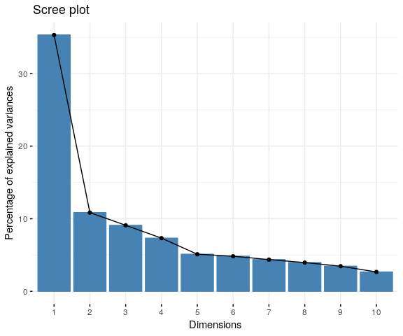
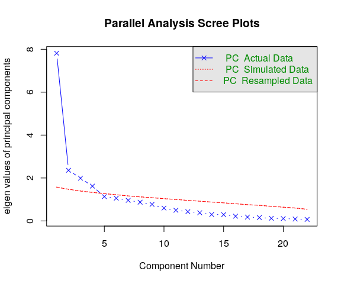
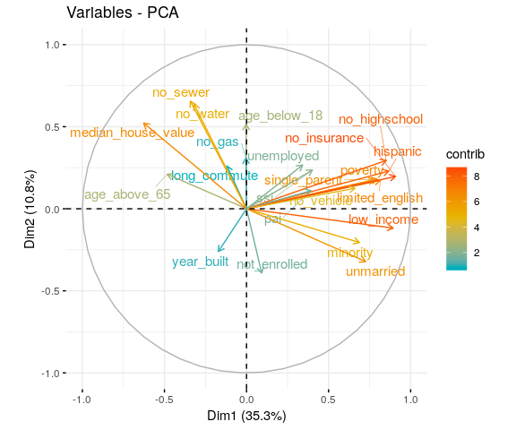
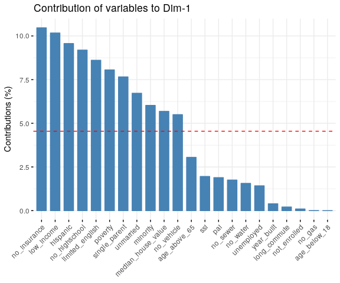
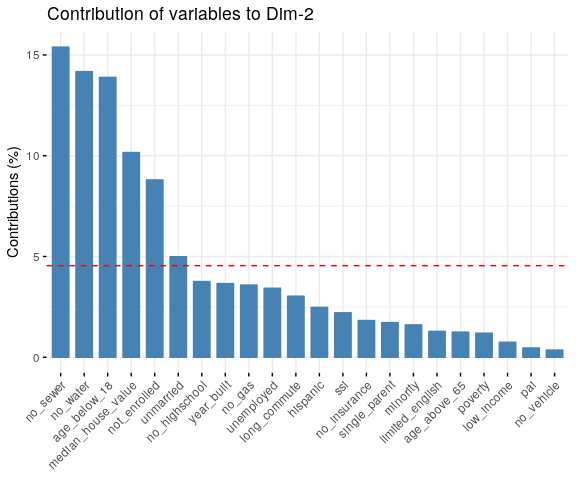

Economic Vulerability variables PCA
================
Cong Cong
7/18/2019

PCA on ACS data based on Census Tract
=====================================

``` r
data <- read.csv("./data/working/ACS_final_index_2/07_22_2019_joined_acs_final.csv") %>% select (-c(Geography,X)) %>% na.omit()

#PCA with standadization
pr.data <- PCA(data, scale.unit = TRUE, graph = FALSE)
```

Identify Dimensions
-------------------

### Number of principle components

One way to determine the number of factors or components in a data matrix is to examine the scree plot of the successive eigenvalues. Sharp breaks in the plot suggest the appropriate number of components or factors to extract. The scree plot below shows ~35% of the variances contained in the data are retained by the first principal component. The elbow is between the first and the second dimensions.

``` r
fviz_screeplot(pr.data, ncp=10)
```



Parallel analyis compares the scree of factors of the observed data with that of a random data matrix of the same size as the original. The parallel analysis for this dataset indicates that four components should be retained. There are two ways to tell this; (1) four of the eigenvalues in the actual data are greater than the simulated/resampled data, and (2) the dashed line for parallel analysis in the graph crosses the blue line before reaching the fifth component.

``` r
psych::fa.parallel(data,fa="pc")
```



    ## Parallel analysis suggests that the number of factors =  NA  and the number of components =  4

### Variances explained by the principal components

The proportion of variances retained by the principal components can be extracted as follows. ~63% of variance is explained by the first four pricipal components.

``` r
eigenvalues <- pr.data$eig
head(eigenvalues)
```

    ##        eigenvalue percentage of variance cumulative percentage of variance
    ## comp 1   7.816081              35.527642                          35.52764
    ## comp 2   2.359962              10.727098                          46.25474
    ## comp 3   1.990373               9.047151                          55.30189
    ## comp 4   1.620546               7.366116                          62.66801
    ## comp 5   1.130101               5.136825                          67.80483
    ## comp 6   1.057150               4.805228                          72.61006

Dimension description
---------------------

### Variables related with the principal components

The variables can be plotted as points in the component space using their loadings (correlation between a variable and a PC) as coordinates.

``` r
pr.data$var$coord
```

    ##                          Dim.1       Dim.2        Dim.3        Dim.4
    ## age_below_18       -0.00232260  0.57253546 -0.595110621 -0.341160563
    ## age_above_65       -0.48843934  0.17174493  0.680661117 -0.223927081
    ## no_highschool       0.84764681  0.29785016  0.135669353 -0.136049021
    ## minority            0.68631245 -0.19477448 -0.358571954  0.210557656
    ## hispanic            0.86471301  0.24179380  0.051337056 -0.098038949
    ## unmarried           0.72487145 -0.34312725  0.174992809  0.295467292
    ## single_parent       0.77367265  0.20153896 -0.137938097 -0.002483437
    ## limited_english     0.82035012  0.17417486  0.063757748 -0.108101366
    ## low_income          0.89161297 -0.13266800  0.072225830  0.170755715
    ## poverty             0.79354916  0.16797443  0.138304713  0.093407517
    ## ssi                 0.39114554  0.22827479  0.178931066 -0.068423278
    ## pai                 0.38441991  0.10441755 -0.008209724 -0.189420997
    ## no_insurance        0.90449930  0.20749645 -0.006652650  0.009835153
    ## unemployed          0.33349354  0.28438025 -0.145141384  0.197735151
    ## not_enrolled        0.08707874 -0.45574714  0.674480691  0.094923509
    ## no_vehicle          0.65548168  0.09215723  0.371938899 -0.012564273
    ## long_commute       -0.12841915  0.26742314  0.006978075  0.087461131
    ## no_water           -0.34957381  0.57835474  0.252478996  0.542947263
    ## no_sewer           -0.37010193  0.60265769  0.210209797  0.478795354
    ## no_gas             -0.02059148  0.29084641  0.003128764  0.452169821
    ## year_built         -0.17549848 -0.29376682 -0.429737485  0.623475569
    ## median_house_value -0.66657795  0.48970510  0.078224219 -0.175752301
    ##                             Dim.5
    ## age_below_18        0.07607534585
    ## age_above_65        0.00003079321
    ## no_highschool      -0.01277736566
    ## minority            0.29494051267
    ## hispanic           -0.09775930714
    ## unmarried          -0.15445063215
    ## single_parent      -0.03509107218
    ## limited_english     0.06998761537
    ## low_income         -0.01175010507
    ## poverty            -0.00402424860
    ## ssi                 0.31570258373
    ## pai                 0.36697879214
    ## no_insurance       -0.00375451030
    ## unemployed         -0.45438264393
    ## not_enrolled        0.16226797472
    ## no_vehicle          0.07873073326
    ## long_commute        0.53844125987
    ## no_water            0.11247090637
    ## no_sewer            0.08044006588
    ## no_gas             -0.35229397303
    ## year_built          0.30157286545
    ## median_house_value  0.00444795089

Correlation circle projects the features/variables of the data into the space of the first two dimensions. The angle shows how the variables are related as well as their directions relative to the first two dimensions

``` r
fviz_pca_var(pr.data,
             col.var = "contrib",
             gradient.cols = c("#00AFBB", "#E7B800", "#FC4E07"),
             repel = TRUE)
```



The following four variables are strongly related with Dimension 1:
- percentage of households with no health insurance coverage (no\_hicov\_pct)
- percentage of population with lower-than-median income (low\_income)
- percentage of Hispanic population (hispanic\_pct)
- percentage of population with no highschool diploma (no\_highschool) - percentage of households with limited English ability (limited\_english)

``` r
pr.desc <- dimdesc(pr.data, axes = c(1,2))
pr.desc$Dim.1
```

    ## $quanti
    ##                    correlation      p.value
    ## no_insurance         0.9044993 3.000750e-95
    ## low_income           0.8916130 1.091952e-88
    ## hispanic             0.8647130 2.504577e-77
    ## no_highschool        0.8476468 2.542203e-71
    ## limited_english      0.8203501 4.200447e-63
    ## poverty              0.7935492 2.722754e-56
    ## single_parent        0.7736726 7.345766e-52
    ## unmarried            0.7248714 1.126831e-42
    ## minority             0.6863124 1.035713e-36
    ## no_vehicle           0.6554817 1.429656e-32
    ## ssi                  0.3911455 1.030651e-10
    ## pai                  0.3844199 2.271155e-10
    ## unemployed           0.3334935 5.166460e-08
    ## long_commute        -0.1284192 4.085046e-02
    ## year_built          -0.1754985 5.031779e-03
    ## no_water            -0.3495738 1.031517e-08
    ## no_sewer            -0.3701019 1.151399e-09
    ## age_above_65        -0.4884393 1.235563e-16
    ## median_house_value  -0.6665779 5.274233e-34

The following four variables are strongly related with Dimension2:
- proportion of housing with no sewer available (no\_sewer) - proportion of housing with no water available (no\_water) - proportion of people aged &lt; 18 (age\_below\_18) - median house value weighted by number of units (median\_house\_value)
- percentage of population with no highschool diploma (no\_highschool)

``` r
pr.desc$Dim.2
```

    ## $quanti
    ##                    correlation      p.value
    ## no_sewer             0.6026577 1.669144e-26
    ## no_water             0.5783547 4.491675e-24
    ## age_below_18         0.5725355 1.601902e-23
    ## median_house_value   0.4897051 1.003980e-16
    ## no_highschool        0.2978502 1.340242e-06
    ## no_gas               0.2908464 2.419659e-06
    ## unemployed           0.2843802 4.117535e-06
    ## long_commute         0.2674231 1.560727e-05
    ## hispanic             0.2417938 9.923082e-05
    ## ssi                  0.2282748 2.437737e-04
    ## no_insurance         0.2074964 8.781154e-04
    ## single_parent        0.2015390 1.240675e-03
    ## limited_english      0.1741749 5.377482e-03
    ## age_above_65         0.1717449 6.068045e-03
    ## poverty              0.1679744 7.297438e-03
    ## low_income          -0.1326680 3.457500e-02
    ## minority            -0.1947745 1.815850e-03
    ## year_built          -0.2937668 1.894941e-06
    ## unmarried           -0.3431273 1.989594e-08
    ## not_enrolled        -0.4557471 1.974736e-14

### Contributions of variables to the principal components

The color (or the length if the vectors) on the correlation circle shows the contribution of variable to the principal components. The amount of contributions can also be extracted as follows.

``` r
pr.data$var$contrib
```

    ##                             Dim.1      Dim.2         Dim.3         Dim.4
    ## age_below_18        0.00006901761 13.8899231 17.7934787451  7.1821820319
    ## age_above_65        3.05233510004  1.2498645 23.2770181080  3.0942257841
    ## no_highschool       9.19265171201  3.7591593  0.9247598570  1.1421669939
    ## minority            6.02635469950  1.6075304  6.4597854956  2.7357779027
    ## hispanic            9.56654077389  2.4773387  0.1324120109  0.5931111048
    ## unmarried           6.72253276898  4.9889079  1.5385296387  5.3871316333
    ## single_parent       7.65817745495  1.7211277  0.9559472314  0.0003805791
    ## limited_english     8.61012462463  1.2854821  0.2042355783  0.7211093546
    ## low_income         10.17100089233  0.7458087  0.2620900556  1.7992406793
    ## poverty             8.05672630102  1.1955876  0.9610354720  0.5383967424
    ## ssi                 1.95743665343  2.2080606  1.6085588719  0.2888993209
    ## pai                 1.89070027409  0.4620001  0.0033862777  2.2140886141
    ## no_insurance       10.46712501901  1.8243846  0.0022235903  0.0059689925
    ## unemployed          1.42293742523  3.4268407  1.0583954855  2.4127177783
    ## not_enrolled        0.09701417708  8.8012219 22.8562250589  0.5560147742
    ## no_vehicle          5.49707998492  0.3598768  6.9503818306  0.0097412229
    ## long_commute        0.21099420759  3.0303517  0.0024464522  0.4720292845
    ## no_water            1.56346702661 14.1737139  3.2026978737 18.1908947093
    ## no_sewer            1.75248233136 15.3899237  2.2200940260 14.1461617674
    ## no_gas              0.00542482848  3.5844495  0.0004918255 12.6165876971
    ## year_built          0.39405573466  3.6567944  9.2783753194 23.9870944306
    ## median_house_value  5.68476899259 10.1616521  0.3074311958  1.9060786022
    ##                                Dim.5
    ## age_below_18        0.51211849260421
    ## age_above_65        0.00000008390592
    ## no_highschool       0.01444658625728
    ## minority            7.69753104883419
    ## hispanic            0.84566589752560
    ## unmarried           2.11087233485480
    ## single_parent       0.10896220006561
    ## limited_english     0.43343600076536
    ## low_income          0.01221704259271
    ## poverty             0.00143301980243
    ## ssi                 8.81939634174648
    ## pai                11.91693365655329
    ## no_insurance        0.00124735246300
    ## unemployed         18.26947452890549
    ## not_enrolled        2.32995867995736
    ## no_vehicle          0.54849311479335
    ## long_commute       25.65424578482087
    ## no_water            1.11934245888315
    ## no_sewer            0.57256846236435
    ## no_gas             10.98229270611206
    ## year_built          8.04761354318369
    ## median_house_value  0.00175066300888

If the contribution of the variables were uniform, the expected value would be 1/length(variables) = 1/22 = 4.5%.The red dashed line on the graph below indicates the expected average contribution. A variable with a contribution larger than this cutoff could be considered as important in contributing to the component.

``` r
fviz_pca_contrib(pr.data, choice = "var", axes = 1)
```

    ## Warning in fviz_pca_contrib(pr.data, choice = "var", axes = 1): The
    ## function fviz_pca_contrib() is deprecated. Please use the function
    ## fviz_contrib() which can handle outputs of PCA, CA and MCA functions.



``` r
fviz_pca_contrib(pr.data, choice = "var", axes = 2)
```

    ## Warning in fviz_pca_contrib(pr.data, choice = "var", axes = 2): The
    ## function fviz_pca_contrib() is deprecated. Please use the function
    ## fviz_contrib() which can handle outputs of PCA, CA and MCA functions.



Conclusions
-----------

There are four principal components in the dataset of ACS variables on census tract. These components explains ~63% of the total variance. The first component is best represented by economic and social status of the population including health insurance coverage, income, Hispanic population, limited English ability. The second component is best represented by housing conditions including water and sewer availability and median house value.

PCA on ACS data based on High School District
=============================================

PCA on ACS data based on Supervisor District
============================================
