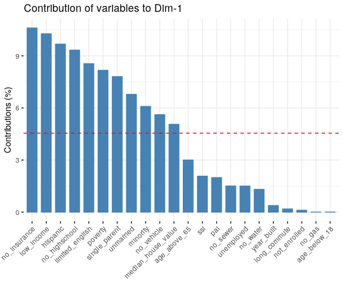

Economic Vulerability variables PCA
================
Cong Cong
7/18/2019

PCA on ACS data based on Census Tract
=====================================

``` r
data <- read.csv("./data/working/ACS_final_index_2/07_22_2019_joined_acs_final.csv") %>% select (-c(Geography,id_type)) %>% na.omit()

#PCA with standadization
pr.data <- PCA(data, scale.unit = TRUE, graph = FALSE)
```

Identify Dimensions
-------------------

### Number of principle components

One way to determine the number of factors or components in a data matrix is to examine the scree plot of the successive eigenvalues. Sharp breaks in the plot suggest the appropriate number of components or factors to extract. The scree plot below shows ~35% of the variances contained in the data are retained by the first principal component. The elbow is between the first and the second dimensions.

``` r
fviz_screeplot(pr.data, ncp=10)
```


Parallel analyis compares the scree of factors of the observed data with that of a random data matrix of the same size as the original. The parallel analysis for this dataset indicates that four components should be retained. There are two ways to tell this; (1) four of the eigenvalues in the actual data are greater than the simulated/resampled data, and (2) the dashed line for parallel analysis in the graph crosses the blue line before reaching the fifth component.

``` r
psych::fa.parallel(data)
```


    ## Parallel analysis suggests that the number of factors =  4  and the number of components =  4

### Variances explained by the principal components

The proportion of variances retained by the principal components can be extracted as follows. ~63% of variance is explained by the first four pricipal components.

``` r
eigenvalues <- pr.data$eig
eigenvalues
```

    ##         eigenvalue percentage of variance
    ## comp 1  7.77036268             35.3198304
    ## comp 2  2.38604136             10.8456426
    ## comp 3  2.00022812              9.0919460
    ## comp 4  1.61073585              7.3215266
    ## comp 5  1.12357608              5.1071640
    ## comp 6  1.06283389              4.8310631
    ## comp 7  0.96078352              4.3671978
    ## comp 8  0.87091377              3.9586990
    ## comp 9  0.76096529              3.4589332
    ## comp 10 0.58671094              2.6668679
    ## comp 11 0.49462067              2.2482758
    ## comp 12 0.43403169              1.9728713
    ## comp 13 0.38103509              1.7319777
    ## comp 14 0.30376706              1.3807593
    ## comp 15 0.28962383              1.3164720
    ## comp 16 0.23884958              1.0856799
    ## comp 17 0.17769549              0.8077068
    ## comp 18 0.15345847              0.6975385
    ## comp 19 0.12436724              0.5653056
    ## comp 20 0.11240202              0.5109183
    ## comp 21 0.08566614              0.3893915
    ## comp 22 0.07133122              0.3242328
    ##         cumulative percentage of variance
    ## comp 1                           35.31983
    ## comp 2                           46.16547
    ## comp 3                           55.25742
    ## comp 4                           62.57895
    ## comp 5                           67.68611
    ## comp 6                           72.51717
    ## comp 7                           76.88437
    ## comp 8                           80.84307
    ## comp 9                           84.30200
    ## comp 10                          86.96887
    ## comp 11                          89.21715
    ## comp 12                          91.19002
    ## comp 13                          92.92200
    ## comp 14                          94.30275
    ## comp 15                          95.61923
    ## comp 16                          96.70491
    ## comp 17                          97.51261
    ## comp 18                          98.21015
    ## comp 19                          98.77546
    ## comp 20                          99.28638
    ## comp 21                          99.67577
    ## comp 22                         100.00000

Dimension description
---------------------

### Variables related with the principal components

The variables can be plotted as points in the component space using their loadings (correlation between a variable and a PC) as coordinates.

``` r
pr.data$var$coord
```

    ##                           Dim.1      Dim.2        Dim.3        Dim.4
    ## age_below_18       -0.002468485  0.5149903 -0.651945210 -0.324101526
    ## age_above_65       -0.482850441  0.2101758  0.648259789 -0.273677738
    ## no_highschool       0.851480380  0.2944983  0.103040654 -0.150262690
    ## minority            0.687736110 -0.2054766 -0.326329720  0.234137050
    ## hispanic            0.867000324  0.2294108  0.031276847 -0.103984825
    ## unmarried           0.725976767 -0.3217630  0.213922159  0.292333964
    ## single_parent       0.778811507  0.1769330 -0.156700750 -0.009776213
    ## limited_english     0.815066700  0.1723429  0.046555589 -0.116835549
    ## low_income          0.893351280 -0.1176428  0.089305313  0.169394102
    ## poverty             0.796641321  0.1796366  0.136059633  0.085145801
    ## ssi                 0.401432343  0.2357584  0.153303442 -0.108833455
    ## pai                 0.393030089  0.1102697 -0.018639193 -0.197966037
    ## no_insurance        0.907704470  0.1966807 -0.017824838  0.003820961
    ## unemployed          0.341773151  0.2662623 -0.166776630  0.173112082
    ## not_enrolled        0.092432965 -0.3916200  0.714103906  0.087510919
    ## no_vehicle          0.660544371  0.1248841  0.367523467 -0.035015355
    ## long_commute       -0.119269053  0.2604372 -0.036294233  0.057874618
    ## no_water           -0.319314545  0.6363844  0.250691694  0.505552990
    ## no_sewer           -0.342035086  0.6554127  0.207305100  0.445387243
    ## no_gas             -0.003626693  0.3092319  0.005511776  0.432424715
    ## median_house_value -0.626942834  0.5218603  0.068851381 -0.169230424
    ## year_built         -0.171523992 -0.2603878 -0.359146052  0.666781950
    ##                           Dim.5
    ## age_below_18        0.066738558
    ## age_above_65       -0.006778907
    ## no_highschool      -0.013551405
    ## minority            0.295778606
    ## hispanic           -0.100445793
    ## unmarried          -0.146543230
    ## single_parent      -0.041816674
    ## limited_english     0.075461596
    ## low_income         -0.004936317
    ## poverty            -0.004446030
    ## ssi                 0.295929486
    ## pai                 0.357357298
    ## no_insurance       -0.005300210
    ## unemployed         -0.460619499
    ## not_enrolled        0.160362000
    ## no_vehicle          0.076547266
    ## long_commute        0.528650361
    ## no_water            0.109791371
    ## no_sewer            0.078784991
    ## no_gas             -0.375127715
    ## median_house_value  0.013437208
    ## year_built          0.307684600

Correlation circle projects the features/variables of the data into the space of the first two dimensions. The angle shows how the variables are related as well as their directions relative to the first two dimensions

``` r
fviz_pca_var(pr.data,
             col.var = "contrib",
             gradient.cols = c("#00AFBB", "#E7B800", "#FC4E07"),
             repel = TRUE)
```


The following four variables are strongly related with Dimension 1:
- percentage of households with no health insurance coverage (no\_hicov\_pct)
- percentage of population with lower-than-median income (low\_income)
- percentage of Hispanic population (hispanic\_pct)
- percentage of population with no highschool diploma (no\_highschool) - percentage of households with limited English ability (limited\_english)

``` r
pr.desc <- dimdesc(pr.data, axes = c(1,2,3,4))
pr.desc$Dim.4
```

    ## $quanti
    ##                    correlation      p.value
    ## year_built           0.6667819 2.849862e-38
    ## no_water             0.5055530 5.009795e-20
    ## no_sewer             0.4453872 2.166653e-15
    ## no_gas               0.4324247 1.661327e-14
    ## unmarried            0.2923340 4.621537e-07
    ## minority             0.2341370 6.200898e-05
    ## unemployed           0.1731121 3.259413e-03
    ## low_income           0.1693941 4.001779e-03
    ## limited_english     -0.1168355 4.798976e-02
    ## no_highschool       -0.1502627 1.080353e-02
    ## median_house_value  -0.1692304 4.037719e-03
    ## pai                 -0.1979660 7.447292e-04
    ## age_above_65        -0.2736777 2.522298e-06
    ## age_below_18        -0.3241015 1.919949e-08

The following four variables are strongly related with Dimension2:
- proportion of housing with no sewer available (no\_sewer) - proportion of housing with no water available (no\_water) - proportion of people aged &lt; 18 (age\_below\_18) - median house value weighted by number of units (median\_house\_value)
- percentage of population with no highschool diploma (no\_highschool)

``` r
pr.desc$Dim.3
```

    ## $quanti
    ##               correlation      p.value
    ## not_enrolled    0.7141039 4.774168e-46
    ## age_above_65    0.6482598 1.327759e-35
    ## no_vehicle      0.3675235 1.315782e-10
    ## no_water        0.2506917 1.729144e-05
    ## unmarried       0.2139222 2.616239e-04
    ## no_sewer        0.2073051 4.075842e-04
    ## ssi             0.1533034 9.290245e-03
    ## poverty         0.1360596 2.112913e-02
    ## single_parent  -0.1567007 7.824668e-03
    ## unemployed     -0.1667766 4.612609e-03
    ## minority       -0.3263297 1.514210e-08
    ## year_built     -0.3591461 3.654048e-10
    ## age_below_18   -0.6519452 4.046371e-36

### Contributions of variables to the principal components

The color (or the length if the vectors) on the correlation circle shows the contribution of variable to the principal components. The amount of contributions can also be extracted as follows.

``` r
pr.data$var$contrib
```

    ##                             Dim.1      Dim.2       Dim.3         Dim.4
    ## age_below_18        0.00007841872 11.1152714 21.24920418  6.5213547456
    ## age_above_65        3.00043328716  1.8513448 21.00964139  4.6500178359
    ## no_highschool       9.33056623511  3.6348592  0.53080827  1.4017739863
    ## minority            6.08698688633  1.7694848  5.32394707  3.4034232300
    ## hispanic            9.67380279723  2.2057160  0.04890648  0.6712983879
    ## unmarried           6.78272416004  4.3390446  2.28787355  5.3055965971
    ## single_parent       7.80590801970  1.3120184  1.22761622  0.0059335825
    ## limited_english     8.54958453385  1.2448271  0.10835878  0.8474726356
    ## low_income         10.27077552603  0.5800331  0.39872647  1.7814442805
    ## poverty             8.16741019159  1.3524196  0.92550562  0.4500928793
    ## ssi                 2.07387908305  2.3294660  1.17496326  0.7353608572
    ## pai                 1.98797221214  0.5096056  0.01736899  2.4330837250
    ## no_insurance       10.60346137363  1.6212330  0.01588443  0.0009064021
    ## unemployed          1.50326170942  2.9712644  1.39056361  1.8605032582
    ## not_enrolled        0.10995436603  6.4276431 25.49431159  0.4754448639
    ## no_vehicle          5.61516731536  0.6536363  6.75290471  0.0761189424
    ## long_commute        0.18306876539  2.8426814  0.06585606  0.2079466619
    ## no_water            1.31218815134 16.9730991  3.14195791 15.8675195252
    ## no_sewer            1.50556679421 18.0032867  2.14852517 12.3154765584
    ## no_gas              0.00016927016  4.0076572  0.00151881 11.6090502550
    ## median_house_value  5.05841662051 11.4138069  0.23699860  1.7780032970
    ## year_built          0.37862428298  2.8416014  6.44855881 27.6021774930
    ##                           Dim.5
    ## age_below_18        0.396415983
    ## age_above_65        0.004089939
    ## no_highschool       0.016344295
    ## minority            7.786298219
    ## hispanic            0.897968326
    ## unmarried           1.911300776
    ## single_parent       0.155631138
    ## limited_english     0.506815035
    ## low_income          0.002168720
    ## poverty             0.001759310
    ## ssi                 7.794243982
    ## pai                11.365873736
    ## no_insurance        0.002500251
    ## unemployed         18.883485226
    ## not_enrolled        2.288760996
    ## no_vehicle          0.521503092
    ## long_commute       24.873367250
    ## no_water            1.072837478
    ## no_sewer            0.552439204
    ## no_gas             12.524367982
    ## median_house_value  0.016069989
    ## year_built          8.425759072

If the contribution of the variables were uniform, the expected value would be 1/length(variables) = 1/22 = 4.5%.The red dashed line on the graph below indicates the expected average contribution. A variable with a contribution larger than this cutoff could be considered as important in contributing to the component.

``` r
fviz_pca_contrib(pr.data, choice = "var", axes = 1)
```

    ## Warning in fviz_pca_contrib(pr.data, choice = "var", axes = 1): The
    ## function fviz_pca_contrib() is deprecated. Please use the function
    ## fviz_contrib() which can handle outputs of PCA, CA and MCA functions.



``` r
fviz_pca_contrib(pr.data, choice = "var", axes = 2)
```

    ## Warning in fviz_pca_contrib(pr.data, choice = "var", axes = 2): The
    ## function fviz_pca_contrib() is deprecated. Please use the function
    ## fviz_contrib() which can handle outputs of PCA, CA and MCA functions.


Conclusions
-----------

There are four principal components in the dataset of ACS variables on census tract. These components explains ~63% of the total variance. The first component is best represented by economic and social status of the population including health insurance coverage, income, Hispanic population, limited English ability. The second component is best represented by housing conditions including water and sewer availability and median house value.

PCA on ACS data based on High School District
=============================================

PCA on ACS data based on Supervisor District
============================================
