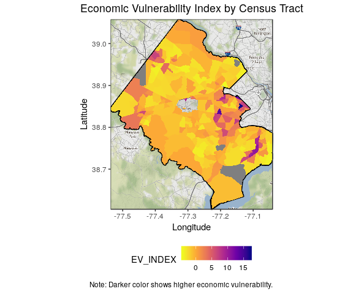

Economic Vulerability Index Map
================
Cong Cong
7/23/2019

``` r
# Installation Libraries if needed

# Libraries
library(psych)
library(tidyverse)
library(stringr)
library(ggplot2)
library(ggmap)
library(sf)
library(rgdal)
library(tigris)
library(osmdata)
library(data.table)

# Setting root directory
knitr::opts_knit$set(echo = TRUE,
                     root.dir = rprojroot::find_rstudio_root_file())

# Controlling figure output in markdown
knitr::opts_chunk$set(
  #  fig.height =   
  fig.width = 6,
  #  fig.asp = .5,
  out.width = "90%",
  #  out.height = 
  cache = FALSE
)
# Set Theme for ggplot2
theme_set(theme_bw() + theme(plot.title = element_text(hjust = 0.5), legend.position = "bottom"))
# Set Scientific notation output for knitr
options(scipen = 999999)
```

``` r
#Base Map Function
fairfax.gg <- function() {
  fairfax.box <- getbb("fairfax county")
  fairfax.boundary <- getbb("fairfax county", format_out = "polygon") %>%
    as.tibble() %>%
    rename(longitude = `V1`, latitude = `V2`)
  
  #Grab the map info (many varieties)
  fairfax.map <- get_map(location = fairfax.box, source="stamen", maptype="watercolor", crop = TRUE)
  
  #ggmap and ggplot map and boundary
  ff.map <- ggmap(fairfax.map) +
    geom_polygon(data = fairfax.boundary, aes(x = longitude, y = latitude), colour = "black", size = 1, alpha = 0.1) +
    labs(
      x = "Longitude",
      y = "Latitude"
    )
  return(ff.map)
}
```

Factor Analysis
---------------

``` r
# Read in data
data <- read.csv("./data/working/ACS_final_index_2/07_22_2019_joined_acs_final.csv") %>% select (-c(Geography,X)) %>% na.omit()
any(is.na(data))
```

    ## [1] FALSE

``` r
# Center and standardize
datastd <- data.frame(scale(data, center = TRUE, scale = TRUE))

# Prepare correlation matrix
cormat <- cor(datastd)

# Selected model
fact3 <- fa(r = cormat, nfactors = 2, rotate = "varimax", fm = "pa")

# Two principal components
factor1 <- datastd %>% select(no_insurance, no_highschool, hispanic, limited_english, poverty, single_parent, no_vehicle)
factor2 <- datastd %>% select(median_house_value, no_sewer, no_water)
```

Calculate Economic Vulnerability Index
--------------------------------------

``` r
# Extract loadings
loadings <- data.frame(unclass(fact3$loadings)) 

# Create the economic vulnerability index dataset
df <- read.csv("./data/working/ACS_final_index_2/07_22_2019_joined_acs_final.csv") %>% na.omit() %>% select (c(Geography)) 

df$PA1 <- factor1$no_insurance * loadings["no_insurance","PA1"] +
  factor1$no_highschool * loadings["no_highschool","PA1"] +
  factor1$hispanic * loadings["hispanic","PA1"] +
  factor1$limited_english * loadings["limited_english","PA1"] +
  factor1$poverty * loadings["poverty","PA1"] +
  factor1$single_parent * loadings["single_parent","PA1"] + 
  factor1$no_vehicle * loadings["no_vehicle","PA1"]
df$PA2 <- factor2$median_house_value * loadings["median_house_value","PA2"] +
  factor2$no_sewer * loadings["no_sewer","PA2"] + 
  factor2$no_water * loadings["no_water","PA2"]
df$EV_INDEX <- df$PA1 + df$PA2
head(df)
```

    ##                                        Geography       PA1        PA2
    ## 1    Census Tract 4151, Fairfax County, Virginia -2.012080 -0.0368337
    ## 2    Census Tract 4152, Fairfax County, Virginia -2.718547 -1.4041934
    ## 3    Census Tract 4153, Fairfax County, Virginia  2.499514 -0.7201983
    ## 4 Census Tract 4154.01, Fairfax County, Virginia  7.556317 -0.1280530
    ## 5 Census Tract 4154.02, Fairfax County, Virginia -1.719321  0.2334382
    ## 6    Census Tract 4155, Fairfax County, Virginia  1.767998 -0.2204577
    ##    EV_INDEX
    ## 1 -2.048914
    ## 2 -4.122740
    ## 3  1.779315
    ## 4  7.428264
    ## 5 -1.485883
    ## 6  1.547540

Plot by Census Tracts
---------------------

``` r
# Retrieve geography name
id <- read.csv("./data/working/ACS_final_index_2/index.csv")
df <- merge(df,id,by.x = "Geography",by.y = "Geography")
# Join by GEOID
tracts <- tracts(state = '51', county = c('059'))
tracts <- merge(tracts, df, by.x="GEOID",by.y="Id2",all.x=TRUE)#"+proj=longlat +datum=NAD83 +no_defs +ellps=GRS80 +towgs84=0,0,0"
# Transform and plot
tracts@data <- tracts@data %>% mutate(id = row.names(.))
shp_df <- broom::tidy(tracts,region = "id")
shp_df <- shp_df %>% left_join(tracts@data, by = c("id"="id"))
fairfax.gg() + 
  geom_polygon(data=shp_df, aes(x = long, y = lat, fill = EV_INDEX, group = group))+
  ggtitle(label = "Economic Vulnerability Index by Census Tracts")+
  scale_fill_viridis_c(option = "plasma",direction = -1) +
  labs(caption = "Note: Darker color shows higher economic vulnerability.")
```



Plot by Highschool Districts

``` r
# Read the geography
#school_shp <- readOGR("./data/original/Fairfax_Geographies/High_School_Attendance_Areas/High_School_Attendance_Areas.shp")
```
