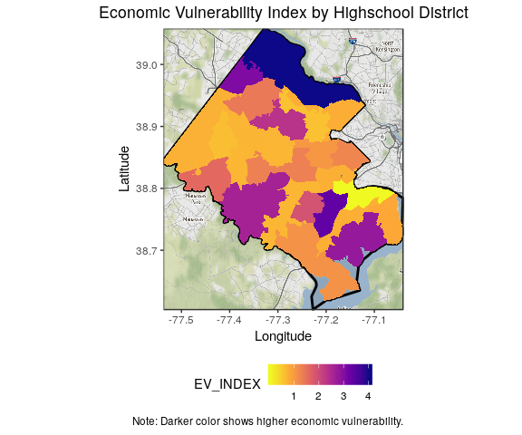

Economic Vulerability Index Map
================
Cong Cong
7/23/2019

``` r
#Base Map Function
fairfax.gg <- function() {
  fairfax.box <- getbb("fairfax county")
  fairfax.boundary <- getbb("fairfax county", format_out = "polygon") %>%
    as.tibble() %>%
    rename(longitude = `V1`, latitude = `V2`)
  
  #Grab the map info (many varieties)
  fairfax.map <- get_map(location = fairfax.box, source="stamen", maptype="watercolor", crop = TRUE)
  
  #ggmap and ggplot map and boundary
  ff.map <- ggmap(fairfax.map) +
    geom_polygon(data = fairfax.boundary, aes(x = longitude, y = latitude), colour = "black", size = 1, alpha = 0.1) +
    labs(
      x = "Longitude",
      y = "Latitude"
    )
  return(ff.map)
}
```

Create functions
----------------

``` r
# Function: Create Economic Vulnerability Index
# geo_type: "census_tract", "highschool_district", "supervisor_district"
create_index <- function(data = data, geo_type = "census_tract", loadings = loadings){
  df <- data %>% filter(id_type == geo_type) %>% .[,1] %>% data.frame()
  slice_std <- data %>% filter(id_type == geo_type) %>%
    select (-c(Geography, id_type)) %>% apply(., 2, function(x) (x - min(x))/(max(x)-min(x))) %>% data.frame()
  factor1 <- slice_std %>% select(no_insurance, no_highschool, hispanic, limited_english, poverty, single_parent, no_vehicle)
  factor2 <- slice_std %>% select(median_house_value, no_sewer, no_water)
    
  df$PA1 <- factor1$no_insurance * loadings["no_insurance","PA1"] +
    factor1$no_highschool * loadings["no_highschool","PA1"] +
    factor1$hispanic * loadings["hispanic","PA1"] +
    factor1$limited_english * loadings["limited_english","PA1"] +
    factor1$poverty * loadings["poverty","PA1"] +
    factor1$single_parent * loadings["single_parent","PA1"] + 
    factor1$no_vehicle * loadings["no_vehicle","PA1"]
  df$PA2 <- factor2$median_house_value * loadings["median_house_value","PA2"] +
    factor2$no_sewer * loadings["no_sewer","PA2"] + 
    factor2$no_water * loadings["no_water","PA2"]
  df$EV_INDEX <- (df$PA1 * length(factor1) + df$PA2 * length(factor2))/(length(factor1)+length(factor2))
  colnames(df)[1] <- "Geography"
  return(df)
}

# Function: Plot
# geo_shp: census_tract, highschool_district, supervisor_district
# geo_name: "Census Tract", "Highschool District", "Supervisor District"
plot_by_geography <- function(geo_shp = highschool_district, geo_name = "Highschool District"){
  geo_shp@data <- geo_shp@data %>% mutate(id = row.names(.))
  shp_df <- broom::tidy(geo_shp,region = "id")
  shp_df <- shp_df %>% left_join(geo_shp@data, by = c("id"="id"))
  fairfax.gg() + 
    geom_polygon(data=shp_df, aes(x = long, y = lat, fill = EV_INDEX, group = group))+
    ggtitle(label = "Economic Vulnerability Index by ${geo_name}" %>% str_interp()) +
    scale_fill_viridis_c(option = "plasma",direction = -1) +
    labs(caption = "Note: Darker color shows higher economic vulnerability.")
}
```

Generate factor analysis results
--------------------------------

``` r
# Read data
data <- read.csv("/home/cc2cm/dspg19fairfax/data/working/ACS_final_index_2/07_22_2019_joined_acs_final.csv")  %>% na.omit() 
# Create loadings from the result of factor analysis
datastd <- data %>% select (-c(Geography, id_type)) %>% scale(.,center = TRUE, scale = TRUE) %>% data.frame()
final <- datastd %>% select(no_insurance, no_highschool, hispanic, limited_english, poverty, single_parent, no_vehicle,
                            median_house_value, no_sewer, no_water)
finalcormat <- cor(final)
finalfact <- fa(r = finalcormat, nfactors = 2, rotate = "varimax", fm = "pa")
# Extract loadings
loadings <- data.frame(unclass(finalfact$loadings)) 
```

Plot by census tract
--------------------

``` r
df <- create_index(data, "census_tract", loadings)
tracts <- tracts(state = '51', county = c('059'))
id <- read_csv("./data/working/ACS_final_index/index.csv")
join <- merge(df,id,by.x = "Geography",by.y = "Geography")
census_tract <- merge(tracts, join, by.x="GEOID",by.y="Id2",all.x=TRUE)
plot_by_geography(census_tract, "Census Tract")
```


Plot by school district
-----------------------

``` r
df <- create_index(data, "highschool_district", loadings)
school_shp <- readOGR("./data/original/Fairfax_Geographies/High_School_Attendance_Areas/High_School_Attendance_Areas.shp")
highschool_district<-merge(school_shp,df,by.x='SCHOOL_NAM',by.y='Geography',all.x=TRUE)
plot_by_geography(highschool_district, "Highschool District")
```



Plot by supervisor district
---------------------------

``` r
df <- create_index(data, "supervisor_district", loadings)
svd_shp <- readOGR("./data/original/Fairfax_Geographies/Supervisor_Districts/Supervisor_Districts.shp")
```

    ## OGR data source with driver: ESRI Shapefile 
    ## Source: "/home/sdad/project_data/ffx/dspg2019fairfax/original/Fairfax_Geographies/Supervisor_Districts/Supervisor_Districts.shp", layer: "Supervisor_Districts"
    ## with 9 features
    ## It has 12 fields
    ## Integer64 fields read as strings:  OBJECTID

``` r
supervisor_district<-merge(svd_shp,df,by.x='DISTRICT',by.y='Geography',all.x=TRUE)
plot_by_geography(supervisor_district, "Supervisor District")
```


