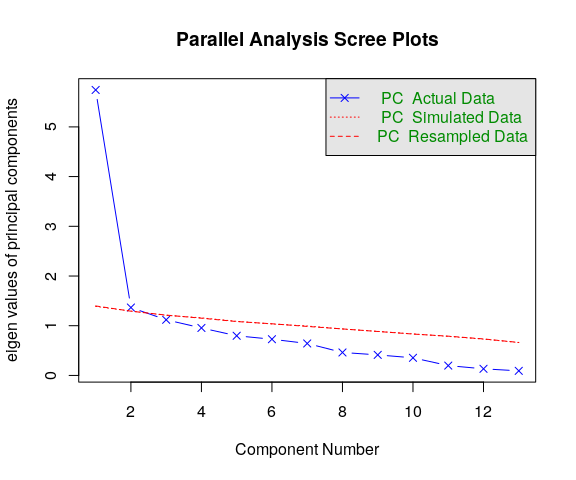
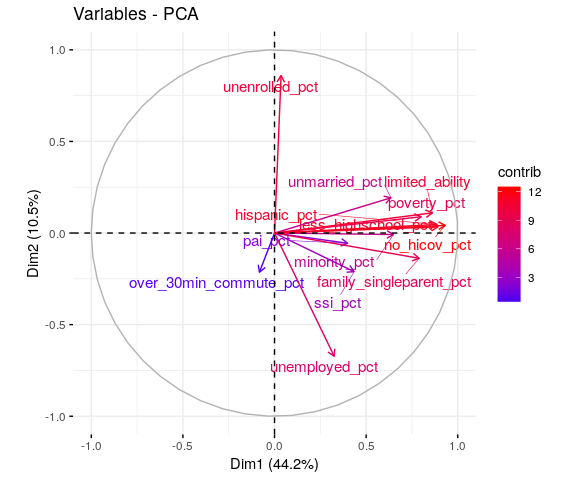

Economic Vulerability variables PCA
================
Cong Cong
7/18/2019

PCA on ACS data based on Census Tract
=====================================

``` r
data <- read.csv("./data/working/ACS_final_index_2/07_11_2019_joined_acs_final.csv") %>% filter(id_type=="census_tract") %>% select (-c(X, X.x, id, id_type, X.y)) %>% na.omit()

#PCA with standadization
pr.data <- PCA(data, scale.unit = TRUE, graph = FALSE)
```

Identify Dimensions
-------------------

### Number of principle components

One way to determine the number of factors or components in a data matrix is to examine the scree plot of the successive eigenvalues. Sharp breaks in the plot suggest the appropriate number of components or factors to extract. The scree plot below shows ~45% of the variances contained in the data are retained by the first principal component. The elbow is between the first and the second dimensions.

``` r
fviz_screeplot(pr.data, ncp=10)
```


Parallel analyis compares the scree of factors of the observed data with that of a random data matrix of the same size as the original. The parallel analysis for this dataset indicates that two components should be retained. There are two ways to tell this; (1) two of the eigenvalues in the actual data are greater than the simulated/resampled data (though marginal for the second eigenvalue), and (2) the dashed line for parallel analysis in the graph crosses the blue line before reaching the third component.

``` r
psych::fa.parallel(data,fa="pc")
```



    ## Parallel analysis suggests that the number of factors =  NA  and the number of components =  2

### Variances explained by the principal components

The proportion of variances retained by the principal components can be extracted as follows. ~55% of variance is explained by the first two pricipal components.

``` r
eigenvalues <- pr.data$eig
head(eigenvalues)
```

    ##        eigenvalue percentage of variance cumulative percentage of variance
    ## comp 1  5.7432288              44.178683                          44.17868
    ## comp 2  1.3655717              10.504398                          54.68308
    ## comp 3  1.1187356               8.605659                          63.28874
    ## comp 4  0.9547252               7.344040                          70.63278
    ## comp 5  0.7973111               6.133162                          76.76594
    ## comp 6  0.7280258               5.600198                          82.36614

Dimension description
---------------------

### Variables correlated with the principal components

The variables can be plotted as points in the component space using their loadings (correlation between a variable and a PC) as coordinates.

``` r
head(pr.data$var$coord)
```

    ##                              Dim.1       Dim.2       Dim.3       Dim.4
    ## pai_pct                 0.39915482 -0.05596950  0.34329400  0.68575107
    ## ssi_pct                 0.43424626 -0.21076932  0.38797300  0.35160252
    ## unenrolled_pct          0.03575591  0.85954657  0.06393445  0.01405983
    ## poverty_pct             0.80024685  0.08889131 -0.05232623 -0.11474969
    ## no_hicov_pct            0.93145335  0.04183201 -0.00705566 -0.13879603
    ## over_30min_commute_pct -0.08237368 -0.21369933  0.77114774 -0.44659660
    ##                              Dim.5
    ## pai_pct                -0.34913765
    ## ssi_pct                 0.56691644
    ## unenrolled_pct          0.31013110
    ## poverty_pct             0.03017437
    ## no_hicov_pct           -0.09784446
    ## over_30min_commute_pct  0.12570116

Variables that are correlated with PC1 and PC2 are the most important in explaining the variability in the data set. Correlation circle projects the features/variables of the data into the space of the first two dimensions. The angle shows the correlation between variables. Again, most variables are positively correlated with the first dimension.

``` r
fviz_pca_var(pr.data, col.var="contrib",repel = TRUE)+
  scale_color_gradient2(low="white", mid="blue", 
                      high="red")
```



The following four variables have strong positive correlation (&gt;~0.85) with Dimension 1:
- percentage of households with no health insurance coverage (no\_hicov\_pct)
- percentage of population with less than highschool education (less\_highschool\_pct)
- percentage of Hispanic population (hispanic\_pct)
- percentage of households with limited English ability (limited\_ability)

``` r
pr.desc <- dimdesc(pr.data, axes = c(1,2))
pr.desc$Dim.1
```

    ## $quanti
    ##                         correlation       p.value
    ## no_hicov_pct              0.9314534 4.437522e-113
    ## less_highschool_pct       0.8920012  3.215049e-89
    ## hispanic_pct              0.8874370  4.474885e-87
    ## limited_ability           0.8612940  2.348746e-76
    ## poverty_pct               0.8002469  4.052522e-58
    ## family_singleparent_pct   0.7892977  1.622540e-55
    ## minority_pct              0.6490663  6.869930e-32
    ## unmarried_pct             0.6354843  3.004247e-30
    ## ssi_pct                   0.4342463  3.762196e-13
    ## pai_pct                   0.3991548  3.595256e-11
    ## unemployed_pct            0.3257513  1.025497e-07

Dimension 2 is most correlated with the percentage of population that are 3 year old and above not enrolled in school (unenrolled\_pct), and unemployment rate (unemployed\_pct).

``` r
pr.desc$Dim.2
```

    ## $quanti
    ##                         correlation      p.value
    ## unenrolled_pct            0.8595466 1.018396e-75
    ## unmarried_pct             0.1923206 2.036382e-03
    ## family_singleparent_pct  -0.1378798 2.770270e-02
    ## ssi_pct                  -0.2107693 7.058125e-04
    ## over_30min_commute_pct   -0.2136993 5.914391e-04
    ## unemployed_pct           -0.6725751 6.167237e-35

### Contributions of variables to the principal components

The color (or the length if the vectors) on the correlation circle shows the contribution of variable to the principal components. The amount of contributions can also be extracted as follows.

``` r
pr.data$var$contrib
```

    ##                               Dim.1       Dim.2        Dim.3       Dim.4
    ## pai_pct                  2.77412889  0.22939729 10.534282103 49.25548430
    ## ssi_pct                  3.28334151  3.25312136 13.454746639 12.94868221
    ## unenrolled_pct           0.02226074 54.10336895  0.365378050  0.02070532
    ## poverty_pct             11.15043562  0.57863426  0.244743642  1.37919183
    ## no_hicov_pct            15.10657829  0.12814538  0.004449875  2.01778875
    ## over_30min_commute_pct   0.11814648  3.34419669 53.155439128 20.89067286
    ## unemployed_pct           1.84763466 33.12584709 14.141700562  0.12934830
    ## hispanic_pct            13.71257225  0.16027646  0.005877775  4.95052789
    ## minority_pct             7.33536859  0.00496682  0.044719590  3.81377918
    ## unmarried_pct            7.03159036  2.70855239  7.210754104  1.15163902
    ## family_singleparent_pct 10.84739792  1.39215177  0.100903863  0.04811231
    ## limited_ability         12.91655722  0.88781072  0.188702777  0.63280613
    ## less_highschool_pct     13.85398747  0.08353083  0.548301893  2.76126189
    ##                              Dim.5
    ## pai_pct                 15.2885239
    ## ssi_pct                 40.3097686
    ## unenrolled_pct          12.0632084
    ## poverty_pct              0.1141954
    ## no_hicov_pct             1.2007281
    ## over_30min_commute_pct   1.9817588
    ## unemployed_pct          10.6446013
    ## hispanic_pct             3.1581844
    ## minority_pct             0.1437489
    ## unmarried_pct           12.1324934
    ## family_singleparent_pct  1.7287329
    ## limited_ability          0.7795335
    ## less_highschool_pct      0.4545223

If the contribution of the variables were uniform, the expected value would be 1/length(variables) = 1/13 = 7.7%.The red dashed line on the graph below indicates the expected average contribution. A variable with a contribution larger than this cutoff could be considered as important in contributing to the component.

``` r
fviz_pca_contrib(pr.data, choice = "var", axes = 1)
```

    ## Warning in fviz_pca_contrib(pr.data, choice = "var", axes = 1): The
    ## function fviz_pca_contrib() is deprecated. Please use the function
    ## fviz_contrib() which can handle outputs of PCA, CA and MCA functions.


``` r
fviz_pca_contrib(pr.data, choice = "var", axes = 2)
```

    ## Warning in fviz_pca_contrib(pr.data, choice = "var", axes = 2): The
    ## function fviz_pca_contrib() is deprecated. Please use the function
    ## fviz_contrib() which can handle outputs of PCA, CA and MCA functions.


Conclusions
-----------

There are two principal components in the dataset of ACS variables on census tract. These two components explains ~55% of the total variance, while the first one explains ~45%. The first component is best represented by health insurance coverage, education, Hispanic population, limited English ability, poverty, and single parent household. The second component is best represented by school enrollment and employment status.

PCA on ACS data based on High School District
=============================================

PCA on ACS data based on Supervisor District
============================================
