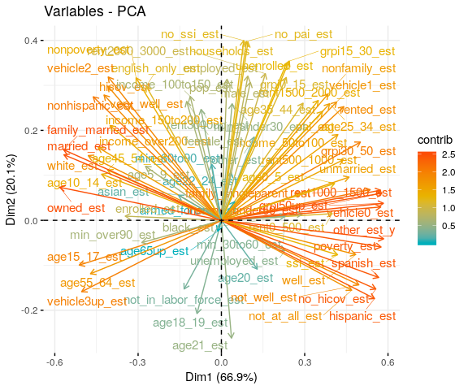

Dimensional Analysis - PCA
================
Quinton Neville
7/1/2019

A. Synthetic Example
--------------------

#### 1. Generate some synthetic continuous data

``` r
#Number of observations
N <- 100
#Number of variables
K <- 10

#Mean of MVN distribution
mu <- 5

#Generate random data from a true multivariate normal distribution with random mean vector & covariance matrix
set.seed(4)
cont.df <- mvrnorm(n = N, mu = rep(c(mu, mu + 10), each = K/2),
                   Sigma = diag(sample(seq(0.1, 1, by = 0.01), K, replace = TRUE))) %>%
           as_tibble() %>%
    mutate(
    pois_1 = rpois(N, lambda = 5),
    pois_2 = rpois(N, lambda = 5)
  ) %>%
           map_df(.x = ., ~scale(.x))
#Standardize the continuous variables
```

#### 2. Dimensional Analysis

Below we produce two principal component objects, one for the raw data and one for the correlation matrix of the raw data. Then we use a parallel analysis to look at the magnitude of the eigen values (the principal components squared), where a value greater than 1 implies we should count it as a valid underlying dimension (if it is above 1 for both PC and FA analysis).

``` r
#Raw Principle Components
pca.df <- cont.df %>% princomp()

#Correlation Matrix Principal Components
pca.corr.df <- cont.df %>% cor() %>% princomp()

#Dimensional analysis from the psych package
pearson.parallel <- cont.df %>% fa.parallel()
```


    ## Parallel analysis suggests that the number of factors =  0  and the number of components =  0

Here, this plots the eigenvalues of the correlation (or raw data, can't remember), and then also does a parallel simulated analysis (below). Using a cutoff of *λ* ≥ 1, the Principal Components imply that there are around 5 dimensions, however the parallel Factor Analysis describes zero dimensions. As this is simulated data, nothing much can be gained from this.

Next we look at a Scree plot, which is just a plot of the percentage of variance explained by each principal component dimension, ordered from largest to smallest. Here, we are looking for an "elbow" in the plot, i.e. where there is a sharp drop in the percentage of variability explained between two dimensions.

``` r
#Visualization of predictors projected onto Prinipal Component Dimensions

#Scree plot raw data
fviz_eig(pca.df)
```


Here there is no obvious elbow, suggesting no underlying structure

Considering a scree plot of the correlation matrix principal components, we see that perhaps 2 or 4 dimensions is explaining a sufficient amount of variability in the correlation matrix, although there is not really strong evidence for an elbow.

``` r
#Scree Plot for correlation components
fviz_eig(pca.corr.df)
```


Lastly, we will project the features of the data (variables), onto the space spanned by the first two principal components. This two dimensional space is a transformation of the data into a space that explains the most variability in the *K* dimensional data, while also showing the direction, relationship, and magnitude of effect that each feature/variable has.

Here we look at the raw principal component projection first, and then the PCA from the correlation matrix.

``` r
fviz_pca_var(pca.df,
             col.var = "contrib",
             gradient.cols = c("#00AFBB", "#E7B800", "#FC4E07"),
             repel = TRUE)
```


``` r
fviz_pca_var(pca.corr.df,
             col.var = "contrib",
             gradient.cols = c("#00AFBB", "#E7B800", "#FC4E07"),
             repel = TRUE)
```


As you can see, there is basically no underlying structure to the data, most variables are relatively orthogonal (not pointing in the same direction); all of which corroborate the findings from the parallel analysis and scree plot above, that there is no underlying factor or dimension evident in these data (which makes sense because there were randomly generated from the same MVN distribution).

#### 3. Keys to Analysis

So in general, the rule of thumb is to do the parallel eigenvalue analysis (with pearson correlation for continuous variables), count the \# greater than or equal to 1; in both PC and FA. Cross reference that with the amount of variance explained, look for an elbow, and come to a consesus about how many you think there are. Lastly, project the features/variables of the data into the PCA space and look at how they're related and if the structure you expect to exist is evident in the plot. Lastly, we also employ literature review and expert opinion (domain knowledge) to inform the final selection of dimensions for further Factor Analysis.

B. ACS Dimensional Analysis
---------------------------

Read in the data.

``` r
#Read in the ACS wide and ACS long (tidy) data
acs.df <- read_csv("./data/working/ACS_joined_estimates/2019_06_24_acs_all_geography.csv")
acs.tidy.df <- read_csv("./data/working/ACS_joined_estimates/2019_06_24_acs_all_geography_tidy.csv")
```

#### Highschool District

``` r
#Read and filter
highschool.df <- acs.df %>%
  filter(id_type %in% "highschool_district") %>%
  dplyr::select(-id_type) %>%
  dplyr::select(-contains('moe'))

#Scale
highschool.df <- bind_cols(highschool.df %>%
                             dplyr::select(id), 
                           highschool.df %>%
                             dplyr::select_if(is.numeric) %>%
                             map_df(scale))

#Grab Principal Components
#pca.hs <- highschool.df %>% 
#  dplyr::select_if(is.numeric) %>%
#  princomp()

#Grabe PC's from Correlation matrix
pca.cor.hs <- highschool.df %>% 
  dplyr::select_if(is.numeric) %>%
  cor() %>%
  princomp()

#Parallel analysis
#highschool.df %>% select_if(is.numeric) %>% fa.parallel()

#Scree Plot for correlation components
fviz_eig(pca.cor.hs)
```


``` r
#Feature map
fviz_pca_var(pca.cor.hs,
             col.var = "contrib",
             gradient.cols = c("#00AFBB", "#E7B800", "#FC4E07"),
             repel = TRUE)
```


``` r
#Code for mapping median across list of df's, need for Housing Stock
#median.highschool.df$median_var[2] %>% unlist() %>% names()
#list(a = tibble(x = 1:10, y = 11:20),
#     b = tibble(x = 1:5, y = 6:10)) %>% map(., ~map_dbl(., median))
```

#### Supervisor District

``` r
#Read and filter
supervisor.df <- acs.df %>%
  filter(id_type %in% "supervisor_district") %>%
  dplyr::select(-id_type) %>%
  dplyr::select(-contains('moe'))

#Scale
highschool.df <- bind_cols(highschool.df %>%
                             dplyr::select(id), 
                           highschool.df %>%
                             dplyr::select_if(is.numeric) %>%
                             map_df(scale))

#Grab Principal Components
#pca.hs <- highschool.df %>% 
#  dplyr::select_if(is.numeric) %>%
#  princomp()

#Grabe PC's from Correlation matrix
pca.cor.sv <- supervisor.df %>% 
  dplyr::select_if(is.numeric) %>%
  cor() %>%
  princomp()

#Parallel analysis
#highschool.df %>% select_if(is.numeric) %>% fa.parallel()

#Scree Plot for correlation components
fviz_eig(pca.cor.sv)
```


``` r
#Feature map
fviz_pca_var(pca.cor.hs,
             col.var = "contrib",
             gradient.cols = c("#00AFBB", "#E7B800", "#FC4E07"),
             repel = TRUE)
```



#### Highschool + Housing Stock

``` r
ffh.highschool.df <- read_csv("./data/working/Fairfax_Housing_2018/fairfax_housing_2018_geo.csv") %>%
  janitor::clean_names() %>%
  dplyr::select(-c(geoid, parcel_id, district)) %>%
  rename(id = highschool) %>%
    nest(-id) %>%
    mutate(
      data   = map(data, ~dplyr::select_if(., is.numeric)) %>%
               map(na.omit),
      median = data %>% map(.x = ., ~map_dbl(., median)),
      median = median %>% map(.x = ., ~as_tibble(as.list(.x)))
    ) %>%
    dplyr::select(-c(data)) %>%
  unnest()

ffh.district.df<- read_csv("./data/working/Fairfax_Housing_2018/fairfax_housing_2018_geo.csv") %>%
  janitor::clean_names() %>%
  dplyr::select(-c(geoid, parcel_id, highschool)) %>%
  rename(id = district) %>%
    nest(-id) %>%
    mutate(
      data   = map(data, ~dplyr::select_if(., is.numeric)) %>%
               map(na.omit),
      median = data %>% map(.x = ., ~map_dbl(., median)),
      median = median %>% map(.x = ., ~as_tibble(as.list(.x)))
    ) %>%
    dplyr::select(-c(data)) %>%
  unnest() 
```
